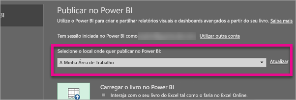
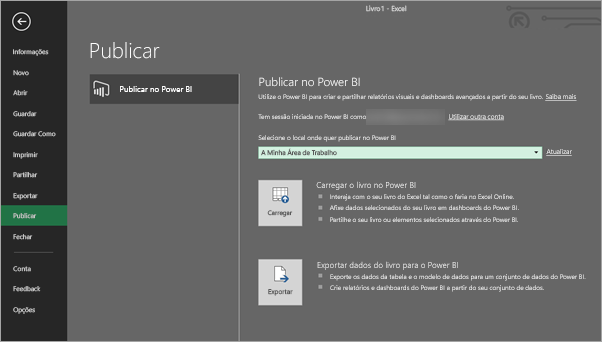
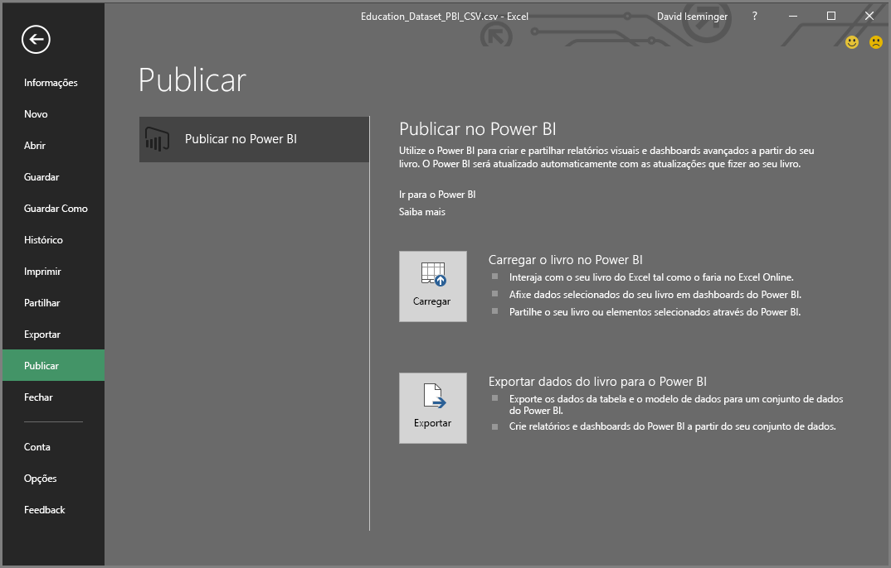
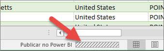

# Publicar no Power BI a partir do Excel 2016
Com o Excel 2016, é possível publicar livros do Excel diretamente no site do [Power BI](https://powerbi.microsoft.com), no qual é possível criar relatórios e dashboards altamente interativos com base nos dados do livro. Em seguida, pode partilhar ideias com outras pessoas na organização.

Antes de continuarmos, há algumas considerações a fazer:

* Antes de publicar no Power BI, o livro deve ser guardado no OneDrive para Empresas.
* A conta usada para entrar no Office, OneDrive para Empresas e Power BI deve ser a mesma.
* Não é possível publicar um livro vazio num livro que não tem qualquer conteúdo suportado pelo Power BI.
* Não é possível publicar livros encriptados ou protegidos por palavra-passe nem livros com Gestão de Proteção de Informação.
* A publicação no Power BI exige a ativação de uma autenticação moderna (padrão). Se estiver desativada, a opção Publicar não estará disponível no menu Ficheiro.

## Para publicar o livro do Excel
No Excel, selecione **Ficheiro** > **Publicar**.

### Publicação de ficheiros locais
A partir da atualização de fevereiro de 2017, o Excel 2016 suporta a publicação de ficheiros locais do Excel. Não têm de ser guardados no OneDrive para Empresas ou no SharePoint Online.

> [!IMPORTANT]
> Apenas o Excel 2016 com uma subscrição do Office 365 irá ver a experiência de publicação com ficheiros locais. A instalação autónoma do Excel 2016 continuará a ter o comportamento de "Publicar" que requer que o livro do Excel seja guardado no OneDrive para Empresas ou no SharePoint Online.
> 
> 

Ao selecionar **Publicar**, poderá selecionar a área de trabalho na qual quer publicar. Pode ser a sua área de trabalho pessoal ou de grupo à que tem acesso.

Terá duas opções para obter o seu livro no Power BI.

Depois de publicado, é guardada uma cópia no Power BI, separada do ficheiro local. Se quiser atualizar o ficheiro no Power BI, terá de publicar novamente a versão atualizada. Pode atualizar os dados e definir a atualização agendada no livro ou no conjunto de dados no Power BI.

### Publicar a partir do Excel Autónomo
Se o livro ainda não estiver guardado no OneDrive, será necessário guardá-lo primeiro. Clique em Guardar na Cloud e selecione um local no OneDrive para Empresas.

Assim que o livro for guardado no OneDrive, ao selecionar **Publicar**, terá duas opções para inserir o livro no Power BI.

#### Carregar o livro no Power BI
Ao escolher essa opção, o livro será apresentado no Power BI, exatamente como apareceria no Excel Online. Mas, ao contrário do Excel Online, terá alguns recursos excelentes para ajudá-lo a afixar elementos das folhas de cálculo nos dashboards.

Não pode editar o livro quando estiver aberto no Power BI, mas se precisar de fazer alterações, pode selecionar **Editar** e optar por editar o livro no Excel Online ou abri-lo no Excel no seu computador. Todas as alterações efetuadas são guardadas no livro no OneDrive.

Ao efetuar o carregamento, nenhum conjunto de dados será criado no Power BI. O livro será apresentado em Relatórios, no painel de navegação do espaço de trabalho. Os livros carregados no Power BI têm um ícone especial do Excel, que os identifica como livros do Excel carregados.

Escolha esta opção se tiver apenas dados em folhas de cálculo ou se desejar ver Tabelas Dinâmicas e Gráficos no Power BI.
No Excel, a utilização da funcionalidade Carregar a partir de Publicar no Power BI no Excel é praticamente o mesmo que usar Obter Dados > Ficheiro > OneDrive para Empresas > Ligar, Gerir e Ver o Excel no Power BI, a partir do Power BI no seu browser.

#### Exportar dados do livro para o Power BI
Ao escolher esta opção, todos os dados suportados em tabelas e/ou num modelo de dados são exportados para um novo conjunto de dados no Power BI. Caso tenha folhas de cálculo do Power View, estas serão recriadas no Power BI como relatórios.

É possível continuar a editar o livro. Quando as alterações forem guardadas, estas serão sincronizadas com o conjunto de dados no Power BI, geralmente, em menos de uma hora. Se precisar de mais resultados imediatos, basta selecionar Publicar novamente e as alterações serão exportadas imediatamente. Todas as visualizações contidas em relatórios e dashboards também serão atualizadas.

Escolha esta opção caso tenha usado o recurso Obter e Transformar dados ou o Power Pivot para carregar dados num modelo de dados, ou se o livro tiver folhas de cálculo do Power View com visualizações que pretende ver no Power BI.

No Excel, a utilização da funcionalidade Exportar a partir de Publicar no Power BI no Excel é praticamente o mesmo que usar Obter Dados > Ficheiro > OneDrive para Empresas > Exportar dados do Excel para o Power BI, a partir do Power BI no seu browser.

## Publicar
Ao escolher uma destas opções, o Excel entrará no Power BI com a conta atual e publicará o livro no site do Power BI. Esteja atento à barra de estado do Excel. Aqui pode ver o progresso da atividade.

Quando concluída, pode ir para o Power BI diretamente através do Excel.

## Próximos passos
[Dados do Excel no Power BI](service-excel-workbook-files.md)  
Mais perguntas? [Pergunte à Comunidade do Power BI](http://community.powerbi.com/)

