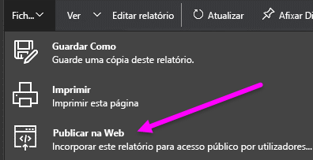
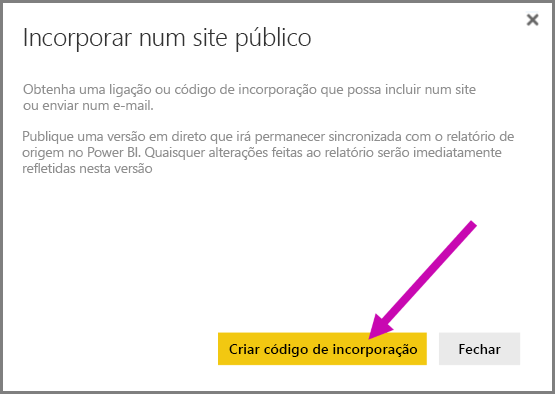
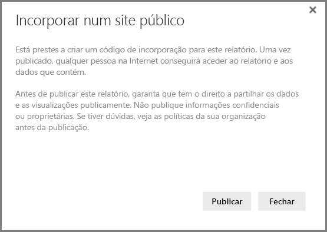
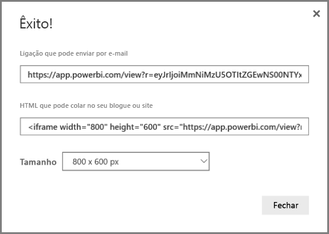
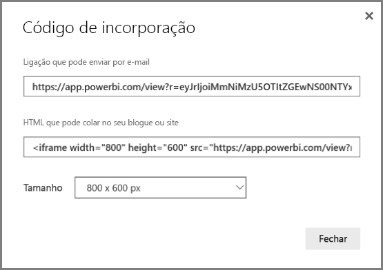
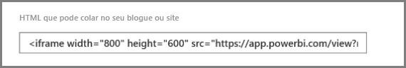
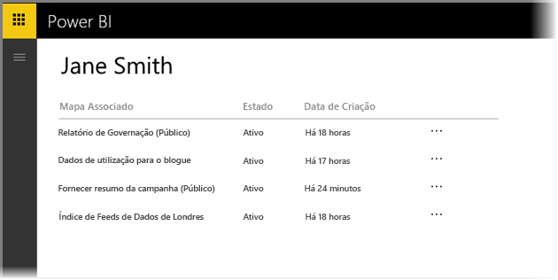
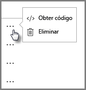
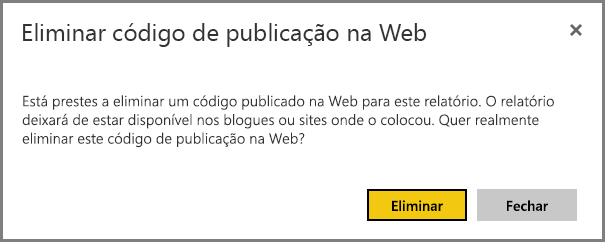

# Publicar na Web do Power BI

Com a funcionalidade **Publicar na Web** do Power BI, pode facilmente incorporar visualizações interativas online do Power BI, como publicações de blogue e sites, através de e-mails ou redes sociais, em qualquer dispositivo.

Também pode facilmente editar, atualizar ou anular a partilha dos seus elementos visuais publicados.

> [!WARNING]
> Quando utilizar a funcionalidade **Publicar na Web**, o relatório ou visual publicado pode ser visualizado por qualquer pessoa na Internet. Não é necessária autenticação para ver estes relatórios. Utilize a funcionalidade Publicar na Web apenas com relatórios e dados que possam ser vistos na Internet por qualquer pessoa (membros do público não autenticado). Isto inclui dados detalhados que são agregados nos seus relatórios. Antes de publicar este relatório, certifique-se de que tem o direito a partilhar os dados e as visualizações publicamente. Não publique informações confidenciais proprietárias. Se tiver dúvidas, consulte as políticas da sua organização antes da publicação.

## Como utilizar a funcionalidade Publicar na Web

A funcionalidade **Publicar na Web** está disponível nos relatórios nas áreas de trabalho pessoais ou de grupo que pode editar.  Não pode utilizar a funcionalidade Publicar na Web com relatórios que foram partilhados consigo nem em relatórios com segurança ao nível de linha para proteger os dados. Consulte a secção **Limitações** abaixo para obter uma lista completa dos casos em que a funcionalidade Publicar na Web não é suportada. Consulte o **Aviso** indicado acima neste artigo antes de utilizar a funcionalidade Publicar na Web.

Pode ver como esta funcionalidade funciona no seguinte *breve vídeo*. Em seguida, siga os passos abaixo para experimentar.

<iframe width="560" height="315" src="https://www.youtube.com/embed/UF9QtqE7s4Y" frameborder="0" allowfullscreen></iframe>

Os passos seguintes descrevem como utilizar a funcionalidade **Publicar na Web**.

1. Num relatório na sua área de trabalho que possa editar, selecione **Ficheiro  > Publicar na Web**.
   
   

2. Consulte o conteúdo na caixa de diálogo e selecione **Criar código de incorporação**, conforme apresentado na seguinte caixa de diálogo.
   
   

3. Consulte o aviso apresentado na caixa de diálogo seguinte e certifique-se de que os dados podem ser incorporados num site público. Se for o caso, selecione **Publicar**.
   
   

4. Será apresentada uma caixa de diálogo que fornece uma ligação que pode ser enviada por e-mail, incorporada em código (como uma iFrame) ou colada diretamente na sua página Web ou blogue.
   
   

5. Se criou anteriormente um código de incorporação para o relatório, o código de incorporação será apresentado de imediato. Só pode criar um código de incorporação para cada relatório.
   
   

## Sugestões e Truques para os Modos de Visualização

Normalmente, ao incorporar conteúdos numa publicação de um blogue, é necessário ajustá-los dentro de um tamanho específico do ecrã.  Pode ainda ajustar a altura e a largura da tag iFrame conforme necessário, mas também poderá precisar de se certificar de que o seu relatório se ajusta à área da iFrame, por isso poderá precisar ainda de definir um Modo de Visualização adequado ao editar o relatório.

A seguinte tabela fornece instruções sobre o Modo de Visualização e a forma como será apresentado quando for incorporado.

| Modo de Visualização | O aspeto que terá quando incorporado |
| --- | --- |
|  |**Ajustar à página** irá respeitar a altura e a largura de página do seu relatório. Se definir a página em proporções "Dinâmicas", como 16:9 ou 4:3, os seus conteúdos serão dimensionados para caber no iFrame que forneceu. Quando incorporado num iFrame, utilizar a funcionalidade **Ajustar à página** pode resultar em **letterboxing**, fazendo com que um fundo cinzento seja mostrado em áreas do iFrame após o conteúdo ser dimensionado para caber no iFrame. Para minimizar o letterboxing, defina apropriadamente a altura e a largura do iFrame. |
|  |O **Tamanho real** garante que o relatório mantém o tamanho conforme definido na página de relatórios. Isto poderá dar origem a barras de deslocamento na sua iFrame. Defina a altura e a largura do iFrame para evitar barras de deslocamento. |
|  |**Ajustar à largura** garante que o conteúdo cabe na área horizontal do iFrame. Ainda assim, será apresentado um limite, mas os conteúdos serão dimensionados para utilizar todo o espaço horizontal disponível. |

## Dicas e truques para a altura e largura do iFrame

O código de incorporação que receber após utilizar a funcionalidade Publicar na Web terá o seguinte aspeto:

Pode editar a largura e a altura manualmente para se certificar de que tem as dimensões perfeitas para caber na página em que o está a incorporar.

Para obter um ajuste melhor, pode experimentar adicionar 56 pixels à dimensão de altura do iFrame. Tal acomoda o tamanho atual da barra inferior. Se a sua página de relatório utilizar o tamanho dinâmico, a tabela seguinte apresenta alguns tamanhos que pode utilizar para atingir um ajuste sem letterboxing.

| Proporção | Tamanho | Dimensão (Largura x Altura) |
| --- | --- | --- |
| 16:9 |Pequeno |640 x 416 px |
| 16:9 |Médio |800 x 506 px |
| 16:9 |Grande |960 x 596 px |
| 4:3 |Pequeno |640 x 536 px |
| 4:3 |Médio |800 x 656 px |
| 4:3 |Grande |960 x 776 px |

## Gerir códigos de incorporação

Depois de criar um código de incorporação na funcionalidade **Publicar na Web**, pode gerir os códigos que cria no menu **Definições** do serviço Power BI. A gestão de códigos de incorporação inclui a capacidade de remover o relatório ou elemento visual de destino de um código (tornando o código de incorporação inutilizável) ou obter o código de incorporação novamente.

1. Para gerir os seus códigos de incorporação da funcionalidade **Publicar na Web**, abra a engrenagem das **Definições** e selecione **Gerir códigos de incorporação**.
   
   

2. A lista de códigos de incorporação que criou é apresentada, conforme apresentado na seguinte imagem.
   
   

3. Para cada código de incorporação de **Publicar na Web** na lista, é possível obter ou eliminar o código de incorporação e, portanto, fazer com que todas as ligações para esse relatório ou visual deixem de funcionar.
   
   

4. Se selecionar **Eliminar**, ser-lhe-á perguntado se tem a certeza de que pretende eliminar o código de incorporação.
   
   

## Atualizações a relatórios e atualização de dados

Depois de criar o seu código de incorporação de **Publicar na Web** e partilhá-lo, o relatório será atualizado com as alterações que fizer. No entanto, é importante saber que pode demorar algum tempo até a atualização ficar visível para os seus utilizadores. As atualizações a um relatório ou elemento visual demoram aproximadamente uma hora a entrar em efeito nos códigos de incorporação da funcionalidade Publicar na Web.

Quando utilizar inicialmente a funcionalidade **Publicar na Web** para obter um código de incorporação, a ligação do código de incorporação fica imediatamente ativa e pode ser vista por qualquer pessoa que abrir a ligação.  Após a ação inicial da funcionalidade Publicar na Web, as atualizações subsequentes a relatórios ou elementos visuais podem demorar aproximadamente uma hora a ficar visíveis para os seus utilizadores.

Para obter mais informações, consulte a secção **Como funciona**, mais à frente neste artigo. Se precisar que as atualizações fiquem imediatamente disponíveis, pode eliminar o código de incorporação e criar um novo.

## Atualização de dados

As atualizações de dados são refletidas automaticamente no relatório ou visual incorporado. Pode demorar aproximadamente 1 hora para que os dados atualizados sejam visíveis nos códigos de incorporação. Pode desativar a atualização automática ao selecionar **não atualizar** na agenda do conjunto de dados utilizado pelo relatório.  

## Elementos visuais personalizados

Os visuais personalizados são suportados na funcionalidade **Publicar na Web**. Ao utilizar a funcionalidade Publicar na Web, os utilizadores com quem partilhar o seu elemento visual publicado não precisam de ativar os elementos visuais personalizados para ver o relatório.

## Limitações

A funcionalidade **Publicar na Web** é suportada para a grande maioria das origens de dados e relatórios no serviço do Power BI; no entanto, os seguintes elementos não são atualmente suportados ou disponibilizados com a funcionalidade Publicar na Web:

1. Relatórios com segurança a nível de linha.
2. Relatórios com Analysis Services Tabular alojado no local.
3. Relatórios partilhados diretamente consigo ou através de um pacote de conteúdos organizacionais.
4. Relatórios num grupo no qual não é um membro de edição.
5. Visuais "R" que atualmente não são suportados em relatórios para Publicar na Web.

## Definição de inquilino

Os administradores do Power BI podem ativar ou desativar a funcionalidade Publicar na Web. Também podem restringir o acesso a grupos específicos. A sua capacidade de criar um código de incorporação é alterada com base nesta definição.

|Destaque |Ativada para toda a organização |Desativada para toda a organização |Grupos de segurança específicos   |
|---------|---------|---------|---------|
|**Publicar na Web**, no menu **Ficheiro** do relatório.|Ativada para todos|Não visível para todos|Visível apenas para utilizadores ou grupos autorizados.|
|**Gerir códigos de incorporação**, em **Definições**|Ativada para todos|Ativada para todos|Ativada para todos  * A opção **Eliminar** está ativada apenas para utilizadores e grupos autorizados. * A opção **Obter códigos** está ativada para todos.|
|**Incorporar códigos** no portal de administração|O estado será um dos seguintes: * Ativo * Não suportado * Bloqueado|O estado apresentado será **Desativado**|O estado será um dos seguintes: * Ativo * Não suportado * Bloqueado  Se um utilizador não estiver autorizado com base na definição do inquilino, o estado apresentado será **Em violação**.|
|Relatórios publicados existentes|Todos ativados|Todos desativados|Os relatórios continuam a ser compostos para todos.|

## Compreender a coluna do estado do código de incorporação

Ao ver a página **Gerir códigos de incorporação** para os seus códigos de incorporação da funcionalidade **Publicar na Web**, é apresentada uma coluna de estado. Os códigos de incorporação estão ativos por predefinição, mas pode encontrar qualquer um dos estados abaixo indicados.

| Estado | Descrição |
| --- | --- |
| **Ativo** |O relatório está disponível para visualização e interação por utilizadores da Internet. |
| **Bloqueado** |O conteúdo do relatório viola os [Termos de Serviço do Power BI](https://powerbi.microsoft.com/terms-of-service). Foi bloqueado pela Microsoft. Se achar que o bloqueio dos conteúdos foi um erro, contacte o suporte. |
| **Não suportado** |O conjunto de dados do relatório está a utilizar segurança ao nível de linha ou outra configuração não suportada. Consulte a secção **Limitações** para obter uma lista completa. |
| **Em violação** |O código de incorporação está fora da política de inquilino definida. Normalmente, isto ocorre quando um código de incorporação foi criado e, em seguida, a definição de inquilino da funcionalidade Publicar na Web foi alterada para excluir o utilizador a quem pertence o código de incorporação. Se a definição de inquilino tiver sido desativada ou o utilizador já não tiver permissão para criar códigos de incorporação, os códigos de incorporação existentes apresentarão o estado **Em violação**. |

## Como comunicar um problema relacionado com conteúdos da funcionalidade Publicar na Web

Para reportar um problema relacionado com os conteúdos **Publicar na Web** incorporados num site ou blogue, utilize o ícone de **Sinalização** na barra inferior, apresentado na imagem seguinte. Ser-lhe-á pedido que envie um e-mail para a Microsoft a explicar o problema. A Microsoft irá avaliar os conteúdos com base nos Termos de Serviço do Power BI e tomar as medidas adequadas.

Para reportar um problema, selecione o ícone de **sinalização** na barra inferior do relatório Publicar na Web que vê.

## Licenciamento e Preços

Tem de ser utilizador do Microsoft Power BI para utilizar a funcionalidade **Publicar na Web**. Os consumidores do seu relatório (leitores, visualizadores) não precisam de ser utilizadores do Power BI.

## Como funciona (detalhes técnicos)

Ao criar um código de incorporação através da funcionalidade **Publicar na Web**, o relatório fica visível para utilizadores na Internet. Encontra-se publicamente disponível, pelo que é expectável que os visualizadores partilhem facilmente o relatório através das redes sociais. Quando os utilizadores virem o relatório, quer ao abrir o URL público direto ou ao vê-lo incorporado numa página Web ou blogue, o Power BI regista a definição do relatório e os resultados das consultas necessários para ver o relatório. Esta abordagem assegura que o relatório pode ser visto por milhares de utilizadores em simultâneo sem nenhum impacto no desempenho.  

A cache é duradoura, pelo que se atualizar a definição do relatório (por exemplo, se alterar o Modo de Visualização) ou atualizar os dados do relatório, pode demorar aproximadamente uma hora até que as alterações tenham efeito na versão do relatório vista pelos seus utilizadores. Por isso, recomenda-se que teste o seu trabalho antecipadamente e crie o código de incorporação **Publicar na Web** apenas quando estiver satisfeito com as definições.

Mais perguntas? [Pergunte à Comunidade do Power BI](http://community.powerbi.com/)