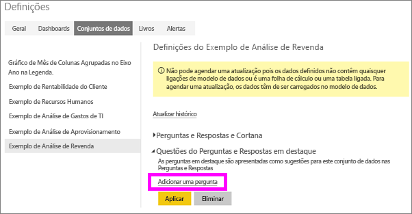
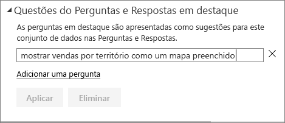
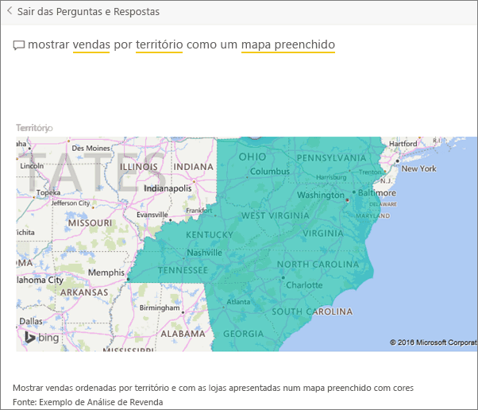

# Criar perguntas em destaque para as Perguntas e Respostas do Power BI
Se possui um conjunto de dados, pode adicionar as suas próprias perguntas em destaque para esse conjunto de dados.  As Perguntas e Respostas do Power BI mostrarão essas perguntas aos colegas que utilizam (*consomem*) o seu conjunto de dados.  As perguntas em destaque fornecem aos seus colegas algumas ideias sobre os tipos de perguntas que eles podem fazer sobre o conjunto de dados. As perguntas em destaque adicionadas são decididas por si; pode adicionar perguntas populares, perguntas que mostram resultados interessantes ou perguntas que podem ser difíceis de formular.

Veja o Will adicionar algumas perguntas em destaque às Perguntas e Respostas do Power BI e, em seguida, utilizar essas perguntas em destaque para explorar o conjunto de dados. Em seguida, siga as instruções passo-a-passo abaixo do vídeo para experimentar.

<iframe width="560" height="315" src="https://www.youtube.com/embed/E1mIAyEXuF4" frameborder="0" allowfullscreen></iframe>

> [!NOTE]
> As perguntas em destaque das Perguntas e Respostas estão disponíveis na [aplicação Microsoft Power BI para iOS em iPads, iPhones e dispositivos iPod Touch](consumer/mobile/mobile-apps-ios-qna.md) e na Pré-visualização Perguntas e Respostas do Power BI Desktop. No entanto, a criação de perguntas só está disponível no serviço Power BI (app.powerbi.com).
> 

Este artigo usa o [exemplo de Vendas de Análise de Revenda](sample-datasets.md).

1. No dashboard, seleciona a caixa de perguntas Perguntas e Respostas.   Repare que as Perguntas e Respostas já estão ser úteis ao apresentarem uma lista de termos que aparecem no conjunto de dados.
2. Para adicionar a esta lista, selecione o ícone de engrenagem no canto superior direito do Power BI.  
   
3. Selecione **Definições** &gt; **Conjuntos de dados** &gt; **exemplo de Análise de Revenda** &gt; **Perguntas das Perguntas e Respostas em destaque**.  
4. Selecione **Adicionar uma pergunta**.
   
   
5. Escreva a sua pergunta na caixa de texto e selecione **Aplicar**.   Opcionalmente, adicione outra pergunta selecionando **Adicionar uma pergunta**.  
   painel 
6. Navegue de volta para o dashboard do Power BI, para o Exemplo de Análise de Revenda, e coloque o cursor na caixa de perguntas das Perguntas e Respostas.   
   
7. A nova pergunta em destaque, **Vendas por território como mapa**, é a primeira na lista. Selecione-a.  
8. A resposta é apresentada como uma visualização de mapa preenchido.  
   

### Próximos passos
[Perguntas e Respostas no Power BI](power-bi-q-and-a.md)  
[Tutorial: Introdução às Perguntas e Respostas do Power BI](power-bi-visualization-introduction-to-q-and-a.md)  
[Power BI - Conceitos Básicos](service-basic-concepts.md)  
Mais perguntas? [Pergunte à Comunidade do Power BI](http://community.powerbi.com/)

