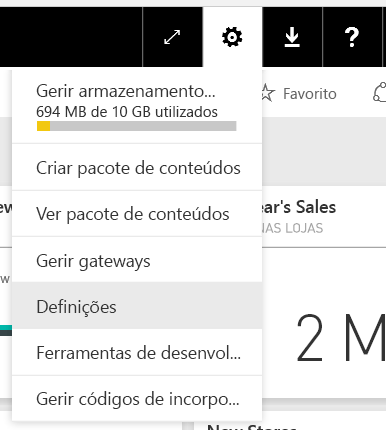
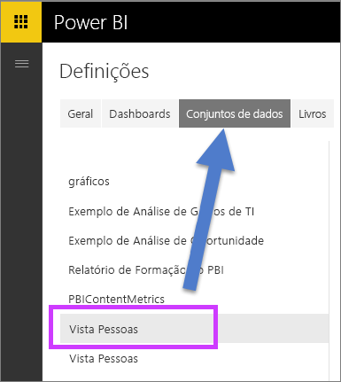
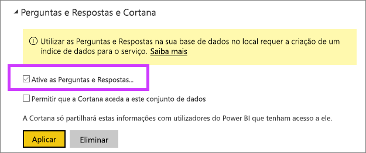

# Ativar as Perguntas e Respostas para ligações em direto
## O que é um Gateway de dados no local?  O que é uma ligação em direto?
Os conjuntos de dados no Power BI podem ser importados para o Power BI ou o utilizador pode criar uma ligação em direto aos mesmos. Os conjuntos de dados de ligações em direto costumam ser conhecidos como "no local". As ligações em direto são geridas através de um [gateway](service-gateway-onprem.md) e os dados e questões são enviados em ambos os sentidos através de consultas em direto.

## Perguntas e Respostas dos conjuntos de dados do Gateway de dados no local
Se pretende utilizar as Perguntas e Respostas com conjuntos de dados aos quais acede através de um gateway, terá de os ativar primeiro.

Após a ativação, o Power BI cria um índice da sua origem de dados e carrega um subconjunto desses dados para o Power BI para permitir a colocação de perguntas. Poderão ser necessários vários minutos para criar o índice inicial e o Power BI mantém e atualiza o índice automaticamente à medida que os seus dados mudam. Utilizar as Perguntas e Respostas com estes conjuntos de dados tem o mesmo comportamento que com os dados publicados no Power BI. O conjunto completo de funcionalidades disponíveis na experiência de Perguntas e Respostas é suportado em ambos os casos, incluindo a utilização da origem de dados com a Cortana.

À medida que coloca perguntas no Power BI, as Perguntas e Respostas determinam o melhor visual para construir ou folha de relatório a utilizar para responder à sua pergunta através de um índice do seu conjunto de dados. Após determinar a melhor resposta potencial, as Perguntas e Respostas utilizam o DirectQuery para obter dados em direto da origem de dados através do gateway, de forma a preencher tabelas e gráficos. Isto garante que os resultados de Perguntas e Respostas do Power BI mostram sempre os dados mais atualizados diretamente da origem de dados subjacente.

Uma vez que as Perguntas e Respostas do Power BI utilizam os valores de esquema e texto da sua origem de dados para determinar como consultar o modelo subjacente para obter respostas, as pesquisas de valores de texto novos ou eliminados específicos (como perguntar o nome de um cliente relacionado com um registo de texto recentemente adicionado) confiam no facto de o índice estar atualizado com os valores mais recentes. O Power BI mantém automaticamente o texto e o índice de esquema atualizados durante um período de 60 minutos das alterações.

Para obter mais informações, veja:

* O que é o [Gateway de dados no local](service-gateway-onprem.md)?
* [Introdução às Perguntas e Respostas do Power BI](power-bi-q-and-a.md)

## Ativar as Perguntas e Respostas
Após o gateway de dados ser configurado, ligue-se aos seus dados a partir do Power BI.  Crie um dashboard ao utilizar os seus dados no local ou carregue um ficheiro .pbix que utilize dados no local.  Também pode já ter dados no local em dashboards, relatórios e conjuntos de dados que tenham sido partilhados consigo.

1. No canto superior direito do Power BI, selecione o ícone da engrenagem  e selecione **Definições**.
   
   
2. Selecione **conjuntos de dados** e selecione o conjunto de dados para ativar para as Perguntas e Respostas.
   
   
3. Expanda **Perguntas e Respostas e Cortana**, selecione a caixa de verificação **Ativar as Perguntas e Respostas neste conjunto de dados** e selecione **Aplicar**.
   
    

## Que dados são colocados em cache é como é que a privacidade é protegida?
Quando ativar as Perguntas e Respostas para os seus dados no local, um subconjunto dos seus dados será colocado em cache no serviço. Isto serve para garantir que as Perguntas e Respostas funcionam com um desempenho razoável. O Power BI exclui valores com mais de 24 carateres da colocação em cache. A cache é eliminada dentro de poucas horas quando desativa as Perguntas e Respostas ao desmarcar a opção **Ativar as Perguntas e Respostas para este conjunto de dados**, ou quando elimina o seu conjunto de dados.

## Considerações e resolução de problemas
Durante a fase de Pré-visualização desta funcionalidade, existem diversas limitações:

* Inicialmente, a funcionalidade só está disponível para origens de dados do SQL Server 2016 Analysis Services Tabular. A funcionalidade está otimizada para trabalhar com dados de tabela. Algumas funcionalidades estão disponíveis para origens de dados multidimensionais, mas a experiência completa de Perguntas e Respostas ainda não é suportada para multidimensional. As origens de dados adicionais suportadas pelo Gateway de dados no local serão implementadas ao longo do tempo.
* O suporte integral para segurança ao nível de linha definido no SQL Server Analysis Services não está inicialmente disponível na pré-visualização pública. Ao colocar perguntas nas Perguntas e Respostas, o "preenchimento automático" de perguntas ao escrever pode mostrar valores de cadeias às quais um utilizador não tem acesso. No entanto, a RLS definida no modelo é respeitada em visuais de gráficos e relatórios, o que impede a exposição dos dados numéricos subjacentes. As opções para controlar este comportamento serão lançadas em atualizações futuras.
* As ligações em direto só são suportadas com o Gateway de dados no local. Como resultado, não é possível utilizar esta funcionalidade com o gateway pessoal.

## Passos seguintes
[Gateway de dados no local](service-gateway-onprem.md)  
[Gerir a sua origem de dados – Analysis Services](service-gateway-enterprise-manage-ssas.md)  
[Power BI - Conceitos Básicos](service-basic-concepts.md)  
[Descrição Geral de Perguntas e Respostas do Power BI](power-bi-q-and-a.md)  

Mais perguntas? [Experimente perguntar à Comunidade do Power BI](http://community.powerbi.com/)

