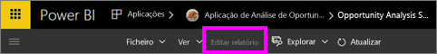
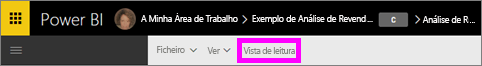

# Vista de Leitura e Vista de Edição nos relatórios do serviço Power BI
No serviço Power BI (mas não no Power BI Desktop), existem dois modos de visualizar e interagir com os relatórios: Vista de Leitura e Vista de Edição. A Vista de Leitura está disponível para todos os utilizadores e foi especialmente concebida para *consumidores* de dados, enquanto a Vista de Edição só está disponível para *criadores* e proprietários de relatórios.

## Vista de Leitura dos relatórios

 A Vista de Leitura serve para explorar e interagir com o relatório. É uma forma segura e divertida de reproduzir e ficar a conhecer os seus dados. A Vista de Leitura foi concebida para os *consumidores* de relatórios; aqueles que abrem relatórios de aplicações ou que têm relatórios [partilhados com as mesmas](service-share-dashboards.md). A Vista de Leitura assegura que cada consumidor de um relatório específico está a ver o mesmo relatório, as mesmas visualizações e, opcionalmente, com os mesmos filtros aplicados.  Os consumidores podem interagir com os relatórios, alterar os filtros existentes (e estas alterações serão guardadas com o relatório), mas não podem adicionar novos filtros.

>**NOTA**: em determinadas circunstâncias, os consumidores dos relatórios poderão ver dados diferentes devido à segurança ao nível da linha e às permissões dos dados.

## Vista de Edição dos relatórios

A Vista de Edição só está disponível para a pessoa que criou o relatório ou para o [coproprietário de um relatório como um membro ou administrador de uma área de trabalho da aplicação](service-create-distribute-apps.md).

A Vista de Edição foi concebida para os *criadores* dos relatórios. É nesta vista que os criadores importam e se ligam aos conjuntos de dados, exploram os dados e criam relatórios e dashboards. Na Vista de Edição, os *criadores* podem aprofundar ainda mais os dados ao adicionar e remover campos, ao alterar o tipo de visualização, ao criar novas visualizações e ao adicionar e eliminar visualizações e páginas do relatório. Em seguida, podem partilhar com os colegas os relatórios criados.

## Vista de Leitura versus Vista de Edição
Este gráfico não lista todas as capacidades de relatório do serviço Power BI! Lista apenas as tarefas de relatório que não estão disponíveis nas **duas** vistas.

|Tarefa  | Vista de Leitura  | Vista de Edição |
|-------------------------|-------|-------|
|**Relatórios, como um todo**  |
||||
| [Criar ou editar um relatório](service-report-create-new.md) | No  | Sim |
| [Partilhar um relatório](service-share-reports.md)| Sim | Sim e também pode gerir as permissões, incluindo conceder a outros permissões de *proprietário*. |
| [Criar filtros persistentes (permanentes) pormenorizados de nível visual, nível de página e nível de relatório no painel Filtros](power-bi-report-add-filter.md) | No  | Sim |
| [Utilizar o painel Filtros do relatório](power-bi-how-to-report-filter.md) | Sim, pode utilizar os filtros existentes e as alterações podem ser guardadas com o relatório, mas não podem ser adicionados novos filtros. | Sim |
| [Utilizar o painel Análise do relatório](service-analytics-pane.md) | No | Sim |
| [Opções **Vista** do relatório](power-bi-report-display-settings.md) | Sim, com algumas exceções. | Sim, todas, incluindo as linhas de grelha, o ajuste e o bloqueio. |
| [Criar um agendamento de atualização](refresh-data.md) | No  | Sim |
| [Subscrever um relatório](service-report-subscribe.md) | Sim | No |
| [Perguntas e respostas – fazer perguntas nos relatórios](power-bi-q-and-a.md) | No  | Sim |
| [Ver métricas de utilização ](service-usage-metrics.md) | Sim, na tela do relatório. | Sim, na lista de relatórios (Vista de Conteúdo) |
| [Ver relacionados](service-related-content.md) | Sim, na tela do relatório. | Sim, na lista de relatórios (Vista de Conteúdo) |
| [Guardar um relatório](service-report-save.md) | Sim, mas apenas através da opção **Guardar como**. | Sim |
| [Eliminar um relatório](service-delete.md) | No  | Sim |
|**Páginas do relatório** |
||||
| [Adicionar ou mudar o nome de uma página do relatório](power-bi-report-add-page.md)  | No  | Sim  |
| [Duplicar uma página do relatório](power-bi-report-copy-paste-page.md) | No  | Sim |
| [Eliminar página do relatório](service-delete.md) | não | sim |
|**Trabalhar com visualizações de relatórios**|
||||
| [Adicionar visualizações a um relatório](power-bi-report-add-visualizations-i.md) | No  | Sim |
| [Adicionar caixas de texto e formas a um relatório](power-bi-reports-add-text-and-shapes.md) | No  | Sim |
| [Utilizar o painel Formatação do relatório](service-the-report-editor-take-a-tour.md) | No | Sim |
| [Definir interações visuais](service-reports-visual-interactions.md) | No  | Sim |
| [Ver os dados utilizados para criar a visualização](service-reports-show-data.md) | No  | Sim |
| [Configurar a desagregação](power-bi-visualization-drill-down.md) | No  | Sim |
| [Alterar a visualização que está a ser utilizada](power-bi-report-change-visualization-type.md) | No | Sim|
| [Eliminar a visualização, a caixa de texto ou a forma](service-delete.md)| No | Sim |

## Navegar entre a Vista de Edição e a Vista de Leitura
Nota: só o criador e o(s) proprietário(s) do relatório poderão abri-lo na Vista de Edição.

1. Por predefinição, o relatório geralmente é aberto na Vista de Leitura. Sabe que está na Vista de Leitura se vir uma opção para **Editar relatório**. Se **Editar relatório** aparecer a cinzento, significa que não dispõe de permissões para abrir o relatório na Vista de Edição.

   

2. Se **Editar relatório** não aparecer a cinzento, selecione a opção para abrir o relatório na Vista de Edição.

   

   O relatório está agora na Vista de Edição e utiliza as mesmas [configurações de apresentação](power-bi-report-display-settings.md) utilizadas pela última vez na Vista de Leitura.

2. Para voltar à Vista de Leitura, selecione **Vista de Leitura** na barra de navegação superior.

    

### Próximos passos
Há muitas maneiras de interagir com o relatório na Vista de Leitura, através da divisão e da repartição de dados para descobrir ideias e obter respostas a perguntas.  O próximo tópico, [Interagir com um relatório na Vista de Leitura](service-interact-with-a-report-in-editing-view.md), descreve algumas em detalhe.    
Voltar a [relatórios no Power BI](service-reports.md)    
Mais perguntas? [Pergunte à Comunidade do Power BI](http://community.powerbi.com/)
