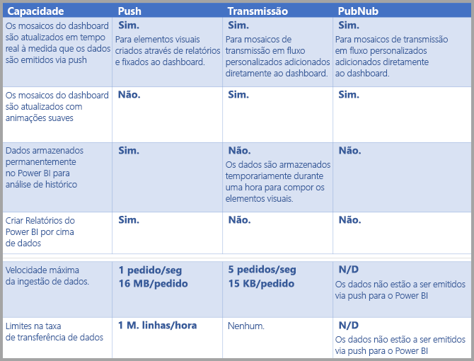
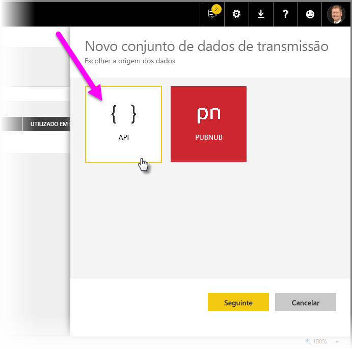
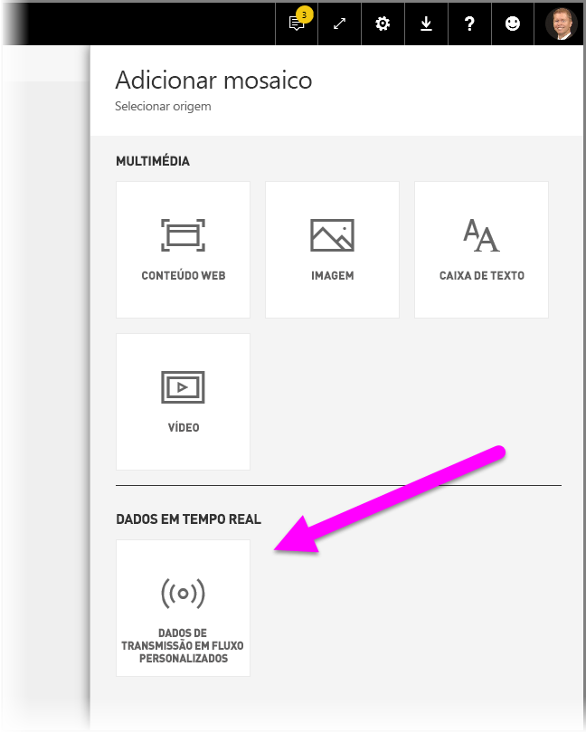
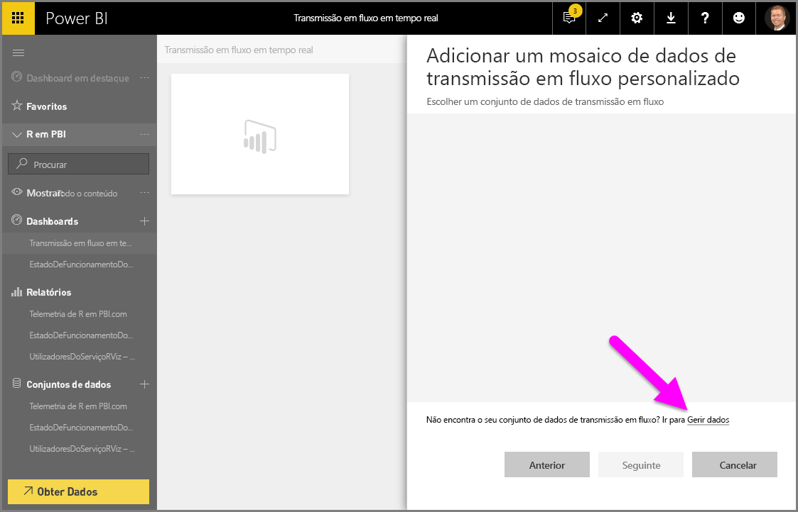
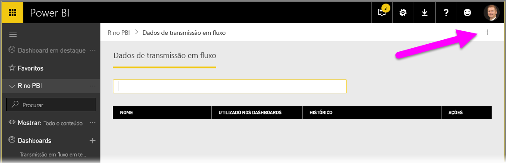
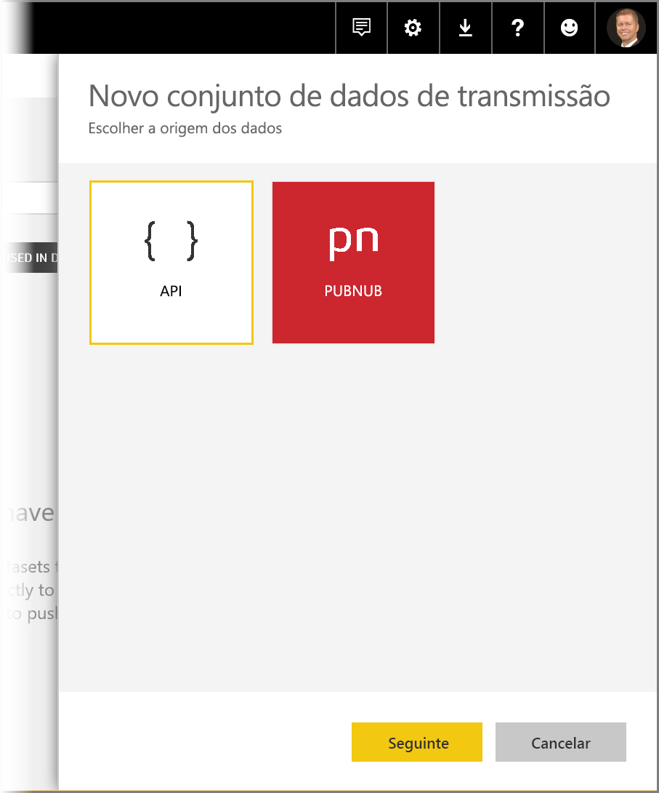
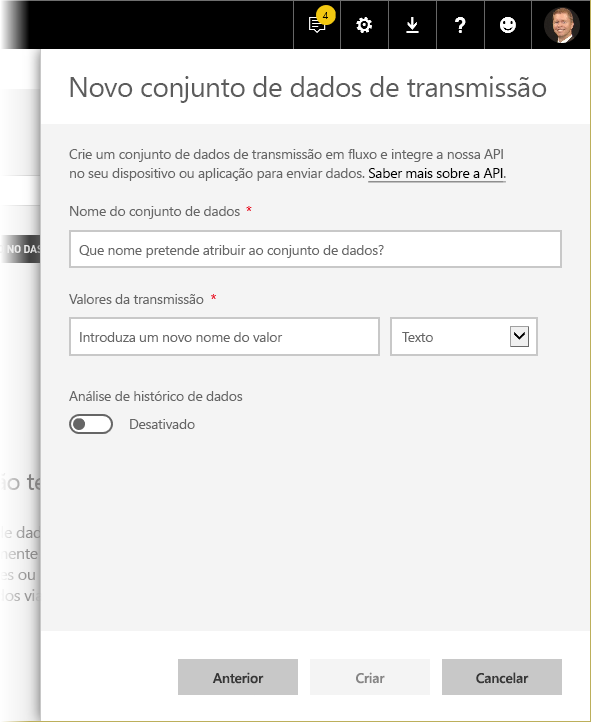
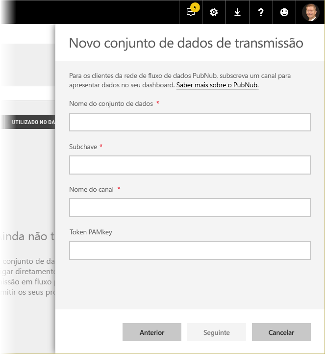
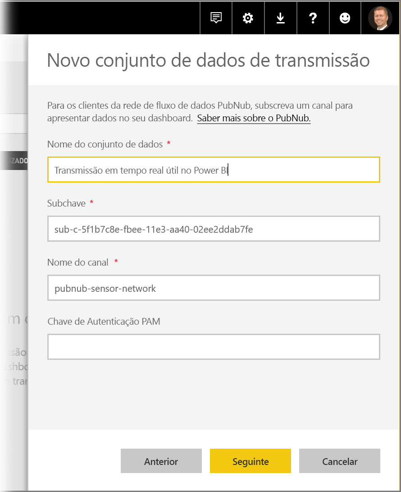
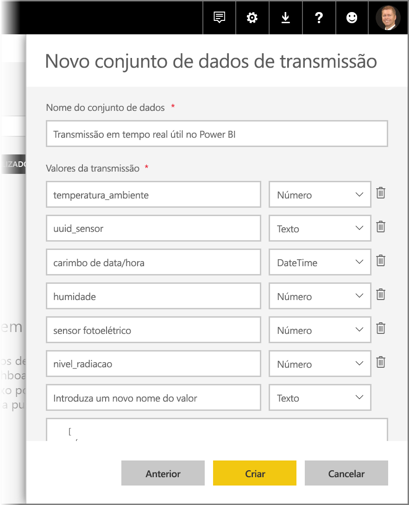

# Transmissão em fluxo em tempo real no Power BI
Com a transmissão em fluxo em tempo real do Power BI, pode transmitir dados em fluxo e atualizar dashboards em tempo real. Também é possível criar qualquer elemento visual ou dashboard passível de geração no Power BI de modo a apresentar e atualizar elementos visuais e dados em tempo real. Os dispositivos e as origens de dados de transmissão em fluxo podem ser sensores de fábrica, origens de redes sociais, métricas de utilização de serviços, entre outros itens a partir dos quais é possível recolher ou transmitir dados temporários.

Este artigo mostra como configurar o conjunto de dados de transmissão em fluxo em tempo real no Power BI. No entanto, antes de abordarmos essa questão, convém compreender os tipos de conjunto de dados em tempo real concebidos para serem apresentados em mosaicos (e dashboards), bem como as diferenças que os distinguem entre si.

## Tipos de conjunto de dados em tempo real
Existem três tipos de conjunto de dados em tempo real concebidos para serem apresentados em dashboards em tempo real:

* Conjunto de dados push
* Conjunto de dados de transmissão em fluxo
* Conjunto de dados de transmissão em fluxo PubNub

Primeiro, vamos compreender as diferenças que distinguem estes conjuntos de dados entre si (esta secção) e, em seguida, vamos debater como emitir dados via push para cada um destes conjuntos de dados.

### Conjunto de dados push
Com um **conjunto de dados push**, os dados são emitidos via push para o serviço Power BI. Quando o conjunto de dados é criado, o serviço Power BI cria automaticamente uma nova base de dados no serviço para armazenar os dados. Uma vez que há uma base de dados subjacente que continua a armazenar os dados à medida que estes vão dando entrada, é possível criar relatórios com os dados. Estes relatórios e os respetivos elementos visuais são semelhantes a qualquer outro elemento visual de relatório, o que significa que pode utilizar todas as funcionalidades de criação de relatórios do Power BI para criar elementos visuais, incluindo elementos visuais personalizados, alertas de dados, mosaicos de dashboard afixados e muito mais.

Assim que um relatório começa a ser criado com o conjunto de dados push, é possível afixar qualquer um dos respetivos elementos visuais a um dashboard. Nesse dashboard, os elementos visuais são atualizados em tempo real sempre que os dados são atualizados. No serviço, por sua vez, o dashboard aciona uma atualização de mosaicos sempre que são recebidos novos dados.

Existem dois factos a ter em atenção no que diz respeito a mosaicos afixados a partir de um conjunto de dados push:

* A afixação de um relatório completo com a opção *Afixar página dinâmica* **não** resulta na atualização automática dos dados.
* Depois de um elemento visual ser afixado a um dashboard, pode utilizar a opção **Perguntas e Respostas** para fazer perguntas ao conjunto de dados push em linguagem natural. Após efetuar uma consulta **Perguntas e Respostas**, pode voltar a afixar o elemento visual resultante no dashboard; deste modo, este dashboard *também* será atualizado em tempo real.

### Conjunto de dados de transmissão em fluxo
Com um **conjunto de dados de transmissão em fluxo**, os dados também são emitidos via push para o serviço Power BI, com uma diferença importante: o Power BI só armazena os dados numa cache temporária, que expira rapidamente. A cache temporária só é utilizada para apresentar elementos visuais que tenham algum sentido transitório em termos de histórico, como um gráfico de linhas com um intervalo de tempo de uma hora.

Com um **conjunto de dados de transmissão em fluxo**, *não* há qualquer base de dados subjacente, pelo que *não pode* criar elementos visuais de relatório com os dados transmitidos a partir do fluxo. Isso significa que não pode utilizar funcionalidades de relatório como a filtragem, os elementos visuais personalizados e outras funções de relatório.

A única forma de visualizar um conjunto de dados de transmissão em fluxo consiste em adicionar um mosaico e utilizar o conjunto de dados de transmissão em fluxo como uma origem de **dados de transmissão em fluxo personalizados**. Os mosaicos de transmissão em fluxo personalizados baseados num **conjunto de dados de transmissão em fluxo** estão otimizados para apresentar rapidamente os dados em tempo real. Existe uma latência muito ténue entre o momento em que os dados são emitidos via push para o serviço Power BI e a altura em que o elemento visual é atualizado, uma vez que não há necessidade de proceder à introdução ou leitura dos dados a partir de uma base de dados.

Na prática, os conjuntos de dados de transmissão em fluxo e os elementos visuais de transmissão em fluxo que lhes estão associados são mais úteis em situações nas quais é fundamental minimizar a latência entre o momento em que os dados são emitidos via push e a visualização dos mesmos. Além disso, as melhores práticas recomendam que os dados sejam emitidos via push num formato que possa ser visualizado tal como está, sem agregações adicionais. Exemplos de dados prontos tal como estão incluem temperaturas e médias pré-calculadas.

### Conjunto de dados de transmissão em fluxo PubNub
Com um conjunto de dados de transmissão em fluxo **PubNub**, o cliente Web do Power BI utiliza o SDK de PubNub para ler um fluxo de dados PubNub existente e não são armazenados quaisquer dados pelo serviço Power BI.

À semelhança do **conjunto de dados de transmissão em fluxo**, com o **conjunto de dados de transmissão em fluxo PubNub** não há qualquer base de dados subjacente no Power BI, pelo que não pode criar elementos visuais de relatório com base nos dados transmitidos em fluxo, da mesma forma que não pode tirar partido das funcionalidades de relatório, como a filtragem, os elementos visuais personalizados, entre outros. Como tal, o **conjunto de dados de transmissão em fluxo PubNub** também só pode ser visualizado quando se adiciona um mosaico ao dashboard e se configura um fluxo de dados PubNub como origem.

Os mosaicos baseados num **conjunto de dados de transmissão em fluxo PubNub** estão otimizados para apresentar rapidamente os dados em tempo real. Uma vez que o Power BI está diretamente ligado ao fluxo de dados PubNub, existe uma latência muito ténue entre o momento em que os dados são emitidos via push para o serviço Power BI e a altura em que o elemento visual é atualizado.

### Matriz de conjuntos de dados de transmissão em fluxo
A tabela que se segue (ou matriz, se preferir) descreve os três tipos de conjunto de dados para a transmissão em fluxo em tempo real e lista as capacidades e limitações de cada um deles.

> [!NOTE]
> Consulte [este artigo do MSDN](https://msdn.microsoft.com/library/dn950053.aspx) para obter informações sobre as limitações de **Push** no que se refere à quantidade de dados podem ser emitidos via push.
> 
> 

## Emitir dados via push para conjuntos de dados
Na secção anterior, foram descritos os três principais tipos de conjunto de dados em tempo real que pode utilizar na transmissão em fluxo em tempo real, bem como as diferenças que os distinguem. Esta secção descreve como criar e emitir dados via push para esses conjuntos de dados.

Existem três formas primordiais de emitir dados via push para um conjunto de dados:

* Utilizar as APIs REST do Power BI
* Utilizar a IU do Conjunto de Dados de Transmissão em Fluxo
* Utilizar o Azure Stream Analytics

Vamos abordar cada uma dessas abordagens caso a caso.

### Utilizar as APIs REST do Power BI para emitir dados via push
As **APIs REST do Power BI** podem ser utilizadas para criar e enviar dados para conjuntos de dados **push**, bem como para conjuntos de dados de **transmissão em fluxo**. Quando cria um conjunto de dados com as APIs REST do Power BI, o sinalizador *defaultMode* especifica se o conjunto de dados é do tipo push ou transmissão em fluxo. Se o sinalizador *defaultMode* não estiver definido, por predefinição, o conjunto de dados assume o tipo de conjunto de dados **push**.

Se o valor *defaultMode* estiver definido como *pushStreaming*, o conjunto de dados é simultaneamente um conjunto de dados **push** *e* de **transmissão em fluxo**, proporcionando os benefícios inerentes a ambos os tipos de conjunto de dados. O [artigo para **Criar conjunto de dados**](https://msdn.microsoft.com/library/mt203562.aspx) no âmbito da API REST demonstra a criação de um conjunto de dados de transmissão em fluxo e mostra o sinalizador *defaultMode* em ação.

> [!NOTE]
> Quando utiliza conjuntos de dados com o sinalizador *defaultMode* definido como *pushStreaming*, se um pedido exceder a restrição de tamanho de 15 KB para um conjunto de dados de **transmissão em fluxo**, mas for inferior à restrição de tamanho de 16 MB de um conjunto de dados **push**, o pedido será bem-sucedido e os dados serão atualizados no conjunto de dados push. No entanto, os mosaicos de transmissão em fluxo irão falhar temporariamente.
> 
> 

Assim que um conjunto de dados estiver criado, utilize as APIs REST para emitir dados via push com a [API **Adicionar linhas**](https://msdn.microsoft.com/library/mt203561.aspx), conforme [demonstrado neste artigo](https://msdn.microsoft.com/library/mt203561.aspx).

Todos os pedidos relativos às APIs REST estão protegidos através do **OAuth do Azure AD**.

### Utilizar a IU do Conjunto de Dados de Transmissão em Fluxo para emitir dados via push
No serviço Power BI, pode criar um conjunto de dados ao selecionar a abordagem **API** conforme mostrado na imagem seguinte.

Quando cria o novo conjunto de dados de transmissão em fluxo, pode optar por ativar a **Análise de histórico de dados** conforme mostrado abaixo, o que gera um impacto significativo.

Quando a **Análise de histórico de dados** está desativada (e está desativada por predefinição), cria um **conjunto de dados de transmissão em fluxo** conforme descrito anteriormente neste artigo. Quando a **Análise de histórico de dados** está *ativada*, o conjunto de dados criado torna-se simultaneamente um **conjunto de dados de transmissão em fluxo** e um **conjunto de dados push**. Isto equivale a utilizar as APIs REST do Power BI para criar um conjunto de dados com o respetivo sinalizador *defaultMode* definido como *pushStreaming*, conforme descrito anteriormente neste artigo.

> [!NOTE]
> Os conjuntos de dados de transmissão em fluxo criados com a IU do serviço Power BI, conforme descrito no parágrafo anterior, não necessitam da autenticação do Azure AD. Nesses conjuntos de dados, o proprietário do conjunto de dados recebe um URL com uma chave de linha, que autoriza o requerente a emitir dados via push para o conjunto de dados sem utilizar um token de portador do OAuth do Azure AD. É de realçar, no entanto, que a abordagem do Azure AD (AAD) continua a ser válida para emitir dados via push para o conjunto de dados.
> 
> 

### Utilizar o Azure Stream Analytics para emitir dados via push
Pode adicionar o Power BI como uma saída no **Azure Stream Analytics** (ASA) e, em seguida, visualizar esses fluxos de dados no serviço Power BI em tempo real. Esta secção descreve os detalhes técnicos de como esse processo decorre.

O Azure Stream Analytics utiliza as APIs REST do Power BI para criar o respetivo fluxo de dados de saída para o Power BI, com o sinalizador *defaultMode* definido como *pushStreaming* (consulte as secções anteriores deste artigo para obter informações sobre o sinalizador *defaultMode*), o que resulta num conjunto de dados capaz de tirar partido das vertentes **push** e **transmissão em fluxo**. No decorrer da criação do conjunto de dados, o Azure Stream Analytics também define o sinalizador **retentionPolicy* como *basicFIFO*. Com essa definição, a base de dados que suporta o conjunto de dados push armazena 200 000 linhas. Uma vez atingido esse limite, as linhas são ignoradas segundo a ordem de entrada, com base no princípio first in, first out (FIFO).

> [!CAUTION]
> Se a consulta do Azure Stream Analytics resultar numa saída muito rápida para o Power BI (por exemplo, uma ou duas vezes por segundo), o Azure Stream Analytics começará a organizar essas saídas em lotes agregados num único pedido. Isto pode fazer com que o tamanho do pedido exceda o limite de mosaicos de transmissão em fluxo. Nesse caso, tal como mencionado em secções anteriores, os mosaicos de transmissão em fluxo não serão compostos. Nesse tipo de situações, a melhor prática consiste em reduzir a taxa de saída de dados para o Power BI. Por exemplo, em vez de um valor máximo por cada segundo, defina um máximo para 10 segundos.
> 
> 

## Configurar o conjunto de dados de transmissão em fluxo em tempo real no Power BI
Agora que já nos debruçámos sobre os três principais tipos de conjunto de dados para a transmissão em fluxo em tempo real e as três formas primordiais de emitir dados via push para um conjunto de dados, vamos colocar o conjunto de dados de transmissão em fluxo em tempo real a funcionar no Power BI.

Para começar a utilizar a transmissão em fluxo em tempo real, precisa de escolher uma das duas maneiras disponíveis para consumir dados de transmissão em fluxo no Power BI:

* **mosaicos** com elementos visuais de dados de transmissão em fluxo
* **conjuntos de dados** criados a partir de dados de transmissão em fluxo mantidos no Power BI

Em qualquer uma das opções, terá de configurar **Dados de transmissão em fluxo** no Power BI. Para tal, no seu dashboard (um dashboard existente ou um novo) selecione **Adicionar um mosaico** e, em seguida, selecione **Dados de transmissão em fluxo personalizados**.

Se ainda não tiver dados de transmissão em fluxo configurados, não se preocupe. Pode selecionar **gerir dados** para começar.

Nesta página, pode introduzir o ponto final do seu conjunto de dados de transmissão em fluxo se já tiver um criado (na caixa de texto). No caso de ainda não ter um conjunto de dados de transmissão em fluxo, selecione o ícone de adição (**+**) no canto superior direito para ver as opções disponíveis para a criação de um conjunto de dados de transmissão em fluxo.

Quando clicar no ícone **+**, ser-lhe-ão apresentadas duas opções:

A secção seguinte descreve estas opções, além de explicar em detalhe como se cria um **mosaico** de transmissão em fluxo ou um **conjunto de dados** a partir da origem de dados de transmissão em fluxo, que poderá utilizar mais tarde para criar relatórios.

## Criar o conjunto de dados de transmissão em fluxo com a sua opção preferida
Existem duas formas de criar um feed de dados de transmissão em fluxo em tempo real apto a ser utilizado e visualizado pelo Power BI:

* **API REST do Power BI** com um ponto final de transmissão em fluxo em tempo real
* **PubNub**

As secções que se seguem analisam cada uma destas opções caso a caso.

### Utilizar a API REST do POWER BI
**API REST do Power BI** - Os recentes melhoramentos na API REST do Power BI visam simplificar a transmissão em fluxo em tempo real para os programadores. Quando seleciona **API** na janela **Novo conjunto de dados de transmissão**, são-lhe apresentadas entradas a preencher que permitem a ligação e utilização do seu ponto final por parte do Power BI:

Se quiser que o Power BI armazene os dados enviados através deste fluxo de dados, ative a *Análise de histórico de dados* e isso permitir-lhe-á criar relatórios e análises centrados no fluxo de dados recolhido. Também pode [saber mais sobre a API](https://msdn.microsoft.com/library/dn877544.aspx).

Depois de criar o fluxo de dados com êxito, é-lhe fornecido um ponto de final do URL da API REST, que a aplicação pode chamar através de pedidos *POST* a fim de emitir os seus dados via push para o conjunto de dados de **transmissão em fluxo** do Power BI que criou.

Quando efetuar pedidos *POST*, deve certificar-se de que o corpo do pedido corresponde ao JSON de exemplo fornecido pela interface de utilizador do Power BI. Por exemplo, agregue os seus objetos JSON numa matriz.

### Utilizar o PubNub
A integração da transmissão em fluxo **PubNub** com o Power BI permite-lhe utilizar (ou criar novos) fluxos de dados **PubNub** de baixa latência e utilizá-los no Power BI. Quando seleciona **PubNub** e, depois, seleciona **Seguinte**, é-lhe apresentada a seguinte janela:

> [!WARNING]
> Os canais de PubNub podem ser protegidos com uma chave de autenticação do Gestor de Acesso de PubNub (PAM). Esta chave será partilhada com todos os utilizadores que têm acesso ao dashboard. Pode [saber mais sobre o controlo de acesso do PubNub](https://www.pubnub.com/docs/web-javascript/pam-security).
> 
> 

Os fluxos de dados do **PubNub** são, muitas vezes, volumosos e o seu formato original nem sempre é adequado para efeitos de armazenamento e análise do histórico. Para utilizar o Power BI na análise do histórico de dados do PubNub, terá de agregar o fluxo de PubNub não processado e enviá-lo para o Power BI. Uma forma de o fazer consiste em utilizar o [Azure Stream Analytics](https://azure.microsoft.com/services/stream-analytics/).

## Exemplo de utilização da transmissão em fluxo em tempo real no Power BI
Segue-se um exemplo rápido de como a transmissão em fluxo em tempo real funciona no Power BI. Pode acompanhar este exemplo a par e passo para constatar em primeira mão todas as vantagens da transmissão em fluxo em tempo real.

Neste exemplo, utilizamos um fluxo disponível ao público do **PubNub**. Eis os passos:

1. No **serviço Power BI**, selecione um dashboard (ou crie um novo) e selecione **Adicionar mosaico** > **Dados de Transmissão em Fluxo Personalizados** e, em seguida, selecione o botão  **Seguinte**.
   
   
2. Se ainda não tiver origens de dados de transmissão em fluxo, selecione a ligação **gerir dados** (logo por cima do botão **Seguinte**) e, em seguida, selecione **+ Adicionar dados de transmissão em fluxo** na ligação presente no canto superior direito da janela. Selecione **PubNub** e, depois, selecione **Seguinte**.
3. Crie um nome para o conjunto de dados, em seguida, cole os seguintes valores na janela apresentada e, depois, selecione **Seguinte**:
   
   *Chave de subscrição:*
   
       sub-c-5f1b7c8e-fbee-11e3-aa40-02ee2ddab7fe
   *Canal:*
   
       pubnub-sensor-network
   
   
4. Na janela seguinte, basta selecionar as predefinições (que estão automaticamente povoadas) e, em seguida, selecione **Criar**.
   
   
5. Na área de trabalho do Power BI, crie um novo dashboard e, em seguida, adicione um mosaico (veja acima para obter os passos, se necessário). Desta vez, quando criar um mosaico e selecionar **Dados de Transmissão em Fluxo Personalizados**, terá um conjunto de dados de transmissão em fluxo pronto a utilizar. Aproveite para o experimentar. Se adicionar campos *numéricos* a gráficos de linhas e, em seguida, adicionar outros mosaicos, poderá obter um dashboard em tempo real semelhante ao seguinte:
   
   

Experimente e explore o conjunto de dados de exemplo. Em seguida, dedique-se a criar os seus próprios conjuntos de dados e a transmitir dados dinâmicos em fluxo para o Power BI.

## Perguntas e respostas
Seguem-se algumas perguntas comuns sobre a transmissão em fluxo em tempo real no Power BI e respetivas respostas.

#### Posso utilizar filtros em conjuntos de dados push? E em relação a um conjunto de dados de transmissão em fluxo?
Infelizmente, os conjuntos de dados de transmissão em fluxo não suportam a filtragem. Para os conjuntos de dados push, pode criar um relatório, filtrar o relatório e, em seguida, afixar os elementos visuais filtrados a um dashboard. No entanto, deixa de poder alterar o filtro no elemento visual assim que o mesmo esteja no dashboard.

Separadamente, pode afixar o mosaico de relatório dinâmico ao dashboard e, nesse caso, pode alterar os filtros. No entanto, os mosaicos de relatórios dinâmicos não serão atualizados em tempo real quando os dados forem emitidos via push. Terá de atualizar manualmente o elemento visual através da opção *Atualizar mosaicos do dashboard* no menu **Mais**.

Quando aplica filtros a conjuntos de dados push com campos *DateTime* com uma precisão ao milissegundo, os operadores de *equivalência* não são suportados. No entanto, os operadores como o sinal de maior (>) ou de menor (<) funcionam corretamente.

#### Como posso ver o valor mais recente num conjunto de dados push? E em relação a um conjunto de dados de transmissão em fluxo?
Os conjuntos de dados de transmissão em fluxo são concebidos de modo a apresentar os dados mais recentes. Pode utilizar o elemento visual de transmissão em fluxo **Cartão** para ver facilmente os valores numéricos mais recentes. Infelizmente, o cartão não suporta dados do tipo *DateTime* ou *Text*.
No caso dos conjuntos de dados push, partindo do princípio que tem um carimbo de data/hora no esquema, pode tentar criar um elemento visual de relatório com o último filtro N.

#### Posso ligar a conjuntos de dados push ou de transmissão em fluxo no Power BI Desktop?
Infelizmente, esta funcionalidade não está disponível neste momento.

#### Tendo em conta a pergunta anterior, como posso modelar conjuntos de dados em tempo real?
Não é possível modelar conjuntos de dados de transmissão em fluxo, uma vez que os dados não estão armazenados permanentemente. Para um conjunto de dados push, pode utilizar as APIs REST de conjuntos de dados/tabelas de atualização para adicionar medidas e relações. Pode obter mais informações nos artigos [Atualizar Esquema da Tabela](https://msdn.microsoft.com/library/mt203560.aspx) e [Propriedades do conjunto de dados](https://msdn.microsoft.com/library/mt742155.aspx).

#### O que devo fazer para limpar todos os valores presentes num conjunto de dados push? E em relação a um conjunto de dados de transmissão em fluxo?
Num conjunto de dados push, pode utilizar a chamada de API REST de eliminação de linhas. Esta ferramenta útil, um wrapper que agrega as APIs REST, também pode ser utilizada separadamente. Neste momento, não existe forma de limpar os dados de um conjunto de dados de transmissão em fluxo, apesar de os mesmos serem limpos automaticamente ao fim de uma hora.

#### Configurei uma saída do Azure Stream Analytics para o Power BI, mas esta não aparece no Power BI. O que aconteceu?
Segue-se uma lista de verificação que pode utilizar para resolver o problema:

1. Reinicie a tarefa do Azure Stream Analytics (as tarefas criadas antes da disponibilização de GA de transmissão em fluxo terão de ser reiniciadas)
2. Experimente voltar a autorizar a ligação do Power BI no Azure Stream Analytics
3. Qual foi a área de trabalho que especificou na saída de Azure Stream Analytics? Está consultar essa (mesma) área de trabalho no serviço Power BI?
4. A saída da consulta do Azure Stream Analytics está a apontar explicitamente para a saída do Power BI? (através da palavra-chave INTO)
5. A tarefa do Azure Stream Analytics tem dados que estejam a ser transmitidos em fluxo? O conjunto de dados só será criado se estiverem a ser transmitidos dados.
6. Consegue consultar os registos do Azure Stream Analytics para verificar se foram emitidos avisos ou erros?

## Passos seguintes
Seguem-se algumas ligações que poderão ser úteis quando estiver a trabalhar com a transmissão em fluxo em tempo real no Power BI:

* [Descrição geral da API REST do Power BI com dados em tempo real](https://msdn.microsoft.com/library/dn877544.aspx)
* [Limitações da API REST do Power BI](https://msdn.microsoft.com/library/dn950053.aspx)
* [Artigo para **Criar conjunto de dados** no âmbito da API REST](https://msdn.microsoft.com/library/mt203562.aspx)
* [API REST **Adicionar Linhas**  do Power BI](https://msdn.microsoft.com/library/mt203561.aspx)
* [Azure Stream Analytics](https://azure.microsoft.com/services/stream-analytics/)

