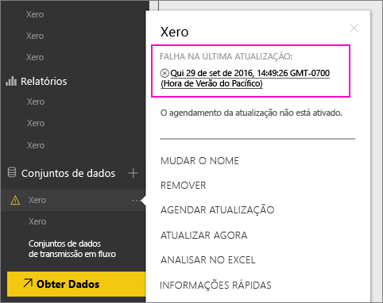
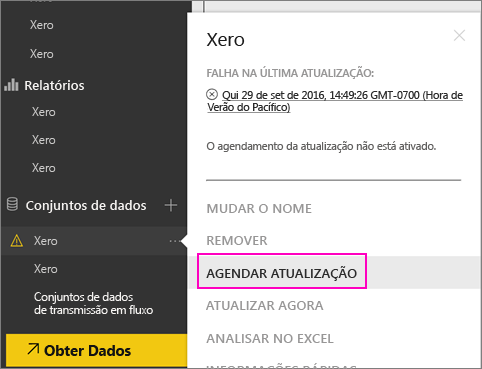
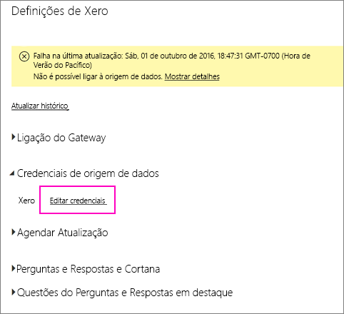
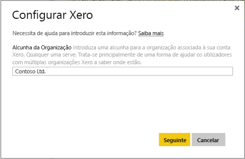
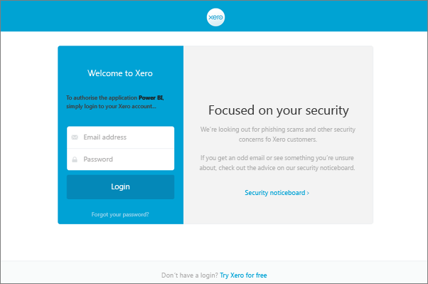
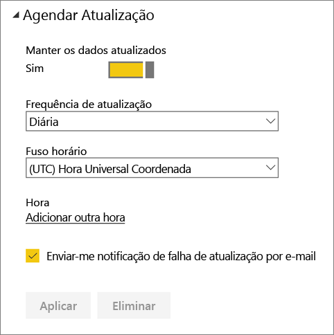
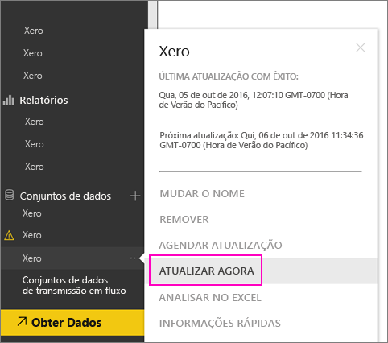

# How to refresh your Xero content pack credentials if refresh failed (Como atualizar as suas credenciais do pacote de conteúdos Xero se a atualização tiver falhado)
Se utilizar o pacote de conteúdos do Xero Power BI, podem ter ocorrido alguns problemas na atualização diária do pacote de conteúdos devido a um incidente recente do serviço Power BI.

Pode ver se o pacote de conteúdos é atualizado com êxito ao verificar o último estado de atualização do conjunto de dados do Xero, conforme mostrado na captura de ecrã abaixo.

Se vir que a atualização falhou, conforme mostrado acima, siga estes passos para renovar as credenciais do pacote de conteúdos.

1. Clique em **Mais opções** (...) junto ao conjunto de dados do Xero e clique em **Agendar atualização**. Esta ação abre a página de definições do pacote de conteúdos do Xero.
   
    
2. Na página **Definições do Xero**, selecione **Credenciais da origem de dados** > **Editar credenciais**.
   
    
3. Introduza o nome da organização > **Seguinte**.
   
    
4. Inicie sessão com a sua conta do Xero.
   
    
5. Agora que as suas credenciais estão atualizadas, vamos assegurar que o agendamento da atualização está definido para ser executado diariamente. Verifique ao clicar em **Mais opções** (...) junto ao conjunto de dados do Xero e clique novamente em **Agendar atualização**.
   
    
6. Também pode optar por atualizar o conjunto de dados de imediato. Clique em **Mais opções** (...) junto ao conjunto de dados do Xero e clique em **Atualizar agora**.
   
    

Se ainda estiver a ter problemas de atualização, não hesite em contactar-nos em [https://support.powerbi.com](https://support.powerbi.com) 

Para obter mais informações sobre o pacote de conteúdos do Xero do Power BI, aceda à [página de ajuda do pacote de conteúdos do Xero](service-connect-to-xero.md).

### Próximas etapas
* Mais perguntas? [Pergunte à Comunidade do Power BI](https://community.powerbi.com/)

