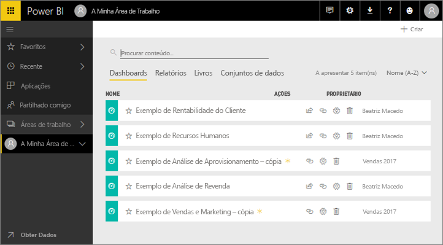
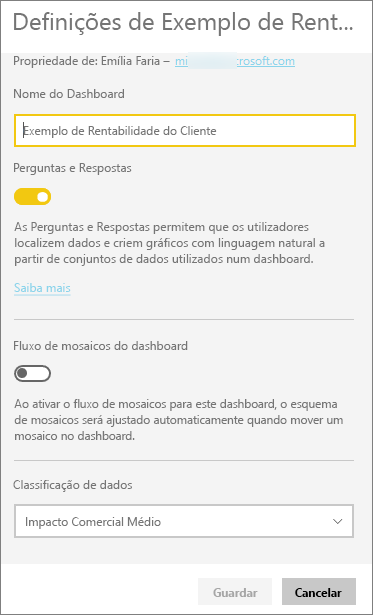
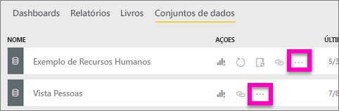
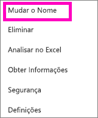
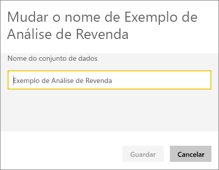
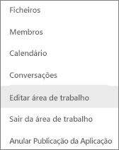
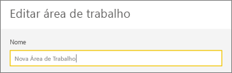
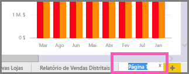
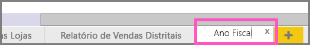

# Mudar o nome de praticamente qualquer coisa no serviço Power BI
Este artigo mostra como mudar o nome de um dashboard, relatório, p´gina de relatório, livro, conjunto de dados, aplicação e área de trabalho no serviço Power BI.

**Posso alterar o nome?**

| Tipo de conteúdo | Sou o autor ou o criador | Partilhado comigo |
| --- | --- | --- |
| Dashboard numa área de trabalho |Sim |Não |
| Relatório numa área de trabalho |Sim |Não |
| Livro numa área de trabalho |Sim |Não |
| Conjunto de dados numa área de trabalho |Sim |Não |
| Aplicação numa área de trabalho |Sim, se for o proprietário ou tiver permissões de Administrador |No |
| Aplicações publicadas |Não a partir do ecrã Aplicação, mas o nome da aplicação pode ser alterado a partir da área de trabalho da aplicação e novamente publicado com um novo nome se tiver permissões de Administrador |No |
| Conteúdo da aplicação (dashboard, relatório, livro, conjunto de dados) |Não a partir do ecrã Aplicação, mas o nome do conteúdo da aplicação pode ser mudado a partir da área de trabalho da aplicação e novamente publicado com um novo nome se tiver permissões de Administrador |No |
| Conteúdo em **Partilhado comigo** |Não |Não |

## Mudar o nome de um dashboard, relatório ou livro
1. Comece numa área de trabalho e selecione o separador **Dashboards**, **Relatórios** ou **Livros**. Coloque o cursor sobre o item cujo nome quer mudar e selecione o ícone de engrenagem . Se não for apresentado nenhum ícone de engrenagem, significa que não tem permissões para mudar o nome.
   
   
2. Na página Definições, escreva o novo nome e selecione **Guardar**.
   
   

## Mudar o nome de um conjunto de dados
1. Comece numa área de trabalho e selecione o separador **Conjuntos de dados**.
   
   
2. Coloque o cursor sobre o item cujo nome quer mudar, selecione as reticências (…) e selecione **Mudar o nome**.  
   
      
   
   > [!NOTE]
   > As opções na lista pendente variam.
   > 
   > 
3. Na página Definições, escreva um novo nome e selecione **Guardar**.
   
     

## Mudar o nome de uma área de trabalho da Aplicação
Qualquer pessoa com permissões de Administrador pode mudar o nome de uma área de trabalho da aplicação.

1. Comece na área de trabalho cujo nome quer mudar.
2. No canto superior direito, selecione as reticências (...) e selecione **Editar área de trabalho**. Se não vir esta opção, significa que não tem permissões para mudar o nome desta área de trabalho. 
   
    
3. Escreva um novo nome de área de trabalho e selecione **Guardar**.
   
   

## Mudar o nome de uma página num relatório
Não gosta do nome de uma página no relatório do Power BI?  Um novo nome está a apenas um clique. É possível mudar o nome das páginas na [vista de Edição de relatórios ](service-interact-with-a-report-in-editing-view.md).

1. Abra o relatório na [Vista de Edição](service-reading-view-and-editing-view.md).
2. Localize os separadores da página do relatório na parte inferior da janela do Power BI.
   
    
3. Abra a página de relatório que deseja renomear selecionando o separador.
4. Clique duas vezes no nome no separador para destacá-lo.  
   
    
5. Introduza um novo nome para a página do relatório e selecione ENTER.
   
    

## Considerações e resolução de problemas
* Se o item cujo nome quer mudar foi partilhado consigo ou fizer parte de um pacote de conteúdos, não verá o ícone de engrenagem e não terá acesso às Definições.
* No separador **Conjuntos de dados**, se não vir as reticências (…), expanda a janela do browser.

Mais perguntas? [Pergunte à Comunidade do Power BI](http://community.powerbi.com/)

