# Criar um novo relatório do Power BI ao importar um conjunto de dados
Leu o artigo [Relatórios no Power BI](service-reports.md) e pretende agora criar o seu. Existem várias formas diferentes de criar um relatório. Neste artigo, vamos começar por criar um relatório muito básico a partir de um conjunto de dados do Excel. Após compreender as noções básicas da criação de um relatório, os **Passos seguintes** na parte inferior irão direcioná-lo para os tópicos de relatórios mais avançados.  

> **SUGESTÃO**: Para criar um relatório ao copiar um relatório existente, consulte [Copiar um relatório](power-bi-report-copy.md)
> 
> 

## Importar o conjunto de dados
Este método de criação de um relatório começa por um conjunto de dados e uma tela de relatório em branco. Para acompanhar, [transfira o conjunto de dados em Excel de exemplo, Análise de Revenda](http://go.microsoft.com/fwlink/?LinkId=529778), e guarde-o no OneDrive para Empresas (preferencial) ou localmente.

1. Vamos criar o relatório numa área de trabalho do serviço Power BI, por isso, selecione uma área de trabalho existente ou crie uma nova.
   
   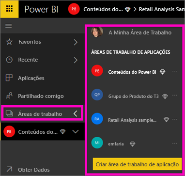
2. Na parte inferior da barra de navegação à esquerda, selecione **Obter dados**.
   
   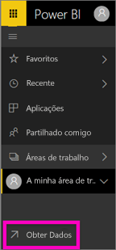
3. Selecione **Ficheiros** e navegue para o local onde guardou o exemplo de Análise de Revenda.
   
    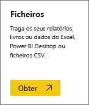
4. Para este exercício, selecione **Importar**.
   
   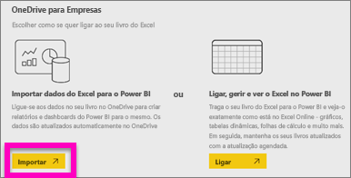
5. Após o conjunto de dados ser importado, selecione **Ver conjunto de dados**.
   
   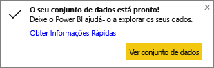
6. Ver um conjunto de dados abre o editor de relatórios.  Irá ver uma tela em branco e as ferramentas de edição de relatórios.
   
   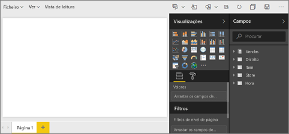

> **SUGESTÃO**: se não estiver familiarizado com a tela de edição de relatórios ou precisar de relembrar alguns aspetos, [Faça uma visita ao editor de relatórios](service-the-report-editor-take-a-tour.md) antes de continuar.
> 
> 

## Adicionar um Medidor Radial ao relatório
Agora que o nosso conjunto de dados foi importado, vamos começar a responder a algumas perguntas.  A nossa Diretora de Marketing (CMO) quer saber quanto falta para atingirmos os nossos objetivos de vendas para este ano. Os Medidores são [uma boa opção de visualização](power-bi-report-visualizations.md) para mostrar este tipo de informação.

1. No painel Campos, selecione **Sales (Vendas)** > **This Year Sales (Vendas Deste Ano)** > **Value (Valor)**.
   
    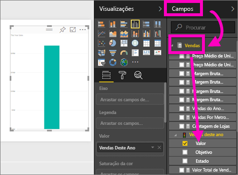
2. Converta o visual para um Medidor ao selecionar o modelo Medidor  no painel **Visualizações**.
   
    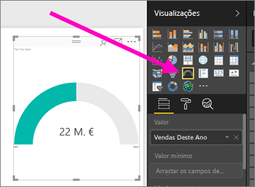
3. Arraste **Sales (Vendas)** > **This Year Sales (Vendas Este Ano)** > **Goal (Objetivo)** para o well **Target value (Valor de destino)**. Parece que estamos bastante próximos do nosso objetivo.
   
    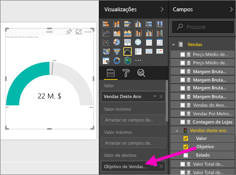
4. Esta é uma boa altura para [guardar o seu relatório](service-report-save.md).
   
   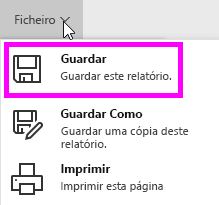

## Adicionar um gráfico de área e segmentação de dados ao relatório
A nossa CMO quer que respondamos a algumas perguntas adicionais. Ela quer comparar as vendas deste ano com as do ano anterior. Quer também saber os dados por distrito.

1. Primeiro, vamos arranjar algum espaço na nossa tela. Selecione o Medidor e mova-o para o canto superior direito. Depois, arraste e largue um dos cantos para diminuir o tamanho.
2. Desselecione o medidor. No painel Campos, selecione **Sales (Vendas)** > **This Year Sales (Vendas Este Ano)** > **Value (Valor)** e selecione **Sales (Vendas)** > **Last Year Sales (Vendas no Ano Passado)**.
   
    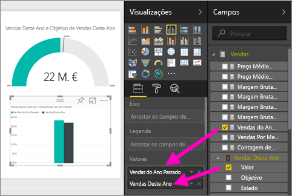
3. Converta o visual para um Gráfico de área ao selecionar o modelo Gráfico de área  no painel **Visualizações**.
4. Selecione **Time (Tempo)** > **Period (Período)** para adicioná-lo ao well **Axis (Eixo)**.
   
    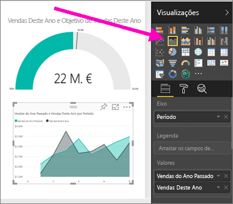
5. Para ordenar a visualização, selecione as reticências e selecione **Ordenar por Período**.
6. Agora, vamos adicionar a segmentação de dados. Selecione uma área vazia na tela e selecione o modelo de Segmentação de Dados . Isto irá adicionar uma segmentação de dados vazia à tela.
   
        
7. No painel Campos, selecione **District (Distrito)** > **District (Distrito)**. Mova e redimensione a segmentação de dados.
   
    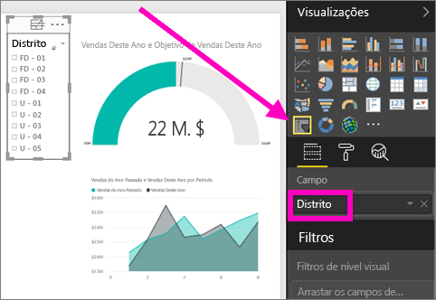  
8. Utilize a segmentação de dados para procurar padrões e informações por Distrito.
   
     
9. Se pretender, continue a adicionar visualizações.

## Próximos passos
* [Criar uma cópia de um relatório](power-bi-report-copy.md)
* [Guardar o relatório](service-report-save.md)    
* [Adicionar uma página nova ao relatório](power-bi-report-add-page.md)  
* Saiba como [afixar visualizações a um dashboard](service-dashboard-pin-tile-from-report.md)    
* Mais perguntas? [Experimente a Comunidade do Power BI](http://community.powerbi.com/)

