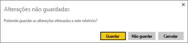
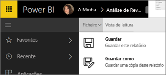
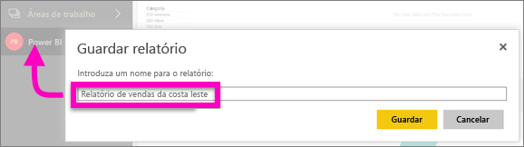

# Guarde um relatório no serviço Power BI e no Power BI Desktop
Depois de fazer alterações a um relatório no Power BI, pode guardá-lo, guardar com um novo nome ou apenas fechá-lo sem guardar as suas alterações. Digamos que abre o relatório, cria uma visualização e afixa-a no dashboard. Se a fechar agora sem guardar as alterações, o mosaico permanece no dashboard, mas a visualização não é guardada no relatório. Ao clicar no mosaico no dashboard, o relatório é aberto, mas a visualização não existe no relatório.

> [!TIP]
> Preste atenção à área de trabalho que está ativa para que possa encontrar o relatório guardado. O relatório é guardado para na área de trabalho ativa.
> 
> 

### Para guardar um relatório:
1. Se tentar navegar para fora de um relatório e este tiver alterações, o Power BI apresenta uma linha de comandos.
   
   
2. Outra forma de guardar o relatório é ao selecionar **FICHEIRO** \> **Guardar** ou **Guardar Como**. Se estiver na [Vista de leitura](service-reading-view-and-editing-view.md) apenas pode ver a opção de Guardar Como. 
   
   
3. Se este for um novo relatório (Guardar) ou uma nova versão de um relatório existente (Guardar como), dê-lhe um nome descritivo.  **O relatório vai ser adicionado à área de trabalho ativa**.
   
    

### Próximos passos
Leia mais sobre os [relatórios no Power BI](service-reports.md)

[Power BI - Conceitos Básicos](service-basic-concepts.md)

Mais perguntas? [Pergunte à Comunidade do Power BI](http://community.powerbi.com/)

