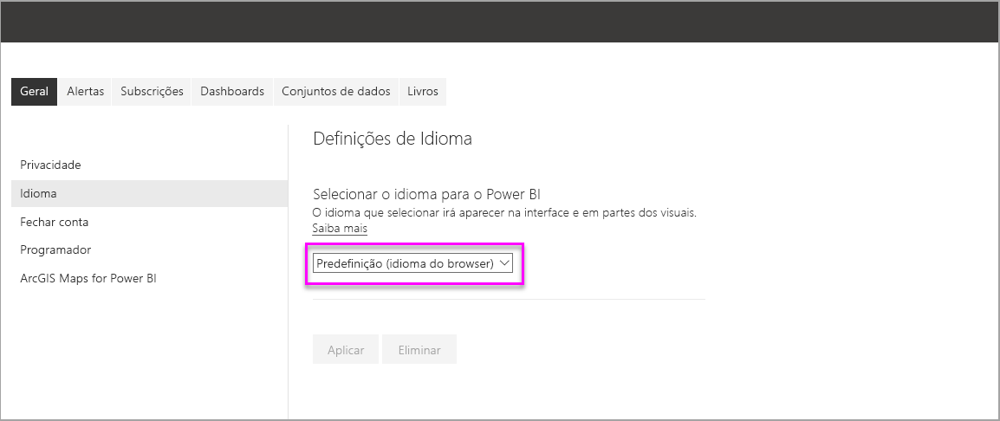
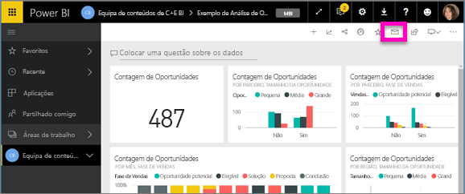
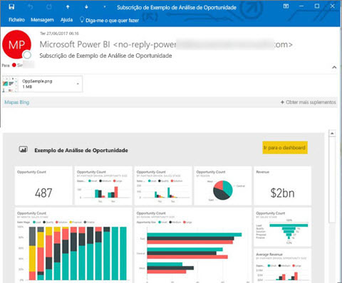
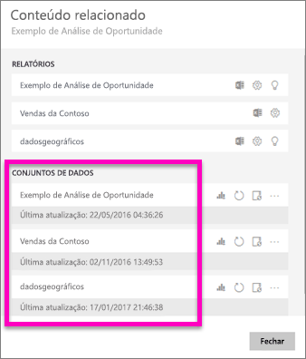
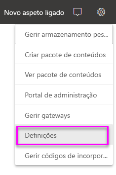
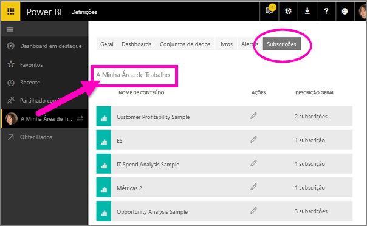

# Subscrever um relatório ou dashboard no serviço Power BI
Nunca foi tão fácil manter-se atualizado relativamente ao seus dashboards e relatórios mais importantes. Subscreva para si próprio e para os seus colegas as páginas de relatório e dashboards mais importantes para si e o Power BI enviará um instantâneo por e-mail para a sua caixa de entrada. Indique ao Power BI com que frequência quer receber os e-mails: desde uma vez por dia a uma vez por semana. 

O e-mail e o instantâneo utilizarão o idioma definido nas definições do Power BI (veja os [Idiomas e países/regiões com suporte no Power BI](supported-languages-countries-regions.md)). Se não for definido qualquer idioma, o Power BI utilizará o idioma de acordo com a definição de local do browser atual. Para ver ou definir a sua preferência de idioma, selecione o ícone de engrenagem  > **Definições > Geral > Idioma**. 

As subscrições apenas podem ser criadas no serviço Power BI. Quando receber o e-mail, este incluirá uma ligação para "ir para o relatório/dashboard". Nos dispositivos móveis com aplicações do Power BI instaladas, a seleção desta ligação inicia a aplicação (por oposição à ação predefinida de abrir o relatório ou dashboard no site do Power BI).

## Requirements
- **Criar** uma subscrição é uma funcionalidade do Power BI Pro e precisa de permissões de edição para o conteúdo (dashboard ou relatório) para criar a respetiva subscrição. 
- Sendo que os e-mails de subscrição só são enviados quando um conjunto de dados subjacente é atualizado, as subscrições não funcionam em conjuntos de dados que não sejam atualizados.

## Subscrever um dashboard ou uma página de relatórios
Quer esteja a subscrever um dashboard ou um relatório, o processo é muito semelhante. O mesmo botão permite subscrever (para si e para outras pessoas) o serviço de dashboards e relatórios do Power BI.
 
.

1. Abra o dashboard ou o relatório.
2. Na barra de menus superior, selecione **Subscrever** ou selecione o ícone de envelope .
   
   

3. Utilize o controlo de deslize amarelo para ativar e desativar a subscrição.  Definir o controlo de deslize para Desativado não eliminará a subscrição. Para eliminar a subscrição, selecione o ícone de recipiente do lixo.

4. Preencha os detalhes da mensagem de e-mail. O seu e-mail é pré-povoado, mas também pode adicionar mais pessoas à subscrição. Só pode adicionar endereços de e-mail do mesmo domínio (veja **Considerações e resolução de problemas** abaixo para obter mais detalhes). Se o relatório ou dashboard estiver alojado em [capacidade Premium](service-premium.md), poderá subscrever outras pessoas através de endereços de e-mail individuais e de aliases de grupo. Se o relatório ou dashboard não estiver alojado em capacidade Premium, ainda poderá subscrever outras pessoas através dos respetivos endereços de e-mail individuais. No entanto, essas pessoas também têm de ter licenças do Power BI Pro.

    Nas capturas de ecrã abaixo, repare que, na realidade, está a subscrever uma *página* de relatórios ao subscrever um relatório.  Para subscrever mais do que uma página num relatório, selecione **Adicionar outra subscrição** e selecione uma página diferente. 
      
     

5. Selecione **Guardar e fechar** para guardar a subscrição. Os utilizadores subscritos receberão um e-mail com um instantâneo do dashboard ou da página de relatórios sempre que qualquer um dos conjuntos de dados subjacentes for alterado. Se o dashboard ou relatório for atualizado mais do que uma vez por dia, o e-mail só será enviado após a primeira atualização.  
   
    
   
   > [!TIP]
   > Quer ver o e-mail de imediato? Acione um e-mail ao atualizar um dos conjuntos de dados associados ao dashboard ou o conjunto de dados associado ao relatório. (Se não tiver permissões de edição para o conjunto de dados, terá de pedir a alguém que tenha essas permissões para o fazer por si.) Para saber que conjuntos de dados estão a ser utilizados, selecione o ícone **Ver relacionados**  para abrir **Conteúdo relacionado** e, em seguida, selecione o ícone de atualização . 
   > 
   > 
   
   

## Como é determinado o agendamento de e-mails
A tabela seguinte descreve a frequência com que receberá um e-mail. Tudo depende do método de ligação do conjunto de dados em que se baseia o dashboard ou o relatório (DirectQuery, ligação em direto, importado para o Power BI ou ficheiro do Excel no OneDrive ou SharePoint Online) e das opções de subscrição disponíveis e selecionadas (diariamente, semanalmente ou nenhum).

|  | **DirectQuery** | **Ligação em Direto** | **Atualização agendada (importação)** | **Ficheiro do Excel no OneDrive/SharePoint Online** |
| --- | --- | --- | --- | --- |
| **Com que frequência é atualizado o relatório/dashboard?** |A cada 15 min |O Power BI faz uma verificação a cada 15 minutos e, se o conjunto de dados tiver sido alterado, o relatório é atualizado. |O utilizador seleciona nenhum, diariamente ou semanalmente. Diariamente pode ser até 8 vezes por dia. Semanalmente é, na verdade, um agendamento semanal criado e definido pelo utilizador para atualizar, no mínimo, uma vez por semana e, no máximo, todos os dias. |A cada hora |
| **Quanto controlo o utilizador tem sobre o agendamento de subscrições por e-mail?** |As opções são: diariamente ou semanalmente |Sem opções: é enviado um e-mail ao utilizador se o relatório for atualizado, mas não mais do que uma vez por dia. |Se o agendamento da atualização for diariamente, as opções são diariamente e semanalmente.  Se o agendamento da atualização for semanalmente, a única opção é semanalmente. |Sem opções: é enviado um e-mail ao utilizador sempre que o conjunto de dados for atualizado, mas não mais do que uma vez por dia. |

## Gerir as subscrições
A subscrição só pode ser gerida pela pessoa que a criou.  Existem dois caminhos para gerir as suas subscrições.  O primeiro é selecionar **Gerir todas as subscrições** na caixa de diálogo **Subscrever e-mails** (ver as capturas de ecrã abaixo do passo 4). O segundo é selecionar o ícone de engrenagem do Power BI  na barra de menus superior e selecionar **Definições**.

As subscrições específicas apresentadas dependem da área de trabalho atualmente ativa.  Para ver todas as subscrições de uma só vez para todas as áreas de trabalho, certifique-se de que a opção **A Minha Área de Trabalho** está ativa. Para ajudar a compreender as áreas de trabalho, veja [Áreas de Trabalho no Power BI](service-create-distribute-apps.md).

Uma subscrição terminará se a licença Pro expirar, o dashboard ou o relatório for eliminado pelo proprietário ou a conta de utilizador utilizada para criar a subscrição for eliminada.

## Considerações e resolução de problemas
* Para subscrições de e-mail do dashboard, se um mosaico tiver segurança aplicada ao nível da linha (RLS), o mesmo não será apresentado.  Para subscrições de e-mail do relatório, se o conjunto de dados utilizar RLS, não poderá criar uma subscrição.
* As subscrições de páginas de relatório estão associadas ao nome da página de relatório. Se subscrever uma página de relatório e mudar o nome da mesma, terá de voltar a criar a sua subscrição
* A sua organização pode configurar determinadas definições no Azure Active Directory que podem limitar a capacidade de utilizar as subscrições de e-mail no Power BI.  Isto inclui, mas não se limita a, ter uma autenticação multifator ou restrições de intervalos de IP quando se acede a recursos.
* Atualmente, as subscrições por e-mail para relatórios/dashboards que utilizem conjuntos de dados com ligações em tempo real só são suportadas ao subscrever utilizadores que não o próprio.
* Para subscrições por e-mail em conjuntos de dados de ligação em direto, só receberá e-mails quando os dados forem alterados. Assim, se ocorrer uma atualização mas sem alterações de dados, o Power BI não enviará nenhum e-mail.
* As subscrições por e-mail não suportam a maioria dos [elementos visuais personalizados](power-bi-custom-visuals.md).  A única exceção são os elementos visuais personalizados que foram [certificados](power-bi-custom-visuals-certified.md).  
* De momento, as subscrições por e-mail não suportam elementos visuais personalizados baseados em R.  
* Se o mosaico do dashboard tiver segurança aplicada ao nível da linha (RLS), o mesmo não será apresentado.
* Não pode subscrever outros utilizadores a um relatório que tenha segurança aplicada ao nível da linha (RLS).
* As subscrições por e-mail são enviadas com as estatísticas de filtro e segmentação de dados predefinidas do relatório. Quaisquer alterações às predefinições efetuadas depois da subscrição não irão aparecer no e-mail.    
* As subscrições por e-mail ainda não são suportadas em páginas de relatório criadas pela funcionalidade de ligação em direto ao serviço do Power BI Desktop.    
* Especificamente para subscrições de dashboards, determinados tipos de mosaicos ainda não são suportados.  Estes incluem: transmissão em fluxo de mosaicos, mosaicos de vídeos e mosaicos de conteúdo Web personalizados.     
* Se partilhar um dashboard com um colega fora do seu inquilino, não poderá criar uma subscrição para esse colega. Por isso, se for aaron@xyz.com, poderá partilhar com anyone@ABC.com, mas ainda não poderá subscrever anyone@ABC.com e o mesmo não poderá subscrever o conteúdo partilhado.      
* As subscrições podem falhar em dashboards ou relatórios com imagens extremamente grandes devido aos limites de tamanho por e-mail.    
* O Power BI interrompe automaticamente a atualização nos conjuntos de dados associados a dashboards e relatórios que não tenham sido acedidos durante mais de 2 meses.  No entanto, se adicionar uma subscrição a um dashboard ou relatório, este não será interrompido, mesmo se não for acedido.    
* Se não estiver a receber os e-mails de subscrição, certifique-se de que o Nome Principal de Utilizador (UPN) consegue receber e-mails. [A equipa do Power BI está a trabalhar para simplificar este requisito](https://community.powerbi.com/t5/Issues/No-Mail-from-Cloud-Service/idc-p/205918#M10163), por isso, mantenha-se atento. 
* Se o dashboard ou relatório estiver em capacidade Premium, pode utilizar aliases de e-mail de grupo para subscrições, em vez de subscrever colegas individualmente através dos endereços de e-mail. Os aliases são baseados no Active Directory atual. 

## Próximos passos
* Mais perguntas? [Experimente perguntar à Comunidade do Power BI](http://community.powerbi.com/)    
* [Ler a mensagem de blogue](https://powerbi.microsoft.com/blog/introducing-dashboard-email-subscriptions-a-360-degree-view-of-your-business-in-your-inbox-every-day/)

