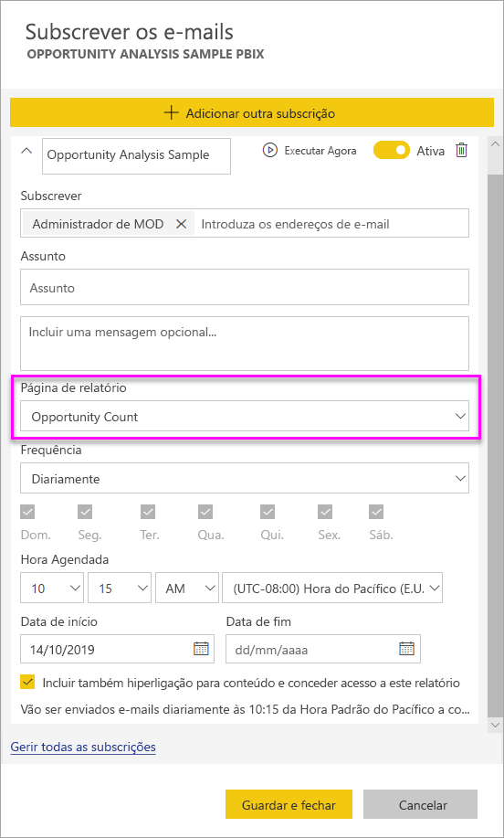

# Subscrever relatórios e dashboards no serviço Power BI para si e para outras pessoas

Pode subscrever-se e os seus colegas para as páginas de relatórios, dashboards e relatórios paginados que mais lhe interessam. Power BI envia por e-mail um instantâneo para sua caixa de entrada. Indique ao Power BI com que frequência quer receber os e-mails: diariamente, semanalmente ou uma vez por dia depois da atualização de dados inicial.  Se escolher diariamente ou semanalmente, pode escolher o tempo que pretende para a subscrição a ser executado.  Pode configurar até 24 subscrições diferentes por dia, para cada página de relatório e dashboard.

 

Só pode criar subscrições no serviço Power BI. Receberá um e-mail com um instantâneo da página de relatório ou do dashboard, com uma ligação para abrir o relatório ou dashboard. Nos dispositivos móveis com aplicações do Power BI instaladas, a seleção desta ligação inicia a aplicação Power BI, em vez de abrir o relatório ou dashboard no site do Power BI.

## Requirements

- **Criar** uma subscrição é uma funcionalidade do Power BI Pro.
- Não precisa de permissões de edição para o conteúdo (dashboard ou relatório) para criar uma subscrição para si próprio, mas tem de ter permissões de edição para criar uma subscrição para outra pessoa. 
- A partir de janeiro de 2019, já não tem de configurar uma atualização do conjunto de dados para executar uma subscrição.  Esta é executada independentemente de quaisquer atualizações agendadas que tenha configurado.  

## Subscrever um dashboard, a página de relatório ou o relatório paginado

Se estiver subscrever um dashboard, relatório, ou relatório paginado, o processo é semelhante. O mesmo botão permite-lhe subscrever os dashboards e os relatórios do serviço Power BI.

Subscrever relatórios paginados é um pouco diferente. Ver [subscrever um relatório paginado no serviço Power BI por conta própria e outros](paginated-reports-subscriptions.md) para obter detalhes.
 
.

1. Abra o dashboard ou o relatório.
2. Na barra de menus superior, selecione **Subscrever** ou selecione o ícone de envelope .
   
   

3. Utilize o controlo de deslize amarelo para ativar e desativar a subscrição.  Definir o controlo de deslize para **Desativado** não elimina a subscrição. Para eliminar a subscrição, selecione o ícone de recipiente do lixo.

4. O seu e-mail já está na caixa **Subscrever**. Também pode adicionar outros endereços de e-mail à subscrição, mas apenas no mesmo domínio. Se o relatório ou dashboard estiver alojado na [capacidade Premium](service-premium-what-is.md), poderá subscrever outros endereços de e-mail individuais e de aliases de grupo. Se o relatório ou dashboard não estiver alojado na capacidade Premium, poderá subscrever outras pessoas, mas estas também terão de ter licenças do Power BI Pro. Para obter detalhes, veja [Considerações e resolução de problemas](#considerations-and-troubleshooting) abaixo. 

5. Preencha os detalhes **Assunto** e **Mensagem** do e-mail. 

5. Selecione uma **Frequência** para a sua subscrição: **Diariamente**, **Semanalmente** ou **Depois da Atualização de Dados (Diariamente)** .  Para receber o e-mail de subscrição apenas em determinados dias, selecione **Semanalmente** e selecione os dias em que o pretende receber.  Por exemplo, se quiser receber o e-mail de subscrição apenas durante os dias úteis, selecione **Semanalmente** e desselecione as caixas **Sáb** e **Dom**.  

6. Se escolher **Diariamente** ou **Semanalmente**, também pode escolher uma **Hora Agendada** para a subscrição.  Pode definir para que seja executada a cada hora ou a cada 15, 30 ou 45 minutos.  Selecione manhã ou tarde/noite. Também pode especificar o fuso horário.

7. Por predefinição, a data de início da sua subscrição é a data em que a criou. Tem a opção de selecionar uma data de fim. Se não definir uma data de fim, esta será definida automaticamente para um ano após a data de início. Pode alterá-la para qualquer data no futuro (até ao ano 9999) em qualquer altura antes de a subscrição terminar. Quando uma subscrição atinge a data de fim, esta é interrompida até que a volte a ativar. Receberá notificações antes da data de fim agendada a perguntar se quer prolongar a subscrição.    

    Nas capturas de ecrã abaixo, repare que, na realidade, está a subscrever uma *página* de relatórios ao subscrever um relatório.  Para subscrever mais do que uma página num relatório, selecione **Adicionar outra subscrição** e selecione uma página diferente. 
      
     

7. Selecione **Guardar e fechar**. Os utilizadores subscritos receberão um e-mail e um instantâneo do dashboard ou da página de relatório com a frequência e na hora que selecionou. Pode criar até 24 subscrições por relatório ou dashboard e pode indicar frequências, horas e destinatários exclusivos para cada subscrição.  Todas as subscrições definidas para **Depois da Atualização de Dados** para o dashboard ou relatório só enviarão um e-mail após a primeira atualização agendada.   
      
   > [!TIP]
   > Quer enviar o e-mail de uma subscrição diretamente ou a pedido a qualquer momento? Selecione **Executar Agora** para as subscrições do dashboard ou relatório que pretende enviar. Verá uma notificação a informar que será enviado um e-mail para todos os utilizadores dessa subscrição específica.  Pode fazer isso o número de vezes que forem necessárias. A mesma não conta para o seu limite de 24 execuções de subscrições agendadas por dia e por relatório ou dashboard. A mesma não aciona uma atualização de dados do conjunto de dados subjacente. 
   > 
   > 
   
## Idiomas do e-mail

O e-mail e o instantâneo utilizam o idioma definido nas definições do Power BI (veja os [Idiomas e países/regiões com suporte no Power BI](supported-languages-countries-regions.md)). Se não for definido qualquer idioma, o Power BI utilizará o idioma de acordo com a definição de local do browser atual. Para ver ou definir a sua preferência de idioma, selecione o ícone de engrenagem  > **Definições > Geral > Idioma**. 

## Gerir as subscrições
A subscrição só pode ser gerida pela pessoa que a criou.  Existem dois caminhos para gerir as suas subscrições.  O primeiro é selecionar **Gerir todas as subscrições** na caixa de diálogo **Subscrever e-mails** (ver as capturas de ecrã abaixo do passo 4). O segundo é selecionar o ícone de engrenagem do Power BI  na barra de menus superior e selecionar **Definições**.

As subscrições específicas apresentadas dependem da área de trabalho atualmente ativa.  Para ver todas as subscrições de uma só vez para todas as áreas de trabalho, certifique-se de que a opção **A Minha Área de Trabalho** está ativa. Para ajudar a compreender as áreas de trabalho, veja [Áreas de Trabalho no Power BI](service-create-workspaces.md).

Uma subscrição terminará se a licença Pro expirar, o proprietário eliminar o dashboard ou relatório, ou a conta de utilizador utilizada para criar a subscrição for eliminada.

## Considerações e resolução de problemas

* É possível que os dashboards com mais de 25 mosaicos afixados ou mais de 4 páginas de relatórios dinâmicos afixadas não sejam apresentados por inteiro nos e-mails de subscrição enviados para os utilizadores.  Subscrições de dashboards sobre estes número de mosaicos não são bloqueadas. No entanto, que sejam considerados não suportado se ocorrerem problemas. Considere modificá-los em conformidade para coincidir com um intervalo suportado.
* Quando configurar as subscrições de correio electrónico, tenha em mente que existe um atraso entre quando a tarefa de subscrição é iniciada e a hora exata a que o email é enviado.  Para minimizar o atraso entre os dois, configure a uma hora diferente para a sua atualização de dados agendada que quando a sua subscrição de e-mail é agendada para ser executada.
* Para subscrições de e-mail do dashboard, se os mosaicos têm a segurança ao nível da linha (RLS) aplicada, não mostrar os mosaicos.  
* Para subscrições de e-mail de relatórios, se o conjunto de dados utiliza a RLS, pode criar uma subscrição para si próprio. Não é possível subscrever outros utilizadores a um relatório com segurança ao nível da linha (RLS) aplicada.
* As subscrições de páginas de relatório estão associadas ao nome da página de relatório. Se subscrever uma página de relatório e, em seguida, mudar o nome da mesma, terá de voltar a criar a sua subscrição.
* A sua organização pode configurar determinadas definições no Azure Active Directory que podem limitar a capacidade de utilizar as subscrições de e-mail no Power BI.  Estas limitações incluem, mas não se limitam a, ter uma autenticação multifator ou restrições de intervalos de IP quando se acede a recursos.
* Atualmente, as subscrições por e-mail para relatórios/dashboards que utilizem conjuntos de dados com ligações em tempo real só são suportadas ao subscrever utilizadores que não o próprio.
* As subscrições de e-mail não suportam a maioria dos [elementos visuais personalizados](power-bi-custom-visuals.md).  A única exceção são os elementos visuais personalizados que foram [certificados](power-bi-custom-visuals-certified.md).  
* Neste momento, as subscrições de e-mail não suportam elementos visuais personalizados baseados em R.  
* As subscrições por e-mail são enviadas com as estatísticas de filtro e segmentação de dados predefinidas do relatório. Quaisquer alterações às predefinições efetuadas depois da subscrição não irão aparecer no e-mail.    
* Especificamente para subscrições de dashboards, determinados tipos de mosaicos ainda não são suportados.  Estes incluem: transmissão em fluxo de mosaicos, mosaicos de vídeos e mosaicos de conteúdo Web personalizados.     
* Se partilhar um dashboard com um colega fora do seu inquilino, também não poderá criar uma subscrição para esse colega. Por isso, se for aaron@xyz.com, poderá partilhar com anyone@ABC.com, mas ainda não poderá subscrever anyone@ABC.com e o mesmo não poderá subscrever o conteúdo partilhado.      
* O Power BI interrompe automaticamente a atualização nos conjuntos de dados associados a dashboards e relatórios que não tenham sido acedidos durante mais de dois meses.  No entanto, se adicionar uma subscrição a um dashboard ou relatório, este não será interrompido, mesmo se não for acedido.    
* Se não estiver a receber os e-mails de subscrição, certifique-se de que o Nome Principal de Utilizador (UPN) pode receber e-mails. [A equipa do Power BI está a trabalhar para simplificar este requisito](https://community.powerbi.com/t5/Issues/No-Mail-from-Cloud-Service/idc-p/205918#M10163), por isso, mantenha-se atento. 
* Se o dashboard ou relatório estiver em capacidade Premium, pode utilizar aliases de e-mail de grupo para subscrições, em vez de subscrever colegas individualmente através dos endereços de e-mail. Os aliases são baseados no Active Directory atual. 

## Próximos passos

- [Subscrever um relatório paginado no serviço Power BI por conta própria e outros](paginated-reports-subscriptions.md)
- Mais perguntas? [Experimente perguntar à Comunidade do Power BI](http://community.powerbi.com/)    
- [Ler a mensagem de blogue](https://powerbi.microsoft.com/blog/introducing-dashboard-email-subscriptions-a-360-degree-view-of-your-business-in-your-inbox-every-day/)
