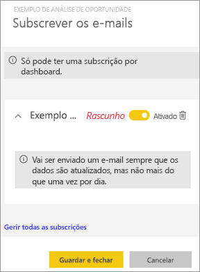
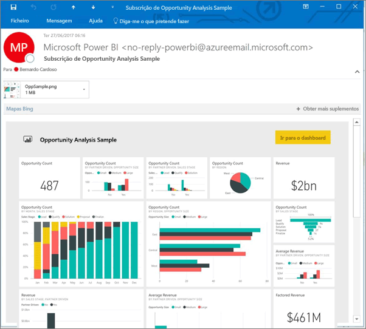
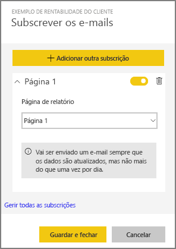
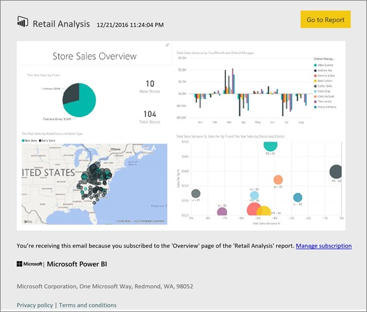
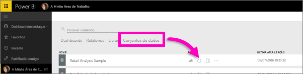

# Subscrever relatórios e dashboards do Power BI
Nunca foi tão fácil manter-se atualizado relativamente ao seus dashboards e relatórios mais importantes. Subscreva as páginas de relatório e dashboards mais importantes para si e o Power BI enviará um instantâneo por e-mail para a sua caixa de entrada. Indique ao Power BI com que frequência quer receber os e-mails: desde uma vez por dia a uma vez por semana. 

O e-mail e o instantâneo utilizarão o idioma definido nas definições do Power BI (veja os [Idiomas e países/regiões com suporte no Power BI](supported-languages-countries-regions.md)). Se não for definido qualquer idioma, o Power BI utilizará o idioma de acordo com a definição de local do browser atual. Para ver ou definir a sua preferência de idioma, selecione o ícone de engrenagem  **> Definições > Geral > Idioma**. 

> [!NOTE]
> As subscrições apenas podem ser criadas no serviço Power BI. Quando receber o e-mail, este incluirá uma ligação para "aceder ao relatório/dashboard". Nos dispositivos móveis com aplicações do Power BI instaladas, a seleção desta ligação inicia a aplicação (por oposição à ação predefinida de abrir o relatório ou dashboard no site do Power BI).
> 
> 

Veja Sirui a configurar uma subscrição de um relatório por e-mail. Em seguida, siga as instruções passo-a-passo abaixo do vídeo para experimentar.

<iframe width="560" height="315" src="https://www.youtube.com/embed/saQx7G0pxhc" frameborder="0" allowfullscreen></iframe>

## Requisitos
**Criar** uma subscrição é uma funcionalidade do Power BI Pro e precisa de permissões de visualização ou edição para o conteúdo (dashboard ou relatório).

## Subscrever um dashboard

1. Abra o dashboard.
2. Na barra de menus superior, selecione **Subscrever** ou selecione o ícone de envelope .
   
   
3. Utilize o controlo de deslize amarelo para ativar e desativar a subscrição.  Definir o controlo de deslize para Desativado não eliminará a subscrição. Para eliminar a subscrição, selecione o ícone de recipiente do lixo.
   
   
4. Selecione **Guardar e fechar** para guardar a subscrição. Receberá um instantâneo por e-mail do dashboard sempre que qualquer um dos conjuntos de dados subjacentes for alterado. Se o dashboard for atualizado mais de uma vez por dia, apenas receberá o instantâneo por e-mail após a primeira atualização.
   
   
   
   > [!TIP]
   > Quer ver o e-mail de imediato? Acione um e-mail ao atualizar um dos conjuntos de dados associados ao dashboard. (Se não tiver permissões de edição para o conjunto de dados, terá de pedir a alguém que tenha essas permissões para o fazer por si.) Para saber que conjuntos de dados estão a ser utilizados para criar o dashboard, no dashboard, selecione o ícone **Ver relacionados**  para abrir **Conteúdo relacionado** e, em seguida, selecione o ícone de atualização . 
   > 
   > 
   
   

## Subscrever uma página de relatório
1. Abra o relatório na [Vista de leitura](service-reading-view-and-editing-view.md).
2. Na barra de menus superior, selecione **Subscrever**.
   
   
3. Pode subscrever uma página de relatório de cada vez. Selecione a página de relatório específica na lista pendente.
   
   
   
   Continue a adicionar páginas de relatório.
4. Utilize o controlo de deslize amarelo para ativar e desativar a subscrição de cada página.  Definir o controlo de deslize para Desativado não eliminará a subscrição. Para eliminar a subscrição, selecione o ícone de recipiente do lixo.
   
   
5. Selecione **Guardar e fechar** para guardar a subscrição. Receberá um instantâneo por e-mail de cada página de relatório quando o relatório for atualizado. Se o relatório não for atualizado, não receberá um instantâneo por e-mail nesse dia.  Se o relatório for atualizado mais de uma vez por dia, apenas receberá o instantâneo por e-mail após a primeira atualização.
   
   
   
   > [!TIP]
   > Quer ver o e-mail de imediato? Acione um e-mail ao abrir o conjunto de dados e ao selecionar **Atualizar agora**. Se não tiver permissões de edição para o conjunto de dados, terá de pedir a alguém que tenha essas permissões para o fazer por si.
   > 
   > 
   > 
   > 

## Como é determinado o agendamento de relatórios por e-mail
A tabela seguinte descreve a frequência com que receberá um e-mail. Tudo depende do método de ligação do conjunto de dados em que se baseia o dashboard ou o relatório (DirectQuery, ligação em direto, importado para o Power BI ou ficheiro do Excel no OneDrive ou SharePoint Online) e das opções de subscrição disponíveis e selecionadas (diariamente, semanalmente ou nenhum).

|  | **DirectQuery** | **Ligação em Direto** | **Atualização agendada (importação)** | **Ficheiro do Excel no OneDrive/SharePoint Online** |
| --- | --- | --- | --- | --- |
| **Com que frequência é atualizado o relatório/dashboard?** |A cada 15 min |O Power BI faz uma verificação a cada 15 minutos e, se o conjunto de dados tiver sido alterado, o relatório é atualizado. |O utilizador seleciona nenhum, diariamente ou semanalmente. Diariamente pode ser até 8 vezes por dia. Semanalmente é, na verdade, um agendamento semanal criado e definido pelo utilizador para atualizar, no mínimo, uma vez por semana e, no máximo, todos os dias. |A cada hora |
| **Quanto controlo o utilizador tem sobre o agendamento de subscrições por e-mail?** |As opções são: diariamente ou semanalmente |Sem opções: é enviado um e-mail ao utilizador se o relatório for atualizado, mas não mais do que uma vez por dia. |Se o agendamento da atualização for diariamente, as opções são diariamente e semanalmente.  Se o agendamento da atualização for semanalmente, a única opção é semanalmente. |Sem opções: é enviado um e-mail ao utilizador sempre que o conjunto de dados for atualizado, mas não mais do que uma vez por dia. |

## Gerir as subscrições
Existem dois caminhos para gerir as suas subscrições.  O primeiro é selecionar **Gerir todas as subscrições** na caixa de diálogo **Subscrever e-mails** (ver passo 3 acima). O segundo é selecionar o ícone de engrenagem do Power BI  na barra de menus superior e selecionar **Definições**.

As subscrições específicas apresentadas dependem da área de trabalho atualmente ativa.  Para ver todas as subscrições de uma só vez para todas as áreas de trabalho, certifique-se de que a opção **A Minha Área de Trabalho** está ativa. Para ajudar a compreender as áreas de trabalho, veja [Áreas de Trabalho no Power BI](service-create-distribute-apps.md).

Uma subscrição terminará se a licença Pro expirar, o dashboard ou o relatório for eliminado pelo proprietário, ou a conta de utilizador utilizada para criar a subscrição for eliminada.

## Considerações e resolução de problemas
* Neste momento, a subscrição não está disponível para dashboards ou relatórios provenientes de pacotes de conteúdo ou aplicações do Power BI. No entanto, existe uma solução... faça uma cópia do relatório/dashboard e adicione as subscrições a essa versão.
* As subscrições de páginas de relatório estão associadas ao nome da página de relatório. Se subscrever uma página de relatório e mudar o nome da mesma, terá de voltar a criar a sua subscrição
* Para subscrições por e-mail em conjuntos de dados de ligação em direto, só receberá e-mails quando os dados forem alterados. Assim, se ocorrer uma atualização mas sem alterações de dados, o Power BI não enviará nenhum e-mail.
* As subscrições por e-mail não suportam a maioria dos [elementos visuais personalizados](power-bi-custom-visuals.md).  A única exceção são os elementos visuais personalizados que foram [certificados](power-bi-custom-visuals-certified.md).  
* As subscrições por e-mail são enviadas com as estatísticas de filtro e segmentação de dados predefinidas do relatório. Quaisquer alterações às predefinições efetuadas antes da subscrição não irão aparecer no e-mail.    
* As subscrições por e-mail ainda não são suportadas em páginas de relatório criadas pela funcionalidade de ligação em direto ao serviço do Power BI Desktop.    
* Especificamente para subscrições de dashboards, determinados tipos de mosaicos ainda não são suportados.  Estes incluem: transmissão em fluxo de mosaicos, mosaicos de vídeos e mosaicos de conteúdo Web personalizados.     
* Se partilhar um dashboard com um colega fora do seu inquilino, este não poderá subscrever o dashboard ou as respetivas páginas de relatório associadas. Assim, se for aaron@xyz.com, pode partilhar com anyone@ABC.com.  No entanto, anyone@ABC.com não pode subscrever o conteúdo partilhado.    
* As subscrições podem falhar em dashboards ou relatórios com imagens extremamente grandes devido aos limites de tamanho por e-mail.    
* O Power BI interrompe automaticamente a atualização nos conjuntos de dados associados a dashboards e relatórios que não tenham sido acedidos durante mais de 2 meses.  No entanto, se adicionar uma subscrição a um dashboard ou relatório, este não será interrompido, mesmo se não for acedido.    
* Se não estiver a receber os e-mails de subscrição, certifique-se de que o Nome Principal de Utilizador (UPN) consegue receber e-mails. [A equipa do Power BI está a trabalhar para simplificar este requisito](https://community.powerbi.com/t5/Issues/No-Mail-from-Cloud-Service/idc-p/205918#M10163), por isso, mantenha-se atento. 
* Os relatórios e os dashboards enviados utilizam a definição de idioma do Power BI. O idioma predefinido é o inglês. Para ver ou definir a sua preferência de idioma, selecione o ícone de engrenagem  **> Definições > Geral > Idioma**.

## Próximos passos
* Mais perguntas? [Experimente perguntar à Comunidade do Power BI](http://community.powerbi.com/)    
* [Ler a mensagem de blogue](https://powerbi.microsoft.com/blog/introducing-dashboard-email-subscriptions-a-360-degree-view-of-your-business-in-your-inbox-every-day/)

