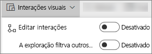
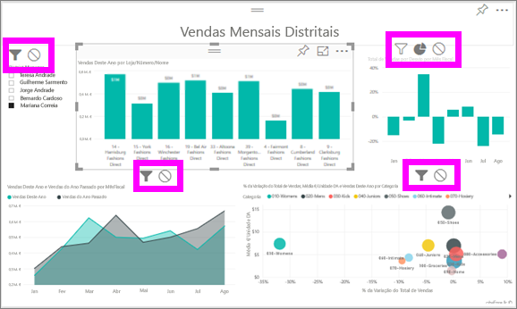
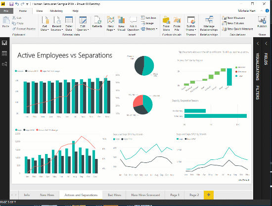

# Alterar a forma como os elementos visuais interagem num relatório do Power BI
Se tiver permissões de edição para um relatório, pode utilizar as **interações visuais** para alterar a forma como as visualizações têm impacto umas nas outras numa página de relatório. 

Por predefinição, as visualizações numa página de relatório podem ser utilizadas para filtro cruzado e realce cruzado de outras visualizações na página.
Por exemplo, selecionar um estado numa visualização de mapa realça o gráfico de colunas e filtra o gráfico de linhas para mostrar apenas os dados que se aplicam a um estado.
Consulte [Sobre filtragem e realce](power-bi-reports-filters-and-highlighting.md). Se tiver uma visualização que suporte a [exploração](consumer/end-user-drill.md) por predefinição, a exploração de uma visualização não tem impacto nas outras visualizações na página de relatório. No entanto, estes comportamentos predefinidos podem ser substituídos e as interações podem ser definidas individualmente para cada visualização.

Este artigo mostra-lhe como utilizar as **Interações visuais** na [Vista de edição](service-interact-with-a-report-in-editing-view.md) do serviço Power BI e no Power BI Desktop. Se um relatório foi partilhado consigo, não conseguirá alterar as definições das Interações visuais.

> [!NOTE]
> Os termos *filtro cruzado* e *realce cruzado* são utilizados para distinguir o comportamento descrito aqui do que acontece quando utiliza o painel **Filtros** para filtrar e realçar visualizações.  
> 
> 

<iframe width="560" height="315" src="https://www.youtube.com/embed/N_xYsCbyHPw?list=PL1N57mwBHtN0JFoKSR0n-tBkUJHeMP2cP" frameborder="0" allowfullscreen></iframe>

1. Selecione a visualização para ativá-la.  
2. Aceda às opções das **Interações Visuais**.
    - No serviço Power BI, selecione o menu pendente na barra de menus do relatório.

       

    - No Desktop, selecione **Formato > Interações**.

        

3. Para ativar os controlos de interação de visualizações, selecione **Editar interações**. O Power BI adiciona ícones de filtragem cruzada e de realce cruzado a todas as outras visualizações na página de relatório.
   
    
3. Determine o impacto que a visualização selecionada deve ter nas outras visualizações.  Opcionalmente, repita para todas as outras visualizações na página do relatório.
   
   * Se quiser executar o filtro cruzado na visualização, selecione o ícone de **filtragem** .
   * Se quiser executar o realce cruzado na visualização, selecione o ícone de **realce** .
   * Se não quiser que tenha impacto, selecione o **ícone** sem impacto .

4. Para ativar os controlos de exploração, selecione **A exploração filtra outros elementos visuais**.  Agora, quando agregar ou desagregar numa visualização, as outras visualizações na página de relatório são alteradas para refletir a seleção de exploração atual. 

   

