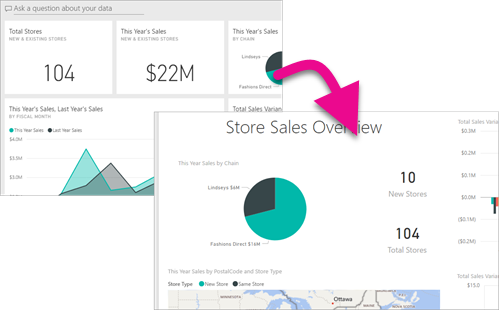
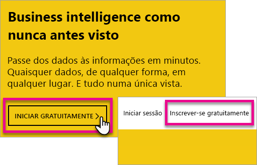
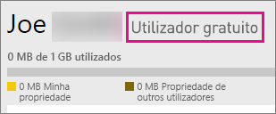
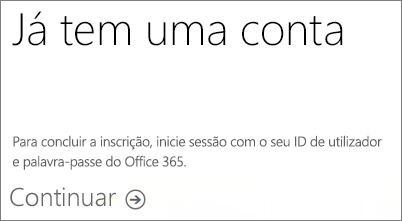
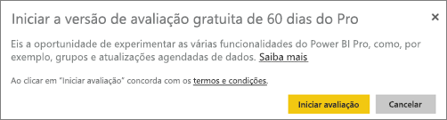
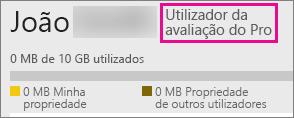

# Inscrever-se no Power BI como um indivíduo
Saiba como inscrever-se no Power BI e começar a utilizá-lo para as suas necessidades pessoais de relatórios e visualização.

O Power BI pode ser a sua ferramenta pessoal de relatórios e visualização e também pode servir como o motor de decisão e análise por detrás de projetos de grupo, divisões ou empresas inteiras.

Este artigo mostra-lhe as opções para se inscrever e começar a utilizar o serviço Power BI. Para obter informações sobre as diferenças entre o Power BI Gratuito e o Pro, consulte [Power BI Gratuito vs Pro](service-free-vs-pro.md).

## Tem algumas opções
Como pessoa, tem várias opções para se inscrever e começar a utilizar o Power BI. Pode optar por inscrever-se gratuitamente ou pode comprar uma subscrição do Power BI Pro. Caso se inscreva numa conta gratuita, quando estiver no serviço, pode optar por receber uma versão de avaliação gratuita de 60 dias no Power BI Pro.

Se fizer parte de uma organização existente que utilize o Office 365, ainda se pode inscrever numa conta gratuita. O seu Administrador de TI também tem algumas opções para comprar o Power BI Pro e atribuir licenças. Para obter mais informações sobre as opções disponíveis enquanto Administrador de TI, consulte [Comprar o Power BI Pro](service-admin-purchasing-power-bi-pro.md).

> [!NOTE]
> Se estiver numa organização, a inscrição individual poderá estar desativada. Consulte [A Inscrição Individual foi desativada](#individual-sign-up-has-been-turned-off) para obter mais informações se obtiver um erro a indicar que foi desativada.
> 
> 

## O que precisa para se inscrever
Para se inscrever no Power BI, precisa de um endereço de e-mail profissional. Um endereço de e-mail pessoal não funciona com o serviço do Power BI.

<a name="what-email-address-can-be-used-with-power-bi"/>

### Qual endereço de email pode ser usado com o Power BI?
O Power BI requer que você use um endereço de email corporativo ou escolar para se inscrever. O Power BI não dá suporte a endereços de email fornecidos por provedores de telecomunicação e serviços de email para consumidores. Isso inclui outlook.com, hotmail.com, gmail.com e outros.

Se você tentar se inscrever com um endereço de email pessoal, receberá uma mensagem indicando para usar um endereço de email corporativo ou escolar.

> [!NOTE]
> Atualmente, o Power BI não suporta a inscrição self-service para endereços .gov ou .mil. Contacte o seu administrador do Office 365.
> 
> 

## De qual precisa?
Pode determinar de qual precisa ao analisar o que cada tipo de licença inclui. Os utilizadores gratuitos têm a maioria das funcionalidades dos serviços, exceto as funcionalidades de partilha e colaboração. Os utilizadores do Power BI Pro podem utilizar todas as funcionalidades no serviço, mas não é gratuito. Se não precisar de partilhar conteúdos, a licença Gratuita pode ser a melhor opção para si. Saiba mais na [página de Preços do Power BI](https://powerbi.microsoft.com//pricing/).

O resto deste artigo analisa como se inscrever em cada opção.

## Inscrever-se no Power BI (gratuito) como um indivíduo
A maneira mais rápida de se inscrever no Power BI é se inscrever para uma conta do Power BI (gratuita). Não há nenhum custo para essa conta e ela permite que você use muitos dos recursos disponíveis no serviço.

> [!NOTE]
> Se receber uma mensagem a indicar que já o conhecemos, experimente navegar para https://app.powerbi.com e iniciar sessão.
> 
> 

Para se inscrever no Power BI, você pode fazer o seguinte.

1. Navegue até [powerbi.com](https://powerbi.microsoft.com).
2. Selecione **Iniciar gratuitamente** ou **Inscrever-se gratuitamente**.
   
    
3. Na página de introdução, seleicone **Experimente Gratuitamente >** no Power BI.
   
    
4. Insira o endereço de email com o qual está se inscrevendo e selecione **Inscrever-se**. Certifique-se de que seu endereço de email é permitido para se inscrever. Para obter mais informações sobre o endereço de e-mail que pode utilizar, consulte [Que endereço de e-mail pode ser utilizado com o Power BI](#what-email-address-can-be-used-with-power-bi).
   
    
5. Receberá uma mensagem a indicar que consulte o e-mail.
   
    
6. Selecione a ligação no e-mail para consultar o seu endereço de e-mail. Isso o levará de volta para o fluxo de inscrição. Talvez seja necessário fornecer algumas informações adicionais sobre você.
7. Você será levado para https://app.powerbi.com e poderá começar a usar o Power BI como um usuário gratuito.

### Aparência dentro do serviço
Quando você estiver conectado ao serviço, será possível verificar se tem uma conta gratuita indo até o ícone de **engrenagem** e selecionando **Gerenciar armazenamento pessoal**.

### E se já fizer parte de uma organização existente?
Se sua conta for parte de uma organização existente, você receberá uma mensagem solicitando que você entre com essa conta. Selecione **Continuar** e entre com seu logon do Office 365.

Depois, irá ver uma mensagem a pedir-lhe que selecione **Começar**.

## Versão de avaliação de 60 dias do Power BI Pro no Serviço
Depois de se inscrever na sua conta gratuita, pode optar por experimentar o Pro gratuitamente durante 60 dias. Você terá acesso a todos os recursos do Pro durante o período da avaliação. O Power BI Pro tem todas as funcionalidades da versão gratuita do Power BI, além de funcionalidades adicionais de partilha e colaboração. Para obter mais informações, veja [Preços do Power BI](https://powerbi.microsoft.com/pricing). Para experimentar uma avaliação gratuita de 60 dias do Power BI Pro, entre no Power BI e experimente um desses recursos do Power BI Pro:

* [Criar uma área de trabalho de aplicação](service-create-distribute-apps.md)
* [Partilhar um dashboard](service-share-dashboards.md)

Quando experimentar um desses recursos, você precisará iniciar sua avaliação gratuita. Você também pode optar por usá-lo indo até o ícone de engrenagem e selecionando **Gerenciar armazenamento pessoal**. Em seguida, selecione **Experimentar o Pro gratuitamente** à direita.

Em seguida, é possível selecionar **Iniciar avaliação**.

>[!NOTE]
>Os usuários que aproveitam esta avaliação do Power BI Pro dentro do produto não aparecem no portal de administração do Office 365 como usuários da Avaliação do Power BI Pro (eles aparecem como usuários da versão gratuita do Power BI). No entanto, eles aparecerão como usuários da versão de Avaliação do Power BI Pro na página **gerenciar armazenamento** do Power BI.

>[!NOTE]
>Se você é um Administrador de TI que deseja adquirir e implantar licenças de avaliação do Power BI para vários usuários em sua organização sem que os usuários individuais aceitem os termos da avaliação individualmente, é possível se inscrever em uma [avaliação de assinatura do Power BI Pro](https://portal.office.com/Signup/MainSignup15.aspx?OfferId=d59682f3-3e3b-4686-9c00-7c7c1c736085&dl=POWER_BI_PRO). Você precisará ser um Administrador Global ou de Cobrança do Office 365 ou criar um novo locatário para se inscrever em uma avaliação de administrador. Para obter mais informações, consulte [Comprar o Power BI Pro](service-admin-purchasing-power-bi-pro.md).
> 
> [!NOTE]
> Com a disponibilidade do Power BI Premium e as alterações à oferta do Power BI Gratuito a 1 de junho de 2017, pode ser elegível para uma Avaliação Pro Expandida. Para obter mais informações, consulte [Ativação da Avaliação Pro Expandida](service-extended-pro-trial.md).
> 
> 

### Aparência dentro do serviço
Quando estiver conectado ao serviço, você poderá verificar se tem uma conta de avaliação do Pro indo até o ícone de **engrenagem* e selecionando **Gerenciar armazenamento pessoal**.

## E se pretender o Power BI Pro completo?
Não existe forma de obter a licença do Power BI Pro enquanto indivíduo. Terá de falar com o seu Administrador de TI para adquirir e atribuir a licença à sua conta. Para obter mais informações, consulte [Comprar o Power BI Pro](service-admin-purchasing-power-bi-pro.md).

## Solução de problemas
Em muitos casos, o registro no Power BI pode ser obtido seguindo o processo simples de inscrição de autoatendimento listado acima. No entanto, há várias razões que você poderá não concluir a inscrição de autoatendimento.  A tabela a seguir resume alguns dos motivos mais comuns que você não poderá concluir a inscrição e maneiras de resolver esses problemas.

| **Sintoma/Mensagem de Erro** | **Motivo e Solução** |
| --- | --- |
| **Endereços de e-mail pessoais (por exemplo, nancy@gmail.com)** Recebe uma mensagem como a seguinte durante a inscrição:    *Introduziu um endereço de e-mail pessoal: introduza o seu endereço de e-mail profissional para que possamos armazenar os dados da sua empresa de forma segura.*    ou    *Isto parece ser um endereço de e-mail pessoal. Digite seu endereço de trabalho para que possa se conectar com outras pessoas em sua empresa. Não se preocupe. Não iremos partilhar o seu endereço com ninguém.* |O Power BI não dá suporte a endereços de email fornecidos por provedores de telecomunicações e serviços de email para consumidores.    Para concluir a inscrição, tente novamente usando um endereço de email atribuído por seu trabalho ou sua escola.    Se você ainda não conseguiu se inscrever e desejar concluir um processo de configuração mais avançado, é possível [registrar-se para obter uma nova assinatura de avaliação do Office 365 e usar esse endereço de email para se inscrever](service-admin-signing-up-for-power-bi-with-a-new-office-365-trial.md). |
| **Inscrição por autoatendimento desabilitada** Você receberá uma mensagem semelhante à seguinte durante a inscrição:    *Não podemos concluir a sua inscrição. O departamento de TI desativou a inscrição para o Microsoft Power BI. Contacte-o para concluir a inscrição.*    ou    *Isto parece ser um endereço de e-mail pessoal. Digite seu endereço de trabalho para que possa se conectar com outras pessoas em sua empresa. Não se preocupe. Não iremos partilhar o seu endereço com ninguém.* |O administrador de TI de sua organização desabilitou a inscrição por autoatendimento para o Power BI.    Para concluir a inscrição, entre em contato com seu administrador de TI e peça para que ele siga as instruções mostradas na página abaixo para permitir que os usuários existentes se inscrevam no Power BI e permitir que novos usuários participem de seu locatário existente.    Você também poderá ter esse problema se tiver se inscrito no Office 365 por meio de um parceiro. [Saiba mais](service-admin-syndication-partner.md)    [Power BI na sua Organização](https://support.office.com/en-ca/article/Power-BI-in-your-Organization-d7941332-8aec-4e5e-87e8-92073ce73dc5#BKMK_HowCanIAllowO365Tenant) |
| **O endereço de email não é uma ID do Office 365** Você receberá uma mensagem semelhante à seguinte durante a inscrição:    *Não foi possível encontrá-lo em contoso.com.  Você usa uma ID diferente no trabalho ou escola?    Experimente iniciar sessão com esse ID e, se não funcionar, contacte o seu departamento de TI.* |Sua organização usa IDs para entrar no Office 365 e em outros serviços da Microsoft que são diferentes de seu endereço de email.  Por exemplo, seu endereço de email pode ser Nancy.Smith@contoso.com mas sua ID é nancys@contoso.com.    Para concluir a inscrição, use a ID atribuída por sua empresa para entrar no Office 365 ou em outros serviços da Microsoft.  Se você não sabe o que isso, entre em contato com seu administrador de TI.    Se você ainda não conseguiu se inscrever e puder concluir um processo de configuração mais avançado, é possível [registrar-se para obter uma nova assinatura de avaliação do Office 365 e usar esse endereço de email para se inscrever](service-admin-signing-up-for-power-bi-with-a-new-office-365-trial.md). |

## Próximas etapas
[Power BI (gratuito) na sua organização](service-admin-service-free-in-your-organization.md)  
[Comprar o Power BI Pro](service-admin-purchasing-power-bi-pro.md)  
[Contrato de serviço do Power BI para utilizadores individuais](https://powerbi.microsoft.com/terms-of-service/)  
[Power BI Premium – o que é?](service-premium.md)  
[Documento técnico do Power BI Premium](https://aka.ms/pbipremiumwhitepaper)  

Mais perguntas? [Experimente perguntar à Comunidade do Power BI](http://community.powerbi.com/)

