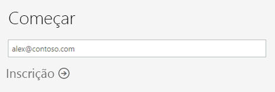
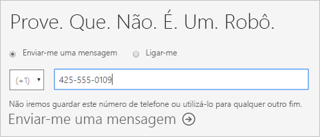
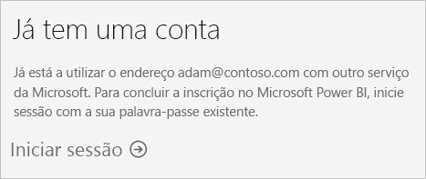
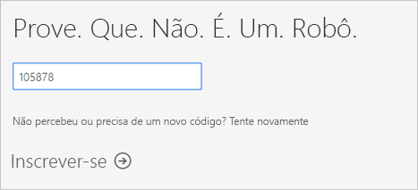
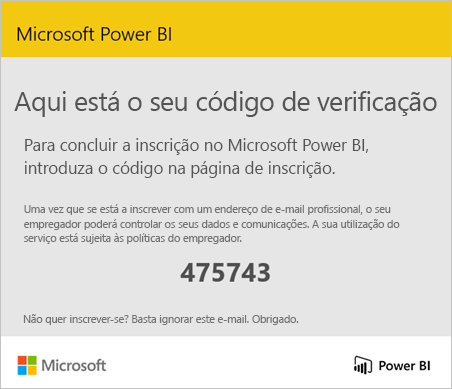
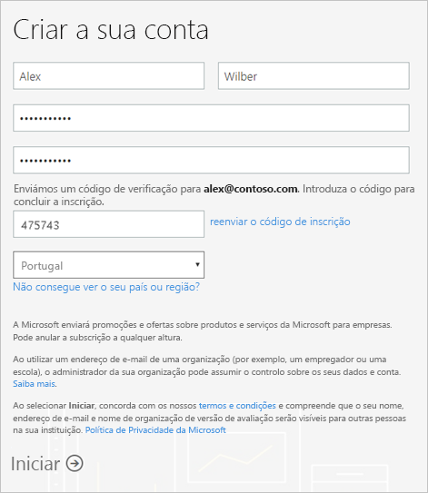
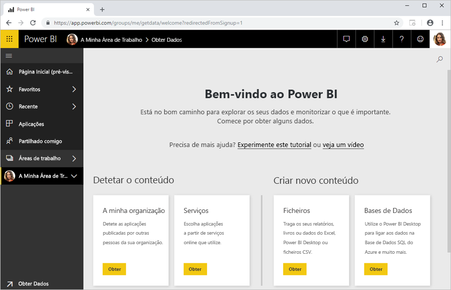

# Inscrever-se no Power BI como um indivíduo

O Power BI pode ser a sua ferramenta pessoal de análise de dados e visualização e também pode servir como o motor de decisão e análise por detrás de projetos de grupo, divisões ou empresas inteiras. Este artigo explica como se pode inscrever no Power BI como utilizador individual. Se for um administrador do Power BI, veja [Licenciamento do Power BI na sua organização](service-admin-licensing-organization.md).

## Endereços de e-mail suportados

Antes de iniciar o processo de inscrição, é importante saber quais são os tipos de endereços de e-mail que pode utilizar para se inscrever no Power BI:

* O Power BI exige a utilização de um endereço de e-mail profissional ou escolar para se inscrever. Não se pode inscrever com endereços de e-mail dados por serviços de e-mail de consumidor ou fornecedores de telecomunicações. Estes incluem o outlook.com, hotmail.com, gmail.com, entre outros.

* Após a inscrição, pode [convidar utilizadores](https://docs.microsoft.com/azure/active-directory/active-directory-b2b-what-is-azure-ad-b2b) para verem os seus conteúdos do Power BI com qualquer endereço de e-mail, incluindo contas pessoais.

* Pode inscrever-se no Power BI com endereços .gov ou .mil, mas estes exigem um procedimento diferente. Para obter mais informações, veja [Inscrever a sua organização do Governo dos EUA no serviço Power BI](service-govus-signup.md).

## Inscrever-se numa conta do Power BI

Siga estes passos para se inscrever numa conta do Power BI. Depois de concluir este processo, terá uma licença (gratuita) do Power BI que pode utilizar para experimentar o Power BI por conta própria com A Minha Área de Trabalho, consumir conteúdos de uma área de trabalho do Power BI atribuída a uma capacidade Premium do Power BI ou iniciar uma avaliação gratuita individual do Power BI Pro. Para obter mais informações, veja [Funcionalidades do Power BI por tipo de licença](service-features-license-type.md). 

1. Aceda à [página de inscrição](https://signup.microsoft.com/signup?sku=a403ebcc-fae0-4ca2-8c8c-7a907fd6c235).

1. Introduza o seu endereço de e-mail e, em seguida, selecione **Inscrição**.

    

1. Se for apresentada uma mensagem como esta, selecione uma opção para receber um código de verificação e, em seguida, avance para o passo seguinte neste procedimento.

    

    Se for apresentada uma mensagem como esta, conclua os passos para iniciar sessão e utilizar o Power BI.

    

1. Introduza o código que recebeu e, em seguida, selecione **Inscrição**.

    

1. Procure uma mensagem como esta no seu e-mail.

    

1. No ecrã seguinte, introduza as suas informações e o código de verificação do e-mail. Selecione uma região, reveja as políticas a partir das ligações neste ecrã e, em seguida, selecione **Começar**.

    

1. Será apresentada a [página de início de sessão do Power BI](https://powerbi.microsoft.com/landing/signin/) e poderá começar a utilizar o Power BI.

    

## Expiração da versão de avaliação

Depois de concluir o processo de inscrição, pode inscrever-se para obter uma avaliação gratuita do Power BI Pro no serviço Power BI. Quando essa avaliação expirar, a sua licença muda novamente para uma licença (gratuita) do Power BI. Depois disto acontecer, já não terá acesso a funcionalidades que exigem uma licença do Power BI Pro. Para obter mais informações, veja [Funcionalidades por tipo de licença](service-features-license-type.md).

Se uma licença (gratuita) do Power BI for suficiente, não tem de fazer mais nada. Para tirar partido das funcionalidades do Power BI Pro, entre em contacto com o seu administrador de TI sobre a compra de uma licença do Power BI Pro.

## Resolver problemas com o processo de inscrição

Na maioria dos casos, conseguirá inscrever-se no Power BI ao seguir o procedimento descrito. Alguns dos problemas que podem impedi-lo de se inscrever estão descritos na tabela seguinte, com possíveis soluções alternativas.

| Sintoma/Mensagem de Erro | Motivo e Solução |
| ----------------------- | -------------------- |
| <strong>Endereços de e-mail pessoais (por exemplo nancy@gmail.com)</strong> Receberá uma mensagem semelhante a esta durante a inscrição:    *Introduziu um endereço de e-mail pessoal: introduza o seu endereço de e-mail de trabalho para que possamos armazenar os dados da sua empresa de forma segura.*    ou    *Isto parece ser um endereço de e-mail pessoal. Escreva o seu endereço de trabalho para que possamos ligá-lo a outras pessoas na sua empresa. E não se preocupe. Não iremos partilhar o seu endereço com ninguém.* | O Power BI não suporta endereços de e-mail fornecidos por serviços de e-mail dos consumidores ou por fornecedores de telecomunicações.    Para concluir a inscrição, experimente novamente com um endereço de e-mail atribuído pela sua empresa ou escola.    Se ainda não conseguiu inscrever-se e deseja realizar um processo de configuração mais avançado, pode [registar-se para uma nova subscrição de avaliação do Office 365 e usar esse endereço de e-mail para se inscrever](service-admin-signing-up-for-power-bi-with-a-new-office-365-trial.md).    Também pode receber um [convite](service-admin-azure-ad-b2b.md) de um utilizador existente. |
| **Inscrição self-service desativada**: É apresentada uma mensagem semelhante a esta durante a inscrição:    *Não podemos concluir a sua inscrição. O departamento de TI desativou a inscrição para o Microsoft Power BI. Contacte-o para concluir a inscrição.*    ou    *Isto parece ser um endereço de e-mail pessoal. Escreva o seu endereço de trabalho para que possamos ligá-lo a outras pessoas na sua empresa. E não se preocupe. Não iremos partilhar o seu endereço com ninguém.* | O administrador de TI da sua organização desativou a inscrição self-service para o Power BI.    Para concluir a inscrição, entre em contacto com o seu administrador de TI e peça-lhe para [seguir as instruções para permitir a inscrição](service-admin-licensing-organization.md#enable-or-disable-individual-user-sign-up-in-azure-active-directory).    Também pode ter este problema se tiver efetuado a [inscrição no Office 365 através de um parceiro](service-admin-syndication-partner.md). |
| **O endereço de e-mail não é um ID do Office 365** É apresentada uma mensagem semelhante a esta durante a inscrição:    *Não foi possível encontrá-lo em contoso.com.  Utiliza um ID diferente no trabalho ou escola?    Experimente iniciar sessão com esse ID e, se não funcionar, contacte o seu departamento de TI.* | A sua organização utiliza IDs para iniciar sessão no Office 365 e noutros serviços Microsoft que são diferentes do endereço de e-mail.  Por exemplo, o seu endereço de e-mail pode ser Nancy.Smith@contoso.com mas o seu ID é nancys@contoso.com.    Para concluir a inscrição, utilize o ID que a sua organização lhe atribuiu para iniciar sessão no Office 365 ou noutros serviços da Microsoft.  Se não souber qual é o ID, contacte o seu administrador de TI.    Se ainda não conseguiu inscrever-se e deseja realizar um processo de configuração mais avançado, pode [registar-se para uma nova subscrição de avaliação do Office 365 e usar esse endereço de e-mail para se inscrever](service-admin-signing-up-for-power-bi-with-a-new-office-365-trial.md). |

## Próximos passos

[Comprar o Power BI Pro](service-admin-purchasing-power-bi-pro.md)  
[Contrato de serviço do Power BI para utilizadores individuais](https://powerbi.microsoft.com/terms-of-service/)  

Mais perguntas? [Experimente perguntar à Comunidade do Power BI](https://community.powerbi.com/)
