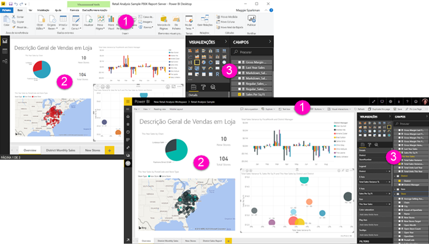

# Comparar o Power BI Desktop e o serviço Power BI

Num diagrama Venn a comparar o Power BI Desktop e o serviço Power BI, a área no meio mostraria como os dois se sobrepõem. Algumas tarefas podem ser efetuadas no Power BI Desktop ou no serviço Power BI. No entanto, nos dois lados do diagrama Venn, a aplicação e o serviço apresentam funcionalidades exclusivas.  

O **Power BI Desktop** é uma ferramenta completa de criação de relatórios e análise de dados. Ao instalar a aplicação gratuita no seu computador local, pode ligar-se a várias origens de dados diferentes e combiná-las (frequentemente denominado modelação) num modelo de dados. O [guia de introdução do Power BI Desktop](desktop-getting-started.md) explica o processo.

O **serviço Power BI** é um serviço online baseado na cloud para colaboração e edição simples de relatórios para equipas e empresas. Também se pode ligar a origens de dados no serviço Power BI, mas a modelação é limitada. 

A maioria dos designers de relatórios que trabalha em projetos de business intelligence utiliza o **Power BI Desktop** para criar relatórios e, em seguida, utiliza o **serviço Power BI** para partilhar os seus relatórios com outras pessoas.

## Edição de relatórios

Na aplicação e no serviço, pode criar e editar *relatórios*. Um relatório pode ter uma ou várias páginas, com elementos visuais e coleções de elementos visuais. Pode adicionar marcadores, botões, filtros e pormenorização para melhorar a navegação nos seus relatórios.

Os editores de relatórios no Power BI Desktop e no serviço Power BI são semelhantes. São compostos por três secções:  

1. As barras de navegação superiores são diferentes no Power BI Desktop e no serviço Power BI    
2. A tela de relatórios     
3. Os painéis **Campos**, **Visualizações** e **Filtros**

Este vídeo mostra o editor de relatórios no Power BI Desktop. 

<iframe width="560" height="315" src="https://www.youtube.com/embed/IkJda4O7oGs" frameborder="0" allowfullscreen></iframe>

## Colaborar no serviço Power BI

Depois de criar os seus relatórios, pode guardá-los numa *área de trabalho* no **serviço Power BI**, onde você e os seus colegas colaboram. Pode criar *dashboards* sobre esses relatórios. Em seguida, pode partilhar esses dashboards e relatórios com consumidores de relatórios dentro e fora da sua organização. Os consumidores de relatórios veem-nos no serviço Power BI na [Vista de Leitura](consumer/end-user-reading-view.md) e não na Vista de Edição. Não têm acesso a todas as funcionalidades disponíveis aos criadores de relatórios. 

## Próximos passos

[O que é o Power BI Desktop?](desktop-what-is-desktop.md)

[Criar um relatório](service-report-create-new.md) no serviço Power BI

[Conceitos básicos para designers de relatórios](service-basic-concepts.md)

Mais perguntas? [Pergunte à Comunidade do Power BI](http://community.powerbi.com/)

