# Partilhar dashboards e relatórios do Power BI com colegas e outras pessoas
A *Partilha* é uma boa forma de dar a algumas pessoas acesso aos seus dashboards e relatórios. O Power BI também disponibiliza [várias outras formas de colaborar e distribuir dashboards e relatórios](service-how-to-collaborate-distribute-dashboards-reports.md).

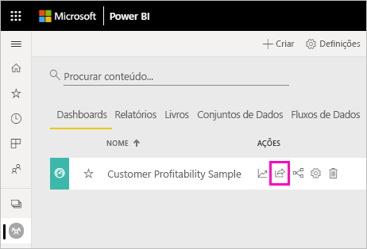

Para partilhar, seja conteúdo dentro ou fora da organização, precisa de uma [licença do Power BI Pro](service-features-license-type.md). Os destinatários também precisam de licenças do Power BI Pro, a menos que os conteúdos estejam numa [capacidade Premium](service-premium-what-is.md). 

Pode partilhar dashboards e relatórios a partir de maioria dos locais no serviço Power BI: as áreas de trabalho Favoritos, Recentes, A Minha Área de Trabalho e Partilhado Comigo, se o proprietário permitir. Também pode partilhar a partir de outras áreas de trabalho se tiver a [função de Administrador, Membro ou Contribuidor](service-new-workspaces.md#roles-in-the-new-workspaces) nas mesmas. 

Ao partilhar dashboards ou relatórios, as pessoas com quem os partilhar poderão ver e interagir com os mesmos, mas não os poderão editar. As pessoas verão os mesmos dados que vê no dashboard ou no relatório, a menos que seja aplicada a [RLS (Segurança em nível de linha)](service-admin-rls.md). Os colegas com quem partilhar também os podem partilhar com os colegas deles, se assim o permitir. As pessoas fora da organização podem ver e interagir com os dashboards ou relatórios, mas não os podem partilhar. 

Não pode *partilhar* dashboards diretamente do Power BI Desktop. Irá [publicar relatórios do Power BI Desktop](desktop-upload-desktop-files.md) para o serviço Power BI. No entanto, pode [partilhar um dashboard a partir das aplicações móveis do Power BI](consumer/mobile/mobile-share-dashboard-from-the-mobile-apps.md).  

## Vídeo: Partilhar um dashboard
Veja a Margarida a partilhar o dashboard com colegas dentro e fora da empresa. Em seguida, siga as instruções passo-a-passo abaixo do vídeo para experimentar.

<iframe width="560" height="315" src="https://www.youtube.com/embed/0tUwn8DHo3s?list=PL1N57mwBHtN0JFoKSR0n-tBkUJHeMP2cP" frameborder="0" allowfullscreen></iframe>

## Partilhar um dashboard ou relatório

1. Numa lista de dashboards ou relatórios, ou num dashboard ou relatório aberto, selecione **Partilhar** .

2. Na caixa superior, introduza os endereços de e-mail completos de pessoas, grupos de distribuição ou grupos de segurança. Não pode partilhar com listas de distribuição dinâmicas. 
   
   Pode partilhar com pessoas cujos endereços são externos à sua organização, mas irá ver um aviso. Saiba mais sobre como [partilhar algo fora da sua organização](#share-a-dashboard-or-report-outside-your-organization) neste artigo.
   
   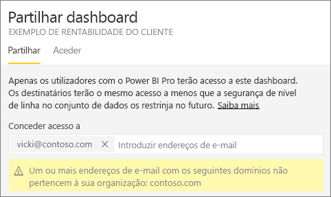 
 
   >[!NOTE]
   >A caixa de entrada suporta um máximo de 100 utilizadores ou grupos separados. Veja a secção [Partilhar com mais de 100 utilizadores](#share-with-more-than-100-separate-users) neste artigo para descobrir formas de poder partilhar com mais pessoas.

3. Se preferir, adicione uma mensagem. É opcional.
4. Para permitir que os seus colegas partilhem os seus conteúdos com outras pessoas, selecione a opção **Permitir aos destinatários partilhar o dashboard (ou relatório)** .
   
   Permitir a partilha a outras pessoas denomina-se *voltar a partilhar*. Se o permitir, eles podem voltar a partilhar a partir do serviço do Power BI e das aplicações móveis ou encaminhar o convite por e-mail para outras pessoas na sua organização. O convite expira após um mês. As pessoas fora da sua organização não podem voltar a partilhar. Como proprietário do conteúdo, pode desativar ou revogar a possibilidade de voltar a partilhar a nível individual. Veja a secção [Parar ou alterar a partilha](#stop-or-change-sharing) neste artigo.

5. Se selecionar a opção **Permitir que os utilizadores criem novos conteúdos com conjuntos de dados subjacentes**, os utilizadores poderão criar os seus próprios relatórios noutras áreas de trabalho com base no conjunto de dados deste dashboard. Saiba mais sobre como [criar relatórios baseados em conjuntos de dados de diferentes áreas de trabalho](service-datasets-discover-across-workspaces.md).

1. Selecione **Partilhar**.
   
   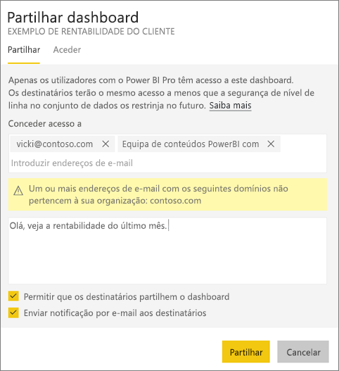  
   
   O Power BI envia um convite por e-mail às pessoas, mas não aos grupos, com uma ligação para o conteúdo partilhado. Verá uma notificação de **Êxito**. 
   
   Quando os destinatários na organização clicam na ligação, o Power BI adiciona o dashboard ou o relatório à página da lista **Partilhado comigo**. Esses destinatários podem selecionar o seu nome para ver todo o conteúdo que partilhou com eles. 
   
   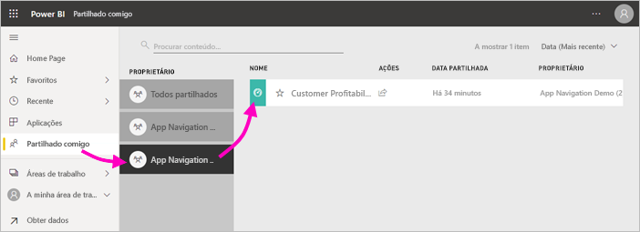
   
   Quando os destinatários externos à sua organização clicam na ligação, veem o dashboard ou o relatório, mas não no portal do Power BI habitual. Saiba mais sobre como [partilhar algo com pessoas fora da sua organização](#share-a-dashboard-or-report-outside-your-organization) neste artigo.

## Ver quem tem acesso a um dashboard ou relatório
Por vezes, é necessário ver as pessoas com quem partilhou e as pessoas com quem estas os partilharam.

1. Na lista de dashboards e relatórios, ou no próprio dashboard ou relatório, selecione **Partilhar** . 
2. Na caixa de diálogo **Partilhar dashboard** ou **Partilhar relatório**, selecione **Acesso**.
   
    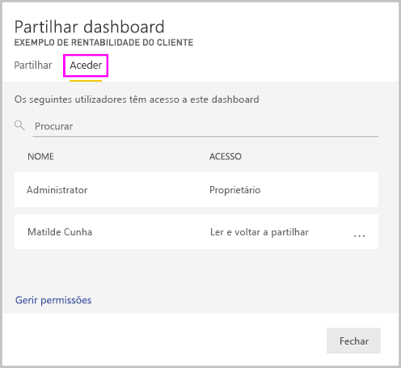

    As pessoas fora da sua organização estão listadas como **Convidado**.

    Nesta vista, pode [parar ou alterar as permissões de partilha](#stop-or-change-sharing) neste artigo. 

## Partilhar um dashboard ou relatório fora da organização
Quando partilha com pessoas fora da sua organização, estas recebem um e-mail com uma ligação para o dashboard ou relatório partilhado. Essas pessoas têm de iniciar sessão no Power BI para verem aquilo que partilhou. Se não tiverem uma licença do Power BI Pro, podem inscrever-se numa ao clicar na ligação.

Após iniciarem sessão, verão o dashboard ou o relatório partilhado na janela do browser e não no portal do Power BI. Para acederem a este dashboard ou relatório mais tarde, têm de marcar a ligação.

Não podem editar conteúdos neste dashboard ou relatório. Estes podem interagir com os gráficos e alterar os filtros ou as segmentações de dados, mas não podem guardar as alterações. 

Apenas os destinatários diretos veem o dashboard ou relatório partilhado. Por exemplo, se tiver enviado o e-mail para Vicki@contoso.com, apenas a Vicki verá o dashboard. Mais ninguém pode ver o dashboard, mesmo que a Vicki encaminhe a ligação. A Vicki tem de utilizar o mesmo endereço de e-mail para aceder ao dashboard. Se a Vicki iniciar sessão com outro endereço de e-mail, não terá acesso ao dashboard.

As pessoas de fora da sua organização não poderão ver os dados se a segurança em nível de linha ou de função for implementada nos modelos de tabela Analysis Services no local.

Utilize um grupo de segurança, não um grupo de distribuição, para partilhar com um grupo que inclui pessoas com endereços de e-mail externos. As pessoas com e-mails externos num grupo de distribuição não conseguem ver os conteúdos que partilha, a não ser que sejam utilizadores convidados do Azure Active Directory (Azure AD) B2B. Saiba mais sobre os [utilizadores convidados do Azure AD B2B](service-admin-azure-ad-b2b.md).

Se enviar uma ligação de uma aplicação móvel do Power BI para pessoas externas à sua organização, quando estas clicarem na mesma, o dashboard será aberto num browser e não na aplicação móvel do Power BI.

### Permitir a edição de conteúdo por utilizadores externos

O seu administrador do Power BI pode permitir que os utilizadores externos convidados editem e façam a gestão de conteúdos na sua organização. Nesse caso, os utilizadores externos não terão uma experiência limitada ao consumo. Desse modo, poderão editar e gerir conteúdos na sua organização. Saiba mais sobre como [distribuir conteúdos do Power BI para utilizadores convidados externos com o Azure AD B2B](service-admin-azure-ad-b2b.md).

## Parar ou alterar a partilha
Apenas o proprietário do dashboard ou do relatório pode ativar ou desativar a possibilidade de voltar a partilhar.

### Se ainda não enviou o convite de partilha
* Antes de enviar o convite, desselecione a caixa de verificação **Permitir que os destinatários partilhem o dashboard (ou relatório)** , na parte inferior.

### Se já partilhou o dashboard ou o relatório
1. Na lista de dashboards e relatórios, ou no próprio dashboard ou relatório, selecione **Partilhar** . 
2. Na caixa de diálogo **Partilhar dashboard** ou **Partilhar relatório**, selecione **Acesso**.
   
    
3. Clique nas reticências ( **...** ) junto a **Ler e voltar a partilhar** e selecione:
   
   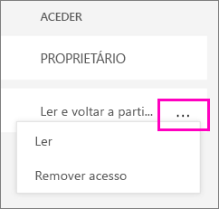
   
   * **Leitura** para impedir a pessoa de partilhar com outros.
   * **Remover acesso** para impedir a pessoa de ver o conteúdo partilhado na íntegra.

4. Na caixa de diálogo **Remover acesso**, pode decidir se também quer remover o acesso a conteúdos relacionados, como relatórios e conjuntos de dados. Se remover itens com um ícone de aviso , recomendamos que também remova os conteúdos relacionados. Caso contrário, não serão apresentados corretamente.

    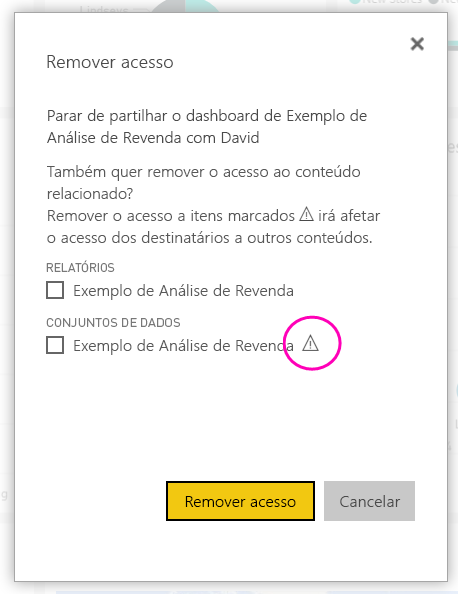

## Limitações e considerações
Elementos a ter em conta sobre a partilha de dashboards e relatórios:

* Em geral, o utilizador e os seus colegas veem os mesmos dados no dashboard ou no relatório. Portanto, se tiver permissões para ver mais dados do que os seus colegas, estes poderão ver todos os seus dados no dashboard ou no relatório. No entanto, se a [RLS (segurança ao nível de linha)](service-admin-rls.md) for aplicada ao conjunto de dados subjacente a um dashboard ou a um relatório, as credenciais de cada pessoa vão determinar a que dados podem aceder.
* Todas as pessoas com quem partilhar o dashboard podem vê-lo e interagir com os relatórios relacionados na [Vista de leitura](consumer/end-user-reading-view.md#reading-view). Em geral, não podem criar relatórios ou guardar alterações a relatórios existentes. No entanto, se selecionar a opção **Permitir que os utilizadores criem novos conteúdos com conjuntos de dados subjacentes**, os utilizadores poderão criar os seus próprios relatórios noutras áreas de trabalho com base no conjunto de dados deste dashboard ou relatório.
* Embora ninguém possa ver ou transferir o conjunto de dados, é possível aceder ao conjunto de dados diretamente através da funcionalidade Analisar no Excel. Um administrador pode restringir a capacidade de utilização da funcionalidade Analisar no Excel para todos os utilizadores num grupo. No entanto, a restrição destina-se a todos os utilizadores desse grupo e para cada área de trabalho a que o grupo pertence.
* Todas as pessoas podem [atualizar os dados](refresh-data.md) manualmente.
* Se utilizar o Office 365 para e-mail, pode partilhar com membros de um grupo de distribuição ao introduzir o endereço de e-mail associado ao grupo de distribuição.
* Os colegas com quem partilhe o domínio de e-mail e os colegas cujo domínio é diferente, mas esteja registado no mesmo inquilino, podem partilhar o dashboard com outras pessoas. Por exemplo, suponhamos que os domínios contoso.com e contoso2.com estão registados no mesmo inquilino e que o seu endereço de e-mail é konrads@contoso.com. Tanto o ravali@contoso.com como o gustav@contoso2.com podem partilhar o seu dashboard, desde que lhes conceda permissão para partilhar.
* Se os seus colegas já tiverem acesso a um dashboard ou a um relatório específico, pode enviar uma ligação direta ao copiar o URL quando estiver no dashboard ou relatório. Por exemplo: `https://powerbi.com/dashboards/g12466b5-a452-4e55-8634-xxxxxxxxxxxx`.
* De igual modo, se os seus colegas já tiverem acesso a um dashboard específico, pode [enviar uma ligação direta para o relatório subjacente](service-share-reports.md). 

### Partilhar com mais de 100 utilizadores separados

No máximo, pode partilhar com até 100 utilizadores ou grupos numa única ação de partilha. No entanto, pode dar acesso a um item a mais de 500 utilizadores. Eis algumas sugestões:

- Partilhe múltiplas vezes ao especificar os utilizadores individualmente.
- Partilhe com um grupo que contenha todos os utilizadores. 
- Crie o relatório ou dashboard numa área de trabalho e, em seguida, crie uma aplicação a partir da área de trabalho. Pode partilhar a aplicação com muito mais pessoas. Saiba mais sobre como [publicar aplicações no Power BI](service-create-distribute-apps.md).

## Resolução de problemas da partilha

### Os destinatários do meu dashboard vêm um ícone de cadeado num mosaico ou a mensagem "Permissão necessária"

As pessoas com quem partilha vêm um ícone de cadeado num dashboard ou a mensagem "Permissão necessária" quanto tentam ver um relatório.

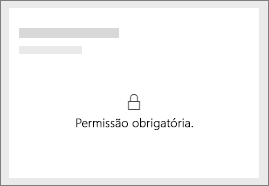

Se for o caso, terá de lhes conceder permissão para o conjunto de dados subjacente.

1. Aceda ao separador **Conjuntos de dados** na sua lista de conteúdos.

1. Selecione as reticências ( **...** ) junto ao conjunto de dados e, em seguida, selecione **Gerir permissões**.

    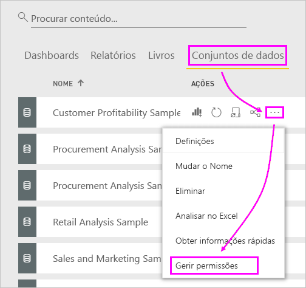

1. Selecione **Adicionar utilizador**.

    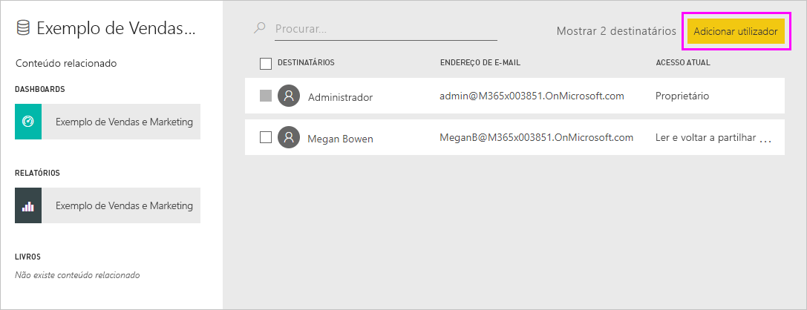

1. Introduza os endereços de e-mail completos de pessoas, grupos de distribuição ou grupos de segurança. Não pode partilhar com listas de distribuição dinâmicas.

    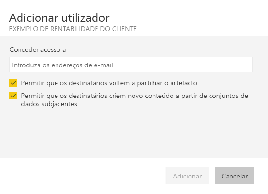

1. Selecione **Adicionar**.

### Não consigo partilhar um dashboard nem um relatório

Para partilhar um dashboard ou relatório, precisa de permissão para voltar a partilhar os conteúdos subjacentes, ou seja, relatórios e conjuntos de dados relacionados. Se lhe for apresentada uma mensagem a informar que não pode partilhar, peça ao autor do relatório que lhe conceda permissão para voltar a partilhar esses relatórios e conjuntos de dados.

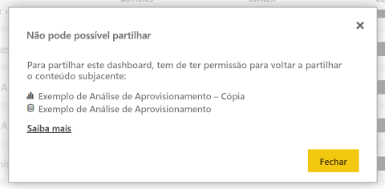

## Próximos passos

* [Como devo colaborar e partilhar os meus dashboards e relatórios?](service-how-to-collaborate-distribute-dashboards-reports.md)
* [Partilhar um relatório do Power BI filtrado](service-share-reports.md)
* Perguntas? [Pergunte à Comunidade do Power BI](https://community.powerbi.com/)

