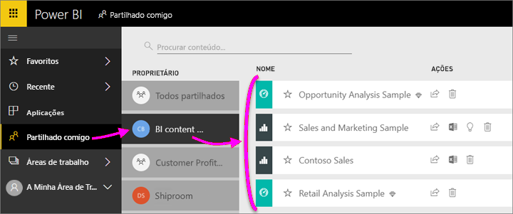

# Partilhar os seus dashboards e relatórios do Power BI com colegas e outras pessoas
A *Partilha* é uma boa forma de dar a algumas pessoas acesso aos seus dashboards e relatórios. O Power BI também disponibiliza [várias outras formas de colaborar e distribuir dashboards e relatórios](service-how-to-collaborate-distribute-dashboards-reports.md).

Para partilhar, seja conteúdo dentro ou fora da organização, precisa de uma [licença do Power BI Pro](service-free-vs-pro.md). Os destinatários necessitam também de licenças do Power BI Pro, ou os conteúdos precisam de estar numa [capacidade Premium](service-premium.md). 

Pode partilhar dashboards e relatórios a partir da maioria dos locais no serviço Power BI: Favoritos, Recente, Partilhado comigo (se o proprietário o permitir), A Minha Área de Trabalho ou outras áreas de trabalho. Ao partilhar um dashboard ou relatório, as pessoas com quem os partilhar poderão ver e interagir com os mesmos, mas não os poderão editar. As pessoas verão os mesmos dados que vê no dashboard ou no relatório, a menos que seja aplicada a [RLS (Segurança em nível de linha)](service-admin-rls.md). Os colegas com quem partilhar também os podem partilhar com os colegas deles, se assim o permitir. As pessoas fora da organização também podem ver e interagir com os dashboards ou relatórios, mas não os podem partilhar. 

Também pode [partilhar um dashboard a partir de qualquer uma das aplicações móveis do Power BI](mobile-share-dashboard-from-the-mobile-apps.md). Pode partilhar dashboards a partir do serviço do Power BI e das aplicações móveis do Power BI, mas não a partir do Power BI Desktop.

## Vídeo: Partilhar um dashboard
Veja a Amanda a partilhar o dashboard dela com colegas dentro e fora da empresa. Em seguida, siga as instruções passo-a-passo abaixo do vídeo para experimentar.

<iframe width="560" height="315" src="https://www.youtube.com/embed/0tUwn8DHo3s?list=PL1N57mwBHtN0JFoKSR0n-tBkUJHeMP2cP" frameborder="0" allowfullscreen></iframe>

## Partilhar um dashboard ou relatório

1. Numa lista de dashboards ou relatórios, ou num dashboard ou relatório abertos, selecione **Partilhar** .

1. Na caixa superior, introduza os endereços de e-mail completos de pessoas, grupos de distribuição ou grupos de segurança. Não pode partilhar com listas de distribuição dinâmicas. 
   
   Pode partilhar com pessoas cujos endereços são externos à sua organização, mas irá ver um aviso.
   
    
 
3. Se preferir, adicione uma mensagem. É opcional.
4. Para permitir que os seus colegas partilhem o conteúdo com outras pessoas, marque a opção **Permitir aos destinatários partilhar o dashboard/relatório**.
   
   Permitir a partilha a outras pessoas denomina-se *voltar a partilhar*. Se o permitir, eles podem voltar a partilhar a partir do serviço do Power BI e das aplicações móveis ou encaminhar o convite por e-mail para outras pessoas na sua organização. O convite expira após um mês. As pessoas fora da sua organização não podem voltar a partilhar. Como proprietário do conteúdo, pode desativar ou revogar a possibilidade de voltar a partilhar a nível individual. Veja [Deixar de partilhar ou impedir outras pessoas de partilhar](service-share-dashboards.md#stop-sharing-or-stop-others-from-sharing) abaixo.

5. Selecione **Partilhar**.
   
     
   
   O Power BI envia um convite por e-mail às pessoas, mas não aos grupos, com uma ligação para o conteúdo partilhado. Verá uma notificação de **Êxito**. 
   
   Quando os destinatários na organização clicam na ligação, o Power BI adiciona o dashboard ou o relatório à página da lista **Partilhado comigo**. Esses destinatários podem selecionar o seu nome para ver todo o conteúdo que partilhou com eles. 
   
   
   
   Quando os destinatários externos à sua organização clicam na ligação, veem o dashboard ou o relatório, mas não no portal do Power BI habitual. Para obter mais detalhes, veja [Partilhar com pessoas fora da organização](service-share-dashboards.md#share-a-dashboard-with-people-outside-your-organization) abaixo.

## Quem tem acesso a um dashboard ou relatório que partilhou?
Por vezes, é necessário ver as pessoas com quem partilhou e as pessoas com quem estas os partilharam.

1. Na lista de dashboards e relatórios, ou nos próprios dashboards ou relatórios, selecione **Partilhar** . 
2. Na caixa de diálogo **Partilhar dashboard/relatório**, selecione **Acesso**.
   
    
   
    As pessoas fora da sua organização estão listadas como **Convidado**.

## Deixar de partilhar ou impedir outras pessoas de partilhar
Apenas o proprietário do dashboard ou do relatório pode ativar ou desativar a possibilidade de voltar a partilhar.

### Se ainda não enviou o convite de partilha
* Desmarque a caixa de verificação **Permitir que os destinatários partilhem este dashboard/relatório**, na parte inferior do convite, antes de enviar.

### Se já partilhou o dashboard ou o relatório
1. Na lista de dashboards e relatórios, ou nos próprios dashboard ou relatórios, selecione **Partilhar** . 
2. Na caixa de diálogo **Partilhar dashboard/relatório**, selecione **Acesso**.
   
    
3. Clique nas reticências (**...**) junto a **Ler e voltar a partilhar** e selecione:
   
   
   
   * **Leitura** para impedir a pessoa de partilhar com outros.
   * **Remover acesso** para impedir a pessoa de ver o conteúdo partilhado na íntegra.

4. Na caixa de diálogo **Remover acesso**, pode decidir se também quer remover o acesso a conteúdos relacionados, como relatórios e conjuntos de dados. Se remover itens com um ícone de aviso , será melhor remover os conteúdos relacionados, porque não serão apresentados de forma adequada.

## Partilhar um dashboard ou relatório com pessoas fora da organização
Quando partilha com pessoas fora da sua organização, estas recebem um e-mail com uma ligação para o dashboard ou o relatório partilhado e têm de iniciar sessão no Power BI para os ver. Se elas não tiverem uma licença do Power BI Pro, poderão inscrever-se para uma após clicarem na ligação.

Após iniciarem sessão, verão o dashboard ou o relatório partilhados nas janelas do browser sem o painel de navegação esquerdo, não no portal do Power BI normal. Têm de adicionar a ligação aos Favoritos para acederem a este dashboard ou relatório no futuro.

Não podem editar conteúdos neste dashboard ou relatório. Estes podem interagir com os gráficos e alterar os filtros ou as segmentações de dados no relatório, mas não podem guardar as alterações.

Apenas os destinatários diretos podem ver o dashboard ou relatório partilhado. Por exemplo, se tiver enviado o e-mail para Vicki@contoso.com, apenas a Vicki poderá ver o dashboard. Mais ninguém consegue ver esse dashboard (mesmo que tenham uma ligação) e a Vicki tem de utilizar o mesmo endereço de e-mail para aceder a esse dashboard. Se ela iniciar sessão com outro endereço de e-mail, também não terá acesso ao dashboard.

As pessoas de fora da sua organização não poderão ver os dados se a segurança em nível de linha ou de função for implementada nos modelos de tabela Analysis Services no local.

Se enviar uma ligação de uma aplicação móvel do Power BI para pessoas externas à sua organização, quando estas clicarem na ligação, o dashboard é aberto num browser, não na aplicação móvel do Power BI.

## Limitações e considerações
Elementos a ter em conta sobre a partilha de dashboards e relatórios:

* Em geral, o utilizador e os seus colegas veem os mesmos dados no dashboard ou no relatório. Portanto, se tiver permissões para ver mais dados do que os seus colegas, eles conseguirão ver todos os seus dados no dashboard ou no relatório. No entanto, se a [RLS (segurança em nível de linha)](service-admin-rls.md) for aplicada ao conjunto de dados subjacente a um dashboard ou a um relatório, as credenciais de cada pessoa serão utilizadas para determinar a que dados podem aceder.
* Todas as pessoas com quem partilha o dashboard podem vê-lo e interagir com os relatórios relacionados na [Vista de Leitura](service-reading-view-and-editing-view.md). Não podem criar relatórios ou guardar alterações a relatórios existentes.
* Ninguém pode ver ou transferir o conjunto de dados.
* Todas as pessoas podem [atualizar os dados](refresh-data.md) manualmente.
* Se utilizar o Office 365 para e-mail, pode partilhar com membros de um grupo de distribuição ao introduzir o endereço de e-mail associado ao grupo de distribuição.
* Os colegas com o mesmo domínio de e-mail que o utilizador e os colegas com um domínio diferente, mas que estejam registados no mesmo inquilino, podem partilhar o dashboard com outras pessoas. Por exemplo, suponhamos que os domínios contoso.com e contoso2.com estão registados no mesmo inquilino. Se o seu endereço de e-mail for konrads@contoso.com, isso quer dizer que ravali@contoso.com e gustav@contoso2.com podem partilhar, desde que lhes tenha dado permissão para partilhar.
* Se os seus colegas já tiverem acesso a um dashboard ou a um relatório específico, poderá enviar uma ligação direta ao copiar o URL quando estiver no dashboard ou no relatório. Por exemplo: `https://powerbi.com/dashboards/g12466b5-a452-4e55-8634-xxxxxxxxxxxx`
* De igual modo, se os seus colegas já tiverem acesso a um dashboard específico, pode [enviar uma ligação direta para o relatório subjacente](service-share-reports.md). 

## Resolução de problemas da partilha

### Os destinatários do meu dashboard vêm um ícone de cadeado num mosaico ou a mensagem "Permissão necessária"

As pessoas com quem partilha vêm um ícone de cadeado num dashboard ou a mensagem "Permissão necessária" quanto tentam ver um relatório.

Se for o caso, terá de lhes conceder permissão para o conjunto de dados subjacente. Eis como fazê-lo.

1. Aceda ao separador **Conjuntos de dados** na sua lista de conteúdos.

1. Selecione as reticências (**...**) junto ao conjunto de dados > **Gerir permissões**.

    

3. Selecione **Adicionar utilizador**.

    

1. Introduza os endereços de e-mail completos de pessoas, grupos de distribuição ou grupos de segurança. Não pode partilhar com listas de distribuição dinâmicas.

    

5. Selecione **Adicionar**.

### Não consigo partilhar um dashboard nem um relatório

Para partilhar um dashboard ou um relatório, tem de ter permissão para voltar a partilhar os conteúdos subjacentes: relatórios e conjuntos de dados relacionados. Se vir uma mensagem a informá-lo que não pode partilhar, peça ao autor do relatório que lhe dê permissão para voltar a partilhar esses relatórios e conjuntos de dados.

## Próximos passos
* Tem comentários? Vá ao [site da Comunidade do Power BI](https://community.powerbi.com/) e envie as suas sugestões.
* [Como devo colaborar e partilhar os meus dashboards e relatórios?](service-how-to-collaborate-distribute-dashboards-reports.md)
* [Partilhar um relatório do Power BI filtrado](service-share-reports.md)
* Perguntas? [Experimente a Comunidade do Power BI](http://community.powerbi.com/).

