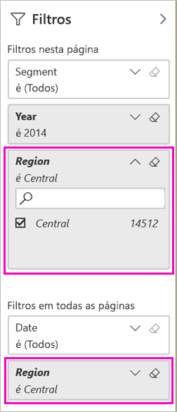

# Duas formas de partilhar um relatório do Power BI filtrado
A *Partilha* é uma boa forma de dar a algumas pessoas acesso aos seus dashboards e relatórios. E se pretender partilhar uma versão filtrada de um relatório? Por exemplo, um relatório que mostre apenas os dados de um vendedor, cidade ou ano específico. Tente filtrar um relatório e partilhá-lo ou criar um URL personalizado. O relatório será filtrado quando os destinatários o abrirem. É possível remover o filtro ao modificar o URL. 

O Power BI também disponibiliza [outras formas de colaborar e distribuir os relatórios](service-how-to-collaborate-distribute-dashboards-reports.md). Na partilha, o utilizador e os seus destinatários necessitam de uma [licença do Power BI Pro](service-features-license-type.md), ou os conteúdos precisam de estar numa [capacidade Premium](service-premium-what-is.md). 

## Duas formas de filtrar um relatório

Para ambas as técnicas de filtragem, estamos a utilizar a aplicação de modelo de exemplo Marketing e Vendas. Deseja experimentá-la? Também pode instalar a [aplicação de modelo de exemplo Marketing e Vendas](https://appsource.microsoft.com/product/power-bi/microsoft-retail-analysis-sample.salesandmarketingsample?tab=Overview).

### Definir um filtro

Abra um relatório na [Vista de edição](consumer/end-user-reading-view.md) e aplique um filtro.

Neste exemplo, estamos a filtrar a página de Categoria do Ano da aplicação de modelo de exemplo Marketing e Vendas para mostrar apenas os valores em que a **Região** é igual a **Central**. 
 

Guarde o relatório.

### Criar um filtro no URL

Quando adiciona o filtro ao final do URL da página de relatório, o comportamento é um pouco diferente. O aspeto da página filtrada não é alterado. No entanto, o Power BI adiciona o filtro a todo o relatório e remove os outros valores do painel do filtro.  

Adicione o seguinte ao final do URL da página do relatório:
   
    ?filter=*tablename*/*fieldname* eq *value*
   
O campo deve ser do tipo número, data/hora ou cadeia de caracteres. Os valores *tablename* ou *fieldname* não podem ter espaços.
   
No nosso exemplo, o nome da tabela é **Área geográfica**, o nome do campo é **Região** e o valor com base no qual pretendemos filtrar é **Central**:
   
    ?filter=Geo/Region eq 'Central'

O browser adiciona carateres especiais para representar barras, espaços e apóstrofos pelo que o resultado será parecido com este:
   
    app.powerbi.com/groups/xxxx/reports/xxxx/ReportSection4d00c3887644123e310e?filter=Geo~2FRegion%20eq%20'Central'

Guarde o relatório.

Veja o artigo [Filtrar um relatório com os parâmetros de cadeia de consulta no URL](service-url-filters.md) para obter muitos mais detalhes.

## Partilhar o relatório filtrado

1. Quando [partilha o relatório](service-share-dashboards.md), desmarque a caixa de verificação **Enviar notificação por e-mail aos destinatários**.

    

4. Envie a ligação com o filtro criado anteriormente.

## Próximos passos
* [Formas de partilhar o seu trabalho no Power BI](service-how-to-collaborate-distribute-dashboards-reports.md)
* [Partilhar um dashboard](service-share-dashboards.md)
* Mais perguntas? [Experimente a Comunidade do Power BI](https://community.powerbi.com/).
* Tem comentários? Vá ao [site da Comunidade do Power BI](https://community.powerbi.com/) e envie as suas sugestões.

