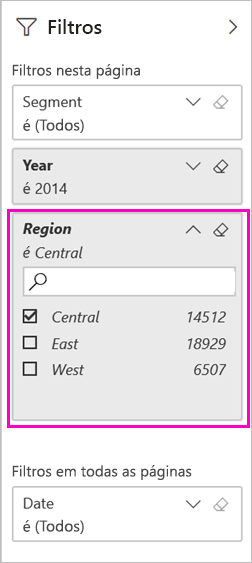

# Filtrar e partilhar um relatório do Power BI
A *Partilha* é uma boa forma de dar a algumas pessoas acesso aos seus dashboards e relatórios. E se pretender partilhar uma versão filtrada de um relatório? Pode querer que o relatório mostre apenas os dados de um vendedor, cidade ou ano específico. Este artigo explica como filtrar um relatório e como partilhar a versão filtrada desse relatório. Pode também partilhar um relatório filtrado ao [adicionar parâmetros de consulta ao URL do relatório](service-url-filters.md). Em ambos os casos, o relatório estará filtrado quando os destinatários o abrirem. Estes últimos podem limpar as seleções de filtro no relatório.

O Power BI também disponibiliza [outras formas de colaborar e distribuir os relatórios](service-how-to-collaborate-distribute-dashboards-reports.md). Na partilha, o utilizador e os seus destinatários necessitam de uma [licença do Power BI Pro](service-features-license-type.md), ou os conteúdos precisam de estar numa [capacidade Premium](service-premium-what-is.md). 

## Seguir os dados de exemplo

Este artigo utiliza a aplicação de modelo de exemplo Marketing and Sales (Marketing e Vendas). Deseja experimentá-la? 

1. Instale a [aplicação de modelo de exemplo Marketing and Sales](https://appsource.microsoft.com/product/power-bi/microsoft-retail-analysis-sample.salesandmarketingsample?tab=Overview).
2. Selecione a aplicação e, em seguida, **Explorar aplicação**.

   

3. Selecione o ícone do lápis para abrir a área de trabalho que instalou com a aplicação.

    

4. Na lista de conteúdos da área de trabalho, selecione **Relatórios** e, em seguida, selecione o relatório **Ficheiro PBIX de Exemplo de Vendas e Marketing**.

    

    Agora está pronto para continuar.

## Definir um filtro no relatório

Abra um relatório na [Vista de edição](consumer/end-user-reading-view.md) e aplique um filtro.

Neste exemplo, estamos a filtrar a página de Categoria do Ano da aplicação de modelo de exemplo Marketing e Vendas para mostrar apenas os valores em que a **Região** é igual a **Central**. 
 

Guarde o relatório.

## Partilhar o relatório filtrado

1. Selecione **Partilhar**.

   

2. Desmarque **Enviar notificação por e-mail aos destinatários**, para poder enviar antes uma ligação filtrada, selecione **Partilhar o relatório com os filtros e as segmentações atuais** e, em seguida, selecione **Partilhar**.

    

4. Selecione **Partilhar** novamente.

   

5. Selecione o separador **Acesso** e, em seguida, selecione **Gerir vistas de relatórios partilhados**.

    

6. Clique com o botão direito do rato no URL desejado e selecione **Copiar ligação**.

    

7. Ao partilhar esta ligação, os destinatários verão o relatório filtrado. 

## Próximos passos
* [Formas de partilhar o seu trabalho no Power BI](service-how-to-collaborate-distribute-dashboards-reports.md)
* [Partilhar um dashboard](service-share-dashboards.md)
* Mais perguntas? [Experimente a Comunidade do Power BI](https://community.powerbi.com/).
* Tem comentários? Vá ao [site da Comunidade do Power BI](https://community.powerbi.com/) e envie as suas sugestões.

