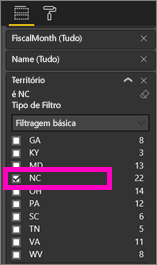
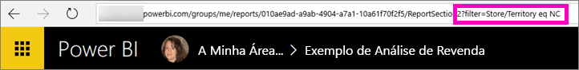
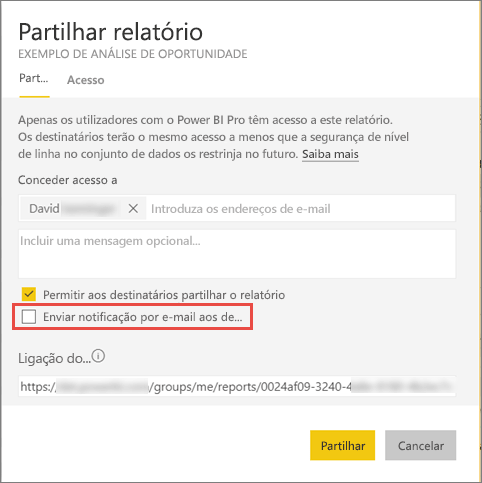

# Partilhar um relatório do Power BI filtrado com os seus colegas
A *Partilha* é uma boa forma de dar a algumas pessoas acesso aos seus dashboards e relatórios. O Power BI também disponibiliza [várias outras formas de colaborar e distribuir os seus relatórios](service-how-to-collaborate-distribute-dashboards-reports.md).

Na partilha, o utilizador e os seus destinatários necessitam de uma [licença do Power BI Pro](service-features-license-type.md), ou os conteúdos precisam de estar numa [capacidade Premium](service-premium.md). 

Pode partilhar um relatório com os colegas no mesmo domínio de e-mail que utiliza, a partir da maioria dos locais no serviço Power BI: Favoritos, Recente, Partilhado comigo (se o proprietário o permitir), A minha área de trabalho ou outras áreas de trabalho. Ao partilhar um relatório, os colegas com quem o partilhar poderão ver e interagir com o mesmo, mas não poderão editá-lo. As pessoas verão os mesmos dados que vê no relatório, a menos que seja aplicada [RLS (Segurança em nível de linha)](service-admin-rls.md). 

E se pretender partilhar uma versão filtrada de um relatório? Por exemplo, um relatório que mostre apenas os dados de um vendedor, cidade ou ano específico. Experimente criar um URL personalizado. O relatório será filtrado quando os destinatários o abrirem. É possível remover o filtro ao modificar o URL.

## Filtrar e partilhar um relatório

1. Abra o relatório na [Vista de edição](consumer/end-user-reading-view.md), aplique o filtro e guarde o relatório.
   
   Neste caso, estamos a filtrar o [Exemplo de Análise de Revenda](sample-tutorial-connect-to-the-samples.md) de forma a mostrar apenas valores em que **Territory** (Território) seja igual a **NC**.
   
   
2. Adicione o seguinte ao final do URL da página do relatório:
   
   ?filter=*tablename*/*fieldname* eq *value*
   
    O campo deve ser do tipo **cadeia**. Os valores *tablename* ou *fieldname* não podem ter espaços.
   
   No nosso exemplo, o nome da tabela é **Store** (Loja), o nome do campo é **Territory** (Território) e o valor com base no qual pretendemos filtrar é **NC**:
   
    ?filter=Store/Territory eq 'NC'
   
   
   
   O browser adiciona carateres especiais para representar barras, espaços e apóstrofos pelo que o resultado será:
   
   app.powerbi.com/groups/me/reports/010ae9ad-a9ab-4904-a7a1-xxxxxxxxxxxx/ReportSection2?filter=Store%252FTerritory%20eq%20%27NC%27

3. [Partilhe o relatório](service-share-dashboards.md), mas desselecione a caixa de verificação **Enviar notificação por e-mail aos destinatários**. 

    

4. Envie a ligação com o filtro criado anteriormente.

## Próximos passos
* Tem comentários? Vá ao [site da Comunidade do Power BI](https://community.powerbi.com/) e envie as suas sugestões.
* [Como devo colaborar e partilhar os meus dashboards e relatórios?](service-how-to-collaborate-distribute-dashboards-reports.md)
* [Partilhar um dashboard](service-share-dashboards.md)
* Mais perguntas? [Experimente a Comunidade do Power BI](http://community.powerbi.com/).

