# Criar uma aplicação de modelo no Power BI (pré-visualização)

As novas *aplicações de modelo* do Power BI permitem que os parceiros do mesmo criem aplicações do Power BI com pouco ou nenhum código e que as implementem para qualquer cliente do Power BI.  Este artigo contém instruções passo a passo para criar uma aplicação de modelo do Power BI.

Se pode criar relatórios do Power BI e dashboards, pode se tornar um *criador de aplicações do modelo* e cria e empacota o conteúdo analítico para um *aplicação*. Pode implementar a sua aplicação para outros inquilinos do Power BI através de qualquer plataforma disponível, como o AppSource, ou ao utilizá-lo no seu próprio web service. Como um construtor, tem a possibilidade de criar um pacote de análise protegido para distribuição.

Os administradores de inquilinos do Power BI gerem e controlam quem na sua organização pode criar aplicações de modelo e quem pode instalá-las. Esses utilizadores que têm autorização podem instalar a aplicação de modelo, em seguida, modificá-lo e distribuí-la para os consumidores do Power BI na sua organização.

## Pré-requisitos

Eis os requisitos para a criação de uma aplicação de modelo:  

- Uma [licença do Power BI Pro](service-self-service-signup-for-power-bi.md)
- Uma [instalação do Power BI Desktop](desktop-get-the-desktop.md) (opcional)
- Familiaridade com o [conceitos básicos do Power BI](service-basic-concepts.md)
- Permissões para criar uma aplicação de modelo. Veja as [Definições de aplicação de modelo do portal de administração](service-admin-portal.md#template-apps-settings-preview) do Power BI para obter detalhes.

## Ativar o modo de programador da aplicação

Para criar uma aplicação de modelo que possa distribuir para outros inquilinos do Power BI, terá de estar no modo de Programador da Aplicação. Caso contrário, estará apenas a criar uma aplicação para consumidores do Power BI na sua própria organização.

1. Abra o serviço Power BI num browser.
2. Aceda a **Definições** > **Geral** > **Programador** > **Ativar o modo de desenvolvimento de aplicações de modelos**.

    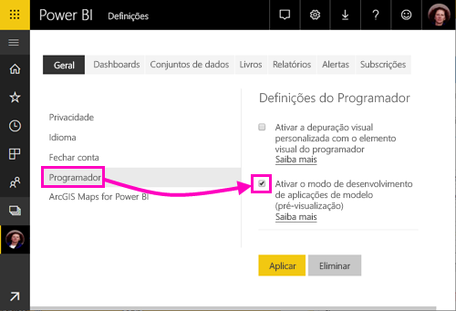

    Se não vir essa opção, contacte o seu administrador do Power BI para que lhe conceda [permissões para a programação de aplicações de modelo](service-admin-portal.md#template-apps-settings-preview) no portal de administração.

3. Selecione **Aplicar**.

## Criar a área de trabalho de aplicação de modelo

Para criar uma aplicação de modelo que possa distribuir para outros inquilinos do Power BI, terá de o fazer numa das novas áreas de trabalho de aplicações.

1. No serviço Power BI, selecione **Áreas de trabalho** > **Criar área de trabalho de aplicação**.

    

2. Em **Criar uma área de trabalho de aplicação**, em **Pré-visualizar as áreas de trabalho melhoradas**, selecione **Experimente agora**.

    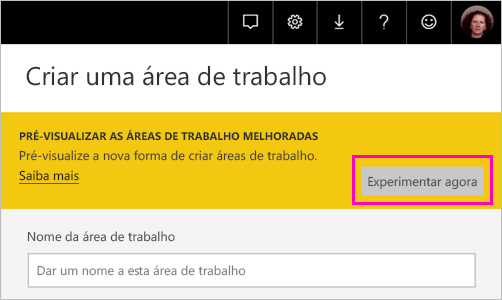

3. Introduza um nome, uma descrição (opcional) e uma imagem de logótipo (opcional) para a sua área de trabalho de aplicação.

4. Selecione **Desenvolver uma aplicação de modelo**.

    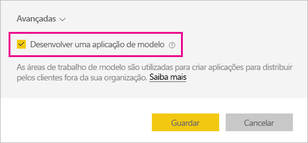

5. Selecione **Guardar**.
>[!NOTE]
>Precisa de permissões do seu administrador do Power BI para promover aplicações de modelo.

## Criar os conteúdos na sua aplicação de modelo

Tal como acontece com uma área de trabalho de aplicação do Power BI normal, o próximo passo é criar os conteúdos na área de trabalho.  Nesta versão de pré-visualização das aplicações de modelo, suportamos apenas um conteúdo de cada tipo: um conjunto de dados, um relatório e um dashboard.

- [Crie os seus conteúdos do Power BI](power-bi-creator-landing.md) na sua área de trabalho de aplicação.

Se estiver a utilizar parâmetros no Power Query, certifique-se de que define corretamente o tipo (por exemplo, Texto). Os tipos Qualquer e Binário não são suportados.

O artigo [Tips for authoring template apps in Power BI (preview)](service-template-apps-tips.md) (Sugestões para a criação de aplicações de modelo no Power BI [pré-visualização]) apresenta sugestões a considerar ao criar relatórios e dashboards para a sua aplicação de modelo.

## Criar a aplicação de modelo de teste

Agora que tem conteúdos na sua área de trabalho, está tudo pronto para os empacotar numa aplicação de modelo. O primeiro passo é criar uma aplicação de modelo de teste que seja acessível apenas a partir do seu inquilino na sua organização.

1. Na área de trabalho de aplicação de modelo, selecione **Criar aplicação**.

    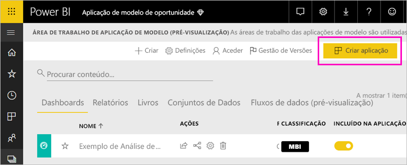

    Aqui, preencha as opções de criação adicionais para a sua aplicação de modelo, em cinco categorias:

    **Personalização**

    
    - Nome da aplicação
    - Descrição
    - Site de suporte (ligação é apresentada em informações da aplicação após a aplicação de modelo como aplicação de organização de redistribuição)
    - Logótipo da aplicação (limite de tamanho de ficheiro de 45K, taxa de proporção de 1:1,. png. jpg. JPEG formatos)
    - Cor do tema de aplicação

    **Conteúdo**

    **Página de destino da aplicação:** Defina um relatório ou dashboard para ser a página de destino da sua aplicação, utilize uma página de aterrissagem que dará a impressão certa:

    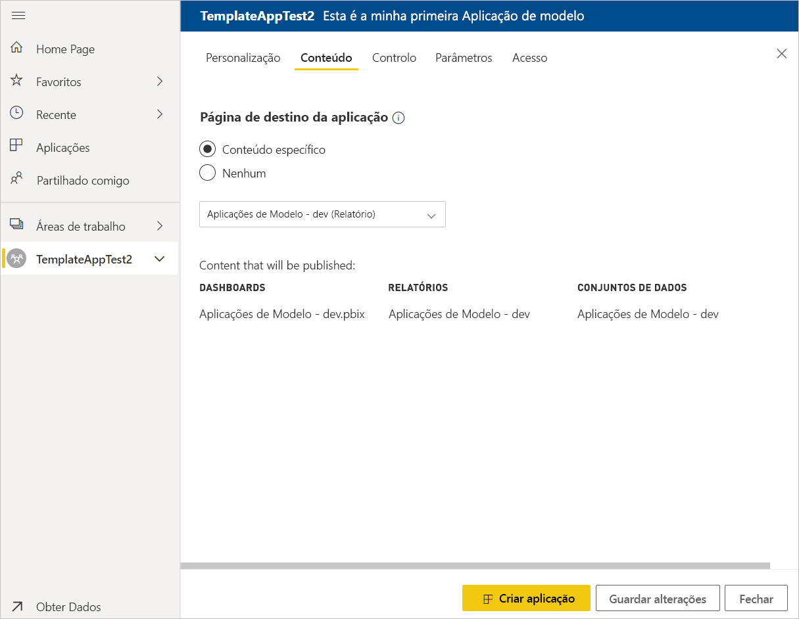

    **Controlo**

    Definir limites e restrições que os usuários do aplicativo terá com o conteúdo do seu aplicativo. Pode utilizar este controlo para proteger a propriedade intelectual na sua aplicação.

    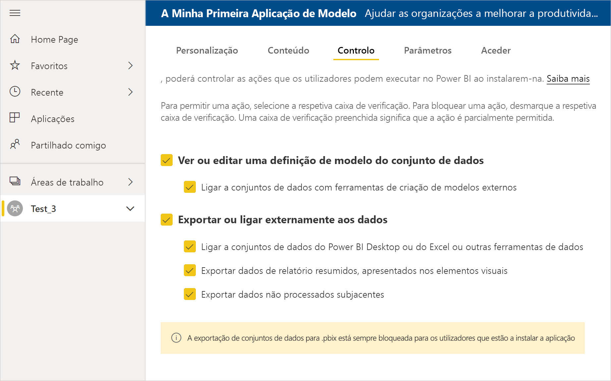

    >[!NOTE]
    >Exportar para o formato. pbix estarão sempre bloqueado para os utilizadores a instalar a aplicação.

    **Parâmetros**

    Utilize esta categoria para gerir o comportamento de parâmetro ao ligar a origens de dados. Saiba mais sobre [criar parâmetros de consulta](https://powerbi.microsoft.com/blog/deep-dive-into-query-parameters-and-power-bi-templates/).

    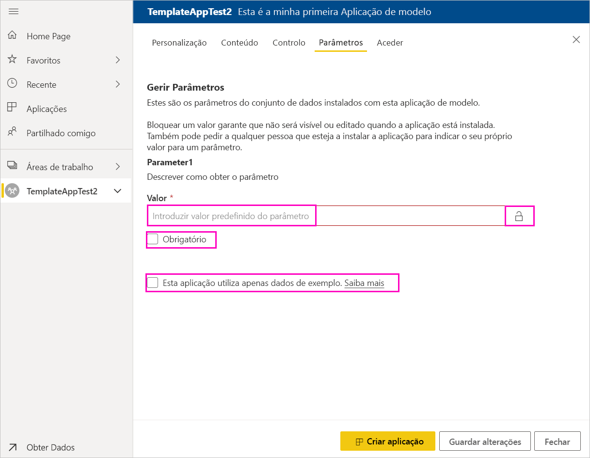
    - **Valor**: valor de parâmetro predefinido.
    - **Necessário**: Utilize esta opção para exigir que o instalador para um parâmetro específico do usuário de entrada.
    - **Bloqueio**: Bloqueio impede que o instalador a atualizar um parâmetro.
    - **Estático**: Ativar no caso da aplicação contiver *apenas* dados de exemplo. Quando seleciona **estático**, o Assistente de instalação não pede aos utilizadores ligar uma origem de dados.

    **Acesso** na fase de teste, decidir que outras pessoas na sua organização podem instalar e testar a aplicação. Não se preocupe, pode sempre voltar atrás e alterar estas definições mais tarde (definição não afeta o acesso da aplicação de modelo distribuído).

2. Selecione **Criar aplicação**.

    Verá uma mensagem a informar que a aplicação de teste está pronta, com uma ligação para copiar e partilhar com os técnicos de teste da sua aplicação.

    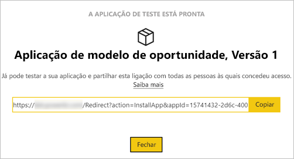

    Também já concluiu o primeiro passo do processo de gestão de versões que segue.

## Gerir a versão da aplicação de modelo

Antes de lançar esta aplicação de modelo publicamente, é importante garantir que está pronta para tal. O Power BI criou o painel de gestão de versões, onde pode acompanhar e inspecionar o caminho de versão completo da aplicação. Também pode acionar a transição de uma fase para outra. As fases comuns são:

- Gerar aplicação de teste: para testar apenas na sua organização.
- Promover o pacote de teste para a fase de pré-produção: testar fora da sua organização.
- Promover o pacote de pré-produção para Produção: versão de produção.
- Eliminar um pacote ou começar a partir da fase anterior.

O URL não é alterado ao se mover entre fases de liberação. Promoção não afeta o URL em si.

Vejamos as fases:

1. Na área de trabalho de aplicação de modelo, selecione **Gestão de Versões**.

    

2. Selecione **Criar aplicação**.

    Se tiver criado a aplicação de teste na secção **Criar a aplicação de modelo de teste** acima, o ponto amarelo junto a **Teste** já está preenchido e não precisa de selecionar a opção **Criar aplicação** nesta fase. Se a selecionar, voltará ao processo de criação de aplicações do modelo.

3. Selecione **Obter ligação**.

    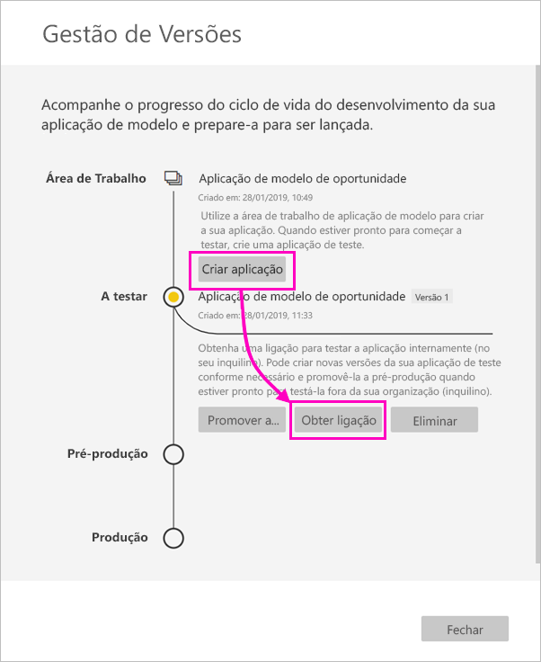

4. Para testar a experiência de instalação da aplicação, copie a ligação na janela de notificação e cole-a numa nova janela do browser.

    A partir daqui, estará a seguir o mesmo procedimento que seguirão os seus clientes. Veja [Install and distribute template apps in your organization](service-template-apps-install-distribute.md) (Instalar e distribuir aplicações de modelo na sua organização) para saber a respetiva versão.

5. Na caixa de diálogo, selecione **Instalar**.

    Quando a instalação for concluída com êxito, será apresentada uma notificação a informar que a nova aplicação está pronta.

6. Selecione **Ir para a aplicação**.
7. Em **Comece já com a sua nova aplicação**, verá a sua aplicação tal como os seus clientes a irão ver.

    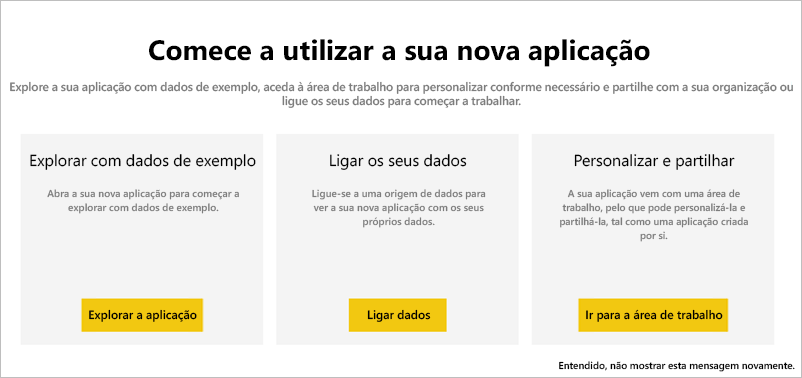
8. Selecione **Explorar a aplicação** para verificar a aplicação de teste com os dados de exemplo.
9. Para fazer alterações, volte à aplicação na área de trabalho original. Atualize a aplicação de teste até obter os resultados que pretende.
10. Quando estiver pronto para promover a sua aplicação para pré-produção para fazer testes adicionais fora do seu inquilino, volte para o **gerenciamento de liberação** painel e selecione **aplicação de promover**. 

    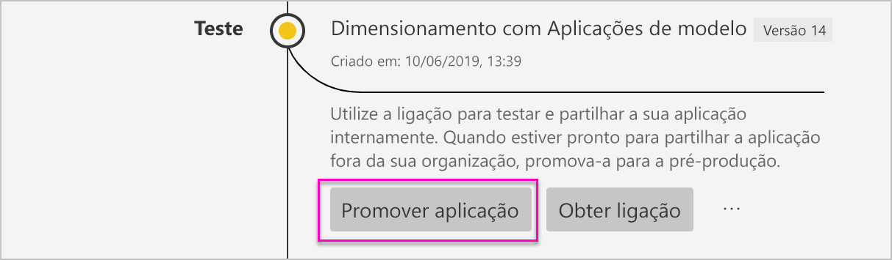

    >[!NOTE]
    > Quando a aplicação é promovida torna-se publicamente disponível fora da sua organização.

11. Selecione **Promover** para confirmar a sua escolha.
12. Copie este novo URL para partilhar fora do seu inquilino para fins de teste. Esta ligação também é aquele que submeter para iniciar o processo de distribuir a sua aplicação no AppSource através da criação de um [nova oferta de Cloud Partner Portal](https://docs.microsoft.com/azure/marketplace/cloud-partner-portal/power-bi/cpp-publish-offer). Submeta ligações apenas de pré-produção para o Portal de parceiro de Cloud. Depois da aplicação é aprovada e recebe notificação que é publicado no AppSource, em seguida, pode promover este pacote para a produção em Power BI.
13. Quando a aplicação está pronta para produção ou partilha através do AppSource, regresse ao painel **Gestão de Versões** e selecione **Promover aplicação** junto a **Pré-produção**.
14. Selecione **Promover** para confirmar a sua escolha.

    Agora a sua aplicação está em produção e pronta para distribuição.

    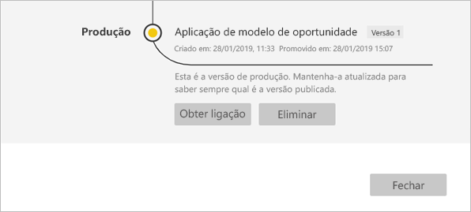

Para disponibilizar a sua aplicação para milhares de utilizadores do Power BI em todo o mundo, recomendamos que a submeta no AppSource. Veja a [Oferta da aplicação Power BI](https://docs.microsoft.com/azure/marketplace/cloud-partner-portal/power-bi/cpp-power-bi-offer) para obter detalhes.

## Atualizar a sua aplicação

Agora que a aplicação está em produção, pode recomeçar a fase de teste sem interromper a aplicação em produção.

1. No painel **Gestão de Versões**, selecione **Criar aplicação**.
2. Repita o processo de criação de aplicações.
3. Após definir as categorias **Personalização**, **Conteúdo**, **Controlo** e **Acesso**, selecione novamente **Criar aplicação**.
4. Selecione **Fechar** e regresse ao painel **Gestão de Versões**.

   Verá que agora tem duas versões: A versão em produção e uma nova versão em modo de teste.

    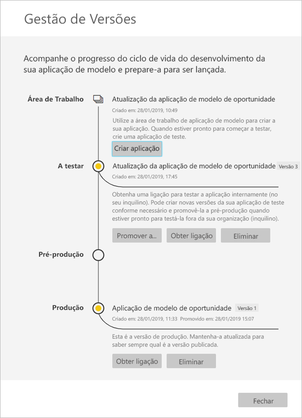

5. Quando estiver pronto para promover a sua aplicação para pré-produção para fazer testes adicionais fora do seu inquilino, volte ao painel de gerenciamento de liberação e selecione **aplicação de promover** junto a **teste**.
6. A ligação está agora ativa, submetê-lo novamente para o Portal do Cloud Partner, seguindo os passos indicados em [atualização de oferta de aplicação do Power BI](https://docs.microsoft.com/azure/marketplace/cloud-partner-portal/power-bi/cpp-update-existing-offer).

>[!NOTE]
>Promova seu aplicativo para a fase de produção apenas após a sua aplicação é aprovada pelo Portal de parceiro de Cloud e publicou-lo.

## Próximos passos

Veja como os seus clientes interagem com a sua aplicação de modelo em [Install, customize, and distribute template apps in your organization](service-template-apps-install-distribute.md) (Instalar, personalizar e distribuir aplicações de modelo na sua organização).

Veja a [Oferta da aplicação Power BI](https://docs.microsoft.com/azure/marketplace/cloud-partner-portal/power-bi/cpp-power-bi-offer) para obter detalhes sobre como distribuir a sua aplicação.
