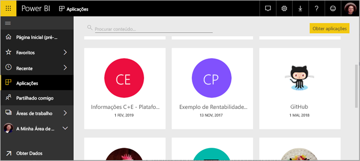
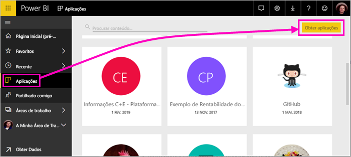
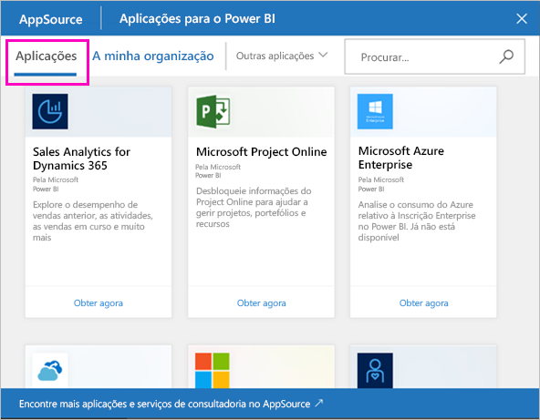
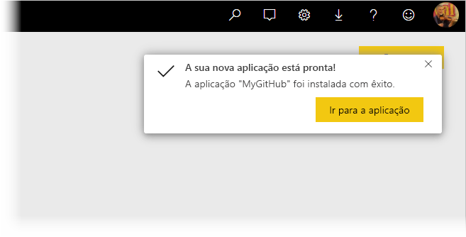
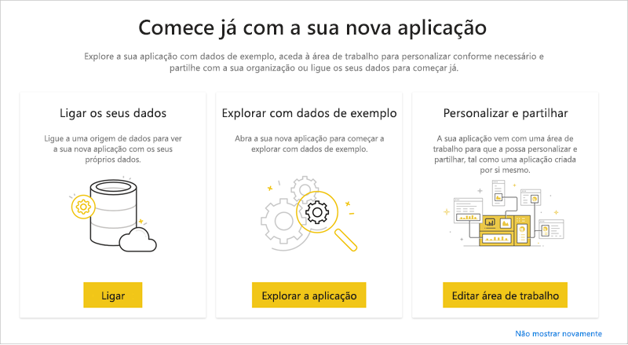
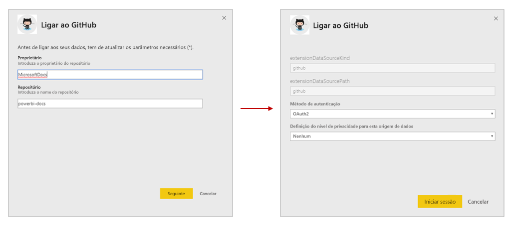
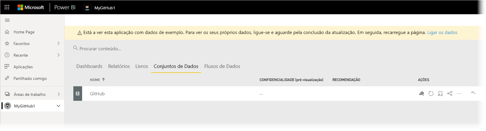
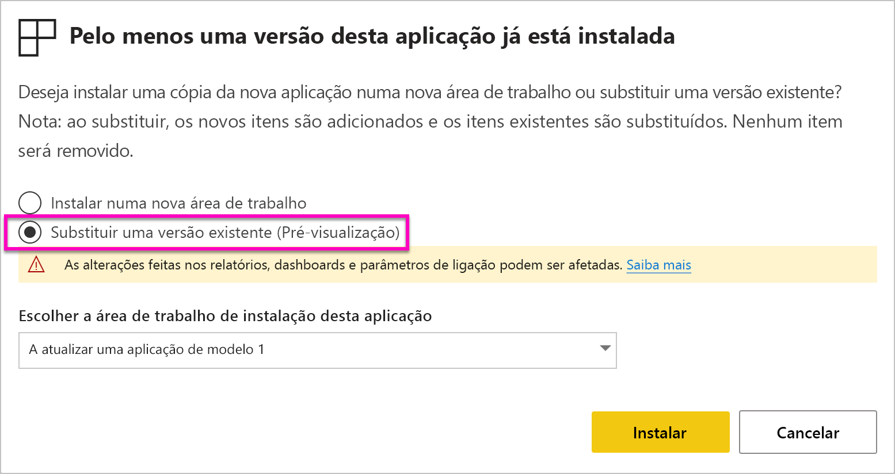
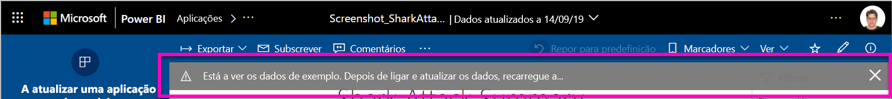

# Instalar e distribuir aplicações de modelo na sua organização

É um analista do Power BI? Se for, este artigo explica como pode instalar [aplicações de modelo](service-template-apps-overview.md) para ligar a muitos dos serviços que utiliza para gerir a sua empresa, nomeadamente o Salesforce, o Microsoft Dynamics e o Google Analytics. Em seguida, pode modificar os relatórios e o dashboard pré-incorporado da aplicação de modelo para satisfazer as necessidades da sua organização e distribuí-los aos seus colegas como [aplicações](consumer/end-user-apps.md). 

Se estiver interessado em criar aplicações de modelo para distribuição própria fora da sua organização, veja [Criar uma aplicação de modelo no Power BI](service-template-apps-create.md). Os parceiros do Power BI podem criar aplicações do Power BI com pouco ou nenhum código e disponibilizá-las para clientes do Power BI. 

## Pré-requisitos  

Para instalar, personalizar e distribuir uma aplicação de modelo, precisa do seguinte: 

* Uma [licença do Power BI Pro](service-self-service-signup-for-power-bi.md).
* Permissões para instalar aplicações de modelo no seu inquilino.
* Uma ligação de instalação válida da aplicação, que pode obter através do AppSource ou de outro criador de aplicações.
* Conhecimentos sólidos dos [conceitos básicos do Power BI](service-basic-concepts.md).

## Instalar uma aplicação de modelo

1. No painel de navegação do serviço Power BI, selecione **Aplicações** > **Obter aplicações**.

    

1. Na janela do AppSource que é apresentada, selecione **Aplicações**. Navegue ou procure a aplicação pretendida e, em seguida, selecione **Obter agora**.

    

1. Na caixa de diálogo apresentada, selecione **Instalar**.

    
    
    A aplicação é instalada com uma área de trabalho associada. **Se optar por personalizar a aplicação, irá fazê-lo nesta área de trabalho associada**.

    > [!NOTE]
    > Se utilizar uma ligação de instalação para uma aplicação que não esteja listada no AppSource, uma caixa de diálogo de validação irá pedir-lhe para confirmar a sua escolha.
    >
    >Para conseguir instalar uma aplicação de modelo que não esteja listada no AppSource, tem de pedir as permissões relevantes ao seu administrador. Veja as [Definições de aplicação de modelo](service-admin-portal.md#template-apps-settings) no portal de administração do Power BI para obter detalhes.

    Quando a instalação for concluída com êxito, uma notificação informa-o de que a sua nova aplicação está pronta.

    

## Ligar-se a dados

1. Selecione **Ir para a aplicação**. A janela **Comece já com a sua nova aplicação**  é apresentada.

   

1. Clique em **Ligar**.
    
    Esta ação abre uma caixa de diálogo ou um conjunto de caixas de diálogo onde pode alterar a origem de dados dos dados de exemplo para a sua própria origem de dados. De forma geral, isto significa redefinir os parâmetros do conjunto de dados e as credenciais da origem de dados. Veja [Limitações conhecidas](service-template-apps-overview.md#known-limitations).
    
    No exemplo abaixo, a ligação a dados envolve duas caixas de diálogo.

   

    Quando terminar o preenchimento das caixas de diálogo de ligação, o processo de ligação é iniciado. Uma faixa informa-o de que está a ver dados de exemplo.

    

    Aguarde até que a ligação e a atualização dos dados sejam concluídas. Para saber quando este processo foi concluído, veja o indicador de progresso na linha (novo aspeto) ou no separador (aspeto antigo) do conjunto de dados.

   Quando a ligação e a atualização dos dados forem concluídas, atualize o seu browser. A faixa informa-o agora de que é necessário atualizar a aplicação para aplicar as alterações efetuadas à aplicação e para partilhá-la.

    

## Personalizar e partilhar a aplicação

Depois de atualizar o browser após a ligação aos dados e a atualização dos mesmos serem concluídas, verá a área de trabalho que está associada à aplicação. Nesta altura, pode editar qualquer um dos artefactos, tal como faria em qualquer outra área de trabalho. No entanto, lembre-se de que as alterações que fizer serão substituídas quando atualizar a aplicação com uma nova versão, a menos que guarde os itens alterados com nomes diferentes. [Veja detalhes sobre a substituição](#overwrite-behavior).

Para obter mais informações sobre a edição de artefactos na área de trabalho, veja
* [Apresentação do editor de relatórios no Power BI](service-the-report-editor-take-a-tour.md)
* [Conceitos básicos para designers no serviço Power BI](service-basic-concepts.md)

Quando concluir as alterações pretendidas aos artefactos na área de trabalho, está pronto para publicar e partilhar a aplicação. Veja [Publicar a sua aplicação](service-create-distribute-apps.md#publish-your-app) para saber como fazê-lo.

## Atualizar uma aplicação de modelo

Periodicamente, os criadores de aplicações de modelo lançam novas versões melhoradas das respetivas aplicações de modelo, quer através do AppSource, por ligação direta ou ambos.

Se transferiu originalmente a aplicação do AppSource, quando for disponibilizada uma nova versão da aplicação de modelo, será notificado de duas formas:
* É apresentada uma faixa de atualização no serviço Power BI a informar que está disponível uma nova versão da aplicação.
  
* Recebe uma notificação no painel de notificações do Power BI.

  

>[!NOTE]
>Se tiver obtido originalmente a aplicação através de uma ligação direta em vez de a partir do AppSource, a única forma de saber quando uma nova versão está disponível é ao contactar o criador da aplicação de modelo.

  Para instalar a atualização, clique em **Obter agora** na faixa de notificações ou na central de notificações ou procure novamente a aplicação no AppSource e selecione **Obter agora**. Se tiver uma ligação direta para a atualização a partir do criador da Aplicação de modelo, basta clicar na ligação.
  
  Ser-lhe-á perguntado se quer substituir a versão atual ou instalar a nova versão numa nova área de trabalho. Por predefinição, a opção "substituir"está selecionada.

  

- **Substituir uma versão existente:** substitui a área de trabalho existente com a versão atualizada da aplicação de modelo. [Veja detalhes sobre a substituição](#overwrite-behavior).

- **Instalar numa nova área de trabalho:** Instala uma nova versão da área de trabalho e da aplicação que precisa de reconfigurar (ou seja, ligar a dados, definir a navegação e permissões).

### Comportamento de substituição

* A substituição faz com que os relatórios, dashboards e conjuntos de dados sejam atualizados na área de trabalho, mas não na aplicação. A substituição não altera a navegação, configuração e permissões da aplicação.
* Depois de atualizar a área de trabalho, tem de **atualizar a aplicação para aplicar as alterações da área de trabalho à aplicação**.
* A substituição mantém a configuração dos parâmetros e da autenticação. Após a atualização, é iniciada uma atualização automática do conjunto de dados. **Durante esta atualização, a aplicação, os relatórios e os dashboards apresentam dados de exemplo**.

  

* A substituição apresenta sempre dados de exemplo até à conclusão da atualização. Se o autor da aplicação de modelo tiver feito alterações no conjunto de dados ou nos parâmetros, os utilizadores da área de trabalho e da aplicação não verão os dados até a atualização estar concluída. Em vez disso, continuarão a ver dados de exemplo durante este período.
* A substituição nunca elimina novos relatórios ou dashboards que adicionou à área de trabalho. Apenas substitui os relatórios e dashboards originais com alterações do autor original.

>[!IMPORTANT]
>Lembre-se de [atualizar a aplicação](#customize-and-share-the-app) depois da substituição para aplicar as alterações aos relatórios e ao dashboard para os utilizadores da aplicação da organização.

## Próximos passos

[Criar áreas de trabalho com os seus colegas no Power BI](service-create-workspaces.md)
