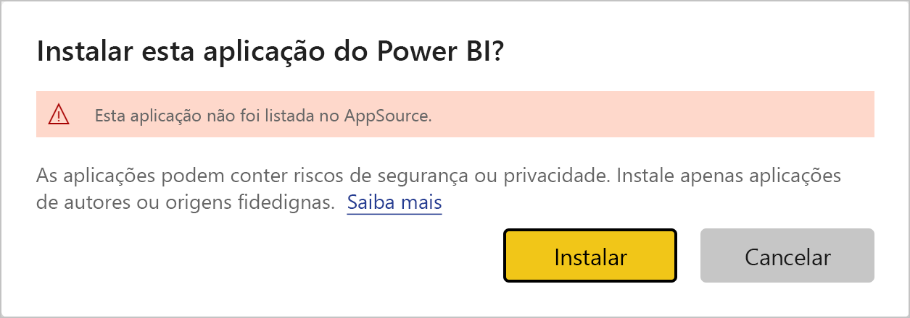
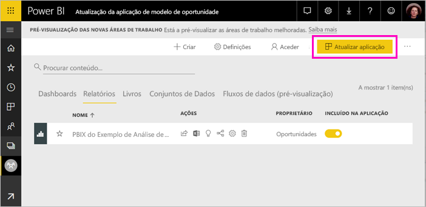
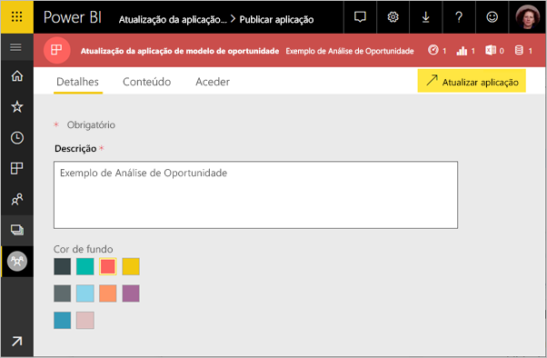
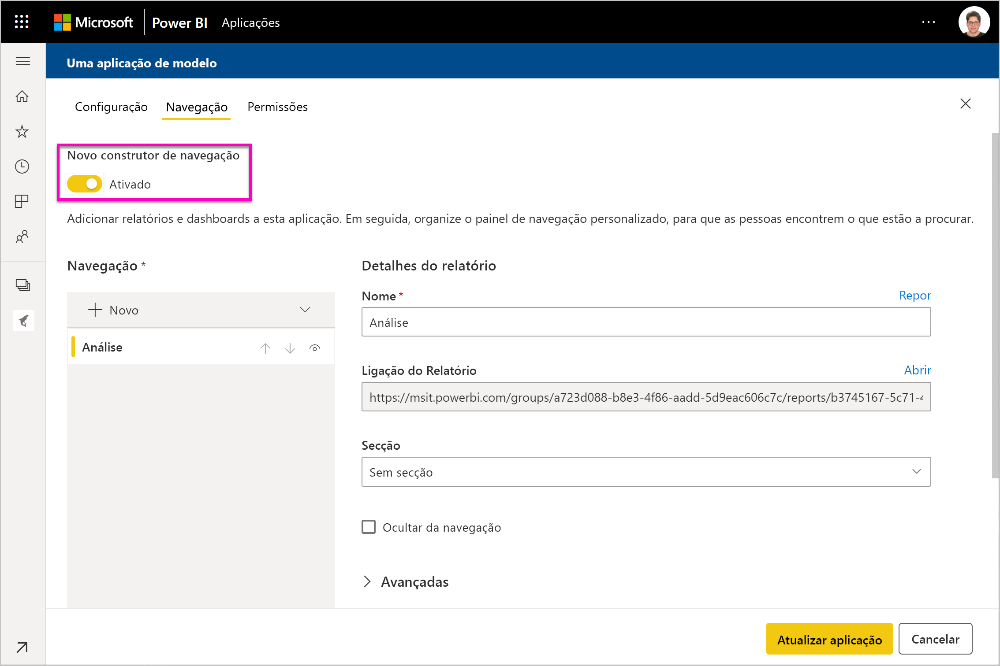
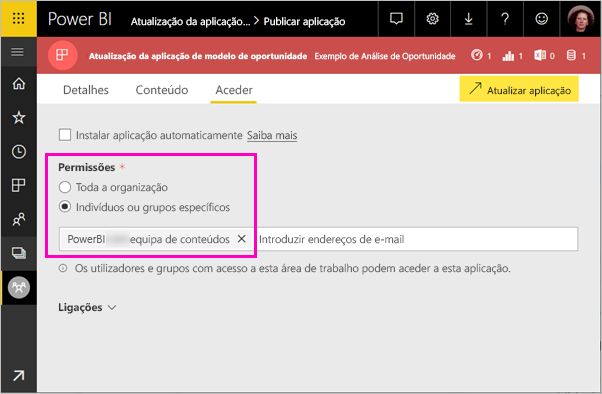

# Instalar e distribuir aplicações de modelo na sua organização – Power BI

É um analista do Power BI? Se for, veja este artigo para aprender a instalar *aplicações de modelo* para ligar a muitos dos serviços que utiliza para gerir a sua empresa, nomeadamente o Salesforce, o Microsoft Dynamics e o Google Analytics. Pode modificar o dashboard e os relatórios para satisfazer as necessidades da sua organização e, em seguida, distribuí-los aos seus colegas como uma *aplicação*. 

Se estiver interessado em criar aplicações de modelo para distribuição própria, veja [Create a template app in Power BI](service-template-apps-create.md) (Criar uma aplicação de modelo no Power BI). Os parceiros do Power BI podem criar aplicações do Power BI com pouco ou nenhum código e implementá-las em clientes do Power BI. 

## Pré-requisitos  

Eis os requisitos de instalação, personalização e distribuição de aplicações de modelo: 

- Uma [licença do Power BI Pro](service-self-service-signup-for-power-bi.md)
- Conhecer os [conceitos básicos do Power BI](service-basic-concepts.md)
- A ligação de instalação válida do criador da aplicação de modelo ou do AppSource. 
- Permissões para instalar aplicações de modelo. 

## Instalar uma aplicação de modelo

Poderá receber uma ligação para uma aplicação de modelo. Caso contrário, pode procurar uma aplicação do seu interesse no AppSource. De qualquer forma, após instalar a aplicação de modelo, poderá modificar e distribuí-la para a sua organização.

### Procurar no AppSource a partir de um browser

Num browser, selecione a seguinte ligação para abrir o AppSource filtrado para apresentar aplicações do Power BI:

- https://appsource.microsoft.com/marketplace/apps?product=power-bi

### Procurar no AppSource a partir do serviço Power BI

1. No painel de navegação do serviço Power BI, selecione **Aplicações** > **Obter aplicações**.

    

2. No AppSource, selecione **Aplicações**.

    

3. Navegue ou procure a aplicação e, em seguida, selecione **Obter agora**.

4. Na caixa de diálogo, selecione **Instalar**.

     Se tiver uma licença do Power BI Pro, a aplicação será instalada com a respetiva área de trabalho. Irá personalizar a aplicação na área de trabalho associada.

    Quando a instalação for concluída com êxito, será apresentada uma notificação a indicar que a sua nova aplicação está pronta.
4. Selecione **Ir para a aplicação**.
5. Em **Comece já com a sua nova aplicação** , selecione uma das três opções:

    

    - **Explorar a aplicação**: exploração de dados de exemplo básica. Comece aqui para obter o aspeto e funcionalidade da aplicação. 
    - **Ligar dados**: altere a origem de dados dos dados de exemplo para a sua própria origem de dados. Pode redefinir os parâmetros do conjunto de dados e as credenciais da origem de dados. Veja a secção [Limitações conhecidas](service-template-apps-tips.md#known-limitations) no artigo de sugestões sobre as aplicações de modelo. 
    - **Ir para a área de trabalho** (opção mais avançada): pode fazer todas as alterações permitidas pelo criador da aplicação.

    Em alternativa, ignore esta caixa de diálogo e aceda à área de trabalho diretamente através da opção **Áreas de trabalho** no painel de navegação.
    >[!NOTE]
    >Instalar uma aplicação de modelo instalada numa *aplicação organizacional* e numa *área de trabalho*. Leia mais sobre a [distribuição de aplicações no Power BI](service-create-distribute-apps.md).
 
6. Antes de partilhar a aplicação com os seus colegas, poderá querer ligar aos seus próprios dados. Também poderá querer modificar o relatório ou o dashboard de acordo com as necessidades da sua organização. Além disso, poderá adicionar outros relatórios ou dashboards neste passo.

   Se selecionar uma ligação de instalação para uma aplicação que não esteja listada no AppSource, obterá a caixa de diálogo de validação que lhe pede para confirmar a sua escolha.

   

   >[!NOTE]
   >Para poder instalar aplicações de modelo que não estão listadas no AppSource, tem de pedir as permissões ao seu administrador. Veja as [Definições de aplicação de modelo do portal de administração](service-admin-portal.md#template-apps-settings) do Power BI para obter detalhes.

## Personalizar e publicar a aplicação

Depois de atualizar a aplicação para a sua organização, estará tudo pronto para publicá-la. Os passos são os mesmos que segue para publicar outra aplicação.

1. Quando concluir a personalização, na vista de lista da área de trabalho, selecione **Atualizar aplicação** no canto superior direito.  

    

2. Em **Detalhes**, pode modificar a descrição e a cor de fundo.

   

3. Em **Navegação**, pode utilizar o novo construtor de navegação para a sua aplicação, ou selecionar o dashboard ou o relatório para a página de destino. Veja [Conceber a experiência de navegação](service-create-distribute-apps.md#design-the-navigation-experience) para obter detalhes.

   

4. Em **Acesso**, pode conceder acesso a utilizadores específicos ou a toda a organização.  

   

5. Selecione **Atualizar aplicação**. 

6. Após publicar a aplicação com êxito, pode copiar a ligação e partilhá-la com as pessoas a quem concedeu acesso. Caso a tenha partilhado, essas pessoas também a verão no separador **A minha organização** no AppSource.

## Atualizar uma aplicação de modelo

Os criadores de aplicações de modelo podem lançar novas versões de aplicações de modelo através do AppSource ou de uma ligação direta. Quando o fizerem, pode atualizar a aplicação de modelo ao reinstalar a aplicação com a mesma versão ou com uma versão mais recente.

  >[!NOTE]
  >Se instalar uma nova versão, todas as alterações feitas aos relatórios e dashboards serão substituídas. Para manter os seus relatórios e dashboards atualizados, pode guardá-los com um nome ou localização diferente antes da instalação.

- **Substituir uma versão existente:** substitui a área de trabalho existente com a versão atualizada da aplicação de modelo.

   

- **Instalar numa nova área de trabalho:** instala uma nova versão da área de trabalho e da aplicação que tem de reconfigurar

### Comportamento de substituição

* A substituição faz com que os relatórios, dashboards e conjuntos de dados sejam atualizados na *área de trabalho*, mas não na aplicação. A substituição não altera a navegação, configuração e permissão da aplicação.
* Depois de atualizar a área de trabalho, tem de *atualizar a aplicação* para aplicar as alterações da área de trabalho para a aplicação da organização.
* A substituição mantém a configuração dos parâmetros e da autenticação. Após a atualização, é iniciada uma atualização automática do conjunto de dados. Durante esse período, os relatórios, os dashboards e a aplicação da organização proporcionam a experiência de *dados de exemplo*.
  
* A substituição apresenta sempre dados de exemplo até à conclusão da atualização. Se o autor da aplicação de modelo tiver feito alterações no conjunto de dados ou nos parâmetros, os utilizadores da área de trabalho e da aplicação continuarão a ver a experiência de *dados de exemplo*.
* A substituição nunca elimina *novos* relatórios ou dashboards que adicionou à área de trabalho. Contudo, substitui os relatórios e dashboards originais com alterações do autor original.

>[!IMPORTANT]
>Lembre-se de [atualizar a aplicação](#customize-and-publish-the-app) depois da substituição para aplicar as alterações aos relatórios e ao dashboard para os utilizadores da aplicação da organização.

## Próximos passos

[Criar áreas de trabalho com os seus colegas no Power BI](service-create-workspaces.md)
