# Introdução ao serviço Power BI

Se já utiliza o serviço Power BI há algum tempo, deve ter reparado que efetuámos alterações significativas à interface de utilizador.  A maioria destas alterações afeta a forma como o conteúdo (dashboards, relatórios, conjuntos de dados) é organizado e os caminhos (cliques) que segue para executar tarefas com esse conteúdo. 

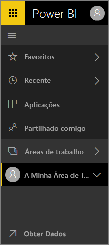

## Como posso...
Para quem está familiarizado com a interface do serviço Power BI anterior, este guia de referência irá ajudar a descobrir como efetuar tarefas na nova interface. Sabemos que pode ser confuso ao início, mas ao longo da utilização, irá descobrir várias vantagens do novo esquema que permitem poupar tempo. 

**Guia de referência rápida**

| Ação | Novo caminho (atual) |
| --- | --- | --- |
| Adicionar um dashboard como favorito |Área de Trabalho > Dashboards e selecione o ícone de estrela para ficar amarelo |
| Ver uma lista dos dashboards favoritos |Selecione **Favoritos** no painel de navegação esquerdo |
| Ver uma lista de dashboards e relatórios acedidos recentemente |Selecione **Recentes** no painel de navegação esquerdo |
| Ver uma lista de dashboards partilhados consigo |Selecione **Partilhado comigo** no painel de navegação esquerdo |
| Partilhar um dashboard |Abra o dashboard e selecione **Partilhar** ou crie e publique uma aplicação |
| Eliminar um dashboard |A minha área de trabalho > Dashboards > ícone de recipiente do lixo |
| Eliminar um relatório |A minha área de trabalho > Relatórios > ícone de recipiente do lixo |
| Eliminar um conjunto de dados |A minha área de trabalho > Conjuntos de dados >... > Eliminar |
| Abrir um dashboard |Área de trabalho > Dashboards > e selecione o nome do dashboard |
| Abrir um relatório |Área de trabalho > Relatórios > e selecione o nome do relatório |
| Abrir um conjunto de dados |Área de trabalho > Conjuntos de dados > e selecione o nome do conjunto de dados |
| Criar um dashboard |Na barra de navegação superior, selecione Criar > Dashboard |
| Criar um relatório |Na barra de navegação superior, selecione Criar > Relatório |
| Criar um conjunto de dados |Na barra de navegação superior, selecione Criar > Conjunto de dados |
| Criar uma aplicação |Áreas de trabalho > Criar área de trabalho de aplicação |
| Ver uma lista de todos os dashboards, relatórios e conjuntos de dados de que é proprietário |Áreas de trabalho > A minha área de trabalho |

## Por que motivo alterámos a experiência de navegação do serviço Power BI?
* Simplificámos as listas de dashboards, relatórios, livros e conjuntos de dados    
* Adicionámos submenus de acesso rápido para favoritos, mais recente e seleção da área de trabalho    
* Adicionámos uma forma de identificar conteúdo relacionado para dashboards, relatórios e conjuntos de dados    
* Adicionámos uma área de conteúdo separada para livros    
* Criámos uma área separada para os dashboards favoritos    
* Criámos uma área separada para o conteúdo partilhado consigo 
* Criámos uma área separada para o conteúdo mais recente  
* Reduzimos o número de cliques necessário para realizar tarefas e combinámos as listas de conteúdo e as ações que pode efetuar nesse conteúdo, no mesmo ecrã. Por exemplo, alternar entre dashboards e relatórios.</td></tr></table>

Veja a Amanda a levá-lo numa apresentação da nova experiência de navegação e a explicar e demonstrar os melhoramentos.  Em seguida, siga as instruções passo a passo abaixo do vídeo para explorar por si.

<iframe width="560" height="315" src="https://www.youtube.com/embed/G26dr2PsEpk" frameborder="0" allowfullscreen></iframe>

## Adicionámos algumas funcionalidades totalmente novas
Siga as instruções passo a passo para explorar por si.

### Ver conteúdo (dashboards, relatórios, livros, conjuntos de dados, áreas de trabalho, aplicações)
Vamos começar por observar como está organizado o conteúdo básico (dashboards, relatórios, conjuntos de dados, livros). Antes disto, todo o conteúdo era listado no painel de navegação esquerdo. Agora, ainda tem essa opção, mas a predefinição é apresentar por tipo de conteúdo no contexto de uma área de trabalho. Selecione uma área de trabalho no painel de navegação esquerdo (navegação esquerda) e os separadores do conteúdo associado (dashboards, relatórios, livros, conjuntos de dados) preenchem o ecrã do Power BI à direita.

Se tiver o Power BI Free, apenas verá uma área de trabalho, **A Minha Área de Trabalho**.

### Dashboards favoritos
Os **Favoritos** permitem aceder rapidamente aos dashboards que são mais importantes para si.  

1. Com o dashboard aberto, selecione **Favorito** no canto superior direito.
   
   
   
   **Favorito** muda para **Anular favorito** e o ícone de estrela fica amarelo.
   
   
2. Para apresentar uma lista de todos os dashboards que adicionou como favoritos, na navegação esquerda, selecione a seta à direita de **Favoritos**. Uma vez que a navegação esquerda é uma funcionalidade permanente do serviço Power BI, tem acesso a esta lista a partir de qualquer local no serviço Power BI.
   
    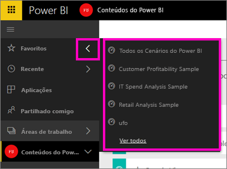
   
    Aqui, pode selecionar um dashboard para abri-lo.
3. Para abrir o painel **Favoritos**, na navegação esquerda, selecione **Favoritos** ou o ícone Favoritos .
   
   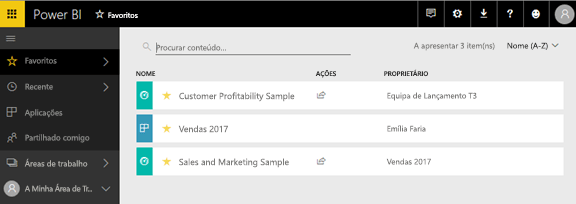
   
   Aqui, pode selecionar um dashboard para abri-lo, ver a quem pertence um dashboard, anular um dashboard como favorito ou partilhar um dashboard com colegas.
4. Outra forma de marcar um dashboard como favorito é a partir do separador **Dashboards**.  Basta abrir a área de trabalho que contém o dashboard e selecione o ícone de estrela à esquerda do nome do dashboard.
   
   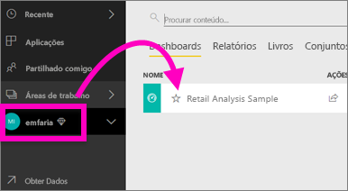

Para saber mais, veja [Adicionar um dashboard como favorito](service-dashboard-favorite.md)

### Recentes
Obtenha rapidamente aos relatórios e dashboards a que acedeu mais recentemente no painel **Recentes**. Isto inclui o conteúdo de todas as áreas de trabalho.

  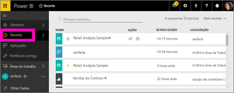

Semelhante aos Favoritos, pode aceder rapidamente aos itens recentes a partir de qualquer local no serviço Power BI ao selecionar a seta junto a **Recentes** na navegação esquerda.

  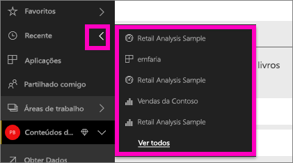

Para saber mais, veja [Recentes no Power BI](service-recent.md)

### Aplicações
Uma aplicação é uma coleção de dashboards e relatórios criados para proporcionar métricas importantes, tudo num único local. Pode ter aplicações internas para a sua organização e também [aplicações para serviços externos](service-connect-to-services.md), como o Google Analytics e o Microsoft Dynamics CRM. 

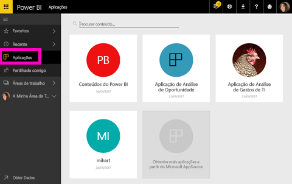

Para saber mais, veja **Áreas de trabalho de aplicação** (abaixo) e [O que são aplicações do Power BI](service-install-use-apps.md).

### Partilhado comigo
**Partilhado comigo** é a localização de todos os dashboards que colegas partilharam consigo.  Filtre por proprietário do dashboard, utilize o campo de pesquisa para localizar o que é relevante e ordene os itens por data.  Para conteúdo partilhado ao qual acede com frequência, é ainda mais fácil adicioná-lo como favorito a partir da vista **Partilhado comigo**.

Para saber mais, veja [Partilhado comigo](service-shared-with-me.md)

### Trabalhar com áreas de trabalho
A seguir na navegação esquerda está *Áreas de trabalho*. As áreas de trabalho podem ser consideradas *contentores* para o conteúdo do Power BI. Existem dois tipos de áreas de trabalho: **A Minha Área de Trabalho** e Áreas de trabalho de aplicação.

Se não for membro de uma área de trabalho de aplicação ou um administrador, poderá não ver as áreas de trabalho de aplicação na navegação esquerda. Se for um cliente do Power BI Free, não verá nenhuma área de trabalho de aplicação.

#### A minha área de trabalho
**A Minha Área de Trabalho** armazena todo o conteúdo de que é proprietário. Considere-a a sua sandbox pessoal ou uma área de trabalho para o seu próprio conteúdo. Pode partilhar conteúdo a partir de A Minha Área de Trabalho com colegas. Em A Minha Área de Trabalho, o conteúdo está organizado em 4 separadores: Dashboards, Relatórios, Livros e Conjuntos de Dados.

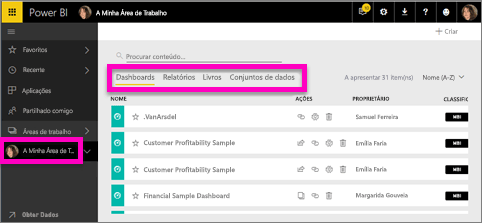

#### Áreas de trabalho de aplicações
As aplicações e as áreas de trabalho de aplicação são uma funcionalidade do Power BI Pro. Se criar dashboards e relatórios para outras pessoas, utilizará áreas de trabalho de aplicação para fazê-lo. Uma área de trabalho de aplicação é o local onde irá criar a aplicação, por isso, para criar uma aplicação, terá primeiro de criar a área de trabalho de aplicação. São a evolução das áreas de trabalho de grupo, áreas de teste e contentores para o conteúdo na aplicação.  Pode, tal como os seus colegas, colaborar em dashboards, relatórios e noutro conteúdo que queira distribuir a um vasto público ou mesmo a toda a organização.

Para saber mais, visite [Criar e distribuir uma aplicação no Power BI](service-create-distribute-apps.md#app-workspaces).

Tal como em **A Minha Área de Trabalho**, o conteúdo está organizado em 4 separadores: Dashboards, Relatórios, Livros e Conjuntos de Dados.

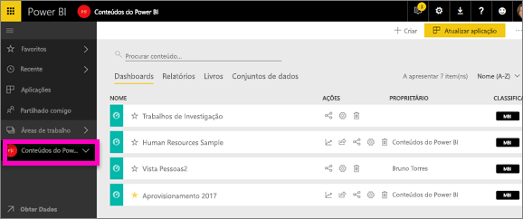

Alterne entre áreas de trabalho ao selecionar **Áreas de trabalho** na navegação esquerda.

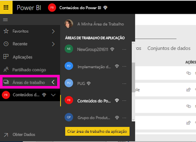

### Pesquisar e ordenar conteúdo
A nova vista de conteúdo torna mais fácil procurar, filtrar e ordenar o conteúdo. Para procurar um dashboard, relatório ou livro, escreva na área de pesquisa. O Power BI filtra apenas o conteúdo que tenha a cadeia de pesquisa como parte do nome.

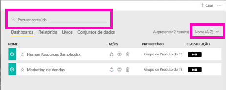

Também pode ordenar o conteúdo por nome ou proprietário.  

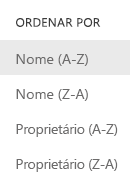

Para saber mais, veja [Navegação no Power BI: procurar, ordenar e filtrar](service-navigation-search-filter-sort.md)

## Passos seguintes
Tem perguntas ou comentários? [Visite o fórum da comunidade do Power BI](http://community.powerbi.com/t5/Navigation-Preview-Forum/bd-p/NavigationPreview)

