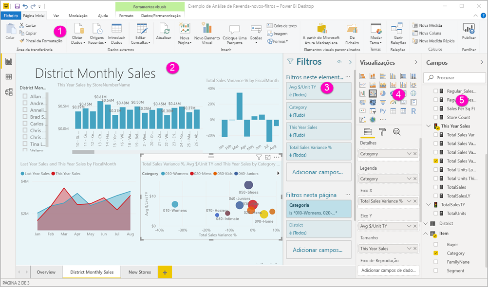
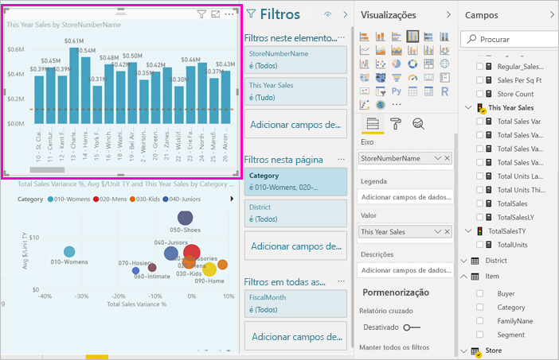
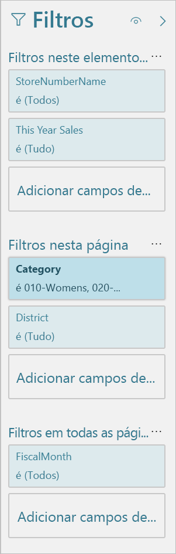
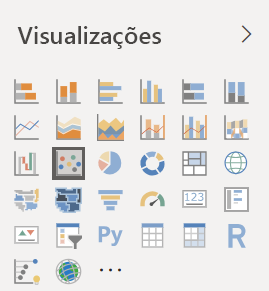
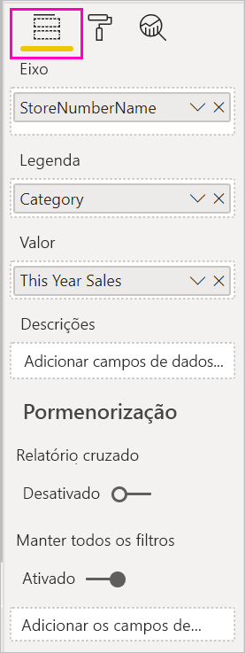
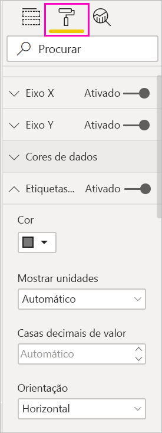
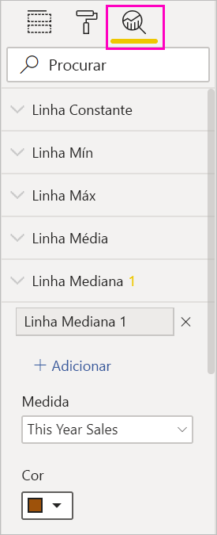
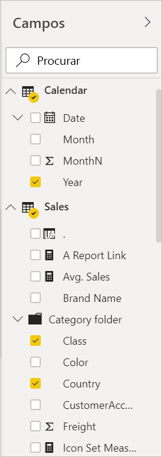

# Apresentação do editor de relatórios no Power BI

No Power BI Desktop e no serviço Power BI, o *editor de relatórios* é o local em que pode criar relatórios para os seus consumidores, com gráficos, tabelas, mapas e outros elementos visuais. É semelhante nos dois ambientes. Normalmente, começa a criar um relatório no Power BI Desktop. Em seguida, publica-o no serviço Power BI, onde pode continuar a modificá-lo. É também no serviço Power BI que cria os dashboards com base nos seus relatórios.

Depois de criar os seus dashboards e relatórios, distribui-os aos consumidores dos relatórios. Dependendo da forma como os partilha, os utilizadores finais podem interagir com os mesmos na Vista de Leitura no serviço Power BI, mas não podem editá-los. Leia mais sobre [o que os consumidores de relatórios podem fazer no serviço Power BI](consumer/end-user-reading-view.md). 

Este vídeo mostra o editor de relatórios no Power BI Desktop. Este artigo também mostra o editor de relatórios no Power BI Desktop. 

<iframe width="560" height="315" src="https://www.youtube.com/embed/IkJda4O7oGs" frameborder="0" allowfullscreen></iframe>

No serviço Power BI, o editor de relatórios está disponível apenas na Vista de Edição. Para abrir um relatório na Vista de Edição, tem de ser o respetivo proprietário ou criador, ou de ser um contribuidor da área de trabalho que aloja o mesmo.

O editor de relatórios do Power BI está dividido em várias secções principais:  

1. Barra de navegação superior
1. Tela de relatório
1. Painel Filtros
1. Painel Visualizações
1. Painel Campos

## 1. A barra de navegação superior
As ações disponíveis na barra de navegação superior são bastantes e estão sempre a ser adicionadas novas ações. Para obter informações sobre uma ação específica, utilize a caixa de pesquisa ou o índice da documentação do Power BI.

## 2. A tela de relatórios
A tela de relatórios é onde o seu trabalho é apresentado. Quando utiliza os painéis Campos, Filtros e Visualizações para criar visuais, estes são criados e apresentados na sua tela de relatórios. Cada separador na parte inferior da tela representa uma página no relatório. Selecione um separador para abrir essa página. 

## Os painéis do editor de relatórios

Quando abre um relatório pela primeira vez, são apresentados três painéis: Filtros, Visualizações e Campos. Os dois primeiros painéis no lado esquerdo, Filtros e Visualizações, controlam o aspeto das visualizações: tipo, cores, filtragem e formato. O último painel no lado direito, Campos, gere os dados subjacentes utilizados nas visualizações. O conteúdo exibido no editor de relatórios varia de acordo com as seleções feitas na tela de relatório. 

Por exemplo, quando seleciona um elemento visual individual, como este gráfico de colunas:

**O painel Filtros** apresenta todos os filtros no elemento visual, na página ou em todas as páginas. Neste caso, há filtros ao nível da página, mas não há filtros ao nível do elemento visual.

**A parte superior do painel Visualizações** identifica o tipo de elemento visual em utilização. Neste exemplo, este tipo é um Gráfico de colunas agrupadas. 

**A parte inferior do painel Visualizações** tem três separadores:

 O separador **Campos** apresenta os campos no elemento visual. Poderá ter de se deslocar para baixo para ver todos os detalhes. Este gráfico está a utilizar LojaNúmeroNome e Vendas Deste Ano.

 O separador **Formatar**: para apresentar o painel de formatação da visualização selecionada, selecione o ícone de rolo de pintura.

 O separador **Análise**: para apresentar o painel Análise, selecione o ícone de lupa.

**O painel Campos** lista todas as tabelas disponíveis no modelo de dados. Quando expandir uma tabela, verá os campos presentes na mesma. A marca de verificação amarela mostra que pelo menos um campo dessa tabela está numa visualização.

Continue a ler para obter detalhes sobre cada painel.

## 3. O painel Filtros
Utilize o painel Filtros para ver, definir e modificar os filtros persistentes dos relatórios ao nível da página, do relatório, da pormenorização e ao nível visual. Sim, pode efetuar uma filtragem ad-hoc nas páginas e nos elementos visuais dos relatórios ao selecionar os elementos visuais ou ao utilizar ferramentas, como as segmentações de dados. A filtragem no painel Filtros tem a vantagem de o estado dos filtros ser guardado com o relatório. 

O painel Filtros possui outra funcionalidade avançada: pode filtrar através de um campo *que já não está num dos elementos visuais do relatório*. Passo a explicar. Quando cria uma visualização, o Power BI adiciona automaticamente todos os campos da mesma à área de filtros ao nível do elemento visual no painel Filtros. Se quiser definir um filtro de elemento visual, de página, de pormenorização ou de relatório através de um campo que já não é utilizado na visualização, basta arrastar o campo para um dos registos do painel Filtros.

A nova experiência de filtros oferece mais flexibilidade. Por exemplo, pode formatar os filtros para que se pareçam com o relatório propriamente dito. Também pode bloquear filtros ou ocultá-los dos consumidores dos seus relatórios. 

Leia mais sobre [a nova experiência de filtros](power-bi-report-filter.md).

## 4. O painel Visualizações

O painel Visualizações tem quatro secções. Vamos começar pela parte superior do painel.

Este local é onde seleciona um tipo de visualização. Os ícones pequenos mostram os diferentes tipos de visualizações que pode criar. Na imagem acima, está selecionado o gráfico de bolhas. Se começar a criar uma visualização ao selecionar campos sem selecionar um tipo de visualização primeiro, o Power BI seleciona o tipo de visualização automaticamente. Pode manter a seleção do Power BI ou alterar o tipo ao selecionar um ícone diferente.

Pode transferir visualizações personalizadas para o Power BI Desktop. Os respetivos ícones também irão aparecer neste painel. 

### Gerir os campos numa visualização

Os registos (por vezes denominados *wells*) neste painel variam consoante o tipo de visualização que selecionou.  Por exemplo, se tiver selecionado um gráfico de barras, verá os registos Eixo, Legenda e Valores. Quando seleciona um campo ou o arrasta para a tela, o Power BI adiciona esse campo a um dos registos.  Também pode arrastar campos da lista Campos diretamente para os registos.  Alguns registos são limitados a determinados tipos de dados.  Por exemplo, **Valores** não aceita campos não numéricos. Por isso, se arrastar um campo **Categoria** para o registo **Valores**, o Power BI altera-o para **Contagem de Categoria**.

Para obter mais informações, veja [Adicionar visualizações a um relatório do Power BI](visuals/power-bi-report-add-visualizations-i.md).

Esta parte do painel também tem opções para controlar a [pormenorização](desktop-drillthrough.md) e o comportamento dos filtros.

### Formatar os elementos visuais
Selecione o ícone do rolo de pintura para apresentar o painel Formatar. As opções disponíveis dependem do tipo de visualização selecionada.

As possibilidades de formatação são muitas.  Para saber mais, explore de forma autónoma ou consulte estes artigos:

* [Personalizar o título, fundo e legenda da visualização](visuals/power-bi-visualization-customize-title-background-and-legend.md)
* [Formatação de cor](visuals/service-getting-started-with-color-formatting-and-axis-properties.md)
* [Personalizar as propriedades dos eixos X e Y](visuals/power-bi-visualization-customize-x-axis-and-y-axis.md)

### Adicionar análises às suas visualizações
Selecione o ícone da lupa para mostrar o painel Análise. As opções disponíveis dependem do tipo de visualização selecionada.

Com o painel Análise no serviço Power BI, pode adicionar linhas de referência dinâmicas a visualizações e dar foco a tendências ou informações importantes. Para saber mais, veja [Painel Análise no Power BI Desktop](desktop-analytics-pane.md).

## 5. O painel Campos
O painel Campos mostra as tabelas, as pastas e os campos nos seus dados que estão disponíveis para que utilize e crie visualizações.

|  |  |
| --- | --- |
|  |<ul><li>Arraste um campo para a página para iniciar uma nova visualização.  Também pode arrastar um campo para uma visualização existente para adicionar o campo a essa visualização.  </li> <li>Quando adicionar uma marca de verificação junto a um campo, o Power BI adiciona esse campo à visualização ativa (ou nova). Também decide em que registo colocar esse campo.  Por exemplo, o campo deve ser utilizado como legenda, eixo ou valor? O Power BI faz uma suposição e, se for necessário, pode movê-lo desse registo para outro.   </li><li>De qualquer das formas, cada campo selecionado é adicionado ao painel Visualizações no editor de relatórios.</li></ul> |

No Power BI Desktop, também terá opções para mostrar/ocultar campos, adicionar cálculos, etc.

## Os ícones de campos

O Power BI utiliza vários ícones diferentes para indicar os tipos de campos num relatório. Quando conseguir reconhecê-los, irá compreender melhor a forma como estes atuam sobre diferentes elementos visuais. Eis alguns dos mais comuns.

|Ícone  |Significado  |
|---------|---------|
|  | Pasta na lista Campos |
| | Campo numérico: os campos numéricos são agregações cuja soma ou média pode ser calculada, por exemplo. As agregações são importadas com os dados e definidas no modelo de dados no qual se baseia o seu relatório. Para obter mais informações, consulte [Agregados em relatórios do Power BI](service-aggregates.md). |
| | Coluna calculada com um tipo de dados não numérico: uma nova coluna não numérica que cria com uma fórmula Data Analysis Expressions (DAX) que define os valores da coluna. Saiba mais sobre as [colunas calculadas](desktop-calculated-columns.md). |
|     |   Coluna calculada numérica: uma nova coluna que cria com uma fórmula Data Analysis Expressions (DAX) que define os valores da coluna. Saiba mais sobre as [colunas calculadas](desktop-calculated-columns.md). |
| |  Medida: uma medida tem a sua própria fórmula codificada. Não é possível alterar o cálculo; por exemplo, se for uma soma, só poderá ser uma soma. Os valores não são armazenados numa coluna. São calculados dinamicamente, dependendo apenas da sua localização num elemento visual. Para obter mais informações, leia a secção [Noções básicas sobre medidas](desktop-measures.md). |
|     | Grupo de medidas  |
| |      KPI: uma indicação visual que comunica a quantidade de progresso feito em relação a um objetivo mensurável. Saiba mais sobre os elementos visuais do [Indicador Chave de Desempenho (KPI)](visuals/power-bi-visualization-kpi.md). |
|     |  Hierarquia de campos: selecione a seta para ver os campos que constituem a hierarquia.  Veja este vídeo do Power BI no YouTube, intitulado [Creating and working with hierarchies](https://www.youtube.com/watch?v=q8WDUAiTGeU) (Criar e trabalhar com hierarquias), para obter mais informações. |
|     | Dados de áreas geográficas: estes campos de localização podem ser utilizados para criar visualizações de mapas. |
|      | Campo de identidade: os campos com este ícone são *campos exclusivos*, definidos para mostrar todos os valores, mesmo se tiverem duplicados. Por exemplo, os seus dados podem ter registos para duas pessoas diferentes chamadas Guilherme Sarmento e cada um dos registos será tratado como exclusivo. Os registos não serão somados.   |
|   | Parâmetro: defina parâmetros para fazer com que várias partes dos seus relatórios e modelos de dados (como um filtro de consulta, uma referência de origem de dados, uma definição de medida, etc.) dependam de um ou mais valores de parâmetros. Veja esta mensagem de blogue do Power BI sobre [parâmetros de consultas](https://powerbi.microsoft.com/blog/deep-dive-into-query-parameters-and-power-bi-templates/) para obter mais informações. |
|  | Campo de data do calendário com uma tabela de datas incorporada |

## Próximos passos
[Criar um relatório](service-report-create-new.md)

Mais informações sobre relatórios no [serviço Power BI](service-report-create-new.md), no [Power BI Desktop](desktop-report-view.md) e nas [aplicações móveis do Power BI](consumer/mobile/mobile-apps-view-phone-report.md).

[Conceitos básicos para designers do Power BI](service-basic-concepts.md)

Mais perguntas? [Pergunte à Comunidade do Power BI](http://community.powerbi.com/)

