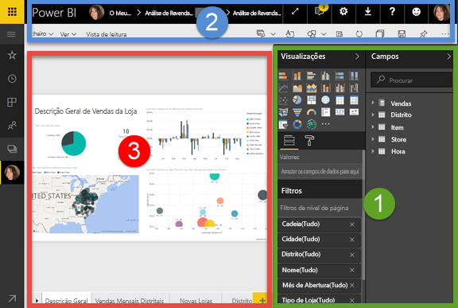
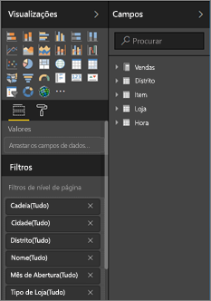
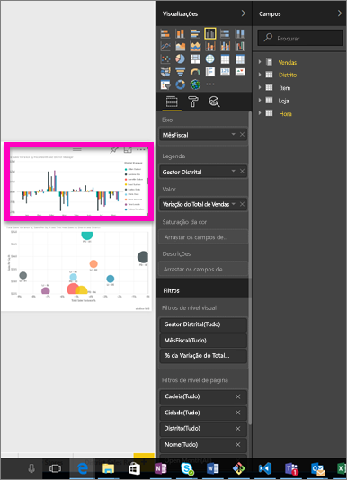
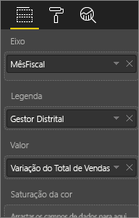
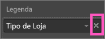
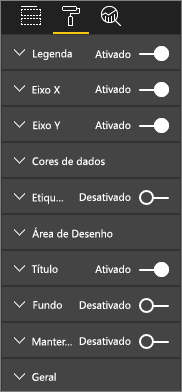
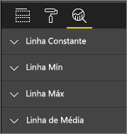
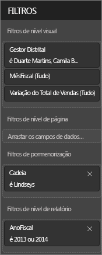
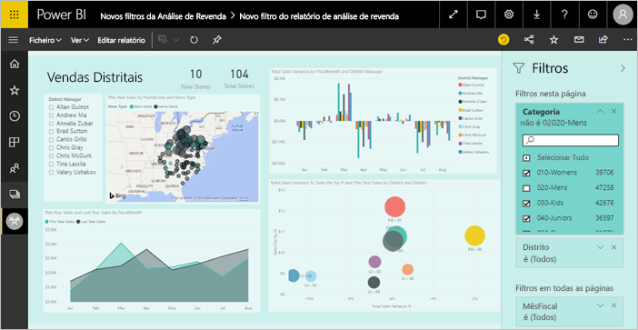
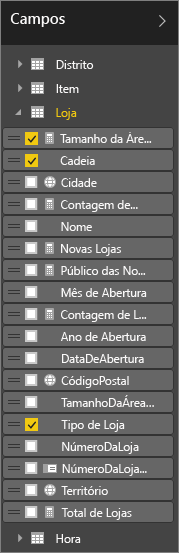

# Apresentação do editor de relatórios no Power BI

O *editor de relatórios* no serviço Power BI e o editor de relatórios no Power BI Desktop são semelhantes. Normalmente, começa por criar relatórios no Power BI Desktop. Em seguida, publica-os no serviço Power BI, onde pode continuar a modificá-los. É também no serviço Power BI que cria os dashboards com base nos seus relatórios.

Depois de criar os seus dashboards e relatórios, distribui-os aos consumidores dos relatórios. Dependendo da forma como os partilha, os utilizadores finais poderão interagir com os mesmos na Vista de leitura no serviço Power BI, mas não podem editá-los. Leia mais sobre [o que os consumidores de relatórios podem fazer no serviço Power BI](consumer/end-user-reading-view.md). 

Este vídeo mostra o editor de relatórios no Power BI Desktop. Este artigo mostra o editor de relatórios no serviço Power BI. 

<iframe width="560" height="315" src="https://www.youtube.com/embed/IkJda4O7oGs" frameborder="0" allowfullscreen></iframe>

No serviço Power BI, o editor de relatórios está disponível apenas na Vista de Edição. Para abrir um relatório na Vista de Edição, tem de ser o respetivo proprietário ou criador, ou ser um contribuidor da área de trabalho da aplicação que aloja o mesmo.

O editor de relatórios do Power BI tem três secções:  

1. Filtros **Campos**, **Visualizações** e **Filtros**
2. barras de navegação superiores    
3. tela de relatórios     

## 1. Os painéis do editor de relatórios

Quando abre um relatório pela primeira vez, são apresentados três painéis: Visualizações, Filtros e Campos. Os painéis no lado esquerdo, Visualizações e Filtros, controlam a aparência das visualizações: tipo, cores, filtragem, formato.  E o painel no lado direito, Campos, gere os dados subjacentes utilizados nas visualizações. 

O conteúdo exibido no editor de relatórios varia de acordo com as seleções feitas na tela de relatório.  Por exemplo, quando seleciona um elemento visual individual:

|  |  |
| --- | --- |
|  |<ul><li>a parte superior do painel Visualização identifica o tipo de visual em utilização: neste exemplo, um gráfico de colunas em Cluster.  </li> <li>A parte inferior do painel Visualização (poderá ter de deslocar-se para baixo) mostra os campos utilizados no visual. Este gráfico utiliza a variância de FiscalMonth, DistrictManager e Vendas Totais.   </li><li>O painel Filtros (poderá ter de deslocar-se para baixo) mostra os filtros que foram aplicados.   </li><li>O painel Campos mostra as tabelas disponíveis e, se expandir o nome de uma tabela, os campos que constituem essa tabela. O tipo de letra amarelo mostra que pelo menos um campo dessa tabela está a ser utilizado na visualização.  </li><li> Para mostrar o painel de formatação, para a visualização selecionada, selecione o ícone do rolo de pintura.  </li><li> Para apresentar o painel Análise, selecione o ícone de lupa.</ul> |

## O painel Visualizações

Este local é onde seleciona um tipo de visualização. As imagens pequenas chamam-se *modelos*. Na imagem acima, o Gráfico de barras agrupadas está selecionado. Se não selecionar primeiro um tipo de visualização, mas começar a criar uma visualização ao selecionar campos, o Power BI irá selecionar o tipo de visualização. Pode manter a seleção do Power BI ou alterar o tipo ao selecionar um modelo diferente. Pode mudar as vezes que precisar até encontrar o tipo de visualização que melhor representa os seus dados.

### Gerir os campos no seu elemento visual

Os registos (por vezes denominados *wells*) mostrados neste painel variam consoante o tipo de visualização que selecionou.  Por exemplo, se tiver selecionado um gráfico de barras, verá registos para: Valores, Eixo e Legenda. Quando seleciona um campo, ou o arrasta para a tela, o Power BI adiciona esse campo a um dos registos.  Também pode arrastar campos da lista Campos diretamente para os registos.  Alguns registos são limitados a determinados tipos de dados.  Por exemplo, **Valores** não aceita campos não numéricos. Por isso, se arrastar um campo **employeename** para o registo **Valores**, o Power BI altera-o para **contagem de employeename**.

### Remover um campo
Para remover um campo da visualização, selecione o **X** à direita do nome do campo.

Para obter mais informações, consulte [Adicionar visualizações a um relatório do Power BI](visuals/power-bi-report-add-visualizations-i.md)

### Formatar os elementos visuais
Selecione o ícone do rolo de pintura para apresentar o painel Formatar. As opções disponíveis dependem do tipo de visualização selecionada.

As possibilidades de formatação são praticamente infinitas.  Para saber mais, explore de forma autónoma ou consulte estes artigos:

* [Personalizar o título, fundo e legenda da visualização](visuals/power-bi-visualization-customize-title-background-and-legend.md)
* [Formatação de cor](visuals/service-getting-started-with-color-formatting-and-axis-properties.md)
* [Personalizar as propriedades dos eixos X e Y](visuals/power-bi-visualization-customize-x-axis-and-y-axis.md)

### Adicionar análises às suas visualizações
Selecione o ícone da lupa para mostrar o painel Análise. As opções disponíveis dependem do tipo de visualização selecionada.

    
Com o painel Análise no serviço Power BI, pode adicionar linhas de referência dinâmicas a visualizações e dar foco a tendências ou informações importantes. Para saber mais, veja o [painel Análise no serviço Power BI](service-analytics-pane.md) ou o [painel Análise no Power BI Desktop](desktop-analytics-pane.md).

- - -
## O painel Filtros
Utilize o painel Filtros para ver, definir e modificar os filtros persistentes dos relatórios ao nível da página, do relatório, da pormenorização e ao nível visual. Sim, pode efetuar uma filtragem ad-hoc nas páginas e nos elementos visuais do relatório ao selecionar os elementos visuais ou ao utilizar as ferramentas como segmentações de dados. Porém, ao utilizar o painel Filtros, o estado dos filtros é guardado com o relatório. 

O painel Filtros possui uma outra funcionalidade poderosa: a capacidade de filtrar através de um campo ***que já não está a ser utilizado num dos elementos visuais do relatório***. Passo a explicar. Quando cria uma página de relatório, o Power BI adiciona automaticamente todos os campos que utiliza nas visualizações à área de filtros do Nível visual do painel Filtros.  No entanto, se pretender definir um filtro visual, de página, de pormenorização ou de relatório através de um campo que já não é utilizado numa visualização, basta arrastar o campo para um dos grupos Filtros.   

Para obter mais informações, consulte [Adicionar um filtro a um relatório](power-bi-report-add-filter.md).

Uma nova experiência de filtros está atualmente em pré-visualização. Nos novos filtros, pode formatá-los para que se pareçam com o relatório propriamente dito. Também pode bloquear filtros ou ocultá-los dos consumidores dos seus relatórios. 

Leia mais sobre [a nova experiência de filtros](power-bi-report-filter-preview.md).

- - -
## O painel Campos
O painel Campos mostra as tabelas e os campos que existem nos seus dados e estão disponíveis para que utilize e crie visualizações.

|  |  |
| --- | --- |
|  |<ul><li>Arraste um campo para a página para iniciar uma nova visualização.  Também pode arrastar um campo para uma visualização existente para adicionar o campo a essa visualização.  </li> <li>Quando adicionar uma marca de verificação junto a um campo, o Power BI adiciona esse campo à visualização ativa (ou nova). Também decide em que registo colocar esse campo.  Por exemplo, o campo deve ser utilizado como legenda, eixo ou valor? O Power BI faz uma suposição e, se for necessário, pode movê-lo desse registo para outro.   </li><li>De qualquer das formas, cada campo selecionado é adicionado ao painel Visualizações no editor de relatórios.</li></ul> |

**NOTA**: se estiver a utilizar o Power BI Desktop, também terá opções para mostrar/ocultar campos, adicionar cálculos, etc.

### O que significam os ícones de campo?
**Agregados ∑** Um agregado é um valor numérico cuja soma ou média, por exemplo, será calculada. Os agregados são importados com os dados (definidos no modelo de dados no qual se baseia o seu relatório).
Para obter mais informações, consulte [Agregados em relatórios do Power BI](service-aggregates.md).

 **Medidas calculadas (também denominadas campos calculados)**  
Cada campo calculado tem a sua própria fórmula calculada. Não é possível alterar o cálculo; por exemplo, se for uma soma, só poderá ser uma soma. Para obter mais informações, consulte [Noções básicas sobre medidas](desktop-measures.md)

 **Campos exclusivos**  
Os campos com este ícone foram importados do Excel e estão definidos para mostrar todos os valores, mesmo se tiverem duplicados. Por exemplo, os seus dados podem ter dois registos para pessoas chamadas "Guilherme Sarmento" e cada um deles será tratado como exclusivo – estes não serão somados.  

** Campos geográficos**  
Os campos de localização podem ser utilizados para criar visualizações de mapas. 

** Hierarquia**  
Selecione a seta para mostrar os campos que constituem a hierarquia. 

## 2. A barra de navegação superior
As ações disponíveis na barra de navegação superior são bastantes, e estão sempre a ser adicionadas novas ações. Para obter informações sobre uma ação específica, utilize a Caixa de pesquisa ou o Índice da Documentação do Power BI.

## 3. A tela de relatórios
A tela de relatórios é onde o seu trabalho é apresentado. Quando utiliza os painéis Campos, Filtros e Visualizações para criar visuais, estes são criados e apresentados na sua tela de relatórios. Cada separador na parte inferior da tela representa uma página no relatório. Selecione um separador para abrir essa página. 

## Próximos passos
[Criar um relatório](service-report-create-new.md)

Mais informações sobre relatórios no [serviço Power BI](service-report-create-new.md), no [Power BI Desktop](desktop-report-view.md) e nas [aplicações móveis do Power BI](consumer/mobile/mobile-apps-view-phone-report.md).

[Conceitos básicos para designers do Power BI](service-basic-concepts.md)

Mais perguntas? [Pergunte à Comunidade do Power BI](http://community.powerbi.com/)

