# Tutorial: Invocar um modelo do Machine Learning Studio (clássico) no Power BI (Pré-visualização)

Neste tutorial, abordamos a experiência de incorporar as informações de um modelo do **Azure Machine Learning Studio (clássico)** no Power BI. Este tutorial inclui orientações para conceder o acesso de um utilizador do Power BI a um modelo do Azure ML, criando um fluxo de dados e aplicando as informações do modelo do Azure ML ao seu fluxo de dados. Também faz referência ao guia de introdução para criar um modelo do Azure ML caso ainda não tenha um modelo.

O tutorial guia-o ao longo dos seguintes passos:

> [!div class="checklist"]
> * Criar e publicar um modelo do Azure Machine Learning
> * Conceder acesso a um utilizador do Power BI para utilizar o modelo
> * Criar um fluxo de dados
> * Aplicar informações do modelo do Azure ML ao fluxo de dados

## Criar e publicar um modelo do Azure ML

Siga as instruções apresentadas em [Walkthrough Step 1: Create a Machine Learning Studio (classic) workspace](https://docs.microsoft.com/azure/machine-learning/studio/walkthrough-1-create-ml-workspace) (Passo 1 das instruções: Criar uma área de trabalho do Machine Learning Studio [clássico]) para criar uma área de trabalho do **Machine Learning**.

Pode utilizar estes passos com qualquer conjunto de dados ou modelo do Azure ML existente. Se não tiver um modelo publicado, pode criar um modelo numa questão de minutos ao consultar [Criar a sua primeira experimentação de ciência de dados no Azure Machine Learning Studio (clássico)](https://docs.microsoft.com/azure/machine-learning/studio/create-experiment), que configura um modelo do Azure ML de Predição de Preço de Automóvel.

Siga os passos apresentados em [Implementar um serviço Web do Azure Machine Learning Studio (clássico)](https://docs.microsoft.com/azure/machine-learning/studio/tutorial-part3-credit-risk-deploy) para publicar o modelo do Azure ML como um serviço Web.

## Conceder acesso a um utilizador do Power BI

Para aceder a um modelo do Azure ML a partir do Power BI, tem de ter acesso de **Leitura** à subscrição do Azure e ao grupo de recursos, bem como acesso de **Leitura** ao serviço Web do Azure Machine Learning Studio (clássico) para modelos do Machine Learning Studio (clássico).  Para o modelo do Azure Machine Learning, precisa de acesso de **Leitura** à área de trabalho do Machine Learning.

Os passos seguintes partem do princípio de que é o coadministrador da subscrição do Azure e do grupo de recursos para os quais o modelo foi publicado.

Inicie sessão no [portal do Azure](https://portal.azure.com) e navegue para a página **Subscrições**, que pode encontrar com a lista **Todos os Serviços** no painel de navegação.

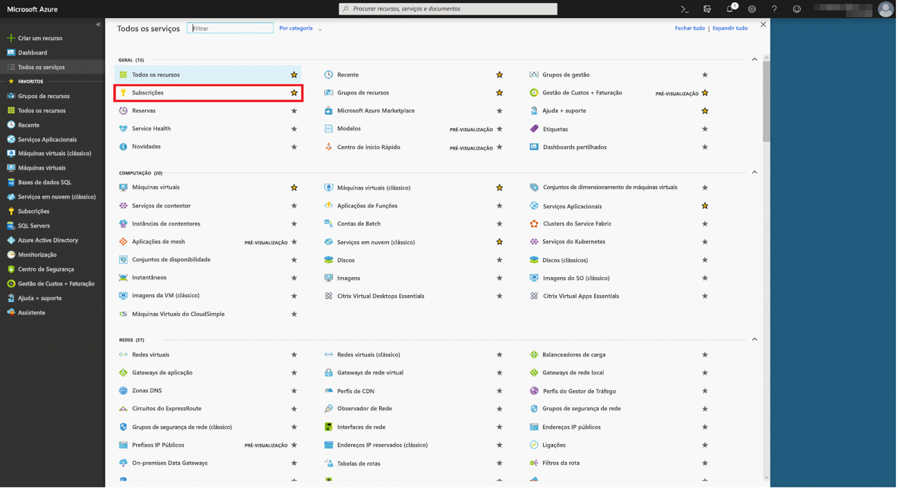

Selecione a subscrição do Azure que utilizou para publicar o modelo e selecione **Controlo de Acesso (IAM)** . Em seguida, selecione **Adicionar atribuição de função**, depois selecione a função **Leitor** e, por último, selecione o utilizador do Power BI. Selecione **Guardar** quando terminar. A imagem seguinte mostra as seleções indicadas.

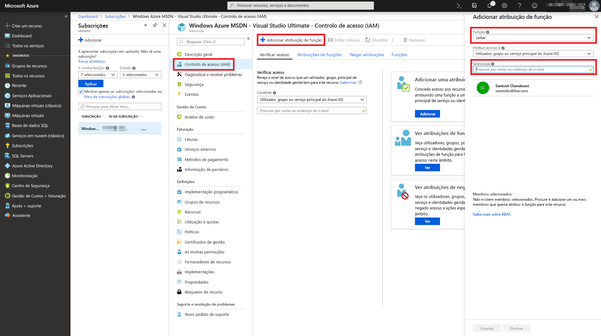

Em seguida, repita os passos acima para conceder à função **Contribuidor** o acesso necessário ao utilizador do Power BI para o serviço Web Machine Learning específico no qual o modelo do Azure ML foi implementado.

## Criar um fluxo de dados

### Obter dados para a criação do fluxo de dados

Inicie sessão no serviço Power BI com as credenciais do utilizador ao qual concedeu acesso ao modelo do Azure ML no passo anterior.

Este passo parte do princípio de que tem os dados que quer classificar com o modelo do Azure ML em formato CSV.  Se tiver utilizado a **Experimentação Preço de Automóvel** para criar o modelo no Machine Learning Studio (clássico), o conjunto de dados está partilhado na seguinte ligação:

* [Modelo de exemplo do Azure Learning Studio (clássico)](https://github.com/santoshc1/PowerBI-AI-samples/blob/master/Tutorial_MLStudio_model_integration/Automobile%20price%20data%20_Raw_.csv)

### Criar um fluxo de dados

Para criar as entidades no seu fluxo de dados, inicie sessão no serviço Power BI e navegue para uma área de trabalho na sua capacidade dedicada que tenha a pré-visualização de IA ativada.

Se ainda não tem uma área de trabalho, pode criar uma ao selecionar **Áreas de trabalho** no menu à esquerda e, em seguida, **Criar área de trabalho** no painel da parte inferior.  Esta ação abre um painel para introduzir os detalhes da área de trabalho. Introduza um nome de área de trabalho e, em seguida, selecione **Guardar**.

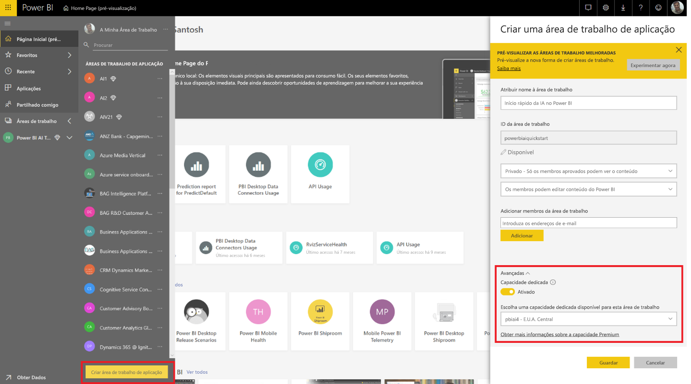

Depois de criar a área de trabalho, pode selecionar **Ignorar** na parte inferior direita do ecrã de Boas-vindas.

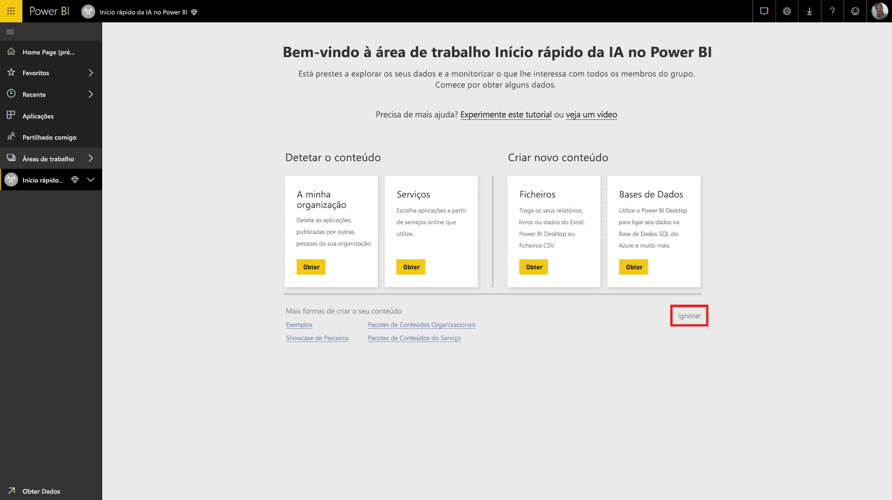

Selecione o separador **Fluxos de dados (pré-visualização)**  e, em seguida, selecione o botão **Criar** na parte superior direita da área de trabalho e selecione **Fluxo de dados**.

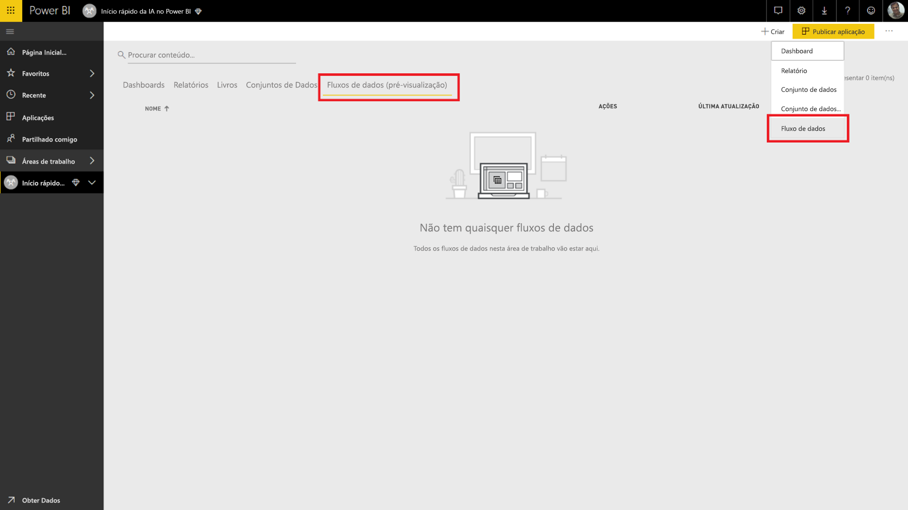

Selecione a opção **Adicionar novas entidades**, o que inicia o **Editor do Power Query** no browser.

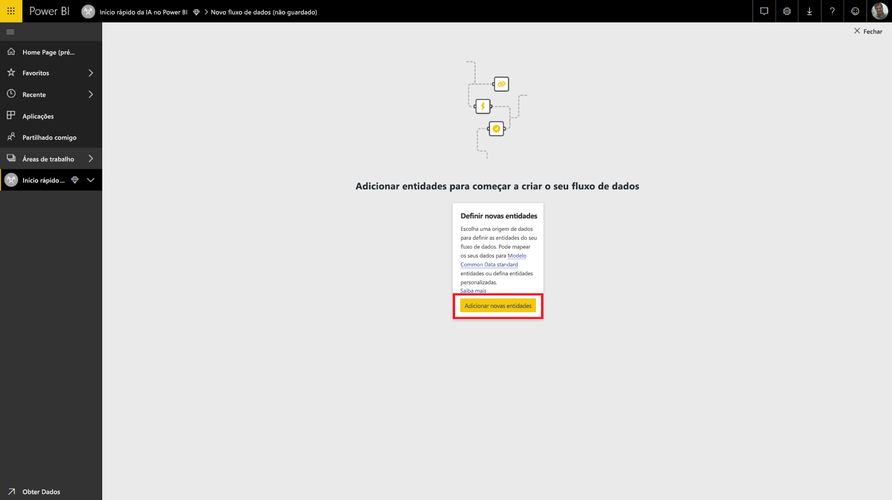

Selecione **Ficheiro de Texto/CSV** como origem de dados.

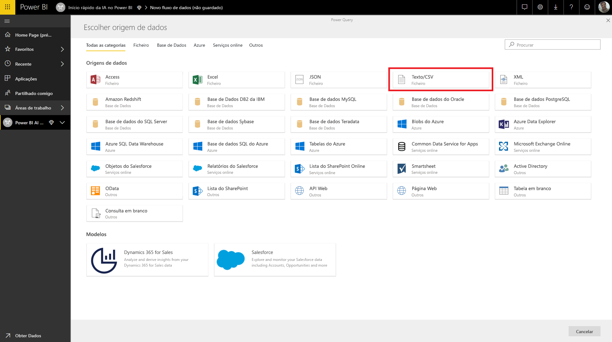

No ecrã seguinte, é-lhe pedido para ligar a uma origem de dados. Cole a ligação para os dados que utilizou para criar o seu modelo do Azure ML. Se utilizou os dados de _Preço de Automóvel_, pode colar a seguinte ligação na caixa **Caminho de ficheiro ou URL** e depois selecione **Seguinte**.

`https://raw.githubusercontent.com/MicrosoftLearning/Principles-of-Machine-Learning-Python/master/Module7/Automobile%20price%20data%20_Raw_.csv`

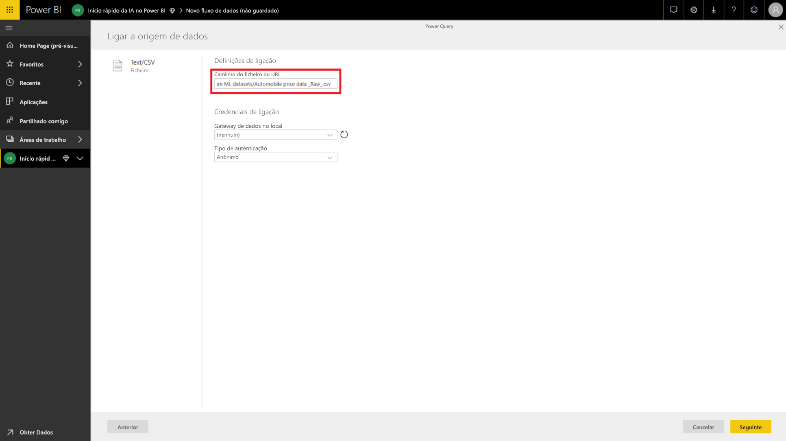

O Editor do Power Query mostra uma pré-visualização dos dados do ficheiro CSV. Selecione **Transformar Tabela** no friso de comandos e, em seguida, selecione **Utilizar primeira linha como cabeçalhos**.  Esta ação adiciona o passo de consulta _Cabeçalhos promovidos_ ao painel **Passos aplicados** à direita. Também pode mudar o nome da consulta para um nome mais reconhecível, como _Preço de Automóvel_, através do painel à direita.

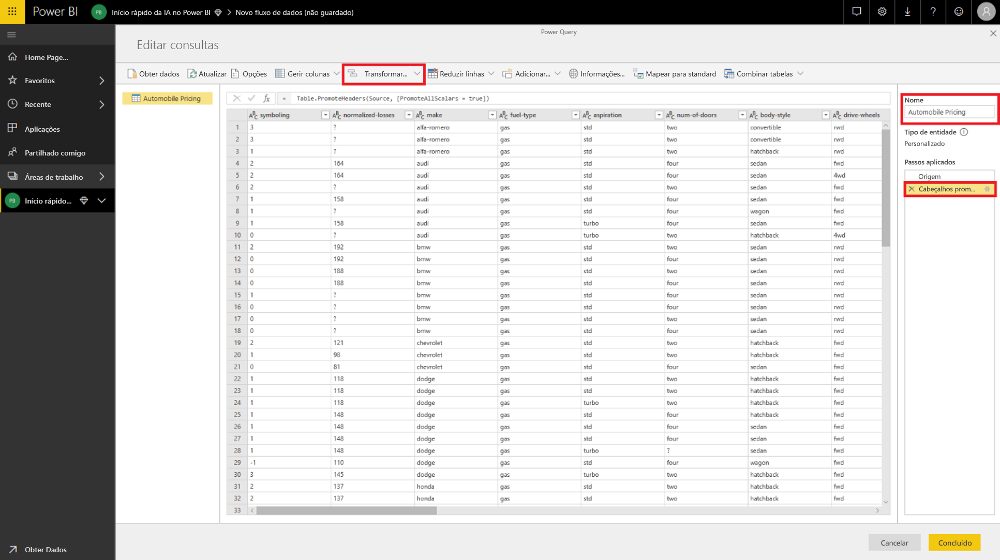

O conjunto de dados de origem tem valores desconhecidos definidos como "?".  Para limpar estes valores, pode substituir "?" por "0" para evitar erros mais tarde, por motivos de simplicidade.  Para tal, selecione as colunas *perdas normalizadas*, *cilindro*, *tempo*, *taxa de compressão*, *potência* , *rpm máximo* e *preço* ao clicar nos respetivos nomes nos cabeçalhos das colunas. Em seguida, clique em "Transformar colunas" e selecione "Substituir valores".  Substitua "?" por "0".

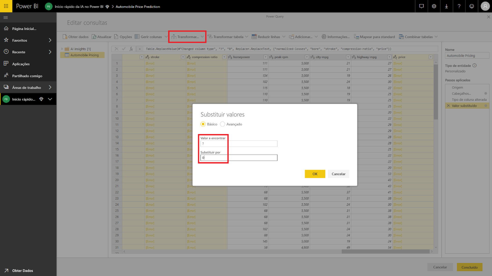

Todas as colunas na tabela de uma origem de Texto/CSV são processadas como colunas de texto.  Em seguida, é necessário alterar as colunas numéricas para os respetivos tipos de dados corretos.  Pode fazê-lo no Power Query, ao clicar no símbolo de tipo de dados no cabeçalho da coluna.  Altere as colunas para os tipos indicados abaixo:

- **Número inteiro**: simbologia, perdas normalizadas, peso sem carga, tamanho do motor, potência, rpm máximo, km/l em cidade, km/l em autoestrada, preço
- **Número decimal**: distância entre os eixos, comprimento, largura, altura, cilindro, tempo, taxa de compressão

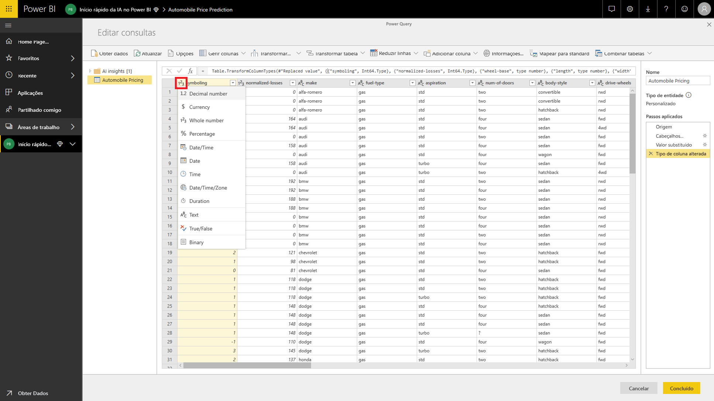

Selecione **Concluído** para fechar o Editor do Power Query. Esta ação irá mostrar a lista de entidades com os dados de _Preço de Automóvel_ adicionados. Selecione **Guardar** no canto superior direito, forneça um nome para o fluxo de dados e, em seguida, selecione **Guardar**.

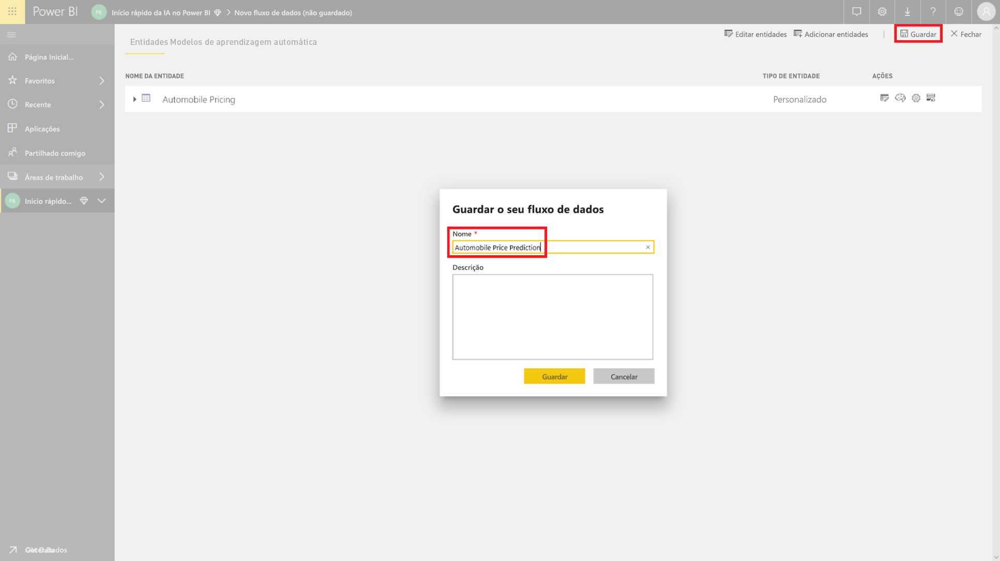

### Atualizar o fluxo de dados

Ao guardar o fluxo de dados, é apresentada uma notificação de que o fluxo de dados foi guardado. Selecione **Atualizar agora** para ingerir dados da origem para o fluxo de dados.

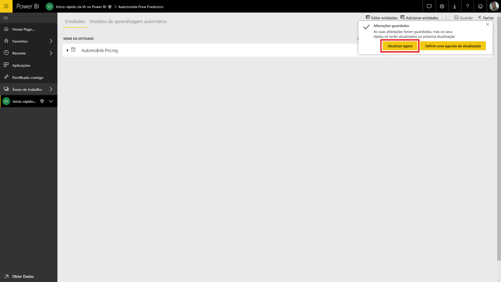

Selecione **Fechar** no canto superior direito e aguarde pela conclusão da atualização do fluxo de dados.

Também pode atualizar o fluxo de dados com os comandos de **Ações**. O fluxo de dados mostra o carimbo de data/hora quando a atualização estiver concluída.

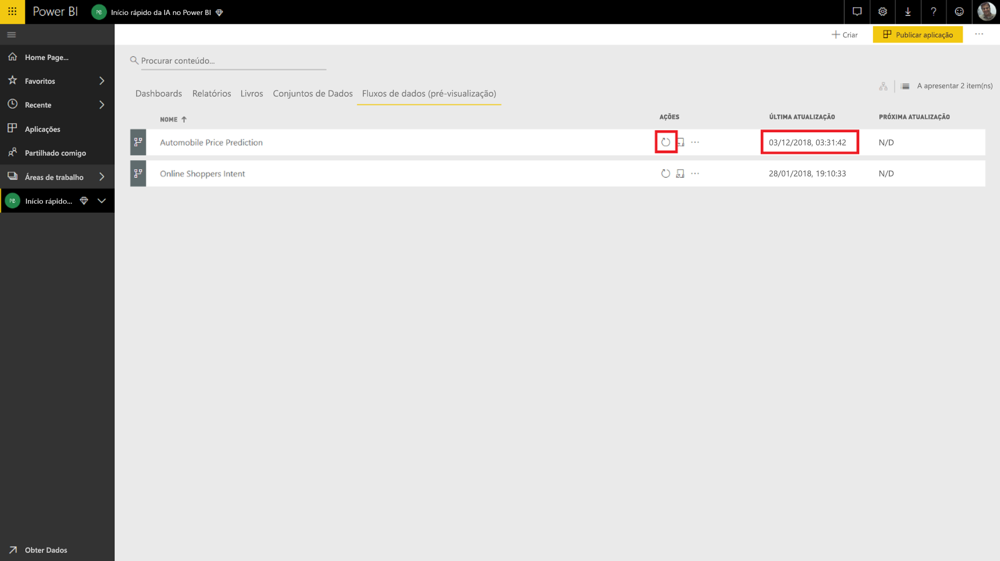

## Aplicar informações do modelo do Azure ML

Para aceder ao modelo do Azure ML de _Predição de Preço de Automóvel_, pode editar a entidade _Preço de Automóvel_ à qual queremos adicionar o preço previsto.

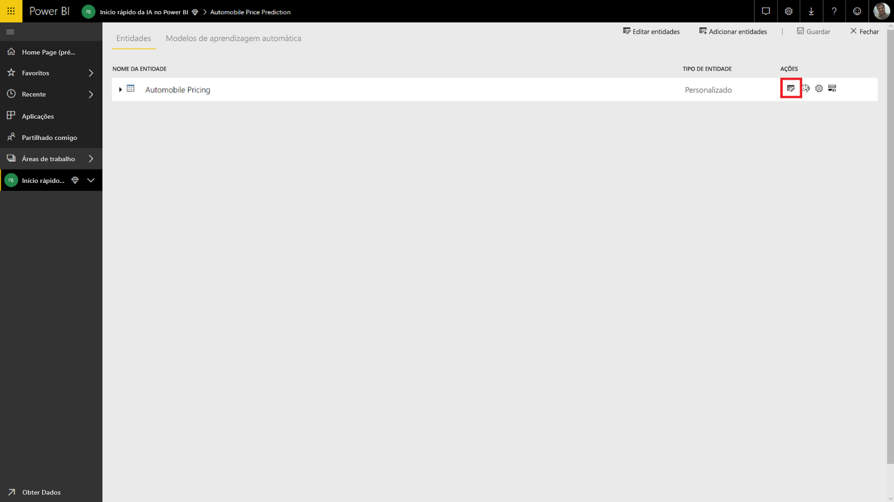

Se selecionar o ícone **Editar**, abre o Editor do Power Query para as entidades no seu fluxo de dados.

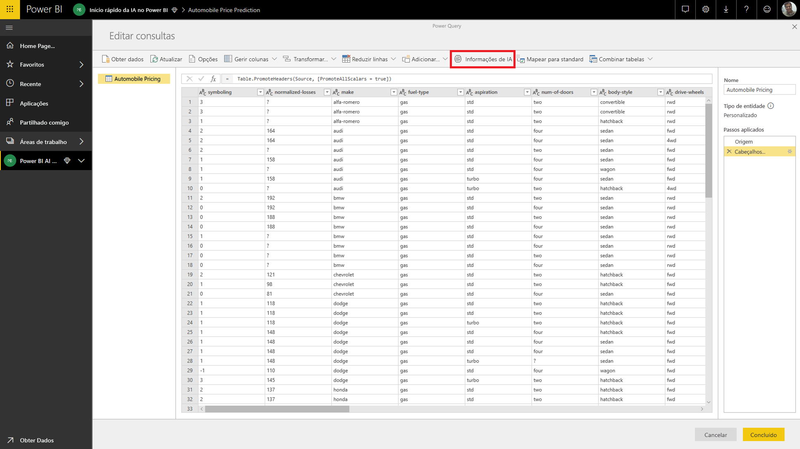

Selecione o botão **Informações de IA** no friso e, em seguida, selecione a pasta _Modelos do Azure Machine Learning_ no menu do painel de navegação.

Os modelos do Azure ML aos quais lhe foi concedido acesso estão indicados como funções do Power Query com um prefixo *AzureML*.  Quando clica na função correspondente ao modelo _AutomobilePricePrediction_ (Predição de Preço de Automóvel), os parâmetros do serviço Web do modelo são indicados como parâmetros de função.

Para invocar um modelo do Azure ML, pode especificar qualquer uma das colunas da entidade selecionada como uma entrada da lista pendente. Também pode especificar um valor constante a utilizar como entrada, ao mudar o ícone de coluna para a esquerda da caixa de diálogo de entrada. Quando um nome de coluna corresponde a um dos nomes de parâmetro de função, a coluna é sugerida automaticamente como uma entrada.  Se o nome de coluna não corresponder, pode selecioná-lo na lista pendente.

No caso do modelo de _Predição de Preço de Automóvel_, os parâmetros de entrada são:

- modelo
- estilo de carroçaria
- distância entre os eixos
- tamanho do motor
- potência
- rpm máximo
- km/l em autoestrada

No nosso caso, uma vez que a tabela corresponde ao conjunto de dados original utilizado para preparar o modelo, todos os parâmetros têm as colunas corretas já selecionadas.

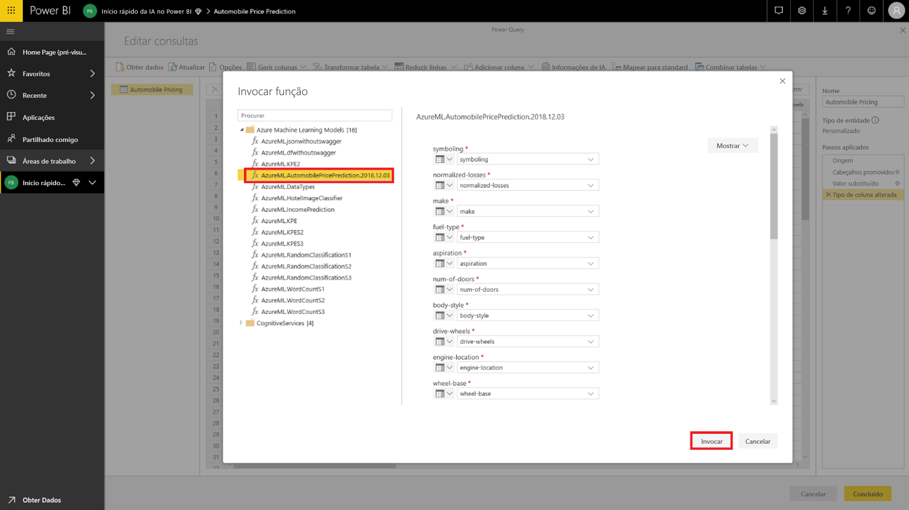

Selecione **Invocar** para ver a pré-visualização da saída do modelo do Azure ML como uma nova coluna na tabela de entidades. Também irá ver a invocação do modelo como um passo aplicado da consulta.

A saída do modelo é mostrada como um registo na coluna de saída. Pode expandir a coluna para produzir parâmetros de saída individuais em colunas separadas. No nosso caso, só estamos interessados nas _Etiquetas Classificadas_ que contêm o preço previsto do automóvel.  Assim sendo, desmarcamos o restante e selecionamos **OK**.

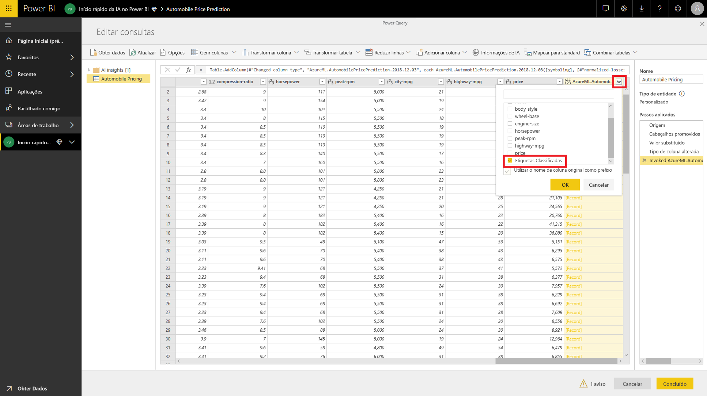

A coluna *Etiquetas Classificadas* resultante contém a predição de preço do modelo do Azure ML.

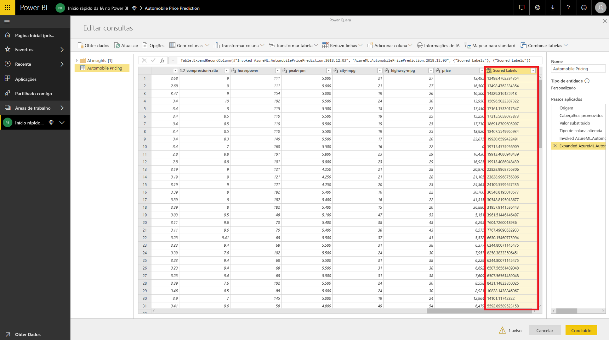

Depois de guardar o fluxo de dados, o modelo do Azure ML será invocado automaticamente quando o fluxo de dados for atualizado em linhas novas ou atualizadas na tabela de entidades.

## Limpar recursos

Se já não precisar dos recursos do Azure que criou com este artigo, elimine-os para evitar incorrer em quaisquer custos.  Também pode eliminar os fluxos de dados que criou, caso já não precise deles.

## Próximos passos

Neste tutorial, criou uma experimentação simples com o Azure Machine Learning Studio (clássico) com base num conjunto de dados simples através destes passos:

- Criar e publicar um modelo do Azure Machine Learning
- Conceder acesso a um utilizador do Power BI para utilizar o modelo
- Criar um fluxo de dados
- Aplicar informações do modelo do Azure ML ao fluxo de dados

Para obter mais informações sobre a integração do Azure Machine Learning no Power BI, veja [Integração do Azure Machine Learning no Power BI (Pré-visualização)](service-machine-learning-integration.md).
