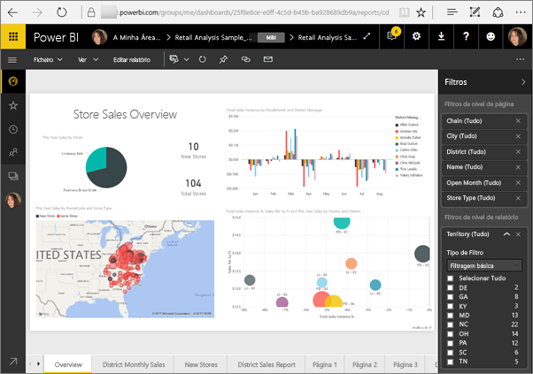
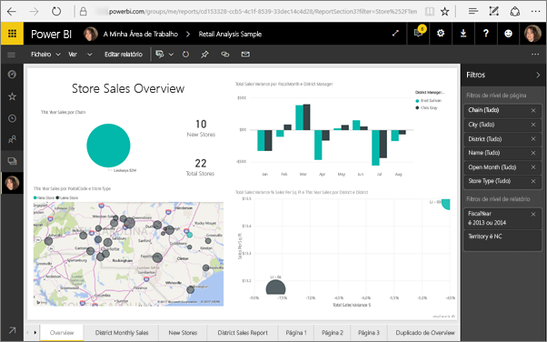
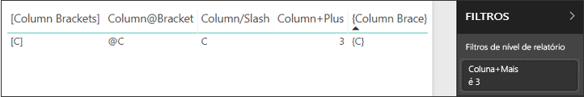
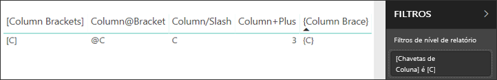

# <a name="filter-a-report-using-query-string-parameters-in-the-url"></a>Filtrar um relatório usando parâmetros de cadeia de consulta no URL

Quando abrir um relatório no serviço Power BI, cada página do relatório tem um URL exclusivo. Para filtrar essa página de relatório, pode utilizar o painel Filtros na tela de relatório.  Também pode adicionar parâmetros de cadeia de consulta ao URL para pré-filtrar o relatório. Pode ter um relatório que pretenda mostrar aos colegas e pré-preenchê-lo para os mesmos. Uma forma de filtrar é começar pelo URL predefinido do relatório, adicionar os parâmetros do filtro ao URL e, em seguida, enviar-lhes todo o novo URL por e-mail.



## <a name="uses-for-query-string-parameters"></a>Utilizações dos parâmetros de cadeia de consulta

Imagine que está a trabalhar no Power BI Desktop. Pretende criar um relatório com ligações para outros relatórios do Power BI, mas apenas quer mostrar algumas das informações nos outros relatórios. Em primeiro lugar, filtre os relatórios através de parâmetros de cadeia de consulta e guarde os URLs. A seguir, crie uma tabela no Power BI Desktop com os novos URLs do relatório.  Em seguida, publique e partilhe o relatório.

Outra utilização dos parâmetros de cadeia de consulta é a criação de uma solução avançada do Power BI.  Ao utilizar o DAX, este cria um relatório que, por sua vez, gera um URL de relatório filtrado que muda de forma dinâmica com base na seleção que o respetivo cliente fizer no relatório atual. Quando os clientes selecionam o URL, eles veem apenas as informações pretendidas. 

## <a name="query-string-parameter-syntax-for-filtering"></a>Sintaxe de parâmetros de cadeia de consulta para filtragem

Com os parâmetros, pode filtrar o relatório para um ou mais valores, mesmo que estes contenham espaços ou carateres especiais. A sintaxe básica é relativamente simples. Comece pelo URL do relatório, adicione um ponto de interrogação e, em seguida, adicione a sua sintaxe de filtro.

URL?filter=***Tabela***/***Campo*** eq '***valor***'


* Os nomes de **Tabela** e **Campo** são sensíveis a maiúsculas e minúsculas, ao contrário de **valor**.
* Os campos que são ocultados da vista de relatórios também podem ser filtrados.

### <a name="field-types"></a>Tipos de campo

O tipo de campo pode ser um número, um valor datetime ou uma cadeia e o tipo utilizado tem de corresponder ao que foi definido no conjunto de dados.  Por exemplo, especificar a coluna de tabela do tipo "cadeia" não irá funcionar se estiver à procura de um valor datetime ou numérico numa coluna do conjunto de dados definida como uma data, como Tabela/ColunaDeCadeia eq 1.

* As **cadeias** têm de estar entre plicas – 'nome do gestor'.
* Os **números** não requerem qualquer formatação especial
* As **datas e horas** têm de estar entre plicas e de ser precedidas pela palavra **DateTime**.

Se estas informações forem confusas, continue a ler para obter uma explicação mais detalhada.  

## <a name="filter-on-a-field"></a>Filtrar num campo

Vamos assumir que o URL do nosso relatório é o seguinte.


Na nossa visualização de mapa (acima), reparamos que temos lojas na Carolina do Norte.

>[!NOTE]
>Este exemplo baseia-se no [exemplo de Análise de Revenda](sample-datasets.md).
> 

Para filtrar o relatório de forma a mostrar dados apenas para lojas na Carolina do Norte ("NC"), anexe o seguinte ao URL:

?filter=Store/Territory eq 'NC'


>[!NOTE]
>*NC* é um valor armazenado no campo **Territory** (Território) da tabela **Store** (Loja).
> 

O nosso relatório está filtrado para a Carolina do Norte. Todas as visualizações na página de relatório mostram dados apenas para a Carolina do Norte.



## <a name="filter-on-multiple-fields"></a>Filtrar em múltiplos campos

Pode também filtrar em múltiplos campos ao adicionar mais parâmetros ao seu URL. Voltemos ao nosso parâmetro de filtro original.

```
?filter=Store/Territory eq 'NC'
```

Para filtrar em campos adicionais, adicione um "**and**" e outro campo no mesmo formato que o anterior. Eis um exemplo.

```
?filter=Store/Territory eq 'NC' and Store/Chain eq 'Fashions Direct'
```

<iframe width="640" height="360" src="https://www.youtube.com/embed/0sDGKxOaC8w?showinfo=0" frameborder="0" allowfullscreen></iframe>

## <a name="operators"></a>Operadores

O Power BI suporta vários operadores para além do operador "**and**". A tabela abaixo apresenta uma lista desses operadores, juntamente com o tipo de conteúdos que os mesmos suportam.

|operador  | definição | cadeia  | número | Data |  Exemplo|
|---------|---------|---------|---------|---------|---------|
|**and**     | e |  sim      | sim |  sim|  produto/preço le 200 and preço gt 3,5 |
|**eq**     | é igual a |  sim      | sim   |  sim       | Endereço/Localidade eq 'Redmond' |
|**ne**     | não é igual a |   sim      | sim  | sim        |  Endereço/Localidade ne 'Londres' |
|**ge**     |  maior ou igual a       | não | sim |sim |  produto/preço ge 10
|**gt**     | maior que        |não | sim | sim  | produto/preço gt 20
|**le**     |   menor ou igual a      | não | sim | sim  | produto/preço le 100
|**lt**     |  menor que       | não | sim | sim |  produto/preço lt 20
|**in****     |  incluindo       | sim | sim |  sim | Estudante/Idade in (27, 29)


\** Ao utilizar o operador **in**, os valores à direita de **in** podem ser uma lista separada por vírgulas entre parênteses ou uma expressão única que devolve uma coleção.

### <a name="numeric-data-types"></a>Tipos de dados numéricos

Um filtro de URL do Power BI pode incluir números nos seguintes formatos.

|Tipo de número  |Exemplo  |
|---------|---------|
|**inteiro**     |   5      |
|**longo**     |   5L ou 5l      |
|**duplo**     |   5,5 ou 55e-1 ou 0,55e+1 ou 5D ou 5d ou 0,5e1D ou 0,5e1d ou 5,5D ou 5,5d ou 55e-1D ou 55e-1d     |
|**decimal**     |   5M ou 5m ou 5,5M ou 5,5m      |
|**flutuante**     | 5F ou 5f ou 0,5e1F ou 0,5e-1d        |

### <a name="date-data-types"></a>Tipos de dados de data

O Power BI suporta o OData V3 e V4 para os tipos de dados **Data** e **DateTimeOffset**.  As datas são representadas através do formato EDM (2019-02-12T00:00:00), por isso, quando especifica uma data como AAAA-MM-DD, o Power BI interpreta-a como AAAA-MM-DDT00:00:00.

Por que motivo esta distinção é importante? Imaginemos que criou o parâmetro de cadeia de consulta **Tabela/Data gt 2018-08-03**.  Será que os resultados vão incluir 3 de agosto de 2018 ou começar por 4 de agosto de 2018? Uma vez que o Power BI traduz a sua consulta para **Tabela/Data gt 2018-08-03T00:00:00**, os resultados incluem todas as datas que tiverem uma parte de hora diferente de zero, uma vez que essas datas seriam maiores do que **2018-08-03T00:00:00**.

## <a name="special-characters-in-url-filters"></a>Carateres especiais em filtros de URL

Os carateres especiais e espaços requerem alguma formatação adicional. Quando a sua consulta contém espaços, travessões ou outros carateres que não forem ASCII, prefixe esses carateres especiais com um *código de escape* que comece com um caráter de sublinhado e um X (**_x**) e, em seguida, o **Unicode** de quatro dígitos, seguido de outro caráter de sublinhado. Se o Unicode tiver menos de quatro carateres, tem de acrescentar zeros ao mesmo. Eis alguns exemplos.

|Identificador  |Unicode  | Códigos do Power BI  |
|---------|---------|---------|
|**Nome da Tabela**     | O espaço é 0x20        |  Nome_x0020_Tabela       |
|**Número**@**Coluna**     |   @ é 0x40     |  Número_x0040_Coluna       |
|**[Coluna]**     |  [é 0x0058] é 0x0050       |  _x0058_Coluna_x0050       |
|**Coluna+SinalDeAdição**     | + é 0x2B        |  Coluna_x002B_SinalDeAdição       |

Tabela_x0020_Nome/Coluna_x002B_SinalDeAdição eq 3 


Tabela_x0020_Especial/_x005B_Coluna_x0020_ParêntesesRetos_x005D_ eq '[C]' 

### <a name="use-dax-to-filter-on-multiple-values"></a>Utilizar o DAX para filtrar em múltiplos valores

Outra forma de filtrar em múltiplos campos é criar uma coluna calculada que concatena dois campos para um valor único. Depois, pode filtrar nesse valor.

Por exemplo, temos dois campos: Territory (Território) e Chain (Cadeia). No Power BI Desktop, [crie uma nova coluna Calculada](desktop-tutorial-create-calculated-columns.md) (Campo) intitulada TerritoryChain (CadeiaTerritório). Lembre-se de que o nome de **Campo** não pode ter espaços. Eis a fórmula DAX dessa coluna.

TerritoryChain = [Território] & " - " & [Cadeia]

Publique o relatório no serviço Power BI e, em seguida, utilize a cadeia de consulta de URL para filtrar de forma a mostrar dados apenas de lojas Lindseys no estado NC.

    https://app.powerbi.com/groups/me/reports/8d6e300b-696f-498e-b611-41ae03366851/ReportSection3?filter=Store/TerritoryChain eq 'NC–Lindseys'

## <a name="pin-a-tile-from-a-filtered-report"></a>Afixar um mosaico de um relatório filtrado

Após filtrar o relatório através de parâmetros de cadeia de consulta, pode afixar visualizações desse relatório ao seu dashboard.  O mosaico no dashboard mostra os dados filtrados e selecionar esse mosaico de dashboard abre o relatório que foi utilizado para criá-lo.  No entanto, a filtragem que fez com o URL não é guardada com o relatório. Ao selecionar o mosaico de dashboard, o relatório é aberto no estado não filtrado.  Assim, os dados apresentados no mosaico de dashboard não correspondem aos dados apresentados na visualização de relatório.

Esta discrepância é útil quando pretende ver resultados diferentes: filtrados no dashboard e não filtrados no relatório.

## <a name="considerations-and-troubleshooting"></a>Considerações e resolução de problemas

Existem alguns elementos a ter em conta ao utilizar os parâmetros da cadeia de consulta.

* Ao utilizar o operador *in*, os valores à direita de *in* têm de ser uma lista separada por vírgulas entre parênteses.    
* No Servidor de Relatórios do Power BI, pode [transmitir parâmetros de relatório](https://docs.microsoft.com/sql/reporting-services/pass-a-report-parameter-within-a-url?view=sql-server-2017.md) ao incluí-los num URL de relatório. Estes parâmetros de URL não têm prefixos porque são transmitidos diretamente ao motor de processamento de relatórios.
* A filtragem de cadeia de consulta não funciona em [Publicar na Web](service-publish-to-web.md).
* [Incorporar com peças Web de relatórios no SharePoint Online](service-embed-report-spo.md) não suporta filtros de URL.
* O tipo de dados longo é (2^53-1) devido a limitações do Javascript.
* Os filtros de URL de relatório têm um limite de 10 expressões (10 filtros ligados por AND).

## <a name="next-steps"></a>Próximos passos

[Afixar uma visualização a um dashboard](service-dashboard-pin-tile-from-report.md)  
[Inscrever-se numa avaliação gratuita](https://powerbi.microsoft.com/get-started/)

Mais perguntas? [Experimente perguntar à Comunidade do Power BI](http://community.powerbi.com/)
