# Métrica de utilização para dashboards e relatórios

Se criar dashboards e relatórios, a métrica de utilização ajuda-o a compreender o respetivo impacto. Quando executa a métrica de utilização do dashboard ou a métrica de utilização de relatórios, pode verificar como esses dashboards e relatórios estão a ser utilizados em toda a organização; o que está a ser utilizado, por quem e com que finalidade.  

> [!NOTE]
> A métrica de utilização irá controlar a utilização de relatórios que estão incorporados no SharePoint Online. No entanto, a métrica de utilização não irá controlar a incorporação de dashboards e relatórios através do fluxo "o utilizador possui credenciais" ou "a aplicação possui credenciais". A métrica de utilização também não irá controlar a utilização de incorporação de relatórios através da opção [Publicar na Web](service-publish-to-web.md).

Estes relatórios de métrica de utilização são só de leitura. No entanto, pode personalizar um relatório de métrica de utilização através da opção "Guardar como". Esta ação cria um novo conjunto de dados e converte o relatório só de leitura num relatório do Power BI completo que pode editar. O relatório personalizado não só contém métricas para o dashboard ou relatório selecionados, mas, ao remover o filtro predefinido, tem agora acesso à métrica de utilização de todos os dashboards ou relatórios na área de trabalho selecionada. Até pode ver os nomes dos seus utilizadores finais.

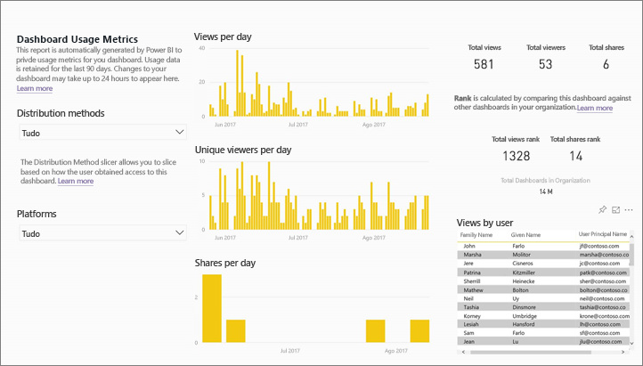

## Por que razão a métrica de utilização é importante para mim?

Saber como o seu conteúdo está a ser utilizado ajuda-o a demonstrar o impacto e a atribuir prioridades aos esforços. A métrica de utilização pode mostrar que um dos seus relatórios é utilizado diariamente por um vasto segmento da organização e mostrar que um dashboard que criou não está a ser visualizado. Este tipo de comentários são valiosos para ajudá-lo nos seus esforços de trabalho.

A execução de relatórios de métrica de utilização só está disponível no serviço Power BI.  No entanto, se guardar um relatório de métrica de utilização ou afixá-lo num dashboard, pode abrir e interagir com esse relatório em dispositivos móveis.

### Pré-requisitos

- A funcionalidade de métrica de utilização recolhe informações de utilização de todos os utilizadores, independentemente da licença que têm atribuída. No entanto, é necessária uma licença do Power BI Pro para executar e aceder aos dados de métrica de utilização.
- A métrica de utilização é fornecida nos dashboards ou relatórios na área de trabalho selecionado. Para aceder às métricas de utilização de um determinado dashboard ou relatório, deve:    
    • Ter acesso de edição a esse dashboard ou relatório • Ter uma licença Pro

## Sobre o relatório da métrica de utilização

Quando seleciona **Métrica de utilização** ou o ícone , o Power BI gera um relatório pré-concebido com a métrica de utilização para esse conteúdo relativo aos últimos 90 dias.  O relatório é semelhante aos relatórios do Power BI com os quais já está familiarizado, mas foi concebido para ser informativo, não interativo. Será capaz de segmentar com base na forma como os utilizadores finais receberam acesso, quer esteja a aceder através da Web ou da aplicação móvel, etc. À medida que os seus dashboards e relatórios evoluem, o mesmo se passa com o relatório de métrica de utilização, que é atualizado todos os dias com novos dados.  

Os relatórios de métrica de utilização não aparecem em **Recente**, **Áreas de trabalho**, **Favoritos**, ou outras listas de conteúdo. Não podem ser adicionados a uma aplicação. Se fixar um mosaico de um relatório de métrica de utilização a um dashboard, esse dashboard não pode ser adicionar a uma aplicação ou pacote de conteúdos.

Para ter acesso aos dados de relatório ou criar os seus próprios relatórios em relação ao conjunto de dados, utilize **Guardar como** (consulte [Guardar o relatório de métrica de utilização como um relatório completo do Power BI](#Save-the-Usage-Metrics-report-as-a-full-featured-Power-BI-report-(personalize)).

## Abrir um relatório de métrica de utilização de um dashboard ou relatório

1. Comece pela área de trabalho que contém o dashboard ou o relatório.
2. Na lista de conteúdo da área de trabalho ou a partir do dashboard ou do relatório propriamente dito, selecione o ícone de **Métrica de utilização**  .

    

    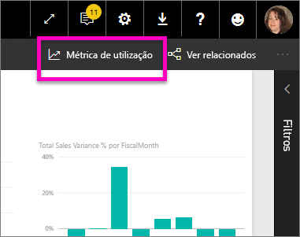
3. Quando o faz pela primeira vez, o Power BI cria o relatório de métrica de utilização e permite-lhe saber quando está pronto.

    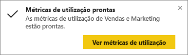
4. Para abrir os resultados, selecione **Ver métrica de utilização**.

    A métrica de utilização será um poderoso aliado enquanto implementa e mantém os dashboards e os relatórios do Power BI. Quer saber que páginas do relatório são mais úteis e quais podem ser suprimidos? Segmente por **Página do relatório** para descobrir. Quer saber se deve criar um esquema móvel para o seu dashboard? Segmente por **Plataformas** para saber quantos utilizadores estão a aceder ao seu conteúdo através de aplicações móveis e não através do Web browser.

5. Opcionalmente, passe o cursor sobre uma visualização e selecione o ícone do pino para adicionar a visualização a um dashboard. Ou, na barra do menu superior, selecione **Afixar Página em Direto** para adicionar a página completa a um dashboard. No dashboard pode monitorizar as métricas de utilização mais facilmente ou partilhá-las com outras pessoas.

    > [!NOTE]
    > Se fixar um mosaico de um relatório de métrica de utilização a um dashboard, esse dashboard não pode ser adicionar a uma aplicação ou pacote de conteúdos.

## Quais são as métricas reportadas?

| Métrica | Dashboard | Relatório | Descrição |
| --- | --- | --- | --- |
| Segmentação de dados por método de distribuição |sim |sim |Como os utilizadores obtêm acesso ao conteúdo. Existem 3 métodos possíveis: os utilizadores podem aceder a dashboard ou ao relatório devido ao facto de serem membros de uma [área de trabalho da aplicação](consumer/end-user-experience.md), ao terem o conteúdo [partilhado com os mesmos](service-share-dashboards.md), ou ao instalarem uma aplicação/pacote de conteúdos.  Tenha em atenção que as vistas através de uma aplicação são contadas como "pacote de conteúdos". |
| Segmentação de dados de plataformas |sim |sim |O dashboard ou o relatório foram acedidos através do serviço Power BI (powerbi.com) ou de um dispositivo móvel? Mobile inclui todas as nossas aplicações iOS, Android e Windows. |
| Segmentação de dados de uma página de relatório |não |sim |Se o relatório tem mais de 1 página, segmente o relatório pela(s) página (s) que foi(ram) visualizada(s). Se vir uma opção de lista para "Em branco", isso significa que uma página do relatório foi adicionada recentemente (dentro de 24 horas, o nome real da nova página será apresentado na lista de segmentação de dados) e/ou as páginas de relatórios foram eliminadas. "Em branco" captura estes tipos de situações. |
| Visualizações por dia |sim |sim |Número total de visualizações por dia - uma visualização é definida como um utilizador a carregar uma página do relatório ou dashboard. |
| Visualizadores exclusivos por dia |sim |sim |Número de utilizadores *diferentes* que visualizaram o dashboard ou o relatório (com base na conta de utilizador do AAD). |
| Visualizações por utilizador |sim |sim |Número de visualizações nos últimos 90 dias, apresentadas por utilizadores individuais. |
| Partilhas por dia |sim |não |Número de vezes que o dashboard foi partilhado com outro utilizador ou grupo. |
| Total de visualizações |sim |sim |Número de visualizações nos últimos 90 dias. |
| Total de visualizadores |sim |sim |Número de visualizações exclusivas nos últimos 90 dias. |
| Total de partilhas |sim |não |Número de vezes que o dashboard ou o relatório foi partilhado nos últimos 90 dias. |
| Total de organizações |sim |sim |Número de todos os dashboards ou relatórios em toda a organização que tenha pelo menos uma visualização nos últimos 90 dias.  Utilizado para calcular a classificação. |
| Classificação: total de visualizações |sim |sim |Para saber o total de visualizações de todos os dashboards ou de relatórios na organização nos últimos 90 dias, qual é a classificação do dashboard ou do relatório. |
| Classificação: total de partilhas |sim |não |Para saber o total de partilhas de todos os dashboards na organização nos últimos 90 dias, qual é a classificação do dashboard ou do relatório. |

### Relatório da métrica de utilização do dashboard

### Relatório da métrica de utilização

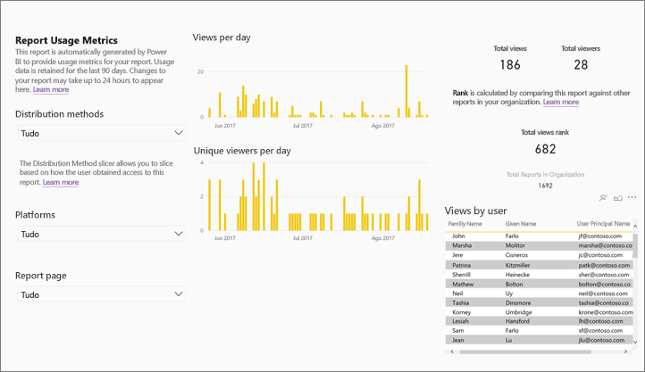

## Guarde o relatório Métrica de Utilização como um relatório completo do Power BI (personalizar)

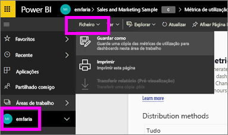

Utilize **Guardar como** para converter a métrica de utilização para um relatório completo do Power BI que pode ser personalizado e partilhado. Depois de criar uma cópia personalizada, terá acesso total ao conjunto de dados subjacente, permitindo-lhe personalizar o relatório de métrica de utilização para as suas necessidades específicas. Pode mesmo utilizar o Power BI Desktop para criar relatórios de métrica de utilização personalizada utilizando a [ligação em direto à funcionalidade de serviço Power BI](https://powerbi.microsoft.com/blog/connecting-to-datasets-in-the-power-bi-service-from-desktop).

Melhor ainda, o conjunto de dados subjacente inclui os detalhes de utilização de todos os dashboards ou de relatórios na área de trabalho. Isto coloca ao seu dispor um vasto leque de opções. Pode, por exemplo, criar um relatório que compara todos os dashboards na sua área de trabalho com base na utilização. Como alternativa, pode criar um dashboard de métrica de utilização para a sua aplicação do Power BI através da utilização de agregação em todo o conteúdo distribuído nessa aplicação.  Consulte [Remover o filtro de nível de página](#remove-the-filter-to-see-all-the-usage-metrics-data-in-the-workspace) abaixo.

### O que é criado quando utiliza "Guardar como"?

Quando o Power BI cria o relatório completo, cria também um novo conjunto de dados **compostos por todos os dashboards ou todos os relatórios incluídos na área de trabalho atual** que tenham sido acedidos nos últimos 90 dias. Por exemplo, imagine que tem uma área de trabalho com o nome "Vendas" que contém três dashboards e dois relatórios e cria um relatório de métrica de utilização no dashboard "Nordeste". Em seguida, utilize **guardar como** para personalizar e convertê-lo num relatório completo. O conjunto de dados desse novo relatório contém a métrica de utilização *não só para esse dashboard chamado "Nordeste"*, mas também para os três dashboards na área de trabalho "Vendas". Por predefinição, o relatório apresenta dados para o dashboard "Nordeste" e terá [remover um filtro](#remove-the-filter-to-see-all-the-usage-metrics-data-in-the-workspace) (clique único) para apresentar dados dos três dashboards.

### Criar uma cópia do relatório de utilização utilizando "Guardar como"

Quando cria uma cópia utilizando "Guardar como" (personalizar), o Power BI converte o relatório pré-construído só de leitura num relatório completo.  À primeira vista, parece exatamente igual. Contudo, agora pode abrir o relatório na vista Editar, adicionar novas visualizações, filtros e páginas, modificar ou eliminar visualizações existentes e muito mais. O Power BI guarda o relatório novo e o conjunto de dados na área de trabalho atual. No exemplo abaixo, a área de trabalho atual é **mihart**.

1. A partir do relatório de métrica de utilização pré-construído, selecione **Ficheiro > Guardar como**. O Power BI converte o relatório de métrica de utilização num relatório completo do Power BI. Isto é denominado um relatório de métrica de utilização *personalizado*. O relatório de utilização personalizado e o conjunto de dados são guardados na área de trabalho denominada **mihart*.

    
2. Abra o relatório na vista Editar e [interaja este, tal como faria com qualquer outro relatório do Power BI](service-interact-with-a-report-in-editing-view.md). Por exemplo, adicione novas páginas e crie novas visualizações, adicione filtros, formate os tipos de letra e cores, etc.

    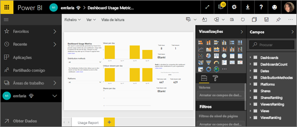
3. Como alternativa, comece com o novo conjunto de dados e crie um relatório de raiz.

    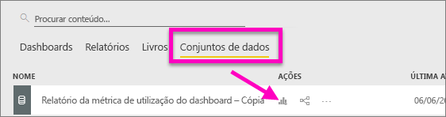
4. O novo relatório é guardado na área de trabalho atual (mihart) e é adicionado à lista de conteúdos **Recente**.

    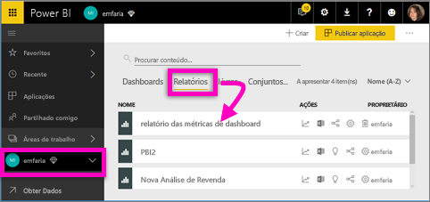

### Remover o filtro para ver ***todos*** os dados da métrica de utilização na área de trabalho

Para ver a métrica de todos os dashboards ou de todos os relatórios na área de trabalho, terá de remover um filtro. Por predefinição, o relatório personalizado está filtrado para apresentar métricas apenas do dashboard ou do relatório que utilizou para criá-lo.

Se, por exemplo, utilizou o dashboard com o nome "Vendas europeias" para criar este novo relatório personalizado, serão apresentados apenas os dados de utilização do dashboard "Vendas europeias". Para remover o filtro e ativar os dados de todos os dashboards nessa área de trabalho:

1. Abra o relatório personalizado na vista Edição.

    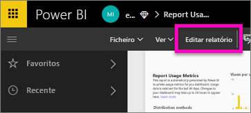
2. No painel Filtros, localize o relatório **Filtros de nível de relatório** e remova o filtro, selecionando "x".

    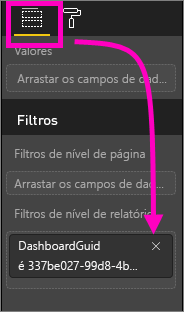

    O relatório personalizado apresenta agora métricas para toda a área de trabalho.

## Controlos de administrador para a métrica de utilização, para administradores do Power BI

Os relatórios de métrica de utilização são uma funcionalidade que o administrador do Power BI ou do Office 365 pode ativar ou desativar. Os administradores têm controlo granular através do qual os utilizadores têm acesso à métrica de utilização. Por predefinição, estão ativados para todos os utilizadores na organização.

1. Abra o portal de administração, selecionando o ícone de engrenagem no canto superior direito do serviço Power BI e escolha **Portal de administração**.

    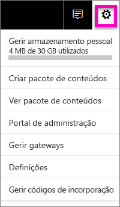
2. No portal de administração, selecione **Definições de inquilino** e escolha **Métrica de utilização para criadores de conteúdo**.

    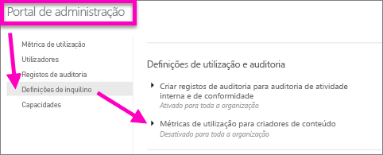
3. Ative (ou desative) a métrica de utilização e selecione **Aplicar**.

    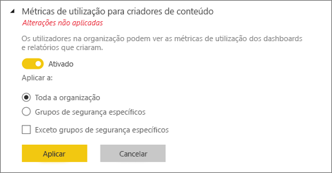

Por predefinição, os dados por utilizador estão ativados para métricas de utilização e as informações da conta do criador de conteúdos estão incluídas no relatório de métricas. Se não quiser incluir estas informações para alguns ou para todos os utilizadores, desative a funcionalidade para grupos de segurança específicos ou para toda a organização. As informações da conta serão apresentadas no relatório como *Sem nome*.

Ao desativar a métrica de utilização para toda a respetiva organização, os administradores podem utilizar a opção **Eliminar todo o conteúdo da métricas de utilização existente** para eliminar todos os relatórios de relatórios e dashboards existentes que foram criados utilizando os conjuntos de dados e relatórios de métrica de utilização. Esta opção remove todo o acesso a dados da métrica de utilização por parte de todos os utilizadores na organização que possam estar a utilizá-lo. Tenha cuidado, porque eliminar o conteúdo da métrica de utilização existente é irreversível.

## Métricas de utilização em clouds nacionais

O Power BI está disponível em clouds nacionais separadas. Estas clouds oferecem os mesmos níveis de segurança, privacidade, conformidade e transparência que a versão global do Power BI, combinadas com um modelo exclusivo para regulamentações locais sobre a entrega de serviços, residência de dados, acesso e controlo. Devido a este modelo exclusivo para regulamentações locais, as métricas de utilização não estão disponíveis em clouds nacionais. Para obter mais informações, veja as [clouds nacionais](https://powerbi.microsoft.com/en-us/clouds/).

## Considerações e limitações

É importante entender que podem existir diferenças na comparação dos registos de auditoria e de métricas de utilização, bem como os motivos para tal. Os *Registos de auditoria* são recolhidos através dos dados do serviço Power BI e as *Métricas de utilização* são recolhidas no cliente. Devido a esta diferença, as contagens acumuladas de atividades nos registos de auditoria podem nem sempre corresponder às métricas de utilização pelos seguintes motivos:

* Por vezes, as métricas de utilização poderão contabilizar menos atividades devido a ligações de rede inconsistentes, bloqueadores de publicidade ou a outros problemas que podem interromper o envio de eventos do cliente.
* Determinados tipos de visualizações não são incluídos nas métricas de utilização, conforme descrito anteriormente neste artigo.
* Por vezes, as métricas de utilização poderão contabilizar atividades a mais, em situações em que o cliente atualiza sem a necessidade de enviar um pedido para o serviço Power BI.

Além das possíveis diferenças entre os registos de auditoria e as métricas de utilização, as seguintes perguntas e respostas sobre as métricas de utilização podem ser úteis para os administradores e os utilizadores:

P: Não consigo executar as métricas de utilização num dashboard ou relatório
R: Só pode ver as métricas de utilização dos conteúdos dos quais é proprietário ou que tem permissões para editar.

P: a métrica de utilização capta as visualizações de dashboards e relatórios incorporados?
R: A métrica de utilização não suporta atualmente a captura de informações de utilização para dashboards incorporados, relatórios e o fluxo [publicar na Web](service-publish-to-web.md).          Nesses casos, recomendamos a utilização de plataformas de análise da Web existentes para controlar a utilização da aplicação ou do portal de alojamento.

P: não consigo executar a métrica de utilização em qualquer conteúdo.
A1: os administradores podem desativar esta funcionalidade para a sua organização.  Contacte o administrador para verificar se isto se verifica.
A2: a métrica de utilização é uma funcionalidade do Power BI Pro.

P: os dados não parecem estar atualizados. Por exemplo, os métodos de distribuição não aparecem, as páginas de relatório estão em falta, etc. R: os dados demoram até 24 horas a aparecer.

P: a área de trabalho tem quatro relatórios, mas o relatório de métrica de utilização só apresenta 3.
R: o relatório de métrica de utilização apenas inclui relatórios (ou dashboards) que tenham sido acedidos nos últimos 90 dias.  Se um relatório (ou dashboard) não for apresentado, é provável que não seja utilizado há mais de 90 dias.

## Passos seguintes

[Adicionar um dashboard como favorito](consumer/end-user-favorite.md)

Mais perguntas? [Pergunte à Comunidade do Power BI](http://community.powerbi.com/)