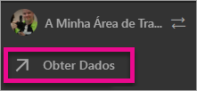
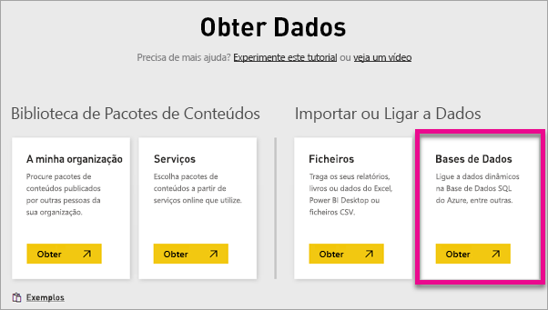
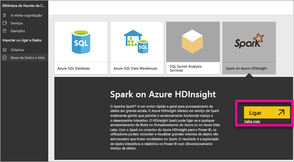
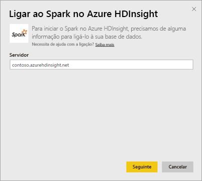
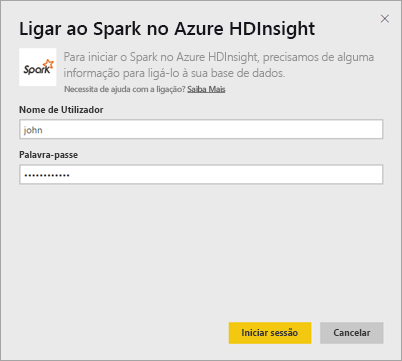
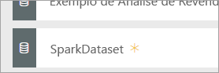
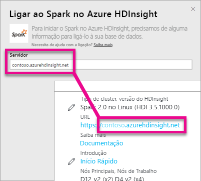
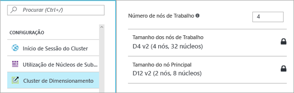

# Spark no HDInsight com DirectQuery

O Spark no Azure HDInsight com DirectQuery permite criar relatórios dinâmicos baseados nos dados e nas métricas que já tem no seu cluster do Spark. Com o DirectQuery, as consultas são enviadas de volta para o cluster do Spark no HDInsight, conforme explora os dados na vista do relatório. Esta experiência é sugerida para utilizadores que estão familiarizados com as entidades às quais ligam.

> [!WARNING]
> A atualização automática de mosaicos foi desativada para os mosaicos de dashboard incorporados em conjuntos de dados baseados no Spark. Pode selecionar **Atualizar Mosaicos do Dashboard** para atualizar manualmente. Os relatórios não são afetados e devem permanecer atualizados. 

Pode utilizar os seguintes passos para ligar ao Spark na origem de dados do Azure HDInsight, através do DirectQuery no serviço Power BI.

> [!Important]
> Temos melhorado a nossa conectividade com o Spark.  Para obter a melhor experiência para se ligar à origem de dados do Spark, utilize o Power BI Desktop.  Assim que criar o seu modelo e relatório, pode publicá-lo no serviço Power BI.  O conector direto do Spark no serviço Power BI foi preterido.

1. Selecione **Obter Dados** na parte inferior do painel de navegação esquerdo.

     
2. Selecione **Bases de Dados e Mais**.

     
3. Selecione o conector **Spark no HDInsight** e escolha **Ligar**.

     
4. Insira o nome do **servidor** ao qual pretende ligar, bem como o seu **nome de utilizador** e a **palavra-passe**. O servidor está sempre no formato \<clustername\>.azurehdinsight.net, veja mais detalhes sobre como localizar estes valores abaixo.

     

     
5. Uma vez ligado, verá um novo conjunto de dados com o nome “SparkDataset”. Também pode aceder ao conjunto de dados através do mosaico de espaço reservado que é criado.

     
6. Ao aprofundar o conjunto de dados, pode explorar todas as tabelas e colunas da base de dados. Selecionar uma coluna resultará no envio de uma consulta de volta para a origem, criando dinamicamente o seu elemento visual. Estes elementos visuais podem ser guardados num novo relatório e afixados de volta no dashboard.

## Localizar os parâmetros do Spark no HDInsight

O servidor está sempre no formato \<clustername\>.azurehdinsight.net e pode ser encontrado no portal do Azure.

O nome de utilizador e a palavra-passe também podem ser encontrados no portal do Azure.

## Limitações

Estas restrições e notas podem mudar, à medida que continuamos a melhorar as experiências. Documentação adicional pode ser encontrada em [Utilizar ferramentas de BI com o Apache Spark no Azure HDInsight](/azure/hdinsight/spark/apache-spark-use-bi-tools/)

* O serviço Power BI suporta apenas uma configuração de Spark 2.0 e HDInsight 3.5.
* Cada ação, como selecionar uma coluna ou adicionar um filtro, enviará uma consulta de volta para a base de dados – antes de selecionar campos muito grandes, considere escolher um tipo adequado de elemento visual.
* As Perguntas e Respostas não estão disponíveis para conjuntos de dados do DirectQuery.
* As alterações de esquema não são selecionadas automaticamente.
* O Power BI suporta 16.000 colunas **em todas as tabelas** dentro de um conjunto de dados. O Power BI também inclui uma coluna interna de números de linha por tabela. Isto significa que, se tiver 100 tabelas no conjunto de dados, o número de colunas disponível será 15.900. Dependendo da quantidade de dados com que estiver a trabalhar da sua origem de dados Spark, pode encontrar esta limitação.

## Resolução de Problemas

Se estiver com problemas ao executar consultas no cluster, verifique se a aplicação ainda está em execução e reinicie se necessário.

Pode também alocar recursos adicionais no portal do Azure em **Configuração** > **Dimensionar Cluster**:

## Próximos passos

[Introdução: criar o cluster do Apache Spark no HDInsight Linux e executar consultas interativas com o Spark SQL](/azure/hdinsight/spark/apache-spark-jupyter-spark-sql/)  
[O que é o Power BI?](power-bi-overview.md)  
[Obter Dados para o Power BI](service-get-data.md)
[Use Kerberos on the On-premises gateway for SSO](service-gateway-sso-kerberos.md) (Utilizar Kerberos no gateway no local para SSO)

Mais perguntas? [Pergunte à Comunidade do Power BI](http://community.powerbi.com/)