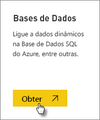
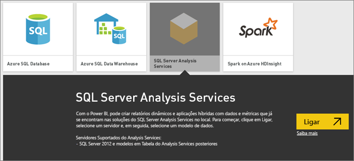
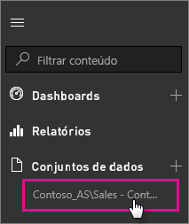

# Dados reais do SQL Server Analysis Services no Power BI
No Power BI, existem duas formas de ligar a um servidor do SQL Server Analysis Services. Em **Obter dados**, pode lugar a um servidor do SQL Server Analysis Services ou a um [ficheiro do Power BI Desktop](service-desktop-files.md) ou [livro do Excel](service-excel-workbook-files.md), já ligado a um servidor do Analysis Services.

 >[!IMPORTANT]
 >* Para ligar em direto a um servidor do Analysis Services, é necessário um administrador instalar e configurar um Gateway de dados no local. Para obter mais informações, veja [Gateway de dados no local](service-gateway-onprem.md).
 >* Quando utilizar o gateway, os seus dados permanecem no local.  Os relatórios criados com base nesses dados são guardados no serviço Power BI. 
 >* A [consulta de linguagem natural com Perguntas e Respostas](service-q-and-a-direct-query.md) está em pré-visualização para ligações em direto do Analysis Services.

## Para ligar a um modelo a partir de Obter dados
1. Em **A Minha Área de Trabalho**, selecione **Obter dados**. Também pode mudar para uma área de trabalho de grupo, se estiver disponível.
   
   
2. Selecione **Bases de Dados e Mais**.
   
   
3. Selecione **SQL Server Analysis Services** > **Ligar**. 
   
   
4. Selecione um servidor. Se não vir nenhum servidor listado aqui, significa que não está configurado um gateway e uma origem de dados ou a conta não está listada no separador **Utilizadores** da origem de dados, no gateway. Contacte o seu administrador.
5. Selecione o modelo ao qual quer ligar. Pode ser Tabular ou Multidimensional.

Depois de ligar ao modelo, este será apresentado no site do Power BI em **A Minha Área de Trabalho/Conjuntos de Dados**. Se mudou para uma área de trabalho de grupo, o conjunto de dados será apresentado no grupo.

## Mosaicos do dashboard
Se afixar elementos visuais de um relatório no dashboard, os mosaicos afixados serão atualizados automaticamente a cada 10 minutos. Se os dados no servidor do Analysis Services no local forem atualizados, os mosaicos serão atualizados automaticamente após 10 minutos.

## Próximos passos
[Gateway de dados no local](service-gateway-onprem.md)  
[Gerir origens de dados do Analysis Services](service-gateway-enterprise-manage-ssas.md)  
[Resolução de problemas do Gateway de dados no local](service-gateway-onprem-tshoot.md)  
Mais perguntas? [Pergunte à Comunidade do Power BI](http://community.powerbi.com/)

