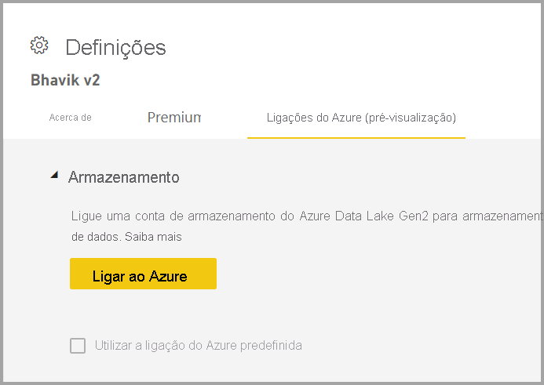
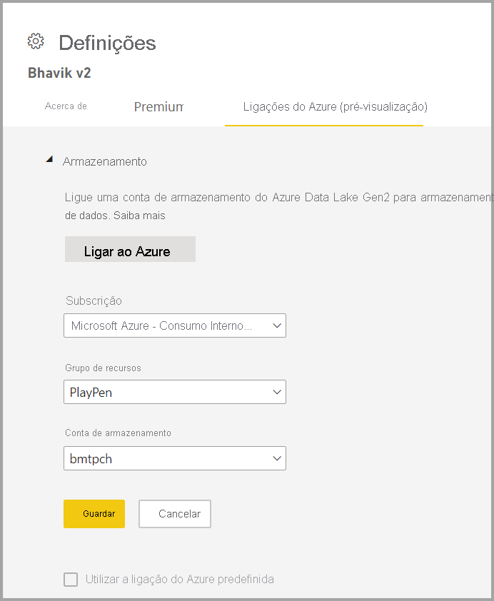

# Configurar o armazenamento de fluxos de dados para utilizar o Azure Data Lake Gen2 

Os dados utilizados com o Power BI são armazenados no armazenamento interno fornecido pelo Power BI por predefinição. Com a integração dos fluxos de dados e do Azure Data Lake Storage Gen2 (ADLS Gen2), pode armazenar os seus fluxos de dados na conta do Azure Data Lake Storage Gen2 da sua organização.

Existem duas formas de configurar qual o armazenamento do ADLS Gen2 a utilizar: pode utilizar uma conta do ADLS Gen2 atribuída a um inquilino ou pode trazer o seu próprio armazenamento do ADLS Gen2 ao nível da área de trabalho. 

## Pré-requisitos

Para trazer a sua própria conta do ADLS Gen2, tem de ter permissões de proprietário, quer na conta de armazenamento, no grupo de recursos ou na camada de subscrição. Mesmo que seja um administrador, tem de atribuir permissão de proprietário a si mesmo.  **Atualmente não suporta contas de armazenamento ADLS Gen2 por trás de uma firewall**

A conta de armazenamento tem de ser criada com o [Espaço de Nomes Hierárquico (HNS)](/azure/storage/blobs/create-data-lake-storage-account) ativado. 

Além disso, a conta do ADLS Gen2 tem de ser implementada na mesma região que o seu inquilino do Power BI. Se as localizações dos recursos não estiverem na mesma região, ocorrerá um erro.

Por fim, pode ligar a qualquer ADLS Gen2 a partir do portal de administração. No entanto, caso se ligue diretamente a uma área de trabalho, terá primeiro de se certificar de que não existem fluxos de dados na mesma antes de efetuar a ligação.

## Ligar a um data lake do Azure Data Lake Gen2 numa área de trabalho
Navegue para uma área de trabalho que não tenha fluxos de dados. Selecione **Definições de área de trabalho** para um novo separador chamado **Ligações do Azure**. Selecione o separador **Ligações do Azure** e selecione a secção **Armazenamento**.

 
A opção **Utilizar a ligação do Azure predefinida** estará visível se o inquilino já tiver configurado o ADLS Gen2. Tem duas opções: pode utilizar o ADLS Gen2 configurado pelo inquilino ao selecionar a caixa de verificação **Utilizar a ligação do Azure predefinida** ou pode selecionar **Ligar ao Azure**, para apontar para uma nova conta de Armazenamento do Azure. 

Quando seleciona **Ligar ao Azure**, o Power BI obtém uma lista das subscrições do Azure às quais tem acesso. Preencha os menus pendentes e selecione uma subscrição do Azure válida, um grupo de recursos e uma conta de armazenamento que tenha a opção de espaço de nomes hierárquico ativada, que é o sinalizador do ADLS Gen2.

 
Uma vez selecionada, selecione **Guardar** e assim terá associado a área de trabalho à sua própria conta do ADLS Gen2 com êxito. O Power BI configura automaticamente a conta de armazenamento com as permissões necessárias e configura o sistema de ficheiros do Power BI no qual os dados serão escritos. Agora, os dados de todos os fluxos de dados nesta área de trabalho serão escritos diretamente neste sistema de ficheiros, que pode ser utilizado com outros serviços do Azure, criando assim uma única origem para todos os dados do seu departamento ou organização.

## Desassociar o Azure Data Lake Gen2 de uma área de trabalho ou inquilino

Para remover uma ligação ao nível da área de trabalho, tem primeiro de se certificar de que todos os fluxos de dados na área de trabalho são eliminados. Quando todos os fluxos de dados tiverem sido removidos, selecione **Desligar** nas definições da área de trabalho. O mesmo se aplica a um inquilino, mas primeiro tem de se certificar de que todas as áreas de trabalho também foram desligadas da conta de armazenamento do inquilino, antes de poder desligar-se ao nível do inquilino.

## Desativar o Azure Data Lake Gen2

No **Portal de Administração**, em **fluxos de dados**, pode desativar o acesso dos utilizadores para utilizarem esta funcionalidade e pode remover a permissão dos administradores de área de trabalho para trazerem o seu próprio Armazenamento do Azure.

## Passos seguintes
Os seguintes artigos fornecem mais informações sobre as fluxos de dados e o Power BI:

* [Introdução aos fluxos de dados e à preparação personalizada de dados](dataflows-introduction-self-service.md)
* [Criar um fluxo de dados](dataflows-create.md)
* [Configurar e consumir um fluxo de dados](dataflows-configure-consume.md)
* [Funcionalidades Premium do fluxo de dados](dataflows-premium-features.md)
* [IA com fluxos de dados](dataflows-machine-learning-integration.md)
* [Limitações e considerações dos fluxo de dados](dataflows-features-limitations.md)
* [Melhores práticas dos fluxos de dados](dataflows-best-practices.md)
