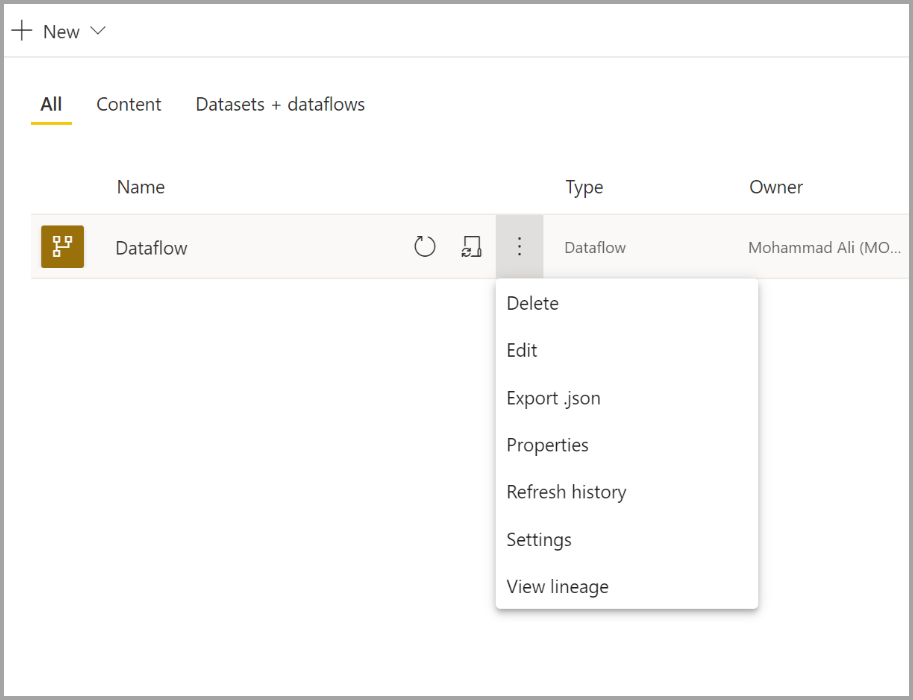
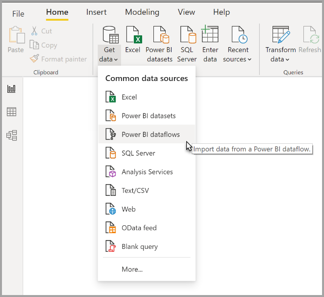

# Configurar e consumir um fluxo de dados

Com os fluxos de dados, pode unificar dados através de várias origens e preparar os mesmos para modelação. Sempre que criar um fluxo de dados, ser-lhe-á pedido para atualizar os dados do fluxo. Tem de atualizar um fluxo de dados antes de o mesmo ser consumido num conjunto de dados no Power BI Desktop ou referenciado como uma entidade associada ou de computação.

## Configurar um fluxo de dados

Para configurar a atualização de um fluxo de dados, selecione o menu **Mais** (ícone de reticências) e selecione **Definições**.

A opção **Definições** oferece muitas opções para o fluxo de dados, conforme descrito nas secções seguintes.

* **Assumir propriedade:** se não for o proprietário do fluxo de dados, muitas das definições serão desativadas. Para assumir a propriedade do fluxo de dados, selecione **Obter controlo**. Ser-lhe-á pedido para fornecer as credenciais para garantir que tem o nível de acesso necessário.

* **Ligação do Gateway:** nesta secção, pode escolher se o fluxo de dados utiliza um gateway e selecionar o gateway a utilizar. 

* **Credenciais da Origem de Dados:** nesta secção, pode escolher as credenciais a utilizar e alterar o método de autenticação da origem de dados.

* **Etiqueta de Confidencialidade:** aqui, pode definir o nível de confidencialidade dos dados no fluxo. Para saber mais sobre as etiquetas de confidencialidade, veja [como aplicar etiquetas de confidencialidade no Power BI](../../admin/service-security-apply-data-sensitivity-labels.md).

* **Atualização Agendada:** aqui, pode definir as horas de atualização do fluxo de dados selecionado. Um fluxo de dados pode ser atualizado com a mesma frequência de um conjunto de dados.

* **Definições do Motor de Computação Avançado:** aqui, podes definir se o fluxo de dados é armazenado no motor de computação. O motor de computação permite que os fluxos de dados subsequentes, que referenciam este fluxo de dados, executem operações de união e fusão, bem como outras transformações mais rápidas. Além disso, permite que o DirectQuery seja executado com o fluxo de dados. Ao selecionar **Ativado** , garante que o fluxo de dados é sempre suportado no modo DirectQuery e que todas as referências beneficiam do motor. Ao selecionar **Otimizado** , o motor é utilizado apenas se existir uma referência a este fluxo de dados. Ao selecionar **Desativado** , desativa o motor de computação e a capacidade do DirectQuery neste fluxo de dados.

* **Recomendações:** pode definir se o fluxo de dados é certificado ou promovido. 

## Atualizar um fluxo de dados
Os fluxos de dados são como tijolos numa parede. Suponha que tem um fluxo de dados chamado *Dados Não Processados* e uma entidade associada denominada *Dados Transformados* , que contém uma entidade associada ao fluxo de dados *Dados Não Processados*. Quando o agendamento da atualização do fluxo de dados *Dados Não Processados* é ativado, o mesmo aciona qualquer fluxo de dados de dados que o referencie após a respetiva conclusão. Esta funcionalidade cria uma cadeia de atualizações, o que lhe permite evitar o agendamento manual de fluxos de dados. Existem algumas diferenças a ter em consideração ao efetuar atualizações de entidades associadas:

* Uma entidade associada é acionada por uma atualização apenas se existir na mesma área de trabalho.

* Uma entidade associada é bloqueada para edição se a entidade de uma origem estiver a ser atualizada. Se não for possível atualizar um fluxo de dados numa cadeia de referência, todos os fluxos de dados serão revertidos para os dados antigos (as atualizações dos fluxos de dados são transacionais numa área de trabalho).

* Apenas as entidades referenciadas são atualizadas ao serem acionadas pela conclusão da atualização de uma origem. Para agendar todas as entidades, também deverá definir uma atualização ao agendamento da entidade associada. Evite definir o agendamento de uma atualização de fluxos de dados associados para não efetuar atualizações duplicadas.

**Cancelar Atualização** Os fluxos de dados suportam a capacidade de cancelar uma atualização, ao contrário dos conjuntos de dados. Se uma atualização demorar demasiado tempo, pode selecionar as opções do fluxo de dados (o ícone de reticências junto ao fluxo de dados) e selecionar **Cancelar atualização**.

**Atualização Incremental (apenas Premium)** Também é possível definir atualizações incrementais nos fluxos de dados. Para tal, selecione o fluxo de dados que pretende configurar para a atualização incremental e, em seguida, selecione o ícone de atualização incremental.

Ao definir a atualização incremental, são adicionados parâmetros ao fluxo de dados para especificar o intervalo de datas. Para obter informações detalhadas sobre como configurar a atualização incremental, veja o artigo [Atualização incremental no Power Query](/power-query/dataflows/incremental-refresh).

Existem algumas circunstâncias em que não deve definir a atualização incremental:

* As entidades associadas não devem utilizar a atualização incremental caso referenciem um fluxo de dados. Os fluxos de dados não suportam a dobragem de consultas (mesmo que a entidade seja o DirectQuery ativado). 

* Os conjuntos de dados que referenciam fluxos de dados não devem utilizar a atualização incremental. Geralmente, as atualizações aos fluxos de dados são eficientes, logo não deverão ser necessárias atualizações incrementais. Se as atualizações demorarem demasiado, recomendamos que utilize o motor de computação ou o modo DirectQuery.

## Consumir um fluxo de dados

Um fluxo de dados pode ser consumido das três formas seguintes:

* Criar uma entidade associada a partir do fluxo de dados para permitir que outro criador de fluxos de dados utilize os dados

* Criar um conjunto de dados a partir do fluxo de dados para permitir que um utilizador utilize os dados para criar relatórios

* Criar uma ligação através de ferramentas externas que podem ler o formato CDM

**Consumo no Power BI Desktop** Para consumir um fluxo de dados, execute o Power BI Desktop e selecione o **Conector de fluxos de dados do Power BI** na caixa de diálogo **Obter Dados**.

> [!NOTE]
> O conector de fluxos de dados do Power BI utiliza um conjunto de credenciais diferente do utilizador com sessão iniciada. Deste modo, os utilizadores com vários inquilinos são suportados.

Selecione o fluxo de dados e as entidades que pretende associar. 

> [!NOTE]
> Pode associar qualquer fluxo de dados ou entidade independentemente da respetiva área de trabalho e de ter sido definida uma área de trabalho Premium ou não Premium.

Se o DirectQuery estiver disponível, ser-lhe-á pedido para escolher se pretende associar as entidades através do DirectQuery ou da opção Importar. 

No modo DirectQuery, pode interrogar rapidamente conjuntos de dados de grande escala a nível local. No entanto, não pode efetuar quaisquer transformações adicionais. 

A opção Importar traz os dados para o Power BI e requer que o conjunto de dados esteja atualizado independentemente do fluxo de dados.

## Passos seguintes
Os seguintes artigos fornecem mais informações sobre as fluxos de dados e o Power BI:

* [Introdução aos fluxos de dados e à preparação personalizada de dados](dataflows-introduction-self-service.md)
* [Criar um fluxo de dados](dataflows-create.md)
* [Configurar o armazenamento do fluxo de dados para utilizar o Azure Data Lake Gen 2](dataflows-azure-data-lake-storage-integration.md)
* [Funcionalidades Premium do fluxo de dados](dataflows-premium-features.md)
* [IA com fluxos de dados](dataflows-machine-learning-integration.md)
* [Limitações e considerações dos fluxo de dados](dataflows-features-limitations.md)