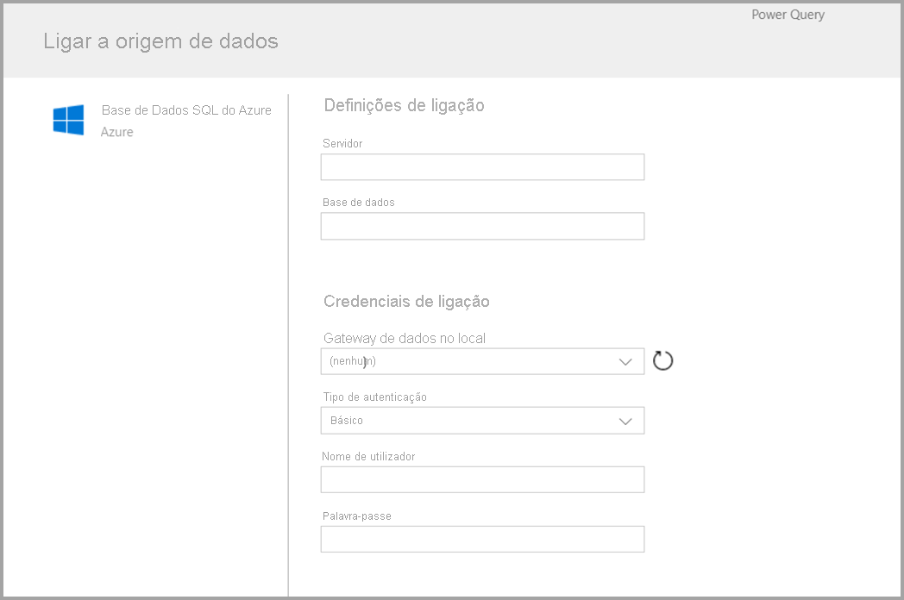
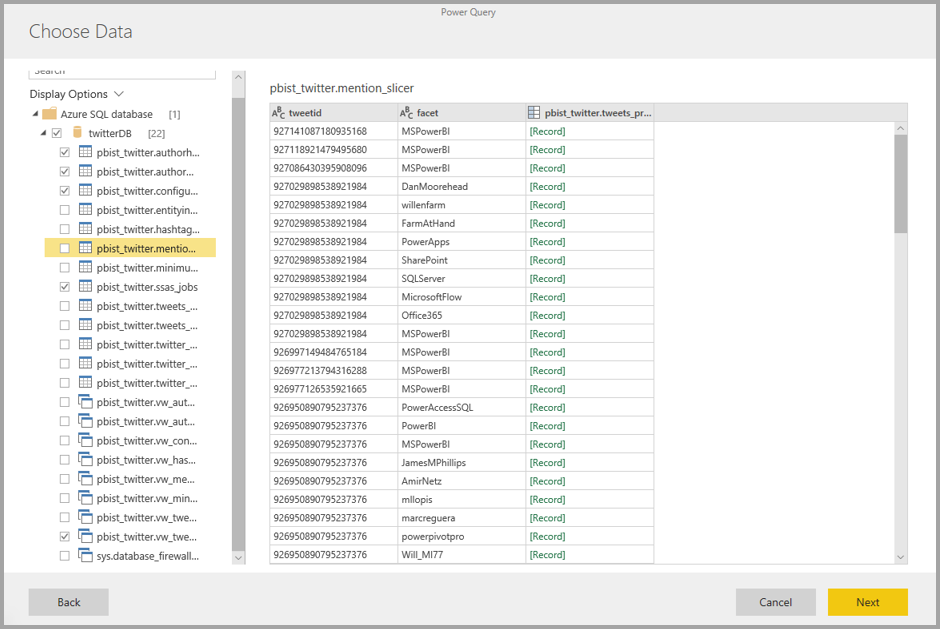
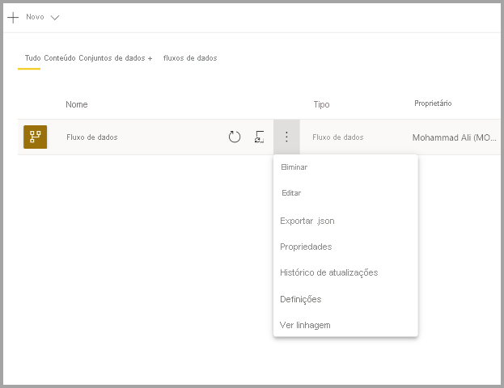

# Criar um fluxo de dados
Um **fluxo de dados** é uma coleção de entidades (as entidades são semelhantes a tabelas) que são criadas e geridas em áreas de trabalho no serviço Power BI. Uma **entidade/Tabela** é um conjunto de campos que servem para armazenar dados, tal como uma tabela numa base de dados. Pode adicionar e editar entidades/tabelas no seu fluxo de dados, bem como gerir agendas de atualização de dados, diretamente a partir da área de trabalho na qual o seu fluxo de dados foi criado.

Para criar um fluxo de dados, inicie o serviço Power BI num browser e, em seguida, selecione uma **área de trabalho** (os fluxos de dados não estão disponíveis em *a minha área de trabalho* no serviço Power BI) no painel de navegação esquerdo, conforme mostrado no ecrã seguinte. Também pode criar uma nova área para criar o novo fluxo de dados.

Existem múltiplas formas de criar ou desenvolver sobre um novo fluxo de dados:

* [Criar um fluxo de dados ao utilizar a opção definir novas entidades](#create-a-dataflow-using-define-new-entities)
* [Criar um fluxo de dados ao utilizar entidades associadas](#create-a-dataflow-using-linked-entities)
* [Criar um fluxo de dados ao utilizar u a entidade calculada](#create-a-dataflow-using-a-computed-entity)
* [Criar um fluxo de dados através da importação/exportação](#create-a-dataflow-using-importexport)

As secções seguintes exploram detalhadamente cada uma destas formas de criar um fluxo de dados.

## Criar um fluxo de dados ao definir novas entidades

A utilização da opção Definir novas entidades permite-lhe definir uma nova entidade/tabela e ligar-se a uma nova origem de dados.

Quando selecionar uma origem de dados, é-lhe pedido para indicar as definições da ligação, incluindo a conta a utilizar ao ligar à origem de dados, conforme mostrado na imagem seguinte.

Depois de ligado, pode selecionar os dados a utilizar para a entidade. Ao escolher os dados e uma origem, o Power BI volta a ligar à origem de dados para manter os dados no fluxo de dados atualizados, com a frequência que selecionar mais tarde no processo de configuração.

Depois de selecionar os dados para utilização na entidade, pode utilizar o editor de fluxo de dados para formatar ou transformar esses dados no formato necessário a utilizar no fluxo de dados. 

## Criar um fluxo de dados ao utilizar entidades associadas

A criação de um fluxo de dados através de entidades associadas permite-lhe referenciar uma entidade existente, definida num outro fluxo de dados, de um modo só de leitura. A lista seguinte descreve algumas das razões pelas quais pode escolher esta abordagem:

* Se quiser reutilizar uma entidade em múltiplos fluxos de dados, como uma entidade de data ou uma tabela de pesquisa estática, deve criar uma entidade uma vez e depois referenciá-la em todos os outros fluxos de dados.

* Se quiser evitar criar múltiplas atualizações numa origem de dados, recomenda-se a utilização de entidades associadas para armazenar os dados e agir como uma cache. Tal permite a cada consumidor subsequente tirar partido dessa entidade e reduzir a carga da origem dos dados subjacente.

* Se precisar de intercalar duas entidades.

> [!NOTE]
> As entidades associadas só estão disponíveis no Power BI Premium.

## Criar um fluxo de dados ao utilizar uma entidade calculada

A criação de um fluxo de dados através de uma entidade calculada permite-lhe referenciar uma entidade associada e efetuar operações sobre a mesma no modo só de escrita. Como resultado, obtém-se uma nova entidade que faz parte do fluxo de dados. Para converter uma entidade associada numa entidade calculada, pode criar uma nova consulta a partir de uma operação de intercalação. Em alternativa, se quiser editar ou transformar a entidade, crie uma referência ou um duplicado da entidade.

### Como criar entidades calculadas

Assim que tiver um fluxo de dados com uma lista de entidades, pode realizar cálculos nessas entidades.
Na ferramenta de criação de fluxos de dados no serviço Power BI, selecione **Editar entidades** e, em seguida, clique com o botão direito do rato na entidade que quer utilizar como base para a sua entidade calculada e na qual deseja realizar cálculos. No menu de contexto, escolha **Referência**.
Para a entidade ser elegível como entidade calculada, a opção **Permitir carga** deve ser marcada, conforme mostrado na imagem seguinte. Clique com o botão direito do rato na entidade para apresentar o menu de contexto.

Ao selecionar **Ativar carga**, cria uma nova entidade para a qual a respetiva origem é a entidade referenciada. O ícone é alterado e mostra o ícone **calculado**, conforme mostrado na imagem seguinte.

Qualquer transformação que efetuar nesta entidade recentemente criada é executada nos dados que já residem no armazenamento de fluxo de dados do Power BI. Isso significa que a consulta não será executada com a origem de dados externos da qual os dados foram importados (por exemplo, a base de dados SQL da qual foram obtidos os dados), mas, em vez disso, é executada nos dados que residem no armazenamento do fluxo de dados.

**Casos de utilização de exemplo** Que tipo de transformações podem ser executadas com as entidades calculadas? Todas as transformações que especificar, normalmente, com a interface de utilizador de transformação no Power BI ou no editor M, são suportadas ao realizar o cálculo no armazenamento.

Considere o seguinte exemplo: tem uma entidade *Conta* que contém os dados não processados de todos os clientes da sua subscrição do Dynamics 365. Tem também dados não processados das *ServiceCalls* do Centro de Assistência, com dados de chamadas de suporte que foram efetuadas a partir de contas diferentes em cada dia do ano.

Imagine que deseja enriquecer a entidade *Conta* com dados das *ServiceCalls*.
Primeiro, terá de agregar os dados das *ServiceCalls* para calcular o número de chamadas de suporte que foram feitas para cada conta no último ano.

Em seguida, deve unir a entidade *Conta* com a entidade *ServiceCallsAggregated* para calcular a tabela *Conta* melhorada.

E, em seguida, pode ver os resultados, mostrados como *EnrichedAccount* na imagem seguinte.

E é tudo. A transformação é executada nos dados no fluxo de dados que reside na sua subscrição do Power BI Premium e não nos dados da origem.

> [!NOTE]
> As entidades calculadas são um recurso exclusivamente premium

## Criar um fluxo de dados através de uma pasta de CDM

A criação de um fluxo de dados a partir de uma pasta CDM permite referenciar uma entidade que tenha sido escrita por outra aplicação no formato Common Data Model (CDM). Ser-lhe-á pedido que forneça o caminho completo do ficheiro de formato CDM armazenado no ADLS Gen2.

 

Existem alguns requisitos para a criação de fluxos de dados a partir de pastas de CDM, como a lista seguinte descreve:

* É necessário que a conta ADLS Gen2 tenha as permissões adequadas configuradas para que o PBI possa aceder ao ficheiro

* A conta do ADLS Gen2 tem de ser acessível para o utilizador que está a tentar criar o fluxo de dados

* A criação de fluxos de dados a partir de pastas de CDM só está disponível na nova experiência de área de trabalho.

* O URL tem de ser um caminho de ficheiro direto para o ficheiro JSON e utilizar o ponto final ADLS Gen2, sendo que blob.core não é suportado.

## Criar um fluxo de dados através da importação/exportação

A criação de um fluxo de dados através da importação/exportação permite-lhe importar um fluxo de dados a partir de um ficheiro. Isto é útil se quiser guardar uma cópia do fluxo de dados offline ou mover um fluxo de dados de uma área de trabalho para outra. 

Para exportar um fluxo de dados, selecione o fluxo de dados que criou e o item do menu **Mais** (as reticências) para expandir as opções. Por fim, selecione **exportar .json**. É-lhe pedido que inicie a transferência do fluxo de dados representado em formato CDM.

Para importar um fluxo de dados, selecione a caixa de importação e carregue o ficheiro. O Power BI cria o fluxo de dados automaticamente e permite-lhe guardá-lo tal como está ou executar transformações adicionais.

## Passos seguintes

Depois de criar um fluxo de dados, pode utilizar o Power BI Desktop e o serviço Power BI para criar conjuntos de dados, relatórios, dashboards e aplicações que se baseiam nos dados que coloca nos fluxos de dados do Power BI e, dessa forma, obter informações sobre as suas atividades de negócios. Os artigos seguintes entram em mais detalhes sobre os cenários de utilização comuns dos fluxos de dados:

* [Introdução aos fluxos de dados e à preparação personalizada de dados](dataflows-introduction-self-service.md)
* [Configurar e consumir um fluxo de dados](dataflows-configure-consume.md)
* [Configurar o armazenamento do fluxo de dados para utilizar o Azure Data Lake Gen2](dataflows-azure-data-lake-storage-integration.md)
* [Funcionalidades Premium do fluxo de dados](dataflows-premium-features.md)
* [IA com fluxos de dados](dataflows-machine-learning-integration.md)
* [Limitações e considerações dos fluxo de dados](dataflows-features-limitations.md)
* [Melhores práticas dos fluxos de dados](dataflows-best-practices.md)