# IA com fluxos de dados

Neste artigo, vamos abordar formas de utilizar a IA (inteligência artificial) com fluxos de dados. As áreas descritas neste artigo são as seguintes:

* Serviços Cognitivos
* Machine Learning Automatizado
* Integração do Azure Machine Learning

## Serviços Cognitivos no Power BI

Com os Serviços Cognitivos no Power BI, pode aplicar diferentes algoritmos dos [Serviços Cognitivos do Azure](https://azure.microsoft.com/services/cognitive-services/) para enriquecer os seus dados na preparação personalizada de dados para Fluxos de Dados.

Seguem-se os serviços suportados atualmente: [Análise de Sentimentos](https://docs.microsoft.com/azure/cognitive-services/text-analytics/how-tos/text-analytics-how-to-sentiment-analysis), [Extração de Expressões-Chave](https://docs.microsoft.com/azure/cognitive-services/text-analytics/how-tos/text-analytics-how-to-keyword-extraction), [Deteção de Idioma](https://docs.microsoft.com/azure/cognitive-services/text-analytics/how-tos/text-analytics-how-to-language-detection) e [Etiquetagem de Imagens](https://docs.microsoft.com/azure/cognitive-services/computer-vision/concept-tagging-images). As transformações são executadas no Serviço Power BI e não precisam de uma subscrição dos Serviços Cognitivos do Azure. Esta funcionalidade precisa do Power BI Premium.

### **Ativar funcionalidades de IA**

Os serviços cognitivos são suportados para nós de capacidade Premium EM2, A2 ou P1 e superiores. É utilizada uma carga de trabalho de IA separada na capacidade para executar os serviços cognitivos. Durante a pré-visualização pública (anterior a junho de 2019), esta carga de trabalho estava desativada por predefinição. Antes de utilizar os serviços cognitivos no Power BI, a carga de trabalho de IA tem de ser ativada nas definições de capacidade do portal de administração. Pode ativar a carga de trabalho de IA na secção de cargas de trabalho e definir a quantidade máxima de memória que gostaria que fosse consumida por esta carga de trabalho. O limite de memória recomendado é de 20%. Exceder este limite torna o processo de consulta mais lento.

### **Introdução aos Serviços Cognitivos no Power BI**

As transformações dos Serviços Cognitivos fazem parte da [Preparação Personalizada de Dados para fluxos de dados](https://powerbi.microsoft.com/blog/introducing-power-bi-data-prep-wtih-dataflows/). Para enriquecer os seus dados com os Serviços Cognitivos, comece por editar um fluxo de dados.

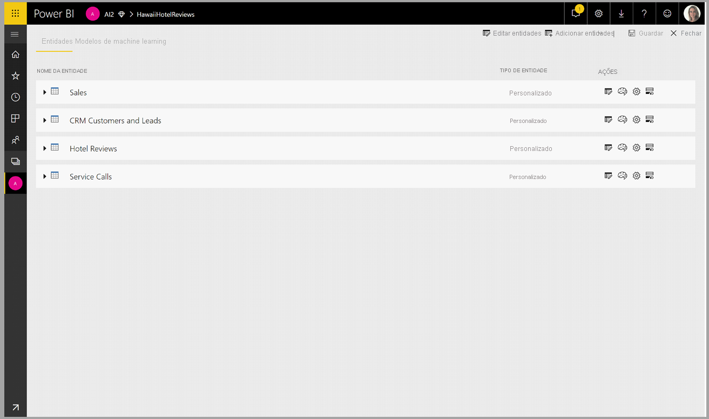

Selecione o botão **Informações de IA** no friso superior do Editor do Power Query.

Na janela de pop-up, selecione a função que quer utilizar e os dados que quer transformar. Neste exemplo, estamos a classificar o sentimento de uma coluna que contém texto de críticas.

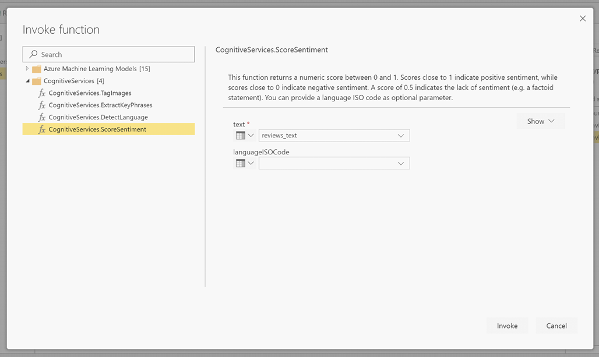

**CultureInfo** (Informações de Cultura) é uma entrada opcional para especificar o idioma do texto. Este campo espera um código ISO. Pode utilizar uma coluna como entrada para Cultureinfo ou um campo estático. Neste exemplo, o idioma é especificado como inglês (en) para a coluna inteira. Se deixar este campo em branco, o Power BI deteta automaticamente o idioma antes de aplicar a função. Em seguida, selecione **Invocar**.

Depois de invocar a função, o resultado é adicionado como uma nova coluna à tabela. A transformação também é adicionada como um passo aplicado na consulta.

Se a função devolver vários campos de saída, invocar a função adiciona uma nova coluna com um registo dos vários campos de saída.

Utilize a opção de expansão para adicionar um ou ambos os valores como colunas aos seus dados.

### **Funções disponíveis**

Esta secção descreve as funções disponíveis nos Serviços Cognitivos no Power BI.

#### **Detetar Idioma**

A função de deteção de idioma avalia a entrada de texto e, para cada campo, devolve o nome do idioma e o identificador ISO. Esta função é útil para colunas de dados que recolhem texto arbitrário, cujo idioma é desconhecido. A função espera dados em formato de texto como entrada.

A Análise de Texto reconhece até 120 idiomas. Para obter mais informações, veja os [idiomas suportados](https://docs.microsoft.com/azure/cognitive-services/text-analytics/text-analytics-supported-languages).

#### **Extrair Expressões-Chave**

A função **Extração de Expressões-Chave** avalia texto não estruturado e, para cada campo de texto, devolve uma lista de expressões-chave. A função precisa de um campo de texto como entrada e aceita uma entrada opcional para **Cultureinfo**. (Veja a secção **Introdução** mais atrás neste artigo).

A extração de expressões-chave funciona melhor quando são disponibilizados segmentos de texto maiores para processamento. Isto é o oposto da análise de sentimentos, que oferece um desempenho melhor em blocos de texto mais pequenos. Para obter os melhores resultados em ambas as operações, considere reestruturar as entradas em conformidade.

#### **Classificar Sentimento**

A função **Classificar Sentimento** avalia a entrada de texto e devolve uma classificação de sentimento para cada documento, de 0 (negativo) a 1 (positivo). Esta função é útil para detetar os sentimentos positivo e negativo nas redes sociais, críticas de clientes e fóruns de debate.

A Análise de Texto utiliza um algoritmo de classificação de aprendizagem automática para gerar uma classificação de sentimento entre 0 e 1. As classificações mais próximas de 1 indicam um sentimento positivo, as classificações mais próximas de 0 indicam um sentimento negativo. O modelo é previamente preparado com um extenso corpo de texto com associações de sentimentos. Atualmente, não é possível fornecer os seus próprios dados de preparação. O modelo utiliza uma combinação de técnicas durante a análise de texto, incluindo o processamento de texto, a análise de categorias gramaticais, a disposição das palavras e associações de palavras. Para obter mais informações sobre o algoritmo, veja [Introducing Text Analytics](/archive/blogs/machinelearning/machine-learning-and-text-analytics) (Introdução à Análise de Texto).

A análise de sentimentos é realizada no campo de entrada inteiro, em vez de extrair sentimentos de uma entidade específica no texto. Na prática, há a tendência de melhorar a precisão da classificação quando os documentos contêm uma ou duas frases, em vez de um grande bloco de texto. Durante a fase de avaliação da objetividade, o modelo determina se um campo de entrada como um todo é objetivo ou se contém sentimento. Um campo de entrada maioritariamente objetivo não avança para a fase de deteção de sentimento, resultando numa classificação de 0,5, sem qualquer processamento adicional. Para os campos de entrada que continuam no pipeline, a fase seguinte gera uma classificação acima ou abaixo de 0,5, consoante o grau de sentimento detetado no campo de entrada.

Atualmente, o serviço Análise de Sentimentos suporta os idiomas inglês, alemão, espanhol e francês. Existem outros idiomas disponíveis em modo de pré-visualização. Para obter mais informações, veja os [Idiomas suportados](https://docs.microsoft.com/azure/cognitive-services/text-analytics/text-analytics-supported-languages).

#### **Etiquetar Imagens**

A função **Etiquetar Imagens** devolve etiquetas com base em mais de 2000 objetos, seres vivos, paisagens e ações reconhecíveis. Quando as etiquetas são ambíguas ou não são do conhecimento geral, a saída fornece "sugestões" para clarificar o significado da etiqueta no contexto de um cenário conhecido. As etiquetas não são organizadas como uma taxonomia e não existem hierarquias de herança. Uma coleção de etiquetas de conteúdos é a base da "descrição" de uma imagem apresentada como um idioma legível por humanos e formatada em frases completas.

Depois de carregar uma imagem ou especificar um URL de imagem, os algoritmos de Imagem Digitalizada produzem etiquetas com base nos objetos, seres vivos e ações identificados na imagem. A etiquetagem não se limita ao tema principal, por exemplo, uma pessoa em primeiro plano, incluindo também o cenário (dentro ou fora de portas), mobiliário, ferramentas, plantas, animais, acessórios, aparelhos e assim por diante.

Essa função precisa de um URL de imagem ou de um campo base 64 como entrada. Neste momento, a etiquetagem de imagens suporta os idiomas inglês, espanhol, japonês, português e chinês simplificado. Para obter mais informações, veja os [Idiomas suportados](https://docs.microsoft.com/rest/api/cognitiveservices/computervision/tagimage/tagimage#uri-parameters).

## Machine Learning automatizada no Power BI

O machine learning automatizado (AutoML) dos fluxos de dados permite que os analistas empresariais preparem, validem e invoquem modelos de Machine Learning (ML) diretamente no Power BI. Inclui uma experiência simples para criar um novo modelo de ML, em que os analistas podem utilizar os fluxos de dados para especificar os dados de entrada para a preparação do modelo. O serviço extrai automaticamente as funcionalidades mais relevantes, seleciona um algoritmo apropriado, bem como ajusta e valida o modelo de ML. Após a preparação de um modelo, o Power BI gera automaticamente um relatório de desempenho que inclui os resultados da validação. O modelo pode ser invocado em todos os dados novos ou atualizados no fluxo de dados.

O machine learning automatizado está disponível para fluxos de dados alojados apenas nas capacidades do Power BI Premium e Embedded.

### Trabalhar com o AutoML

Os fluxos de dados oferecem uma preparação de dados personalizada para macrodados. O AutoML está integrado nos fluxos de dados e permite-lhe tirar partido do esforço de preparação de dados para criar modelos de machine learning diretamente no Power BI.

O AutoML no Power BI permite que os analistas de dados utilizem os fluxos de dados para criar modelos de machine learning com uma experiência simplificada através das competências do Power BI. A maior parte da ciência de dados por trás da criação dos modelos de ML é automatizada pelo Power BI. Dispõe de proteções para garantir que o modelo produzido tem boa qualidade e fornece visibilidade do processo utilizado para criar o seu modelo de ML.

O AutoML suporta a criação de modelos de **Predição Binária** , de **Classificação** e de **Regressão** para os fluxos de dados. Estes são tipos de técnicas de machine learning supervisionadas, o que significa que aprendem com os resultados conhecidos das observações anteriores para prever os resultados de outras observações. O conjunto de dados de entrada para a preparação de um modelo de AutoML é um conjunto de registos **etiquetados** com os resultados conhecidos.

O AutoML no Power BI integra o [ML automatizado](https://docs.microsoft.com/azure/machine-learning/service/concept-automated-ml) do [Azure Machine Learning](https://docs.microsoft.com/azure/machine-learning/service/overview-what-is-azure-ml) para criar os modelos de ML. No entanto, não é necessária uma subscrição do Azure para utilizar o AutoML no Power BI. O processo de preparação e de alojamento dos modelos de ML é completamente gerido pelo serviço Power BI.

Após a preparação de um modelo de ML, o AutoML gera automaticamente um relatório do Power BI que explica o desempenho provável do modelo de ML. O AutoML realça a explicabilidade ao destacar os principais influenciadores entre as entradas que influenciam as predições devolvidas pelo modelo. O relatório também inclui as principais métricas do modelo.

Outras páginas do relatório gerado apresentam o resumo estatístico do modelo e os detalhes de preparação. O resumo estatístico é de interesse para os utilizadores que queiram ver as medidas da ciência de dados padrão do desempenho do modelo. Os detalhes de preparação resumem todas as iterações que foram executadas para criar o modelo, com os parâmetros de modelação associados. Além disso, descreve como cada entrada foi utilizada para criar o modelo de ML.

Em seguida, pode aplicar o modelo de ML aos dados para classificação. Quando o fluxo de dados é atualizado, os seus dados são atualizados com predições do seu modelo de ML. O Power BI também inclui uma explicação individualizada para cada predição específica produzida pelo modelo de ML.

### Criar um modelo de machine learning

Esta secção descreve como criar um modelo de AutoML.

#### Preparação de dados para criar um modelo de ML

Para criar um modelo de machine learning no Power BI, em primeiro lugar, deve criar um fluxo de dados para os dados que contêm as informações dos resultados históricos, utilizadas para a preparação do modelo de ML. Além disso, deve adicionar colunas calculadas para quaisquer métricas de negócios que possam ser fortes previsões para o resultado que está a tentar prever. Para obter detalhes sobre como configurar o fluxo de dados, veja o artigo [Configurar e consumir um fluxo de dados](dataflows-configure-consume.md).

O AutoML tem requisitos de dados específicos para a preparação de um modelo de machine learning. Esses requisitos são descritos nas secções a seguir, com base nos tipos de modelo.

#### Configurar as entradas do modelo de ML

Para criar um modelo de AutoML, selecione o ícone de ML na coluna **Ações** da entidade de fluxo de dados e selecione **Adicionar um modelo de machine learning**.

É iniciada uma experiência simplificada que consiste num assistente que o orienta ao longo do processo de criação do modelo de ML. O assistente inclui os seguintes passos simples.

**1. Selecionar a entidade com os dados históricos e o campo de resultados para o qual quer uma predição**

O campo de resultados identifica o atributo de etiqueta para a preparação do modelo de ML, apresentado na imagem seguinte.

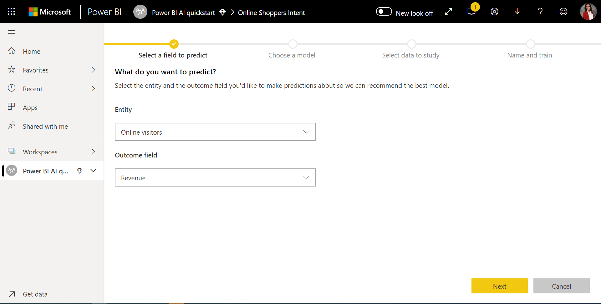

**2. Escolher um tipo de modelo**

Quando especifica o campo de resultados, o AutoML analisa os dados da etiqueta para recomendar o tipo de modelo de ML mais provável que pode ser preparado. Pode escolher um tipo de modelo diferente, conforme mostrado abaixo, ao clicar em "Selecionar um modelo diferente".

> [!NOTE]
> Alguns tipos de modelos podem não ser suportados para os dados que selecionou e, assim, serão desativados. No exemplo acima, a Regressão está desativada, uma vez que uma coluna de texto está selecionada como campo de resultados.

**3. Selecionar as entradas que pretende que o modelo utilize como sinais preditivos**

O AutoML analisa uma amostra da entidade selecionada para sugerir as entradas que podem ser utilizadas para a preparação do modelo de ML. Seriam fornecidas explicações ao lado dos campos que não estão selecionados. Se um campo específico tiver demasiados valores distintos ou apenas um valor, ou correlação baixa ou alta com o campo de saída, não será recomendado.

As entradas que dependem do campo de resultados (ou do campo de etiquetas) não devem ser utilizadas para a preparação do modelo de ML, uma vez que afetarão o desempenho. Estes campos seriam sinalizados como campos que têm uma "correlação suspeitosamente elevada com o campo de saída". A introdução destes campos nos dados de preparação provoca a fuga de etiquetas, na qual o modelo é bem executado nos dados de validação ou de teste, mas não consegue igualar esse desempenho quando utilizado na produção para classificação. A fuga de etiquetas pode ser um possível problema em modelos de AutoML, quando o desempenho do modelo de preparação é demasiado bom para ser verdade.

Esta recomendação de recurso baseia-se numa amostra de dados, por isso, deve analisar as entradas utilizadas. Tem a opção de alterar as seleções para incluir apenas os campos que pretende que o modelo estude. Pode também selecionar todos os campos ao selecionar a caixa de verificação junto ao nome da entidade.

**4. Atribuir um nome ao modelo e guardar a configuração**

Na etapa final, pode atribuir um nome ao modelo e selecionar Guardar e preparar, que inicia a preparação do modelo de ML. Pode optar por reduzir o tempo de preparação para ver resultados rápidos ou aumentar a quantidade de tempo gasto na preparação para obter o melhor modelo.

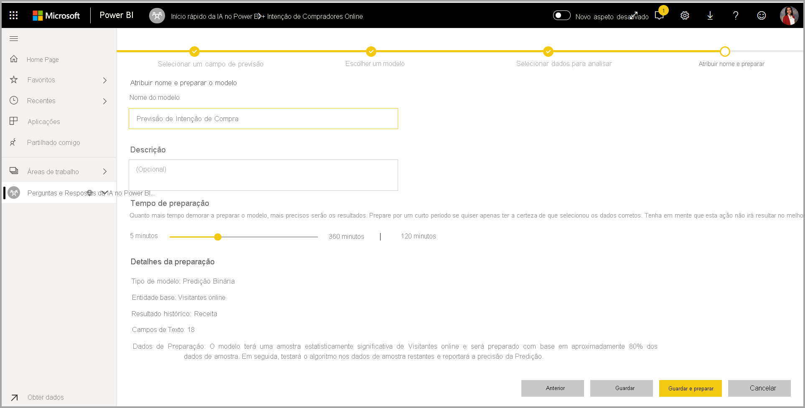

#### Preparação do modelo de ML

A preparação de modelos de AutoML faz parte da atualização do fluxo de dados. O AutoML prepara, em primeiro lugar, os dados para a preparação.
O AutoML divide os dados históricos fornecidos pelo utilizador em conjuntos de dados de preparação e de teste. O conjunto de dados de teste é um conjunto de exclusão utilizado para validar o desempenho do modelo após a preparação. Estes são reconhecidos como entidades de **Preparação e Teste** no fluxo de dados. O AutoML utiliza uma validação cruzada para a validação do modelo.

Em seguida, cada campo de entrada é analisado e uma imputação é aplicada, o que substitui quaisquer valores em falta por valores substituídos. O AutoML utiliza algumas estratégias de imputação diferentes. Para atributos de entrada tratados como recursos numéricos, a média dos valores da coluna é utilizada para imputação. Para atributos de entrada tratados como recursos categóricos, o AutoML utiliza o modo dos valores da coluna para imputação. A média e o modo dos valores utilizados para imputação são calculados pela estrutura do AutoML no conjunto de dados de preparação em subamostragem.

Em seguida, a amostragem e normalização são aplicadas aos dados, conforme necessário. Para modelos de classificação, o AutoML executa os dados de entrada através da amostragem estratificada e equilibra as classes para garantir que as contagens de linhas são iguais para todos.

O AutoML aplica várias transformações a cada campo de entrada selecionado com base no tipo de dados e nas propriedades estatísticas. O AutoML utiliza essas transformações para extrair recursos para utilização na preparação do modelo de ML.

O processo de preparação dos modelos de AutoML consiste num máximo de 50 iterações com diferentes algoritmos de modelação e definições de hiperparâmetros para localizar o modelo com o melhor desempenho. A preparação pode terminar antecipadamente com iterações menores se o AutoML observar que não existe melhoria de desempenho. O desempenho de cada um destes modelos é avaliado por uma validação com o conjunto de dados de teste de exclusão. Durante este passo da preparação, o AutoML cria vários pipelines para a preparação e a validação destas iterações. O processo de avaliação do desempenho dos modelos pode demorar algum tempo, desde vários minutos a algumas horas, até ao tempo de preparação configurado no assistente, consoante o tamanho do conjunto de dados e os recursos de capacidade disponíveis.

Em alguns casos, o modelo final gerado pode utilizar a aprendizagem conjunta, em que vários modelos são utilizados para fornecer o melhor desempenho preditivo.

#### Explicabilidade do modelo de AutoML

Após a preparação do modelo, o AutoML analisa a relação entre os recursos de entrada e a saída do modelo. Avalia a magnitude da alteração à saída do modelo para o conjunto de dados de teste de exclusão para cada recurso de entrada. Tal é conhecido como a _importância do recurso_. Isto acontece como parte da atualização quando a preparação é concluída. Portanto, a sua atualização pode demorar mais do que o tempo de preparação configurado no assistente.

#### Relatório de modelo de AutoML

O AutoML gera um relatório do Power BI que resume o desempenho do modelo durante a validação, em conjunto com a importância do recurso global. É possível aceder a este relatório no separador Modelo de Machine Learning quando a atualização do fluxo de dados for efetuada com êxito. O relatório resume os resultados da aplicação do modelo de ML para os dados de teste de exclusão e da comparação das predições com os valores de resultado conhecidos.

Pode rever o relatório de modelo para compreender o seu desempenho. Além disso, pode validar se os principais influenciadores do modelo estão alinhados com as informações de negócios no que diz respeito aos resultados conhecidos.

As medidas e os gráficos utilizados para descrever o desempenho do modelo no relatório dependem do tipo de modelo. Tais medidas e gráficos de desempenho são descritos nas secções a seguir.

Páginas adicionais do relatório podem descrever as medidas estatísticas sobre o modelo de uma perspetiva da ciência de dados. Por exemplo, o relatório **Predição Binária** inclui um gráfico de ganhos e a curva ROC para o modelo.

Os relatórios também incluem uma página **Detalhes da Preparação** , que inclui uma descrição da preparação do modelo e um gráfico que descreve o desempenho do modelo em cada uma das execuções de iterações.

Outra secção desta página descreve o tipo detetado do campo de entrada e o método de imputação utilizado para preencher valores em falta. Além disso, inclui os parâmetros utilizados pelo modelo final.

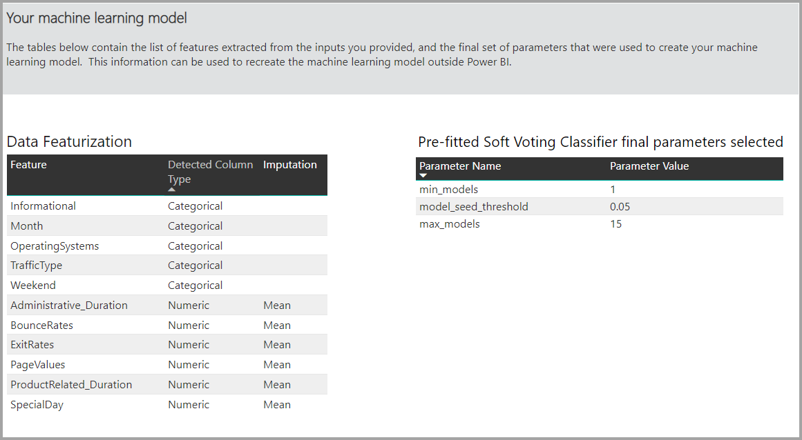

Se o modelo produzido utilizar a aprendizagem conjunta, a página **Detalhes da Preparação** também incluirá um gráfico que mostra a importância de cada modelo de constituinte no conjunto e os seus parâmetros.

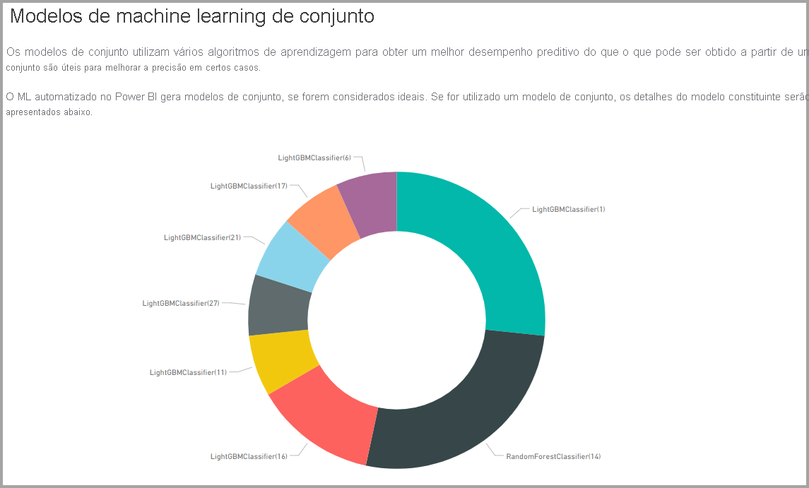

### Aplicar o modelo de AutoML

Caso esteja satisfeito com o desempenho do modelo de ML criado, pode aplicá-lo aos dados novos ou atualizados quando o fluxo de dados for atualizado. Pode fazê-lo a partir do relatório do modelo, ao selecionar o botão **Aplicar** no canto superior direito ou o botão Aplicar Modelo de ML em ações no separador Modelos de Machine Learning.

Para aplicar o modelo de ML, deve especificar o nome da entidade à qual deve ser aplicado e um prefixo para as colunas que serão adicionadas a essa entidade para a saída do modelo. O prefixo predefinido para os nomes das colunas é o nome do modelo. A função _Aplicar_ pode incluir parâmetros adicionais específicos do tipo de modelo.

A aplicação do modelo de ML cria duas novas entidades de fluxo de dados que contêm as predições e explicações individualizadas para cada linha classificada na entidade de saída. Por exemplo, se aplicar o modelo _PurchaseIntent_ à entidade _OnlineShoppers_ , a saída gerará as entidades **OnlineShoppers enriched PurchaseIntent** e **OnlineShoppers enriched PurchaseIntent explanations**. Para cada linha na entidade melhorada, as **Explicações** estão divididas em várias linhas na entidade de explicações melhoradas com base na funcionalidade de entrada. Um **ExplanationIndex** ajuda a mapear as linhas da entidade de explicações melhoradas para a linha na entidade melhorada.

Também pode aplicar qualquer modelo de AutoML do Power BI a entidades em qualquer fluxo de dados na mesma área de trabalho através das Informações de IA no browser de funções do PQO. Desta forma, pode utilizar modelos criados por outras pessoas na mesma área de trabalho sem precisar de ser proprietário do fluxo de dados que contém o modelo. O Power Query deteta todos os modelos de ML do Power BI na área de trabalho e expõe-nos como funções dinâmicas do Power Query.  Pode invocar essas funções ao aceder às mesmas a partir do friso no Editor do Power Query ou ao invocar diretamente a função M. Atualmente, esta funcionalidade só é suportada para fluxos de dados do Power BI e para o Power Query Online no serviço Power BI. Tenha em atenção que isto é muito diferente de aplicar modelos de ML num fluxo de dados com o assistente de AutoML. Não há nenhuma entidade de explicações criada através deste método e, a menos que seja o proprietário do fluxo de dados, não pode aceder aos relatórios de preparação do modelo nem voltar a preparar o modelo. Se o modelo de origem for editado (através da adição ou remoção de campos de entrada) ou se o modelo ou o fluxo de dados de origem for eliminado, este fluxo de dados dependente deixa de funcionar.

Depois de aplicar o modelo, o AutoML mantém sempre as predições atualizadas sempre que o fluxo de dados é atualizado.

Para utilizar as informações e as predições do modelo de ML num relatório do Power BI, pode ligar à entidade de saída do Power BI Desktop com o conector de **fluxos de dados**.

### Modelos de Predição Binária

Os modelos de Predição Binária, mais formalmente conhecidos como **modelos de classificação binária** , são utilizados para classificar um conjunto de dados em dois grupos. São utilizados para prever eventos que podem ter um resultado binário. Por exemplo, se uma oportunidade de vendas será convertida, uma conta será abandonada, uma fatura será paga pontualmente, uma transação é fraudulenta, entre outros.

A saída de um modelo de Predição Binária é uma classificação de probabilidade, que identifica a probabilidade de o resultado de destino ser alcançado.

#### Preparar um modelo de Predição Binária

Pré-requisitos:

- São necessárias, no mínimo, 20 linhas de dados históricos para cada classe de resultados

O processo de criação de um modelo de Predição Binária segue os mesmos passos de outros modelos de AutoML, descritos na secção **Configurar as entradas do modelo de ML** acima. A única diferença encontra-se no passo "Escolher um modelo", no qual é possível selecionar o valor de resultado de destino no qual tem mais interesse. Pode também fornecer etiquetas amigáveis para os resultados a serem utilizados no relatório gerado automaticamente, que resumirá os resultados da validação do modelo.

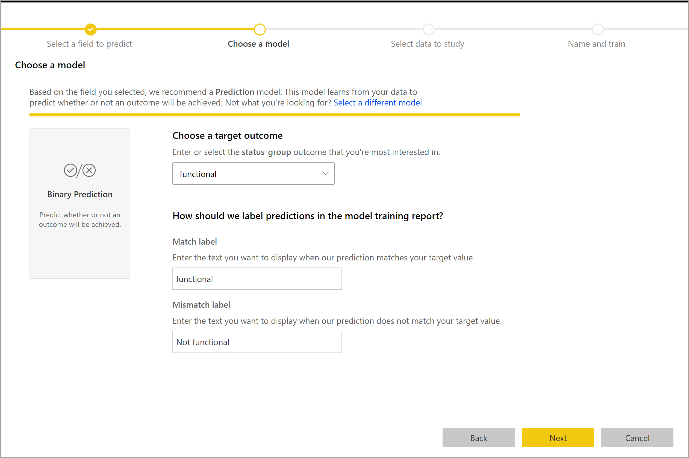

#### Relatório do modelo de Predição Binária

O modelo de Predição Binária produz como uma saída uma probabilidade de que um registo alcance o resultado de destino. O relatório inclui uma segmentação de dados para o limite de probabilidade, que influencia o modo como as pontuações superiores e inferiores ao limite de probabilidade são interpretadas.

O relatório descreve o desempenho do modelo em termos de _Verdadeiros Positivos, Falsos Positivos, Verdadeiros Negativos e Falsos Negativos_. Os Verdadeiros Positivos e os Verdadeiros Negativos são resultados previstos corretamente para as duas classes nos dados de resultado. Falsos Positivos são registos que foram previstos para ter Resultado de destino, mas, na verdade, não tiveram. Por outro lado, os Falsos Negativos são registos que tinham um Resultado de destino, mas foram previstos como não tendo.

As medidas, tais como Precisão e Revocação, descrevem o efeito do limite de probabilidade nos resultados previstos. Pode utilizar a segmentação de dados de limite de probabilidade para selecionar um limite que alcance um compromisso equilibrado entre Precisão e Revocação.

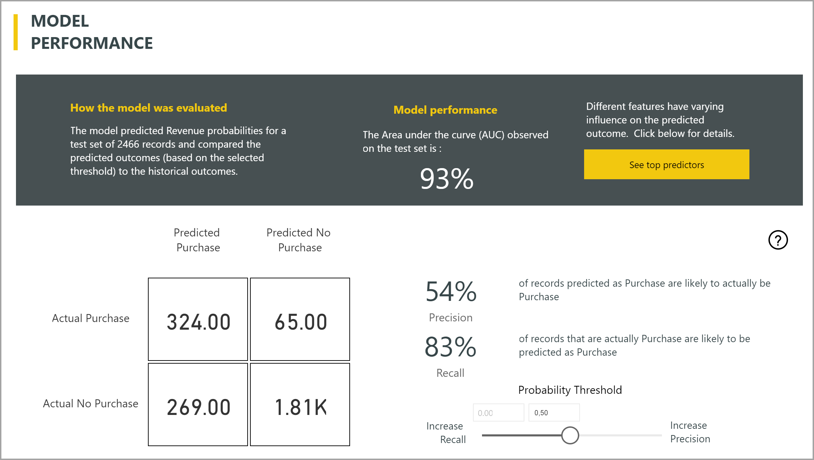

O relatório inclui também uma ferramenta de análise de Custo-Benefício para ajudar a identificar o subconjunto da população que deve ser direcionado para produzir o lucro mais alto. Através de um custo unitário estimado de direcionamento e um benefício da unidade por atingir um resultado de destino, a análise de Custo-Benefício tenta maximizar o lucro. Pode utilizar esta ferramenta para escolher o seu limite de probabilidade com base no ponto máximo no gráfico para maximizar o lucro. Pode também utilizar o gráfico para calcular o lucro ou o custo da sua escolha de limite de probabilidade.

A página **Relatório de Precisão** do relatório de modelo inclui o gráfico _Ganhos Cumulativos_ e a curva ROC para o modelo. Estas são medidas estatísticas de desempenho do modelo. Os relatórios incluem descrições dos gráficos apresentados.

#### Aplicar um modelo de Predição Binária

Para aplicar um modelo de Predição Binária, deve especificar a entidade com os dados aos quais quer aplicar as predições do modelo de ML. Outros parâmetros incluem o prefixo de nome da coluna de saída e o limite de probabilidade para a classificação do resultado previsto.

Quando um modelo de Predição Binária é aplicado, adiciona quatro colunas de saída à entidade de saída melhorada: **Outcome** , **PredictionScore** , **PredictionExplanation** e **ExplanationIndex**. Os nomes das colunas na entidade têm o prefixo especificado quando o modelo é aplicado.

**PredictionScore** é uma probabilidade em percentagem, que identifica a probabilidade de o resultado de destino ser alcançado.

A coluna **Outcome** contém a etiqueta de resultado previsto. Os registos com probabilidades superiores ao limite são previstos como prováveis de alcançar o resultado de destino e são etiquetados como Verdadeiros. Os registos abaixo do limite são previstos como improváveis de alcançar o resultado e são etiquetados como Falsos.

A coluna **PredictionExplanation** contém uma explicação com a influência específica que os recursos de entrada tiveram na coluna **PredictionScore**.

### Modelos de classificação

Os modelos de classificação são utilizados para classificar um conjunto de dados em vários grupos ou classes. São utilizados para prever eventos que podem ter um dos vários resultados possíveis. Por exemplo, se um cliente tem provavelmente um valor de duração muito elevado, elevado, médio ou reduzido, o risco de incumprimento é elevado, moderado, reduzido ou muito reduzido, entre outros.

A saída de um Modelo de classificação é uma pontuação de probabilidade, que identifica a probabilidade de um registo alcançar os critérios para uma determinada classe.

#### Preparar um modelo de classificação

A entidade de entrada com os dados de preparação para um Modelo de classificação deve ter um campo de número inteiro ou uma cadeia como o campo de resultados, que identifica os últimos resultados conhecidos.

Pré-requisitos:

- São necessárias, no mínimo, 20 linhas de dados históricos para cada classe de resultados

O processo de criação de um modelo de classificação segue os mesmos passos de outros modelos de AutoML, descritos na secção **Configurar as entradas do modelo de ML** acima.

#### Relatório do Modelo de classificação

O relatório do Modelo de classificação é produzido através da aplicação do modelo de ML aos dados de teste de exclusão e da comparação da classe prevista para um registo com a classe conhecida real.

O relatório de modelo inclui um gráfico no qual consta a divisão dos registos correta e incorretamente classificados para cada classe conhecida.

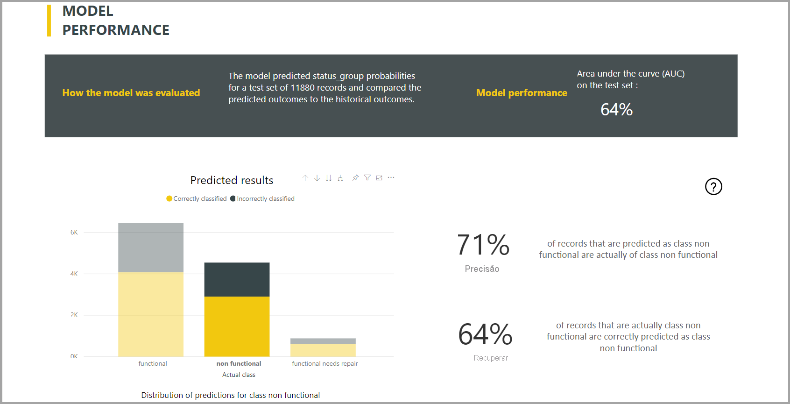

Um aprofundamento adicional específico de classe permite uma análise de como as predições para uma classe conhecida são distribuídas. Isto mostra as outras classes nas quais os registos dessa classe conhecida serão, provavelmente, classificados de modo incorreto.

A explicação do modelo no relatório também inclui as principais previsões para cada classe.

O relatório do Modelo de classificação também inclui uma página Detalhes da Preparação semelhante às páginas de outros tipos de modelo, conforme descrito na secção **Relatório do modelo de AutoML** acima neste artigo.

#### Aplicar um modelo de classificação

Para aplicar um Modelo de ML de classificação, deve especificar a entidade com os dados de entrada e o prefixo de nome da coluna de saída.

Quando um Modelo de classificação é aplicado, adiciona cinco colunas de saída à entidade de saída melhorada: **ClassificationScore** , **ClassificationResult** , **ClassificationExplanation** , **ClassProbabilities** e **ExplanationIndex**. Os nomes das colunas na entidade têm o prefixo especificado quando o modelo é aplicado.

A coluna **ClassProbabilities** contém a lista de pontuações de probabilidade para o registo de cada classe possível.

A **ClassificationScore** é a probabilidade em percentagem, que identifica a probabilidade de um registo alcançar os critérios para uma determinada classe.

A coluna **ClassificationResult** contém a classe prevista mais provável para o registo.

A coluna **ClassificationExplanation** contém uma explicação com a influência específica que os recursos de entrada tiveram na coluna **ClassificationScore**.

### Modelos de regressão

Os modelos de regressão são utilizados para prever um valor numérico. Por exemplo: a receita que provavelmente será obtida de um negócio de vendas, o valor de duração de uma conta, o montante de uma fatura a receber que será provavelmente pago, a data em que uma fatura poderá ser paga, entre outros.

A saída de um Modelo de regressão é o valor previsto.

#### Preparar um Modelo de regressão

A entidade de entrada com os dados de preparação para um Modelo de regressão deve ter um campo numérico como o campo de resultados, que identifica os resultados conhecidos.

Pré-requisitos:

- São necessárias, no mínimo, 100 linhas de dados históricos para um modelo de regressão

O processo de criação de um Modelo de regressão segue os mesmos passos de outros modelos de AutoML, descritos na secção **Configurar as entradas do modelo de ML** acima.

#### Relatório do Modelo de regressão

Tal como os outros relatórios de modelo de AutoML, o Relatório de regressão baseia-se nos resultados da aplicação do modelo aos dados de teste de exclusão.

O relatório de modelo inclui um gráfico que compara os valores previstos com os valores reais. Neste gráfico, a distância da diagonal indica o erro na predição.

O gráfico de erro residual apresenta a distribuição da percentagem de erro médio para diferentes valores no conjunto de dados de teste de exclusão. O eixo horizontal representa a média do valor real do grupo, com o tamanho da bolha a apresentar a frequência ou a contagem de valores nesse intervalo. O eixo vertical é o erro residual médio.

O relatório do Modelo de regressão também inclui uma página Detalhes da Preparação semelhante aos relatórios de outros tipos de modelo, conforme descrito na secção **Relatório do Modelo de AutoML** acima.

#### Aplicar um modelo de regressão

Para aplicar um Modelo de ML de regressão, deve especificar a entidade com os dados de entrada e o prefixo de nome da coluna de saída.

Quando um Modelo de regressão é aplicado, adiciona três colunas de saída à entidade de saída melhorada: **RegressionResult** , **RegressionExplanation** e **ExplanationIndex**. Os nomes das colunas na entidade têm o prefixo especificado quando o modelo é aplicado.

A coluna **RegressionResult** contém o valor previsto para o registo com base nos campos de entrada. A coluna **RegressionExplanation** contém uma explicação com a influência específica que os recursos de entrada tiveram na coluna **RegressionResult**.

## Integração do Azure Machine Learning no Power BI

Muitas organizações utilizam os modelos do **Machine Learning** para obter melhores informações e previsões sobre os seus negócios. A capacidade de visualizar e invocar informações a partir destes modelos, nos seus relatórios, dashboards e outras análises, pode ajudar a disseminar estas informações junto dos utilizadores empresariais que mais precisam delas.  Agora, o Power BI simplifica a incorporação de informações de modelos alojados no Azure Machine Learning através de gestos simples de apontar e clicar.

Para utilizar esta capacidade, basta que um cientista de dados conceda acesso ao modelo do Azure ML ao analista de BI através do portal do Azure.  Em seguida, no início de cada sessão, o Power Query deteta todos os modelos do Azure ML aos quais o utilizador tem acesso e expõe-nos como funções dinâmicas do Power Query.  Por sua vez, o utilizador pode invocar essas funções ao aceder às mesmas a partir do friso no Editor do Power Query ou ao invocar diretamente a função M. O Power BI também agrupa automaticamente os pedidos de acesso ao invocar o modelo do Azure ML para um conjunto de linhas de modo a obter um melhor desempenho.

Atualmente, esta funcionalidade só é suportada para fluxos de dados do Power BI e para o Power Query online no serviço Power BI.

Para saber mais sobre os fluxos de dados, veja o artigo [Introdução aos fluxos de dados e à preparação personalizada de dados](dataflows-introduction-self-service.md).

Para saber mais sobre o Azure Machine Learning, veja:

- Descrição Geral:  [O que é o Azure Machine Learning?](https://docs.microsoft.com/azure/machine-learning/service/overview-what-is-azure-ml)
- Guias de Introdução e Tutoriais para o Azure Machine Learning:  [Documentação do Azure Machine Learning](https://docs.microsoft.com/azure/machine-learning/)

> [!NOTE]
> Uma subscrição do Power BI Premium é necessária para utilizar a integração do Azure Machine Learning.

### Conceder acesso ao modelo do Azure ML a um utilizador do Power BI

Para aceder a um modelo do Azure ML a partir do Power BI, o utilizador tem de ter acesso de **Leitura** à subscrição do Azure.  Além disso:

- Para modelos do Machine Learning Studio (clássico), tem de ter acesso de **Leitura** ao serviço Web Machine Learning Studio (clássico)
- Para modelos do Machine Learning, tem de ter acesso de **Leitura** à área de trabalho do Machine Learning

Os passos indicados neste artigo descrevem como conceder acesso a um utilizador do Power BI a um modelo alojado no serviço do Azure ML, para que possam aceder a este modelo como uma função do Power Query.  Para obter mais detalhes, veja [Gerir o acesso com o RBAC e o portal do Azure](https://docs.microsoft.com/azure/role-based-access-control/role-assignments-portal).

1. Inicie sessão no [portal do Azure](https://portal.azure.com).

2. Vá para a página **Subscrições**. Pode encontrar a página **Subscrições** através da lista **Todos os Serviços** no menu do painel de navegação do portal do Azure.

    [ 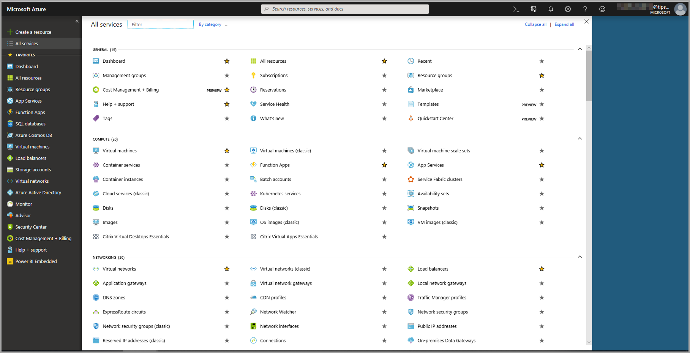 ](media/service-machine-learning-integration/machine-learning-integration-01.png#lightbox)

3. Selecione a sua subscrição.

    

4. Selecione **Controlo de Acesso (IAM)** e, em seguida, selecione o botão **Adicionar**.

    

5. Selecione **Leitor** como Função. Selecione o utilizador do Power BI ao qual quer conceder acesso ao modelo do Azure ML.

    

6. Selecione **Guardar**.

7. Repita os passos três a seis para conceder acesso de **Leitor** ao utilizador ao serviço Web Machine Learning Studio (clássico) específico *ou* à área de trabalho do Machine Learning que aloja o modelo.

### Deteção de esquema para modelos do Machine Learning

Os cientistas de dados utilizam o Python sobretudo para desenvolver e, inclusivamente, implementar os respetivos modelos de machine learning no Machine Learning.  Ao contrário do Machine Learning Studio (clássico), que ajuda a automatizar a tarefa de criação de um ficheiro de esquema para o modelo, no caso do Machine Learning, o cientista de dados tem de gerar explicitamente o ficheiro de esquema com o Python.

O ficheiro de esquema tem de estar incluído no serviço Web implementado para modelos do Machine Learning. Para gerar automaticamente o esquema para o serviço Web, tem de disponibilizar um exemplo de entrada/saída no script de entrada para o modelo implementado. Veja a subsecção na documentação do serviço [(Opcional) Geração automática de esquemas Swagger nos Modelos de implementação com o Azure Machine Learning](https://docs.microsoft.com/azure/machine-learning/how-to-deploy-and-where#optional-define-model-web-service-schema). A ligação inclui o script de entrada de exemplo com as instruções para a geração de esquemas. 

Em específico, as funções *\@input_schema* e *\@output_schema* no script de entrada fazem referência aos formatos de exemplo de entrada e de saída nas variáveis *input_sample* e *output_sample* e utilizam estes exemplos para gerar uma especificação OpenAPI (Swagger) para o serviço Web durante a implementação.

Estas instruções para a geração de esquemas ao atualizar o script de entrada também têm de ser aplicadas aos modelos criados com experimentações de aprendizagem automática com o SDK do Azure Machine Learning.

> [!NOTE]
> Os modelos criados através da interface visual do Azure Machine Learning não suportam atualmente a geração de esquemas, mas irão suportá-la em versões futuras. 

### Invocar o modelo do Azure ML no Power BI

Pode invocar qualquer modelo do Azure ML ao qual lhe foi concedido acesso diretamente a partir do Editor do Power Query no seu fluxo de dados. Para aceder aos modelos do Azure ML, selecione o botão **Editar** para a entidade que pretende enriquecer com informações do modelo do Azure ML, conforme mostrado na imagem seguinte.

[ 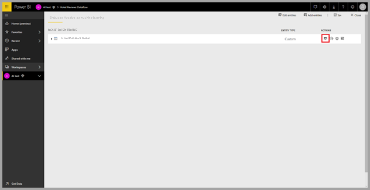 ](media/service-machine-learning-integration/machine-learning-integration-05.png#lightbox)

Se selecionar o botão **Editar** , abre o Editor do Power Query para as entidades no seu fluxo de dados.

Selecione o botão **Informações de IA** no friso e, em seguida, selecione a pasta _Modelos do Azure Machine Learning_ no menu do painel de navegação. Todos os modelos do Azure ML aos quais tem acesso estão listados aqui como funções do Power Query. Além disso, os parâmetros de entrada para o modelo do Azure ML são mapeados automaticamente como parâmetros da função de Power Query correspondente.

Para invocar um modelo do Azure ML, pode especificar qualquer uma das colunas da entidade selecionada como uma entrada da lista pendente. Também pode especificar um valor constante a utilizar como entrada, ao mudar o ícone de coluna para a esquerda da caixa de diálogo de entrada.

Selecione **Invocar** para ver a pré-visualização da saída do modelo do Azure ML como uma nova coluna na tabela de entidades. Também irá ver a invocação do modelo como um passo aplicado da consulta.

Se o modelo devolver vários parâmetros de saída, estes são agrupados como um registo na coluna de saída. Pode expandir a coluna para produzir parâmetros de saída individuais em colunas separadas.

Depois de guardar o fluxo de dados, o modelo será invocado automaticamente quando o fluxo de dados for atualizado em linhas novas ou atualizadas na tabela de entidades.

## Passos seguintes

Este artigo forneceu uma descrição geral do Machine Learning Automatizado para os fluxos de dados no serviço Power BI. Os seguintes artigos também podem ser úteis.

- [Tutorial: Criar um modelo de Machine Learning no Power BI ](../../connect-data/service-tutorial-build-machine-learning-model.md)
- [Tutorial: Utilizar os Serviços Cognitivos no Power BI](../../connect-data/service-tutorial-use-cognitive-services.md)
- [Tutorial: Invocar um modelo do Machine Learning Studio (clássico) no Power BI (Pré-visualização)](../../connect-data/service-tutorial-invoke-machine-learning-model.md)

Os seguintes artigos fornecem mais informações sobre as fluxos de dados e o Power BI:

* [Introdução aos fluxos de dados e à preparação personalizada de dados](dataflows-introduction-self-service.md)
* [Criar um fluxo de dados](dataflows-create.md)
* [Configurar e consumir um fluxo de dados](dataflows-configure-consume.md)
* [Configurar o armazenamento do fluxo de dados para utilizar o Azure Data Lake Gen 2](dataflows-azure-data-lake-storage-integration.md)
* [Funcionalidades Premium do fluxo de dados](dataflows-premium-features.md)
* [Limitações e considerações dos fluxo de dados](dataflows-features-limitations.md) 