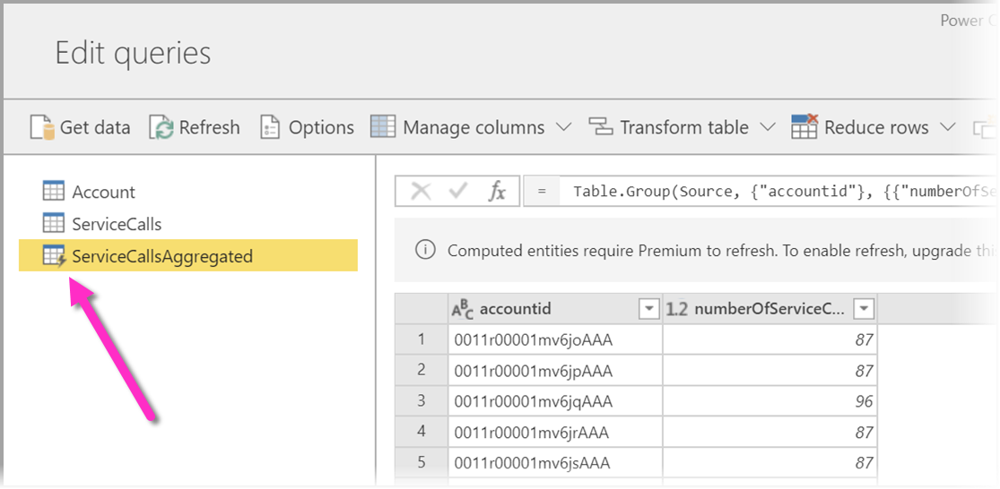

# Funcionalidades Premium do fluxo de dados

Os fluxos de dados são suportados para os utilizadores do Power BI Pro e Power BI Premium. Algumas funcionalidades só estão disponíveis com uma subscrição do Power BI Premium. Este artigo descreve e pormenoriza as funcionalidades exclusivamente Premium e as respetivas utilizações. 

As seguintes funcionalidades estão disponíveis apenas no Power BI Premium:

* Motor de computação melhorado
* Consulta Direta
* Entidades calculadas
* Entidades Associadas
* Atualização incremental

As secções seguintes descrevem pormenorizadamente cada uma destas funcionalidades.

## O motor de computação melhorado

O motor de computação melhorado no Power BI permite que os subscritores do Power BI Premium utilizem as suas capacidades para otimizar a utilização de fluxos de dados. A utilização do motor de computação melhorado proporciona as seguintes vantagens:

* Reduz drasticamente o tempo de atualização necessário para passos de ETL de execução longa em entidades calculadas, como a execução de *associações*, *distinto*, *filtros* e *agrupar por*
* Executa consultas do DirectQuery em entidades

Por predefinição, o motor de computação melhorado está **Ativado**. Se o motor de computação melhorado não estiver ativado, é descrito como o ativar na próxima secção e também estão disponíveis respostas a perguntas comuns.

### Utilizar o motor de computação melhorado

O motor de computação melhorado é ativado na página **Definições de Capacidade** no serviço Power BI, na secção de **fluxos de dados**. Por predefinição, o motor de computação melhorado está **Desativado**. Para ativar o motor de computação melhorado, altere o botão de alternar para **Ativado**, conforme apresentado na seguinte imagem, e guarde as definições. 

> [!IMPORTANT]
> O motor de computação melhorado funciona apenas para as capacidades A3 e superiores do Power BI.

Assim que o motor de computação melhorado estiver ativado, regresse à secção de **fluxos de dados** e deverá observar uma melhoria no desempenho em qualquer entidade calculada que execute operações complexas, como as operações *associações* ou *agrupar por* para fluxos de dados criados com base em entidades associadas existentes na mesma capacidade. 

Para utilizar o motor de computação da melhor forma, divida a fase de ETL em dois fluxos de dados em separados da seguinte forma:

* **Fluxo de dados 1** – este fluxo de dados deve apenas ingerir tudo o que for necessário de uma origem de dados e colocar tudo isso no Fluxo de dados 2.
* **Fluxo de dados 2** – execute todas as operações de ETL neste segundo fluxo de dados, mas certifique-se de que está a fazer referência ao Fluxo de dados 1, que deve estar na mesma capacidade. Além disso, certifique-se de que executa primeiro operações que podem efetuar divisões (filtrar, agrupar por, distinto, associar) antes de qualquer outra operação, para garantir que o motor de computação é utilizado.

### Perguntas comuns e respostas

**Pergunta:** Ativei o motor de computação melhorado, mas as minhas atualizações estão mais lentas. Porquê?

**Resposta:** Se ativar o motor de computação melhorado, existem duas explicações possíveis que podem levar a tempos de atualização mais lentos:

 * Quando o motor de computação melhorado está ativado, exige alguma memória para funcionar corretamente. Assim, a memória disponível para executar uma atualização é reduzida e, por conseguinte, a probabilidade de as atualizações serem colocadas em fila de espera aumenta, o que por sua vez reduz o número de fluxos de dados que podem ser atualizados em simultâneo. Para resolver o problema, ao ativar o mecanismo de computação, aumente a memória atribuída aos fluxos de dados para garantir que a memória disponível para as atualizações de dados em simultâneo permanece a mesma.

 * Outra razão pela qual pode encontrar atualizações mais lentas reside no facto de o motor de computação funcionar apenas sobre entidades existentes. Não verá uma melhoria se o seu fluxo de dados fizer referência a uma origem de dados que não seja um fluxo de dados. Não haverá um aumento do desempenho, pois, em alguns cenários de macrodados, a leitura inicial de uma origem de dados será mais lenta porque os dados precisam de ser transmitidos para o motor de computação melhorado.  

**Pergunta:** Não consigo ver o botão de alternar do motor de computação. Porquê?

**Resposta:** O motor de computação melhorado está a ser lançado por fases em regiões em todo o mundo. Prevemos que todas as regiões terão suporte no fim de 2020.

**Pergunta:** Quais são os tipos de dados suportados para o motor de computação?

**Resposta:** O motor de computação melhorado e os fluxos de dados suportam atualmente os seguintes tipos de dados. Se o fluxo de dados não utilizar um dos seguintes tipos de dados, ocorrerá um erro durante a atualização:

* Data/Hora
* Número Decimal
* Texto
* Número inteiro
* Data/Hora/Zona
* Verdadeiro/Falso
* Data
* Hora

## Use DirectQuery with dataflows in Power BI (preview) (Utilizar o DirectQuery com fluxos de dados no Power BI [pré-visualização])

Pode utilizar o DirectQuery para ligar diretamente a fluxos de dados e, assim, ligar diretamente ao seu fluxo de dados sem ter de importar os respetivos dados. 

Utilizar o DirectQuery com fluxos de dados permite as seguintes melhorias aos seus processos do Power BI e fluxos de dados:

* **Evitar as agendas de atualização em separado** – o DirectQuery liga diretamente a um fluxo de dados, não sendo necessário criar um conjunto de dados importado. Como tal, utilizar o DirectQuery com os seus fluxos de dados significa que já não precisa de separar as agendas de atualização para o fluxo de dados e o conjunto de dados para garantir que os seus dados estão sincronizados.

* **Filtrar dados** – o DirectQuery é útil para trabalhar numa vista filtrada dos dados dentro de um fluxo de dados. Se quiser filtrar os dados e trabalhar com um subconjunto de dados mais pequeno no seu fluxo de dados, pode utilizar o DirectQuery (e o motor de computação) para filtrar os dados do fluxo de dados e trabalhar com o subconjunto filtrado de que precisa.

### Utilizar o DirectQuery para fluxos de dados

A utilização do DirectQuery com fluxos de dados é uma funcionalidade de pré-visualização disponível a partir da versão de maio de 2020 do Power BI Desktop. 

Também existem pré-requisitos para utilizar o DirectQuery com fluxos de dados:

* O seu fluxo de dados tem de residir numa área de trabalho do Power BI Premium
* O **motor de computação** tem de estar ativado.

### Ativar o DirectQuery para fluxos de dados

Para garantir que o seu fluxo de dados está disponível para acesso ao DirectQuery, o motor de computação avançado tem de estar no respetivo estado otimizado. Para ativar o DirectQuery para fluxos de dados, defina a nova opção **Definições do motor de computação avançado** para **Ativado**. A seguinte imagem mostra a definição devidamente selecionada.

Após aplicar essa definição, atualize o fluxo de dados para que a otimização seja aplicada.

### Considerações e limitações do DirectQuery

Existem algumas limitações conhecidas com o DirectQuery e os fluxos de dados.

* Durante o período de pré-visualização desta funcionalidade, alguns clientes poderão ter problemas de desempenho ou com tempos limite ao utilizar o DirectQuery com fluxos de dados. Estes problemas estão a ser ativamente resolvidos durante este período de pré-visualização.

* Atualmente, os modelos compostos/mistos com origens de dados de importação e do DirectQuery não são suportados.

* Os fluxos de dados grandes podem deparar-se com problemas de limite de tempo durante as visualizações. Os fluxos de dados grandes que se deparem com problemas de limite de tempo devem utilizar o Modo de importação.

* Nas definições da origem de dados, o conector de fluxos de dados mostrará credenciais inválidas se estiver a utilizar o DirectQuery. Esta situação não afeta o comportamento e o conjunto de dados irá funcionar corretamente. 

## Entidades calculadas

Pode realizar **cálculos no armazenamento** ao utilizar **fluxos de dados** com uma subscrição do Power BI Premium. Tal permite-lhe realizar cálculos com os seus fluxos de dados existentes e devolver resultados que lhe permitem concentrar-se na criação de relatórios e nas análises.

Para efetuar cálculos no armazenamento, primeiro tem de criar o fluxo de dados e trazer os dados para o armazenamento desse fluxo de dados do Power BI. Assim que tiver um fluxo de dados com dados, pode criar entidades calculadas, que são entidades que realizam cálculos no armazenamento.

### Considerações e limitações das entidades calculadas

* Ao trabalhar com fluxos de dados criados numa conta do Azure Data Lake Storage Gen2 de uma organização, as entidades associadas e as entidades calculadas só funcionam corretamente quando as entidades residem na mesma conta de armazenamento. 

Como melhor prática, quando efetuar cálculos em dados associados no local e na cloud, crie um novo fluxo de dados para cada origem (um para o local e outro para a cloud) e, em seguida, crie um terceiro fluxo de dados para intercalar/calcular estas duas origens de dados.

## Entidades associadas

Pode consultar os fluxos de dados existentes quando utiliza uma subscrição do Power BI Premium. Tal permite-lhe efetuar cálculos nestas entidades através de entidades calculadas ou criar uma tabela como "única versão dos dados" que pode ser reutilizada em múltiplos fluxos de dados.

## Atualização incremental

Os fluxos de dados podem ser definidos para atualizarem de forma incremental de modo a não solicitarem todos os dados em cada atualização. Para tal, selecione o fluxo de dados e, em seguida, selecione o ícone de atualização incremental.

Ao definir a atualização incremental, são adicionados parâmetros ao fluxo de dados para especificar o intervalo de datas. Para obter informações detalhadas sobre como configurar a atualização incremental, veja o artigo sobre a [atualização incremental](/power-query/dataflows/incremental-refresh).

### Considerações relativas ao momento em que não deve ser definida uma atualização incremental

Nas situações abaixo, não deve definir um fluxo de dados para efetuar a atualização incremental:

* As entidades associadas não devem utilizar a atualização incremental caso referenciem um fluxo de dados. Os fluxos de dados não suportam a dobragem de consultas (mesmo que a entidade seja o DirectQuery ativado). 
* Os conjuntos de dados que referenciam fluxos de dados não devem utilizar a atualização incremental. Geralmente, as atualizações aos fluxos de dados deverão funcionar corretamente. Se as atualizações demorarem mais tempo do que o esperado, pondere utilizar o motor de computação e/ou o modo DirectQuery.

## Passos seguintes
Os seguintes artigos fornecem mais informações sobre as fluxos de dados e o Power BI:

* [Melhores práticas dos fluxos de dados](dataflows-best-practices.md)
* [Configurar cargas de trabalho de fluxo de dados do Power BI Premium](dataflows-premium-workload-configuration.md)
* [Introdução aos fluxos de dados e à preparação personalizada de dados](dataflows-introduction-self-service.md)
* [Criar um fluxo de dados](dataflows-create.md)
* [Configurar e consumir um fluxo de dados](dataflows-configure-consume.md)
* [Configurar o armazenamento do fluxo de dados para utilizar o Azure Data Lake Gen2](dataflows-azure-data-lake-storage-integration.md)
* [IA com fluxos de dados](dataflows-machine-learning-integration.md)
* [Limitações e considerações dos fluxo de dados](dataflows-features-limitations.md)