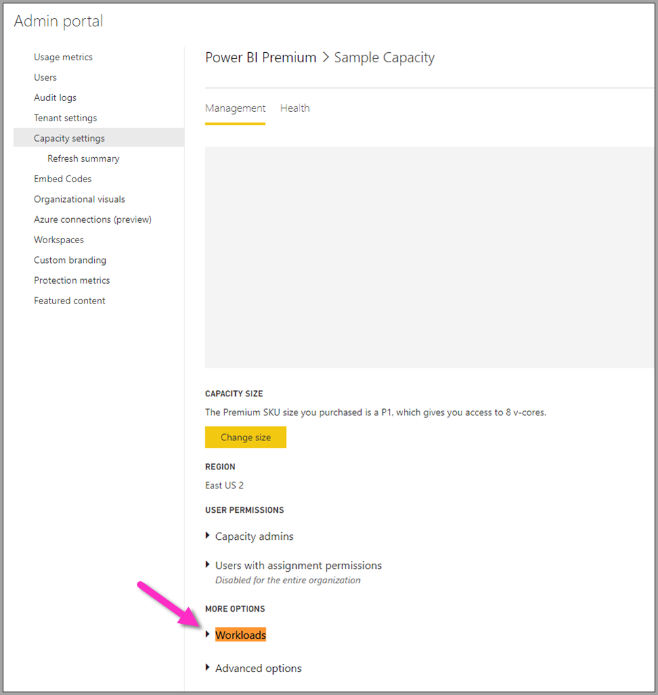

# Configurar cargas de trabalho de fluxo de dados do Power BI Premium

Pode criar cargas de trabalho de fluxo de dados na sua subscrição do Power BI Premium. O Power BI utiliza o conceito de *cargas de trabalho* para descrever conteúdos Premium. As cargas de trabalho incluem Conjuntos de Dados, Relatórios Paginados, Fluxos de Dados e IA. A carga de trabalho dos *fluxos de dados* permite-lhe utilizar a preparação personalizada de fluxos de dados para ingerir, transformar, integrar e enriquecer os dados. Os fluxos de dados do Power BI Premium são geridos no **Portal de administração**.

As secções seguintes descrevem como ativar fluxos de dados na sua organização, como refinar as respetivas definições na sua capacidade Premium e incluem orientações para a utilização comum.

## Ativar fluxos de dados no Power BI Premium

O primeiro requisito para a utilização de fluxos de dados na sua subscrição do Power BI Premium é a ativação da criação e utilização dos fluxos de dados para a sua organização. No **Portal de administração** , selecione **Definições** e defina o controlo de deslize em **Definições do fluxo de dados** para **Ativado** , como apresentado na seguinte imagem.

Após ativar a carga de trabalho de fluxos de dados, esta é configurada com as definições predefinidas. Poderá querer otimizar estas definições conforme as suas necessidades. Em seguida, vamos descrever onde se encontram estas definições, descrever cada uma delas e ajudá-lo a compreender quando poderá querer alterar os valores para otimizar o desempenho do fluxo de dados.

## Refinar as definições do fluxo de dados

Assim que os fluxos de dados forem ativados, pode utilizar o **Portal de administração** para alterar ou refinar a forma como os fluxos de dados são criados e como utilizam recursos na sua subscrição do Power BI Premium. Os seguintes passos mostram como ajustar as suas definições de fluxo de dados.

1. No **Portal de administração** , selecione **Definições do inquilino** para listar todas as capacidades que foram criadas. Selecione uma capacidade para gerir as respetivas definições.

    

2. A sua capacidade do Power BI Premium reflete os recursos disponíveis para os seus fluxos de dados. Pode alterar o tamanho da sua capacidade ao selecionar o botão **Alterar tamanho** , como apresentado na seguinte imagem.

    

3. Em Definições de capacidade, pode configurar as definições de fluxo de dados ao expandir a secção **Cargas de trabalho**.

    

4. Na secção **Cargas de trabalho** , navegue para a área **Fluxos de dados**. A seguinte imagem mostra as definições que pode utilizar para controlar ou refinar o comportamento da carga de trabalho de fluxo de dados da sua capacidade.

    

A seguinte tabela fornece uma descrição básica das definições de fluxos de trabalho.

| **Secção de administrador** | **Nome da definição** | **Descrição** |
|---------|---------|---------|
| **Tamanho da Capacidade** | **Alterar Tamanho** | A capacidade atualmente selecionada está listada com opções para alterar a capacidade. Alterar a capacidade permite aumentar verticalmente e reduzir verticalmente a capacidade. |
| **Carga de trabalho** | **Memória Máxima (%)** | A percentagem máxima de memória disponível que os fluxos de dados podem utilizar numa capacidade. |
| **Carga de trabalho** | **Motor de Computação de Fluxos de Dados Avançado** | Ative esta opção para obter um cálculo de entidades 20 vezes mais rápido ao trabalhar com grandes volumes de dados.  **Tem de reiniciar a capacidade para ativar o novo motor.**  Para obter mais informações, veja [Motor de computação de fluxos de dados avançado](../../admin/service-admin-premium-workloads.md#enhanced-dataflows-compute-engine). |
| **Carga de trabalho** | **Tamanho do Contentor** | O tamanho máximo do contentor utilizado para cada entidade num fluxo de dados. O valor predefinido é 700 MB. Para obter mais informações, veja [Tamanho do contentor](../../admin/service-admin-premium-workloads.md#container-size). |
| **Carga de trabalho** | **Memória do motor de computação (%)** | A percentagem máxima de memória alocada ao motor de computação. O valor predefinido é 30%. |

Nas secções seguintes, iremos detalhar cada uma das definições e a forma como afetam a sua carga de trabalho de fluxo de dados.

### Compreender as opções de carga de trabalho de fluxo de dados

Uma forma simples de pensar nas opções de carga de trabalho de fluxo de dados é com uma analogia. Podemos pensar no *Tamanho da capacidade* ou no tipo de Instância do Power BI Premium que tem como o seu *restaurante*. No seu restaurante, tem a sua *memória de carga de trabalho* , que é a sua *cozinha*. O *motor de computação* é o seu *forno*. Por último, o *contentor* é o tipo de qualidade do seu *chefe de cozinha*. Para avaliar as suas opções de carga de trabalho de fluxo de dados, imagine que está a preparar uma refeição para um grande jantar. Vai ter convidados importantes e tem de ter o jantar preparado para ser servido quando chegarem.

Vamos utilizar esta analogia do restaurante à medida que explicamos e fornecemos orientações sobre cada uma das definições. Vamos começar no nível superior, a sua Capacidade Premium, uma vez que esta é a primeira escolha que efetuamos ao utilizar o Power BI Premium.

#### SKUs com capacidade Premium – aumentar verticalmente o hardware

As cargas de trabalho do Power BI Premium utilizam uma combinação de núcleos de front-end e back-end para servir consultas rápidas em vários tipos de carga de trabalho. O artigo [nós de capacidade](../../admin/service-premium-what-is.md#capacity-nodes) inclui um gráfico que ilustra as especificações atuais em cada uma das ofertas de carga de trabalho disponíveis. As capacidades A3 e superiores podem tirar partido do motor de computação. Portanto, quando quiser utilizar o motor de computação avançado, comece por aí: [Nós de capacidade](../../admin/service-premium-what-is.md#capacity-nodes). 

Na nossa analogia do restaurante, escolher uma capacidade é como escolher um restaurante de melhor qualidade. Apesar do preço mais elevado, sabe que pode esperar um nível de desempenho mais elevado, devido ao aumento de núcleos de front-end, núcleos de back-end e memória. Quando vai a um restaurante maior, tem uma cozinha maior e melhores cozinheiros. Isto é análogo à atualização para um SKU superior no Power BI Premium, o que lhe dá a vantagem de aumentar a velocidade da CPU, aumentar a memória por operação e adicionar mais paralelismo.

#### Memória máxima – dedicar uma capacidade aos fluxos de dados 

A definição **Memória Máxima (%)** é a percentagem de memória da memória física disponível para a capacidade Premium, fornecida para as cargas de trabalho de fluxos de dados. Pode dedicar efetivamente até à capacidade máxima para uma carga de trabalho de fluxo de dados e a capacidade irá aumentar verticalmente de forma dinâmica conforme necessário para a alocação que definiu. Na nossa analogia, se tornar a sua cozinha maior, pode cozinhar mais refeições. De forma semelhante, pode aumentar o tamanho da sua carga de trabalho da capacidade para fluxos de dados e, assim, permitir mais fluxos de dados. Apesar de haver uma governação de recursos dinâmica em curso, a opção de configuração *Memória Máxima (%)* permite-lhe dedicar 100% da memória à carga de trabalho de fluxos de dados. Isto serve para a rara situação em que pretende garantir que a memória da capacidade está disponível para a sua carga de trabalho de fluxo de dados, em vez de depender da Governação de Recursos. Com a nossa analogia, isto seria como certificar-se de que a sua cozinha se concentra na preparação de uma refeição específica para um convidado, ao dedicar toda a cozinha à tarefa. Como é óbvio, a capacidade para dedicar mais não é sinónimo de comida melhor ou de uma preparação mais rápida, como a secção seguinte explica.

#### Tamanho do contentor – problemas de atualização ou falta de memória

Em seguida, vamos falar sobre a definição **Tamanho do Contentor (MB)** . Internamente, os fluxos de dados utilizam um processo chamado *contentores Mashup* para avaliar o seu processo de ETL. O motor divide a sua lógica de consulta nestes contentores e estes podem processar em paralelo. O número de contentores fornece efetivamente o processamento simultâneo e aumenta o desempenho. Estes contentores são restritos pela **Capacidade** em primeiro lugar, pela **Memória Máxima (%)** em segundo lugar e, em seguida, a quantidade de memória que alocou especificamente aos mesmos na definição de contentor, o que por predefinição é 700 MB. Por isso, é possível aumentar a quantidade de memória de hardware e aumentar o tamanho do contentor, mas fazê-lo irá diminuir as operações paralelas enquanto dedica mais memória ao processo de ETL específico dentro dos seus contentores. O número de contentores está limitado a três vezes o número de núcleos de back-end. Isto é importante, uma vez que não pode tornar o contentor muito pequeno e tem muitos contentores paralelos além desse ponto. O tamanho mínimo de um contentor é de 200 MB. O tamanho do contentor também é confinado a um nível de consulta, o que significa que cada consulta é executada no seu próprio contentor, exceto quando as consultas se referem a outras consultas. Nesse caso, são atualizadas como parte do mesmo contentor.

Se voltarmos à nossa analogia, ter menos cozinheiros na cozinha, mas mais concentrados, permite-lhe cozinhar uma refeição muito mais rapidamente, consoante os tipos de pedidos que são feitos e a complexidade da refeição. A contrapartida aqui é ter menos cozinheiros, mas mais tempo de concentração para a preparação. Da mesma forma, aumentar a medida do tamanho do contentor para 1200-1500 MB pode significar um número mais pequeno de trabalhos de ETL mais complexos: atividades como agregações, associações, dinamizações e manipulações de linha ou coluna podem ter um aumento no desempenho à medida que fornecemos mais memória a cada contentor, mas ao fazê-lo, reduzir o número de contentores. Tal como a analogia implica, demasiados pedidos podem tornar o trabalho na cozinha mais lento. É dessa forma que pode pensar no tamanho do contentor: utilize esta opção quando precisar de concluir operações de entidade complexas e se estiver disposto a trocar paralelismo por desempenho, uma vez que este recurso divide a memória alocada a menos contentores.

Em suma, o objetivo é otimizar o tamanho do seu contentor com base nas consultas a serem utilizadas. Por exemplo, carregar apenas dados a partir de uma origem para uma entidade não requer a solicitação de dados e o desempenho de quaisquer operações, apenas carrega os dados para o armazenamento. Precisa do máximo de paralelismo possível para esta situação, uma vez que pretende aumentar a velocidade das operações de atualização e carga. Por outro lado, quando adiciona mais operações de transformação (filtros complexos, associações, agregações), a memória deverá ser muito superior, uma vez que poderemos precisar de processar algumas destas operações de transformação em memória. Tenha em atenção que, se tiver outras operações de fluxo de dados em execução na capacidade, esta pode tornar essas operações mais lentas e forçá-las a esperar numa fila por um bloco de execução. Para esse fim, a monitorização e gestão de fluxos de dados, o desempenho de atualizações e toda a capacidade são apoiados pela aplicação **Métricas de Capacidade do Power BI Premium**. Pode utilizar a aplicação [Power BI Premium Capacity Metrics](../../admin/service-premium-capacity-optimize.md#what-content-is-using-up-my-capacity) para filtrar por capacidade e analisar as métricas de desempenho do conteúdo da área de trabalho. É possível rever as métrica de desempenho e utilização de recursos por hora, para os últimos sete dias, para todos os conteúdos armazenados numa capacidade Premium. Por isso, para investigar o desempenho do fluxo de dados, recomenda-se que comece com a aplicação.

#### Motor de computação avançado – uma oportunidade para melhorar o desempenho

Na nossa analogia, o [motor de computação avançado](dataflows-premium-features.md#the-enhanced-compute-engine) é como um forno. O Power BI utiliza um motor de computação para processar as suas consultas e atualizar as operações. O motor de computação avançado é uma melhoria relativamente ao motor padrão e funciona ao carregar dados para uma Cache de SQL. Além disso, utiliza o SQL para acelerar a transformação de entidades, atualizar operações e ativar a conectividade do DirectQuery. Se compararmos os motores a fornos, ao tirar partido de um forno mais avançado, poderá cozinhar refeições mais rapidamente e com mais eficiência. Quando configurado para **Ativado** ou **Otimizado** para entidades calculadas, se a sua lógica de negócio o permitir, o Power BI utiliza o SQL para acelerar o desempenho. Ter o motor **Ativado** também fornece conectividade do DirectQuery. Como a analogia sugere, determinadas refeições poderão não precisar do forno ou tirar partido do forno. Pode pensar no motor de computação avançado de forma semelhante. Certifique-se de que a sua utilização do fluxo de dados está a tirar partido do motor de computação avançado adequadamente.

> [!NOTE]
> O motor de computação avançado ainda não está disponível em todas as regiões.

## Orientações para cenários comuns

Esta secção fornece orientações para cenários comuns ao utilizar cargas de trabalho de fluxo de dados com o Power BI Premium.

### Tempos de atualização lentos

Os tempos de atualização lentos são, normalmente, um problema de paralelismo. Deve rever as seguintes opções por ordem:

1. Um conceito chave para os tempos de atualização lentos é a natureza da sua preparação de dados. Na nossa analogia do restaurante, explicada anteriormente neste artigo, imagine que já preparou a comida, que está à espera de ser utilizada. Neste cenário, a comida pode ser cozinhada muito mais rapidamente devido ao tempo de preparação reduzido. Da mesma forma, sempre que for possível otimizar os seus tempos de atualização lentos ao tirar partido da preparação e desempenho adiantados da lógica de consultas pela sua origem de dados, deve fazê-lo. Especificamente, ao utilizar uma base de dados relacional como o SQL como origem, veja se a consulta inicial pode ser executada na origem e utilize essa consulta de origem para o fluxo de dados da extração inicial para a origem de dados. Se não conseguir utilizar uma consulta nativa no sistema de origem, desempenhe operações que o [motor de fluxos de dados consiga dobrar para a origem de dados](/power-query/power-query-folding).

2. Avalie a distribuição de tempos de atualização na mesma capacidade. As operações de atualização são um processo que requer uma computação significativa. Com a nossa analogia do restaurante, a distribuição de tempos de atualização corresponde à limitação do número de convidados no seu restaurante. Assim como os restaurantes fazem reservas para os convidados e fazem planos relativamente à capacidade, também deverá considerar as operações de atualização durante os tempos em que a utilização não esteja no seu pico. Isto poderá aliviar bastante a sobrecarga na capacidade.

3. Aumente a quantidade geral de memória atribuída à carga de trabalho. Pense nisto como o tamanho da cozinha. Refinar este recurso é semelhante ao ajuste da quantidade de cozinheiros que pode ter na cozinha. Isto é feito ao ajustar a definição **Memória Máxima (%)** e ao aumentá-la para 100%.

4. Diminua a quantidade de memória para o contentor, o que lhe permite ter mais contentores. Pode pensar nisto da seguinte forma: em vez de contratar um cozinheiro famoso pelas suas competências, como o Gordon Ramsey, contrata vários cozinheiros competentes mas menos dispendiosos. Portanto, tem mais cozinheiros na cozinha, mas esses cozinheiros podem desempenhar apenas tarefas mais pequenas. Assim, tem mais contentores, mas menos memória.

5. Efetue ambos os passos anteriores, o que lhe permite um grau mais elevado de paralelismo, porque fica com mais cozinheiros e uma cozinha maior.
    
6. Se os passos nesta secção não fornecerem o grau de paralelismo pretendido, considere atualizar a sua capacidade para um SKU superior. Em seguida, siga os passos anteriores nesta secção novamente.

### Exceções de fora da memória

Quando se deparar com **exceções de fora da memória** , precisa de aumentar o desempenho dos contentores e memória. Siga estes passos.

1. Aumente a memória do contentor. Isto é semelhante a ter um cozinheiro famoso em oposição a vários cozinheiros, como descrito na secção anterior.

2. Aumente a memória para a carga de trabalho e mais memória para o contentor. Na nossa analogia, isto cria uma cozinha maior e cozinheiro de qualidade superior.

3. Se estas alterações não lhe derem o grau de paralelismo pretendido, considere um SKU do Power BI Premium superior.

### Utilizar o motor de computação para melhorar o desempenho

Siga os passos seguintes para permitir que as cargas de trabalho acionem o motor de computação e melhorem sempre o desempenho:

**Para entidades ligas e calculadas na mesma área de trabalho:**

1. Para a *ingestão* , concentre-se em transmitir os dados para o armazenamento o mais rapidamente possível, utilizando os filtros apenas se for reduzido o tamanho do conjunto de dados no geral. É uma boa prática manter a sua lógica de transformação à parte deste passo e permitir que o motor se concentre na recolha inicial de ingredientes. Em seguida, separe a sua lógica de transformação e negócio num fluxo de dados separado na mesma área de trabalho, com entidades ligadas ou calculadas. Ao fazê-lo, está a permitir que o motor ative e acelere as suas computações. Na nossa analogia, é como preparar a comida na cozinha: a preparação da comida é, normalmente, um passo separado e distinto da recolha dos ingredientes não cozinhados e um pré-requisito para colocar a comida no forno. Da mesma forma, as suas necessidades de lógica precisam de ser preparadas em separado, antes de tirar partido do motor de computação.

2. Certifique-se de que desempenha as operações que se dobram, como uniões, associações, conversões, entre [outras](/power-query/power-query-folding#transformations-that-can-achieve-folding).

3. Crie fluxos de dados [dentro das orientações e limitações publicadas](dataflows-features-limitations.md#dataflows-in-premium).

Também pode utilizar o DirectQuery.

### O motor de computação está ativado, mas o desempenho é lento

Siga os seguintes passos ao investigar cenários em que o motor de computação está ativado, mas está com um desempenho mais lento:

1. Limite as entidades computadas e ligadas que existam na área de trabalho.

2. Se a sua atualização inicial com o motor de computação estiver ativada, os dados serão escritos no lake e na cache. Esta escrita dupla significa que estas atualizações serão mais lentas.

3. Se tiver um fluxo de dados associado a múltiplos fluxos de dados, certifique-se de que agenda as atualizações dos fluxos de dados de origem, para que não sejam todos atualizados ao mesmo tempo.

## Passos seguintes
Os seguintes artigos fornecem mais informações sobre os fluxos de dados e o Power BI:

* [Introdução aos fluxos de dados e à preparação personalizada de dados](dataflows-introduction-self-service.md)
* [Criar um fluxo de dados](dataflows-create.md)
* [Configurar e consumir um fluxo de dados](dataflows-configure-consume.md)
* [Configurar o armazenamento do fluxo de dados para utilizar o Azure Data Lake Gen2](dataflows-azure-data-lake-storage-integration.md)
* [IA com fluxos de dados](dataflows-machine-learning-integration.md)
* [Limitações e considerações dos fluxo de dados](dataflows-features-limitations.md)