# Utilizar agregações no Power BI Desktop

As *agregações* no Power BI permitem-lhe reduzir o tamanho da tabela para que se possa focar nos dados importantes e melhorar o desempenho da consulta. As agregações permitem a análise interativa de macrodados que não é possível de outra forma e podem reduzir drasticamente o custo relacionado com o desbloqueio de grandes conjuntos de dados para a tomada de decisões.

Eis algumas vantagens de utilizar agregações:

- **Melhor desempenho da consulta de macrodados**. Todas as interações com elementos visuais do Power BI submetem consultas DAX ao conjunto de dados. Os dados agregados em cache utilizam uma fração dos recursos necessários para dados detalhados para que possa desbloquear macrodados que de outra forma seriam inacessíveis.
- **Atualização de dados otimizada**. Os tamanhos de cache mais pequenos reduzem os tempos de atualização para que os dados cheguem aos utilizadores mais rapidamente.
- **Arquiteturas equilibradas**. A cache na memória do Power BI consegue processar consultas agregadas, ao limitar as consultas enviadas no modo DirectQuery e ajudar a cumprir os limites de simultaneidade. As restantes consultas de nível de detalhe são, normalmente, consultas filtradas e de nível transacional, que os armazéns de dados e os sistemas de macrodados costumam processar corretamente.

As origens de dados dimensionais, tais como armazéns de dados e data marts, podem utilizar [agregações baseadas na relação](#aggregation-based-on-relationships). Os macrodados baseados no Hadoop muitas vezes [baseiam as agregações em colunas GroupBy](#aggregation-based-on-groupby-columns) (Agrupar por). Este artigo descreve as diferenças de modelação típicas no Power BI para cada tipo de origem de dados.

## Criar uma tabela agregada

Para criar uma tabela agregada:
1. Configure uma nova tabela com os campos pretendidos, dependendo da origem de dados e do modelo. 
1. Defina as agregações na caixa de diálogo **Gerir agregações**.
1. Se aplicável, altere o [modo de armazenamento](#storage-modes) para a tabela agregada. 

### Gerir agregações

Depois de criar a nova tabela que tem os campos pretendidos, no painel **Campos** de qualquer vista do Power BI Desktop, clique com o botão direito do rato na tabela e selecione **Gerir agregações**.

A caixa de diálogo **Gerir agregações** mostra uma linha para cada coluna na tabela, onde pode especificar o comportamento de agregação. No seguinte exemplo, as consultas feitas na tabela de detalhes **Sales** (Vendas) são redirecionadas internamente para a tabela de agregação **Sales Agg** (Agregação de Vendas). 

A lista pendente **Resumo** na caixa de diálogo **Gerir agregações** fornece os seguintes valores:
- Contagem
- GroupBy
- Max
- Mín
- Soma
- Linhas da tabela de contagem

Neste exemplo de agregação baseada na relação, as entradas GroupBy são opcionais. Com exceção de DISTINCTCOUNT, as entradas não afetam o comportamento de agregação e servem principalmente para fins de legibilidade. Sem as entradas GroupBy, as agregações continuariam a obter resultados com base nas relações. O mesmo não acontece com o [exemplo de macrodados](#aggregation-based-on-groupby-columns) que abordaremos mais adiante neste artigo, onde são necessárias as entradas GroupBy.

Depois de definir as agregações pretendidas, selecione **Aplicar Tudo**. 

### Validações

A caixa de diálogo **Gerir agregações** impõe as seguintes validações notáveis:

- A **Coluna de Detalhes** tem de ter o mesmo tipo de dados que a **Coluna de Agregação**, exceto para as funções de **Resumo** Contagem e Contagem de linhas da tabela. A Contagem e a Contagem de linhas da tabela são apenas disponibilizadas para as colunas de agregação de número inteiro e não necessitam de um tipo de dados correspondente.
- Não são permitidas agregações em cadeia que abranjam três ou mais tabelas. Por exemplo, as agregações na **Tabela A** não se podem referir a uma **Tabela B** que tenha agregações que se referem a uma **Tabela C**.
- Não são permitidas agregações duplicadas, em que duas entradas utilizem a mesma função de **Resumo** e se refiram à mesma **Tabela de Detalhes** e **Coluna de Detalhes**.
- A **Tabela de Detalhes** tem de utilizar o modo de armazenamento DirectQuery e não o modo Importar.
- Não é suportado o agrupamento por uma coluna de chave externa utilizada por uma relação inativa e com base na função USERELATIONSHIP para resultados da agregação.

A maioria das validações é imposta através da desativação dos valores de lista pendente e da apresentação do texto explicativo na descrição, tal como mostra a seguinte imagem.

### As tabelas de agregação estão ocultas

Os utilizadores com acesso só de leitura ao conjunto de dados não podem consultar tabelas de agregação. Isso evita preocupações com a segurança ao utilizar a *segurança ao nível da linha (RLS)* . Os consumidores e as consultas referem-se à tabela de detalhes e não à tabela de agregação e não precisam de saber que a tabela de agregação existe.

Por este motivo, as tabelas de agregação estão ocultas da vista **Relatório**. Se a tabela ainda não estiver oculta, a caixa de diálogo **Gerir agregações** irá defini-la para ficar oculta quando selecionar **Aplicar tudo**.

### Modos de armazenamento
A funcionalidade de agregação interage com modos de armazenamento ao nível da tabela. As tabelas do Power BI podem utilizar os modos de armazenamento *DirectQuery*, *Importar* ou *Duplo*. O modo DirectQuery consulta diretamente o back-end, enquanto o modo Importar coloca dados em cache na memória e envia consultas para os dados em cache. Todas as origens de dados de importação e do DirectQuery não multidimensionais do Power BI podem funcionar com agregações. 

Para definir o modo de armazenamento de uma tabela agregada para o modo Importar de forma a acelerar as consultas, selecione a tabela agregada na vista **Modelo** do Power BI Desktop. No painel **Propriedades**, expanda **Avançadas**, abra a lista pendente com a seleção em **Modo de armazenamento** e selecione **Importar**. Não se esqueça de que esta ação é irreversível. 

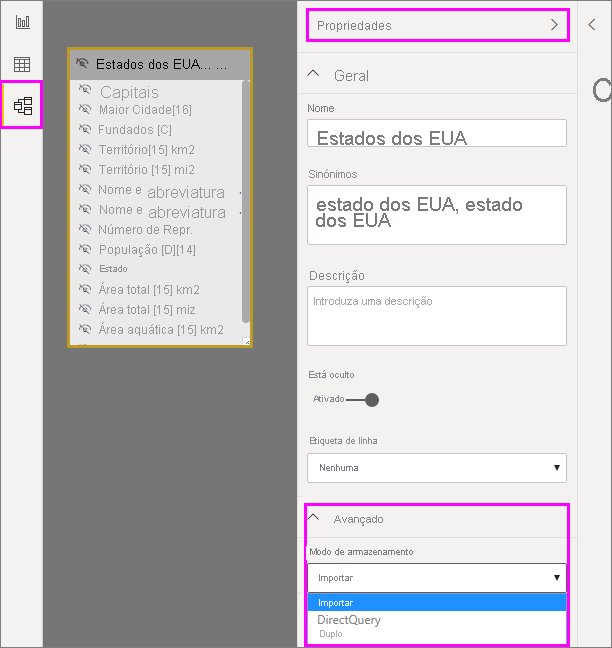

Para obter mais informações sobre o modo de armazenamento de tabelas, veja [Gerir o modo de armazenamento no Power BI Desktop](desktop-storage-mode.md).

### RLS para agregações

Para que as agregações funcionem corretamente, as expressões RLS (segurança ao nível da linha) devem filtrar a tabela de agregação e a tabela de detalhes. 

No exemplo a seguir, a expressão RLS na tabela **Geography** (Geografia) funciona com as agregações porque Geografia está no lado da filtragem das relações com as tabelas **Sales** (Vendas) e **Sales Agg** (Agregação de Vendas). As consultas correspondentes e não correspondentes à tabela de agregação terão a RLS aplicada com êxito.

Uma expressão RLS na tabela **Product** (Produto) filtra apenas a tabela de detalhes **Sales** (Vendas) e não a tabela agregada **Sales Agg** (Agregação de Vendas). Uma vez que a tabela de agregação é outra representação dos dados na tabela de detalhes, não seria seguro responder a consultas da tabela de agregação se não fosse possível aplicar o filtro RLS. Não se recomenda filtrar apenas a tabela de detalhes porque as consultas do utilizador desta função não beneficiarão com os resultados da agregação. 

Não é permitida uma expressão RLS que filtra apenas a tabela de agregação **Sales Agg** (Agregação de Vendas) e não a tabela de detalhes **Sales** (Vendas).

Para as [agregações baseadas em colunas GroupBy](#aggregation-based-on-groupby-columns), pode ser utilizada uma expressão RLS aplicada à tabela de detalhes para filtrar a tabela de agregação porque todas as colunas GroupBy na tabela de agregação são abrangidas pela tabela de detalhes. Por outro lado, não se pode aplicar um filtro RLS da tabela de agregação na tabela de detalhe.

## Agregação baseada em relações

Normalmente, os modelos dimensionais utilizam *agregações baseadas em relações*. Os conjuntos de dados do Power BI de armazéns de dados e de data marts assemelham-se a esquemas de estrelas/flocos de neve com relações entre tabelas de dimensão e tabelas de factos.

No seguinte modelo de uma única origem de dados, as tabelas estão a utilizar o modo de armazenamento DirectQuery. A tabela de factos **Sales** (Vendas) contém mil milhões de linhas. A definição do modo de armazenamento da tabela **Sales** (Vendas) para Importar com vista à colocação em cache consumiria bastante memória e levaria à sobrecarga de gestão.

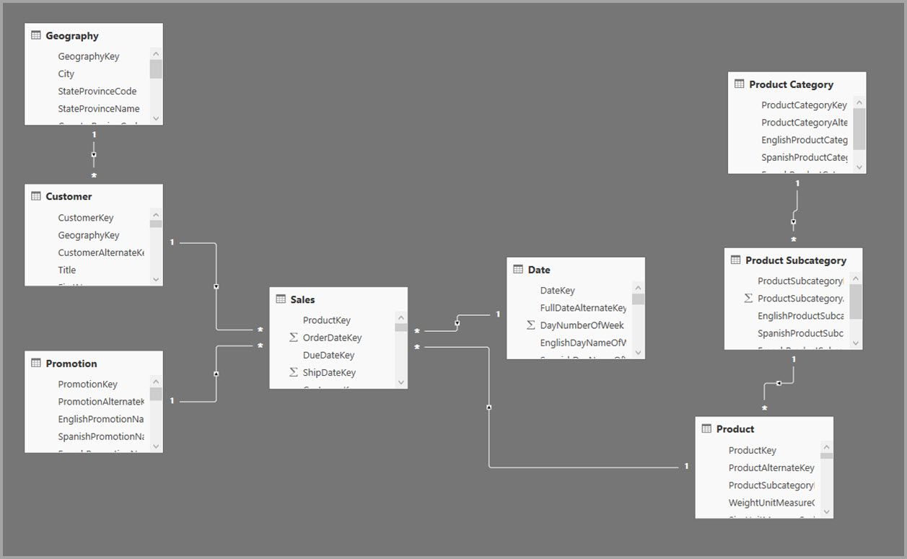

Em alternativa, crie a tabela de agregação **Sales Agg** (Agregação de Vendas). Na tabela **Sales Agg** (Agregação de Vendas), o número de linhas deve ser igual à soma de **SalesAmount** (MontanteDeVendas) agrupada por **CustomerKey** (ClientePrincipal), **DateKey** (DataPrincipal) e **ProductSubcategoryKey** (SubcategoriaDeProdutoPrincipal). A tabela **Sales Agg** (Agregação de Vendas) tem uma granularidade superior à tabela **Sales** (Vendas), pelo que, em vez de milhares de milhões, poderá conter milhões de linhas, o que é muito mais fácil de gerir.

Se as seguintes tabelas de dimensão forem as normalmente utilizadas para as consultas com elevado valor comercial, podem filtrar a tabela **Sales Agg** (Agregação de Vendas) ao utilizar relações *um-para-muitos* ou *muitos-para-um*.

- Geografia
- Cliente
- Data
- Subcategoria de Produto
- Product Category (Categoria de Produto)

A imagem seguinte ilustra este modelo.

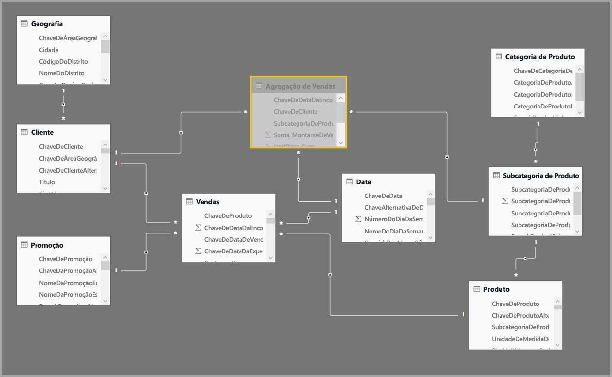

A tabela seguinte mostra as agregações da tabela **Sales Agg** (Agregação de Vendas).

> [!NOTE]
> A tabela **Sales Agg** (Agregação de Vendas), como qualquer tabela, tem a flexibilidade de ser carregada de várias formas. A agregação pode ser executada na base de dados de origem através de processos ETL/ELT ou através da [expressão M](/powerquery-m/power-query-m-function-reference) para a tabela. A tabela de agregação pode utilizar o modo de armazenamento Importar, com ou sem [atualização incremental no Power BI Premium](../admin/service-premium-incremental-refresh.md), ou pode utilizar o modo DirectQuery e ser otimizada para consultas rápidas com [índices columnstore](/sql/relational-databases/indexes/columnstore-indexes-overview). Esta flexibilidade permite obter arquiteturas equilibradas que consigam distribuir a carga de consulta para evitar estrangulamentos.

Se alterar o modo de armazenamento da tabela agregada **Sales Agg** (Agregação de Vendas) para **Importar**, é aberta uma caixa de diálogo que informa que as tabelas de dimensão relacionadas podem ser definidas para o modo de armazenamento *Duplo*. 

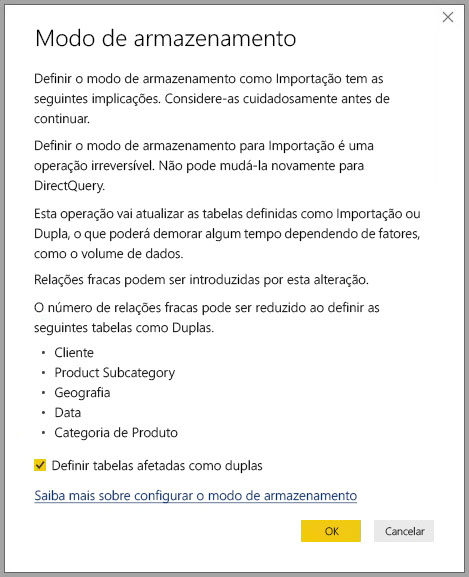

Ao definir as tabelas de dimensão relacionadas para modo de armazenamento Duplo permite que estas atuem como modo Importar ou DirectQuery, consoante a subconsulta. No exemplo:

- As consultas que agregam métricas da tabela **Sales Agg** (Agregação de Vendas), no modo de armazenamento Duplo, e que se agrupam por atributo(s) das tabelas relacionadas no modo Duplo, podem ser devolvidas a partir da cache na memória.
- As consultas que agregam métricas da tabela **Sales** (Vendas), no modo de armazenamento DirectQuery, e que se agrupam por atributo(s) das tabelas relacionadas no modo Duplo, podem ser devolvidas no modo DirectQuery. A lógica de consulta, incluindo a operação GroupBy, é transmitida à base de dados de origem.

Para obter mais informações sobre o modo de armazenamento Duplo, veja [Gerir o modo de armazenamento no Power BI Desktop](desktop-storage-mode.md).

### Relações fortes vs. fracas

Os resultados da agregação com base nas relações exigem relações fortes.

As relações fortes incluem as seguintes combinações de modos de armazenamento, em que ambas as tabelas são provenientes de uma única origem:

| Tabela no lado *muitos* | Tabela no lado *1* |
| ------------- |----------------------| 
| Duplo          | Duplo                 | 
| Importar        | Importação ou Dual       | 
| DirectQuery   | DirectQuery ou Dual  | 

O único caso em que uma relação de *origem cruzada* é considerada forte é quando ambas as tabelas estão definidas como Importar. As relações de muitos para muitos são sempre consideradas fracas.

Para obter resultados da agregação de *origem cruzada* que não dependem de relações, veja [Agregações baseadas em colunas GroupBy](#aggregation-based-on-groupby-columns). 

### Exemplos de consulta de agregação baseada em relações

A consulta seguinte obtém resultados da agregação porque as colunas na tabela **Date** (Data) têm o nível de detalhe que permite obter resultados da agregação. A coluna **SalesAmount** (MontanteDeVendas) utiliza a agregação **Sum** (Soma).

A consulta seguinte não obtém resultados da agregação. Apesar de se pedir a soma de **SalesAmount** (MontanteDeVendas), a consulta está a realizar a operação GroupBy numa coluna na tabela **Product** (Produto), que não tem a granularidade que permite obter resultados da agregação. Se observar as relações no modelo, uma subcategoria de produto pode ter múltiplas linhas **Product** (Produto). A consulta não conseguiria determinar a que produto agregar. Neste caso, a consulta é revertida para o DirectQuery e submete uma consulta SQL para a origem de dados.

As agregações não se destinam apenas a cálculos simples que realizam uma soma básica. Também podem ser vantajosas para cálculos complexos. Conceptualmente, um cálculo complexo é dividido em subconsultas para cada função SUM, MIN, MAX e COUNT, e cada subconsulta é avaliada para determinar se é possível obter resultados da agregação. Esta lógica nem sempre é verdadeira devido à otimização do plano de consulta, mas, em geral, deve ser aplicada. O exemplo seguinte obtém resultados da agregação:

A função COUNTROWS pode beneficiar com as agregações. A seguinte consulta obtém resultados da agregação porque existe uma agregação das linhas da tabela **Count** (Contagem) definida para a tabela **Sales** (Vendas).

A função AVERAGE pode beneficiar com as agregações. A consulta seguinte obtém resultados da agregação porque AVERAGE (MÉDIA) é obtida internamente através da SUM (SOMA) dividida pela COUNT (CONTAGEM). Como a coluna **UnitPrice** (PreçoUnitário) tem agregações definidas para SUM e COUNT, a agregação dará resultados.

Em alguns casos, a função DISTINCTCOUNT pode beneficiar com as agregações. A consulta seguinte obtém resultados da agregação porque existe uma entrada GroupBy (AgruparPor) para **CustomerKey** (ClientePrincipal), que mantém a distinção de **CustomerKey** (ClientePrincipal) na tabela de agregação. Esta técnica poderia continuar a obter o limiar de desempenho em que mais de dois a cinco milhões de valores distintos podem afetar o desempenho da consulta. No entanto, pode ser útil em contextos em que existam milhares de milhões de linhas na tabela de detalhes, mas dois a cinco milhões de valores distintos na coluna. Neste caso, a função DISTINCTCOUNT pode ser realizada com maior rapidez do que uma análise da tabela com milhares de milhões de linhas, mesmo que tenha sido colocada em cache dentro da memória.

As funções de análise de tempo DAX têm em consideração a agregação. A seguinte consulta tem como resultado a agregação porque a função DATESYTD gera uma tabela de valores **CalendarDay** e a tabela de agregação está numa granularidade que é coberta para colunas Agrupar por na tabela **Data**. Este é um exemplo de um filtro de valor de tabela para a função CALCULATE, que pode funcionar com agregações.

## Agregações baseadas em colunas GroupBy 

Os modelos de macrodados baseados no Hadoop têm caraterísticas diferentes das dos modelos dimensionais. Para evitar associações entre grandes tabelas, os modelos de macrodados não utilizam muitas vezes relações, mas desnormalizam atributos de dimensão para tabelas de factos. Pode desbloquear esses modelos de macrodados para análise interativa através de *agregações baseadas em colunas GroupBy*.

A tabela seguinte contém a coluna numérica **Movement** (Deslocação) para ser agregada. Todas as outras colunas são atributos pelos quais se irá agrupar. A tabela contém dados de IoT e um grande número de linhas. O modo de armazenamento é o DirectQuery. As consultas na origem de dados que são agregadas em todo o conjunto de dados são lentas devido ao grande volume. 

Para ativar a análise interativa neste conjunto de dados, pode adicionar uma tabela de agregação que agrupa pela maioria dos atributos, mas exclui os atributos de cardinalidade elevada, tais como a longitude e a latitude. Isto reduz drasticamente o número de linhas, sendo a tabela suficientemente pequena para caber confortavelmente numa cache dentro da memória. 

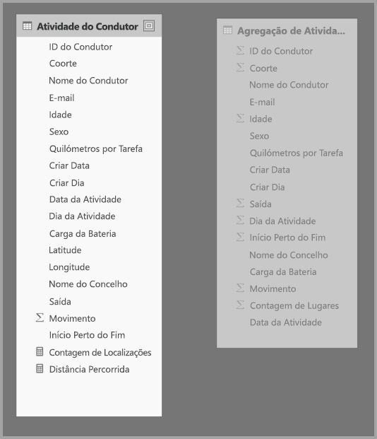

Os mapeamentos de agregação da tabela **Driver Activity Agg** (Agregação de Atividades do Condutor) na caixa de diálogo **Gerir agregações** são definidos por si. 

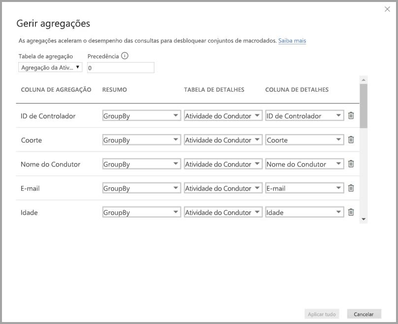

Nas agregações baseadas em colunas GroupBy (Agrupar por), as entradas **GroupBy** não são opcionais. Sem elas, as agregações não obtêm resultados. O mesmo não acontece quando se utilizam agregações baseadas em relações, em que as entradas GroupBy são opcionais.

A tabela seguinte mostra as agregações da tabela **Driver Activity Agg** (Agregação de Atividades do Condutor).

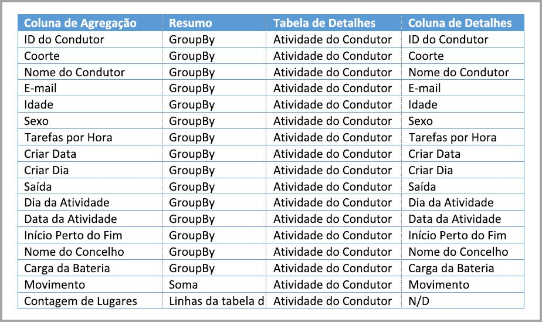

Pode definir o modo de armazenamento da tabela agregada **Driver Activity Agg** (Agregação de Atividades do Condutor) para Importar.

### Exemplo de consulta de agregação GroupBy

A seguinte consulta obtém resultados da agregação porque a coluna **Activity Date** (Data de Atividade) é abrangida pela tabela de agregação. A função COUNTROWS utiliza a agregação **Contagem de linhas da tabela**.

É aconselhável utilizar as agregações **Contagem de linhas da tabela** especialmente para os modelos que contêm atributos de filtro em tabelas de factos. O Power BI pode submeter consultas no conjunto de dados com a função COUNTROWS nos casos em que isso não é explicitamente pedido pelo utilizador. Por exemplo, a caixa de diálogo de filtros mostra a contagem de linhas para cada valor.

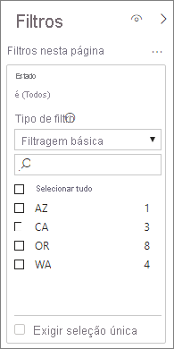

## Técnicas de agregação combinadas

Pode combinar as relações e as técnicas de colunas GroupBy para agregações. As agregações baseadas em relações podem exigir a divisão das tabelas de dimensão desnormalizadas em múltiplas tabelas. Se tal for dispendioso ou impraticável para algumas tabelas de dimensão, pode replicar os atributos necessários na tabela de agregação para essas dimensões e utilizar relações para outras.

Por exemplo, o seguinte modelo replica **Month** (Mês), **Quarter** (Trimestre), **Semester** (Semestre) e **Year** (Ano) na tabela **Sales Agg** (Agregação de Vendas). Não existe qualquer relação entre a tabela **Sales Agg** (Agregação de Vendas) e a tabela **Date** (Data), mas existem relações com **Customer** (Cliente) e **Product Subcategory** (Subcategoria de Produto). O modo de armazenamento da tabela **Sales Agg** (Agregação de Vendas) é o de importação.

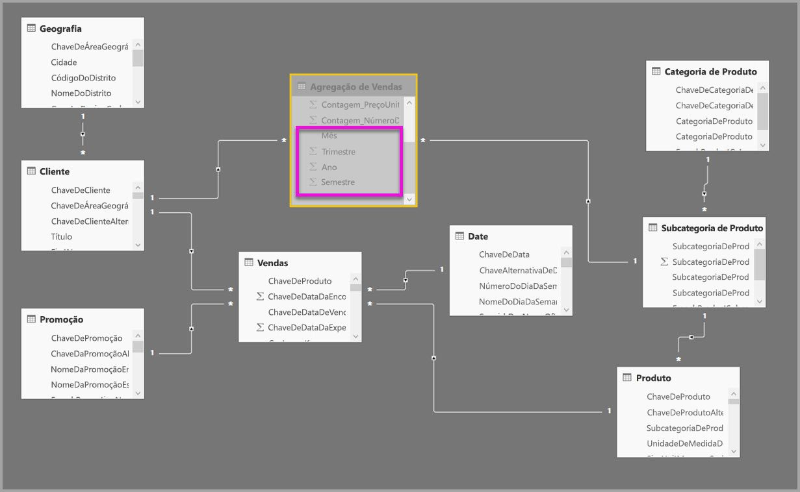

A tabela seguinte mostra as entradas definidas na caixa de diálogo **Gerir agregações** da tabela **Sales Agg** (Agregação de Vendas). As entradas GroupBy em que **Date** (Data) corresponde à tabela de detalhes são obrigatórias para obter resultados de agregações para as consultas agrupadas pelos atributos **Date** (Data). Tal como no exemplo anterior, as entradas **GroupBy** (Agrupar por) para **CustomerKey** (ClientePrincipal) e **ProductSubcategoryKey** (SubcategoriaDeProdutoPrincipal) não afetam os resultados da agregação, com a exceção de DISTINCTCOUNT, devido à presença de relações.

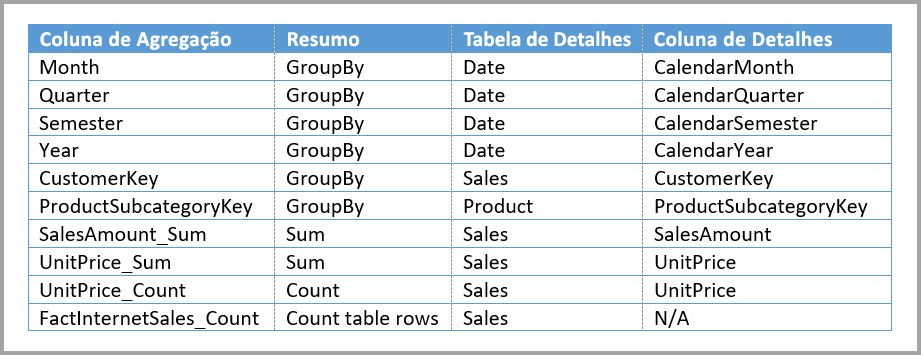

### Exemplos de consulta de agregação combinada

A seguinte consulta obtém resultados da agregação porque **CalendarMonth** (MêsDoCalendário) está abrangido pela tabela de agregação e **CategoryName** (NomeDaCategoria) é acessível através de relações um-para-muitos. A coluna **SalesAmount** (MontanteDeVendas) utiliza a agregação **SUM** (Soma).

A seguinte consulta não obtém resultados da agregação, porque **CalendarDay** (DiaDoCalendário) não é abrangido pela tabela de agregação.

A seguinte consulta de análise de tempo não obtém resultados da agregação porque a função DATESYTD gera uma tabela de valores **CalendarDay** (DiaDoCalendário) que não é abrangida pela tabela de agregação.

## Precedência de agregação

A precedência de agregação permite que múltiplas tabelas de agregação sejam consideradas por uma subconsulta única.

O seguinte exemplo é um [modelo composto](desktop-composite-models.md) que contém múltiplas origens:

- A tabela **Driver Activity** (Atividade do Condutor) no modo DirectQuery contém mais de um bilião de linhas de dados de IoT obtidos a partir de um sistema de macrodados. Destina-se a consultas de pormenorização para ver leituras de IoT individuais em contextos de filtros controlados.
- A tabela **Driver Activity Agg** (Agregação de Atividades do Condutor) é uma tabela de agregação intermediária no modo DirectQuery. Contém mais de mil milhões de linhas no Azure SQL Data Warehouse e está otimizada na origem com índices columnstore.
- A tabela **Driver Activity Agg2** (Agregação de Atividades do Condutor2) no modo Importar tem um nível de granularidade elevado porque os atributos Agrupar por são poucos e têm uma cardinalidade baixa. O número de linhas poderia estar apenas na ordem dos milhares para que a tabela coubesse facilmente numa cache dentro da memória. Estes atributos costumavam ser utilizados por um dashboard executivo com uma posição de relevo, pelo que as consultas que se referem a esses atributos devem ser o mais rápidas possível.

> [!NOTE]
> As tabelas de agregação do DirectQuery que utilizam uma origem de dados diferente da origem da tabela de detalhes só são suportadas se a tabela de agregação for de uma origem do SQL Server, Azure SQL ou do Azure SQL Data Warehouse.

A quantidade de memória deste modelo é relativamente pequena, mas permitirá desbloquear um enorme conjunto de dados. Representa uma arquitetura equilibrada porque distribui a carga de consultas pelos componentes da arquitetura ao utilizá-los com base nos seus pontos fortes.

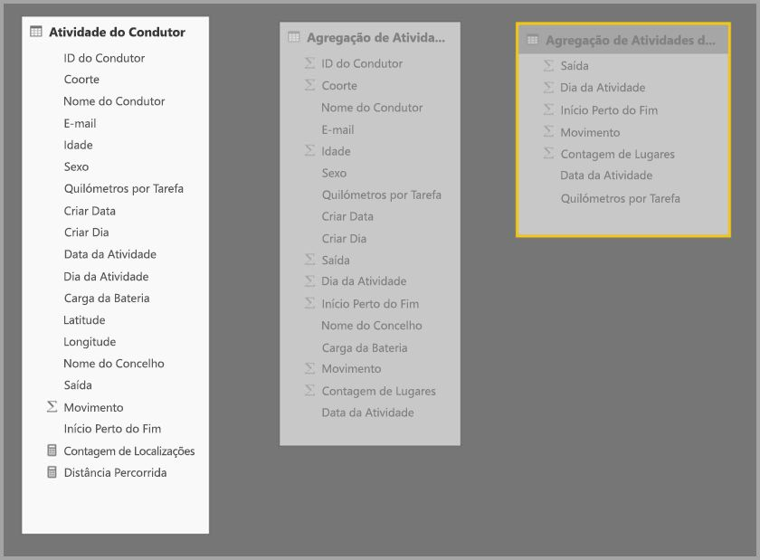

A caixa de diálogo **Gerir agregações** de **Driver Activity Agg2** (Agregação 2 de Atividades do Condutor) define o campo **Precedência** para *10*, que é superior a **Driver Activity Agg** (Agregação de Atividades do Condutor). A definição de precedência mais elevada significa que as consultas que utilizam agregações considerarão primeiro **Driver Activity Agg2** (Agregação 2 de Atividades do Condutor). As subconsultas que não têm a granularidade para que a tabela **Driver Activity Agg2** (Agregação de Atividades do Condutor2) devolva resultados considerarão então a tabela **Driver Activity Agg** (Agregação de Atividades do Condutor). As consultas de detalhes que não conseguirem obter resposta de uma tabela de agregação serão direcionadas para a tabela **Driver Activity** (Atividade do Condutor).

A tabela especificada na coluna **Tabela de Detalhes** é a **Driver Activity** (Atividade do Condutor) e não a **Driver Activity Agg** (Agregação de Atividades do Condutor) porque não são permitidas agregações em cadeia.

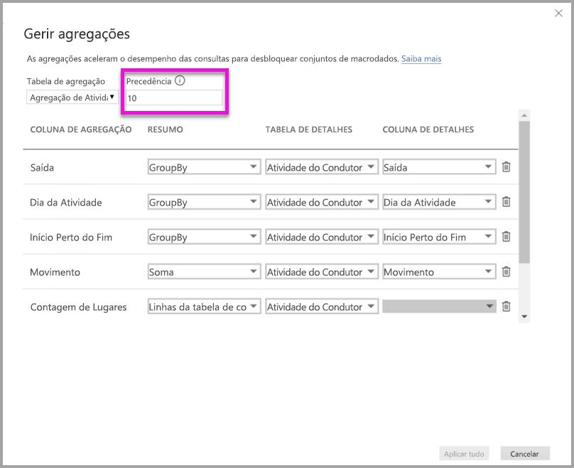

A tabela seguinte mostra as agregações da tabela **Driver Activity Agg2** (Agregação 2 de Atividades do Condutor).

## Detetar se as consultas obtêm ou não resultados da agregação

O SQL Profiler consegue detetar se as consultas são devolvidas do motor de armazenamento de cache na memória ou enviadas para a origem de dados pelo DirectQuery. Pode utilizar o mesmo processo para detetar se está a obter resultados das agregações. Para obter mais informações, veja [Consultas que obtêm ou não resultados da cache](desktop-storage-mode.md#queries-that-hit-or-miss-the-cache). 

O SQL Profiler também fornece o evento `Query Processing\Aggregate Table Rewrite Query` alargado.

O fragmento JSON seguinte mostra um exemplo do resultado do evento quando é utilizada uma agregação.

- **matchingResult** mostra que a subconsulta utilizou uma agregação.
- **dataRequest** mostra as colunas GroupBy e as colunas agregadas utilizadas pela subconsulta.
- **mapping** mostra as colunas na tabela de agregação às quais foi mapeado.

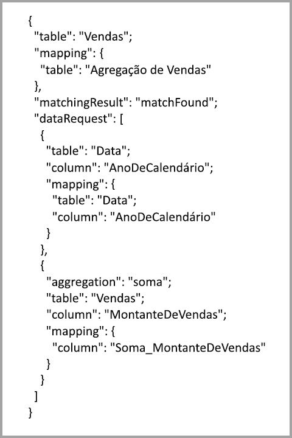

## Manter as caches sincronizadas

As agregações que combinam os modos de armazenamento DirectQuery, Importar e/ou Duplo podem devolver dados diferentes, salvo se a cache na memória permanecer sincronizada com os dados de origem. Por exemplo, a execução da consulta não tentará dissimular os problemas de dados ao filtrar, por exemplo, os resultados do DirectQuery para corresponder aos valores da cache. Existem técnicas estabelecidas para lidar com estes problemas na origem, se necessário. As otimizações de desempenho devem ser utilizadas apenas de modo que não comprometam a sua capacidade de satisfazer os requisitos comerciais. É da sua responsabilidade conhecer os seus fluxos de dados e criá-los em conformidade. 

## Próximos passos

Para obter mais informações sobre modelos compostos, veja:

- [Utilizar modelos compostos no Power BI Desktop](desktop-composite-models.md)
- [Aplicar relações muitos-para-muitos no Power BI Desktop](desktop-many-to-many-relationships.md)
- [Gerir o modo de armazenamento no Power BI Desktop](desktop-storage-mode.md)

Para obter mais informações sobre o DirectQuery, veja:

- [Acerca de utilizar o DirectQuery no Power BI](../connect-data/desktop-directquery-about.md)
- [Origens de dados do Power BI](../connect-data/power-bi-data-sources.md)
