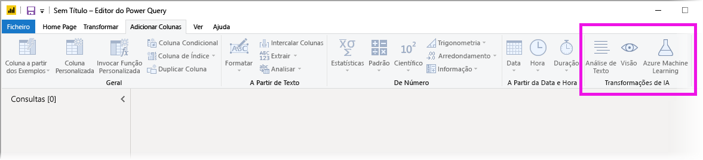
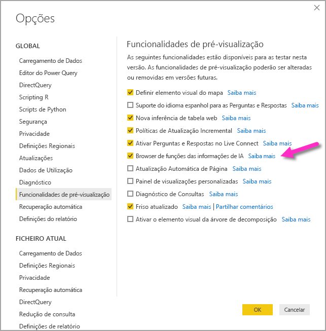
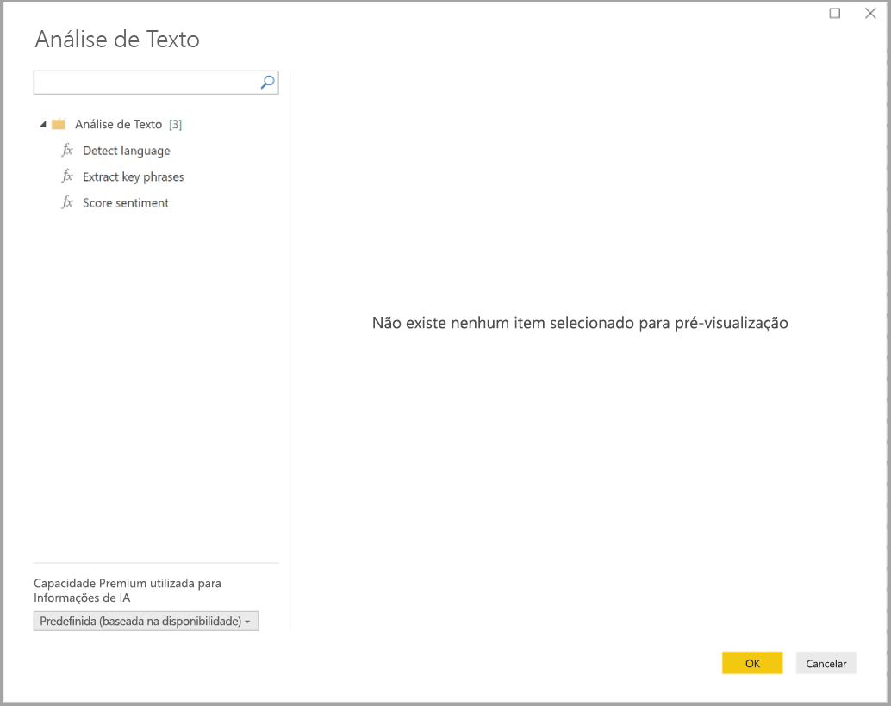
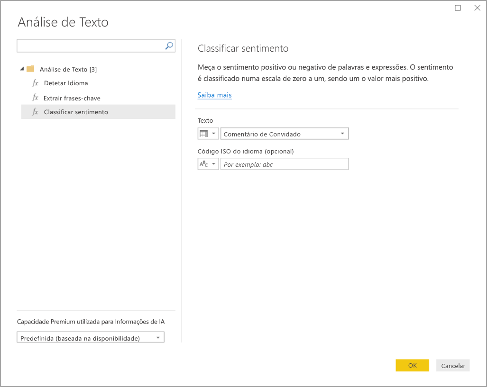
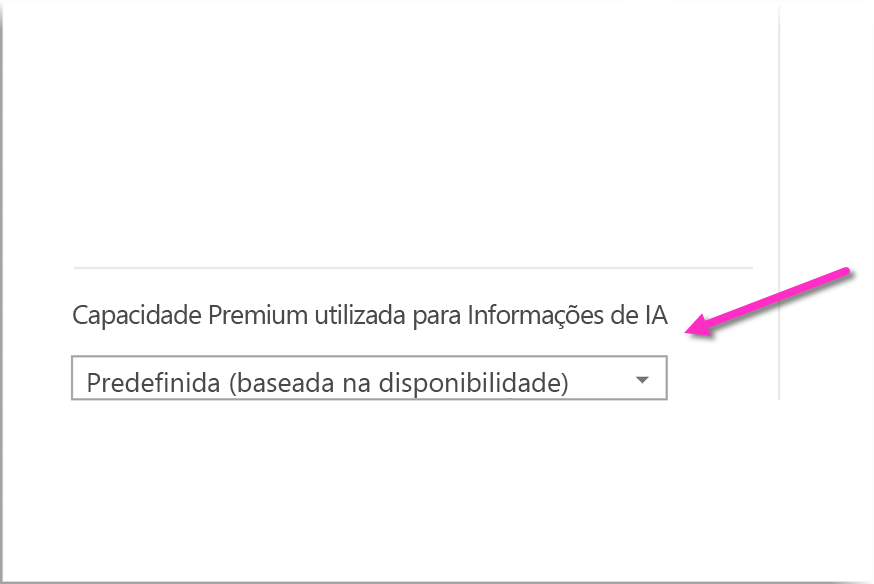
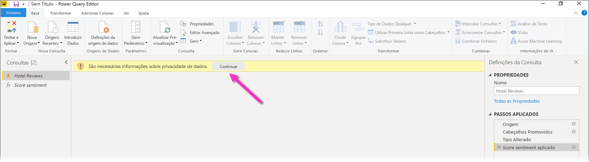
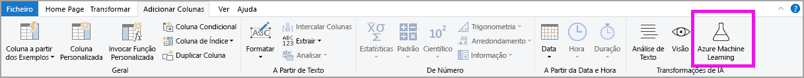
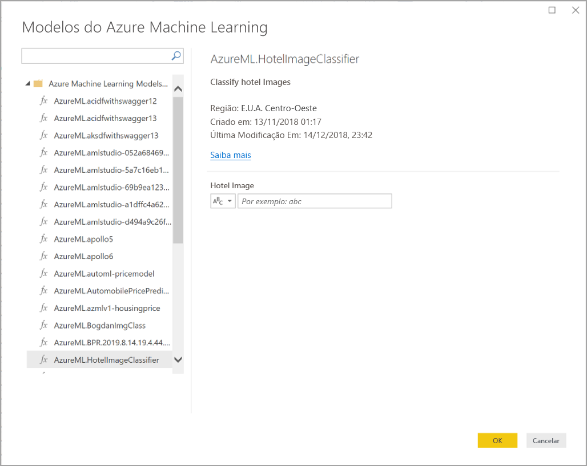

# Use AI Insights in Power BI Desktop (preview) (Utilizar as informações de IA no Power BI Desktop [pré-visualização])

No Power BI, pode utilizar Informações de IA para obter acesso a uma coleção de modelos de machine learning previamente preparados que aumentam os esforços de preparação de dados. As Informações de IA são acedidas no **Editor do Power Query** e as funcionalidades e funções são acedidas através dos separadores **Base** e **Adicionar Coluna** do **Editor do Power Query**. 

Este artigo descreve as funções da Análise de Texto e as funções de Visão, ambas nos Serviços Cognitivos do Azure. Além disso, este artigo também inclui uma secção que descreve as funções personalizadas disponíveis no Power BI a partir do Azure Machine Learning.

## Como ativar as Informações de IA

As informações de IA no Power BI são uma funcionalidade de pré-visualização e devem ser ativadas. Para a ativar, selecione **Ficheiro > Opções e definições > Opções** e, em seguida, **Funcionalidades de pré-visualização** na coluna esquerda. No painel direto, poderá encontrar a seleção **Browser de funções das Informações de IA**. Marque a caixa junto a **Browser de funções das Informações de IA** para ativar a funcionalidade de pré-visualização. Terá de reiniciar o Power BI Desktop para que a alteração da funcionalidade de pré-visualização produza efeito.

## Utilizar a Análise de Texto e a Visão

Com a Análise de Texto e a Visão do Power BI, pode aplicar diferentes algoritmos dos [Serviços Cognitivos do Azure](https://azure.microsoft.com/services/cognitive-services/) para enriquecer os dados no Power Query.

Serviços suportados atualmente:

* [Análise de Sentimentos](https://docs.microsoft.com/azure/cognitive-services/text-analytics/how-tos/text-analytics-how-to-sentiment-analysis)
* [Extração de Expressões-Chave](https://docs.microsoft.com/azure/cognitive-services/text-analytics/how-tos/text-analytics-how-to-keyword-extraction)
* [Deteção de Idioma](https://docs.microsoft.com/azure/cognitive-services/text-analytics/how-tos/text-analytics-how-to-language-detection)
* [Etiquetagem de Imagens](https://docs.microsoft.com/azure/cognitive-services/computer-vision/concept-tagging-images). 

As transformações são executadas no serviço Power BI e não precisam de uma subscrição dos Serviços Cognitivos do Azure. 

> [!IMPORTANT]
> 
> A utilização das funcionalidades de Análise de Texto e Visão requer o Power BI Premium.

### Ativar a Análise de Texto e a Visão nas capacidades Premium

Os Serviços Cognitivos são suportados para os nós EM2, A2 ou P1 e superior da capacidade Premium. É utilizada uma carga de trabalho de IA separada na capacidade para executar os Serviços Cognitivos. Durante a pré-visualização pública destas funcionalidades (antes de junho de 2019), esta carga de trabalho estava desativada por predefinição. Antes de utilizar os Serviços Cognitivos no Power BI, a carga de trabalho de IA tem de ser ativada nas **definições de capacidade** do portal de administração. Pode ativar a **carga de trabalho de IA** na secção **cargas de trabalho** e definir a quantidade máxima de memória que gostaria que fosse consumida por esta carga de trabalho. O limite de memória recomendado é de 20%. Exceder este limite torna o processo de consulta mais lento.

### Funções disponíveis

Esta secção descreve as funções disponíveis nos Serviços Cognitivos no Power BI.

#### Detetar Idioma

A função de deteção de idioma avalia a entrada de texto e, para cada campo, devolve o nome do idioma e o identificador ISO. Esta função é útil para colunas de dados que recolhem texto arbitrário, cujo idioma é desconhecido. A função espera dados em formato de texto como entrada.

A Análise de Texto reconhece até 120 idiomas. Para obter mais informações, veja os [idiomas suportados](https://docs.microsoft.com/azure/cognitive-services/text-analytics/text-analytics-supported-languages).

#### Extrair Expressões-Chave

A função **Extração de Expressões-Chave** avalia texto não estruturado e, para cada campo de texto, devolve uma lista de expressões-chave. A função precisa de um campo de texto como entrada e aceita uma entrada opcional para **Informações de cultura**.

A extração de expressões-chave funciona melhor quando são disponibilizados segmentos de texto maiores para processamento. Isto é o oposto da análise de sentimentos, que oferece um desempenho melhor em blocos de texto mais pequenos. Para obter os melhores resultados em ambas as operações, considere reestruturar as entradas em conformidade.

#### Classificar sentimento

A função **Classificar Sentimento** avalia a entrada de texto e devolve uma classificação de sentimento para cada documento, de 0 (negativo) a 1 (positivo). Esta função é útil para detetar os sentimentos positivo e negativo nas redes sociais, críticas de clientes e fóruns de debate.

A Análise de Texto utiliza um algoritmo de classificação de aprendizagem automática para gerar uma classificação de sentimento entre 0 e 1. As classificações mais próximas de 1 indicam um sentimento positivo, as classificações mais próximas de 0 indicam um sentimento negativo. O modelo é previamente preparado com um extenso corpo de texto com associações de sentimentos. Atualmente, não é possível fornecer os seus próprios dados de preparação. O modelo utiliza uma combinação de técnicas durante a análise de texto, incluindo o processamento de texto, a análise de categorias gramaticais, a disposição das palavras e associações de palavras. Para obter mais informações sobre o algoritmo, veja [Introducing Text Analytics](https://blogs.technet.microsoft.com/machinelearning/2015/04/08/introducing-text-analytics-in-the-azure-ml-marketplace/) (Introdução à Análise de Texto).

A análise de sentimentos é realizada no campo de entrada inteiro, em vez de extrair sentimentos de uma entidade específica no texto. Na prática, há a tendência de melhorar a precisão da classificação quando os documentos contêm uma ou duas frases, em vez de um grande bloco de texto. Durante a fase de avaliação da objetividade, o modelo determina se um campo de entrada como um todo é objetivo ou se contém sentimento. Um campo de entrada maioritariamente objetivo não avança para a fase de deteção de sentimento, resultando numa classificação de 0,5, sem qualquer processamento adicional. Para os campos de entrada que continuam no pipeline, a fase seguinte gera uma classificação acima ou abaixo de 0,5, consoante o grau de sentimento detetado no campo de entrada.

Atualmente, o serviço Análise de Sentimentos suporta os idiomas inglês, alemão, espanhol e francês. Existem outros idiomas disponíveis em modo de pré-visualização. Para obter mais informações, veja os [idiomas suportados](https://docs.microsoft.com/azure/cognitive-services/text-analytics/text-analytics-supported-languages).

#### Etiquetar Imagens

A função **Etiquetar Imagens** devolve etiquetas com base em mais de 2000 objetos, seres vivos, paisagens e ações reconhecíveis. Quando as etiquetas são ambíguas ou não são do conhecimento geral, a saída fornece *sugestões* para clarificar o significado da etiqueta no contexto de um cenário conhecido. As etiquetas não são organizadas como uma taxonomia e não existem hierarquias de herança. Uma coleção de etiquetas de conteúdo é a base de uma *descrição* da imagem apresentada como linguagem legível por humanos sob a forma de frases completas.

Depois de carregar uma imagem ou especificar um URL de imagem, os algoritmos de Imagem Digitalizada produzem etiquetas com base nos objetos, seres vivos e ações identificados na imagem. A etiquetagem não se limita ao tema principal, por exemplo, uma pessoa em primeiro plano, incluindo também o cenário (dentro ou fora de portas), mobiliário, ferramentas, plantas, animais, acessórios, aparelhos e assim por diante.

Esta função precisa de um URL de imagem ou de um campo base 64 como entrada. Neste momento, a etiquetagem de imagens suporta os idiomas inglês, espanhol, japonês, português e chinês simplificado. Para obter mais informações, veja os [idiomas suportados](https://docs.microsoft.com/rest/api/cognitiveservices/computervision/tagimage/tagimage#uri-parameters).

### Invocar as funções Análise de Texto ou Visão no Power Query

Para enriquecer os dados com as funções Análise de Texto ou Visão, abra o **Editor do Power Query**. Este exemplo explica o processo de classificação de sentimento de um texto. Podem ser utilizados os mesmos passos para extrair expressões-chave, detetar idioma e etiquetar imagens.

Selecione o botão **Análise de texto** na **Base** ou no friso **Adicionar coluna**. Ser-lhe-á pedido que inicie sessão.

Depois de iniciar sessão, selecione a função que quer utilizar e a coluna de dados que quer transformar na janela de pop-up.

O Power BI seleciona uma capacidade Premium para executar a função e enviar os resultados de volta para o Power BI Desktop. A capacidade selecionada só é utilizada para a função Análise de Texto e Visão durante a aplicação e as atualizações no Power BI Desktop. Assim que o relatório for publicado, as atualizações são executadas na capacidade Premium da área de trabalho onde o relatório é publicado. Pode altera a capacidade utilizada para todos os Serviços Cognitivos na lista pendente no canto inferior esquerdo da janela de pop-up.

**CultureInfo** (Informações de Cultura) é uma entrada opcional para especificar o idioma do texto. Este campo é um código ISO. Pode utilizar uma coluna como entrada para Cultureinfo ou um campo estático. Neste exemplo, o idioma é especificado como inglês (en) para a coluna inteira. Se deixar este campo em branco, o Power BI deteta automaticamente o idioma antes de aplicar a função. Em seguida, selecione **Aplicar**.

Quando utilizar as Informações de IA pela primeira vez numa origem de dados nova, ser-lhe-á pedido que defina o nível de privacidade dos dados.

> [!NOTE]
> As atualizações do conjunto de dados no Power BI só funcionarão em origens de dados se o nível de privacidade estiver definido como público ou organizacional.

Depois de invocar a função, o resultado é adicionado como uma nova coluna à tabela. A transformação também é adicionada como um passo aplicado na consulta.

Nos casos de etiquetagem de imagens e extração de expressão-chave, os resultados podem ser devolvidos em vários valores. Cada resultado individual é devolvido num duplicado da linha original.

### Publicar um relatório com as funções Análise de Texto ou Visão

Ao editar no Power BI e ao efetuar atualizações no Power BI Desktop, a Análise de Texto e Visão utiliza a capacidade Premium que foi selecionada no editor do Power Query. Depois de publicar o relatório no Power BI, este utiliza a capacidade Premium da área de trabalho na qual foi publicado.

Os relatórios com funções Análise de Texto e Visão aplicadas devem ser publicados numa área de trabalho que não esteja numa capacidade Premium, caso contrário ocorrerá uma falha na atualização do conjunto de dados.

### Gerir o impacto numa capacidade Premium

As seções seguintes descrevem como pode gerir os impactos da Análise de Texto e Visão na capacidade.

#### Selecionar uma capacidade

Os autores de relatórios podem selecionar qual a capacidade Premium em que executam as Informações de IA. Por predefinição, o Power BI seleciona a primeira capacidade criada à qual o utilizador tem acesso.

#### Monitorizar com a aplicação Métricas de Capacidade

Os proprietários da capacidade Premium podem monitorizar o impacto das funções Análise de Texto e Visão numa capacidade com a [aplicação Métricas de Capacidade Premium do Power BI](../admin/service-admin-premium-monitor-capacity.md). A aplicação proporciona métricas detalhadas sobre o estado de funcionamento das cargas de trabalho de IA dentro da capacidade. O gráfico superior mostra o consumo de memória pelas cargas de trabalho de IA. Os administradores da capacidade Premium podem definir o limite de memória da carga de trabalho de IA por capacidade. Quando a utilização da memória atingir o limite de memória, pode considerar aumentar o limite de memória ou mover algumas áreas de trabalho para uma capacidade diferente.

### Comparar o Power Query e o Power Query Online

As funções Análise de Texto e Visão utilizadas no Power Query e no Power Query Online são as mesmas. A única diferença entre as experiências são as seguintes:

* O Power Query tem botões separados para a Análise de Texto, a Visão e o Azure Machine Learning. No Power Query Online, estes estão combinados num só menu.
* No Power Query, o autor do relatório pode selecionar a capacidade Premium que é utilizada para executar as funções. Este procedimento não é necessário no Power Query Online, uma vez que o fluxo de dados já está numa capacidade específica.

### Considerações e limitações da Análise de Texto

Existem algumas considerações e limitações a ter em conta ao utilizar a Análise de Texto.

* A atualização incremental é suportada mas pode causar problemas de desempenho quando utilizada em consultas com informações de IA.
* O Direct Query não é suportado.

## Utilizar o Azure ML

Muitas organizações utilizam os modelos do **Machine Learning** para obter melhores informações e previsões sobre os seus negócios. A capacidade de visualizar e invocar informações a partir destes modelos, nos seus relatórios, dashboards e outras análises, pode ajudar a disseminar estas informações junto dos utilizadores empresariais que mais precisam delas. O Power BI simplifica a incorporação de informações de modelos alojados no Azure Machine Learning através de gestos simples de apontar e clicar.

Para utilizar esta capacidade, basta que um cientista de dados conceda acesso ao modelo do Azure ML ao analista de BI através do portal do Azure. Em seguida, no início de cada sessão, o Power Query deteta todos os modelos do Azure ML aos quais o utilizador tem acesso e expõe-nos como funções dinâmicas do Power Query. Por sua vez, o utilizador pode invocar essas funções ao aceder às mesmas a partir do friso no editor do Power Query ou ao invocar diretamente a função M. O Power BI também agrupa automaticamente os pedidos de acesso ao invocar o modelo do Azure ML para um conjunto de linhas de modo a obter um melhor desempenho.

Esta funcionalidade é suportada no Power BI Desktop, nos fluxos de dados do Power BI e para o Power Query Online no serviço Power BI.

Para saber mais sobre fluxos de dados, veja [Preparação personalizada de dados no Power BI](service-dataflows-overview.md).

Para saber mais sobre o Azure Machine Learning, veja os seguintes artigos:

- Descrição Geral: [O que é o Azure Machine Learning?](https://docs.microsoft.com/azure/machine-learning/service/overview-what-is-azure-ml)
- Guias de Introdução e Tutoriais para o Azure Machine Learning: [Documentação do Azure Machine Learning](https://docs.microsoft.com/azure/machine-learning/)

### Conceder acesso a um modelo do Azure ML

Para aceder a um modelo do Azure ML a partir do Power BI, o utilizador tem de ter acesso de **Leitura** à subscrição do Azure. Além disso, devem ter o seguinte:

- Para modelos do Machine Learning Studio (clássico), tem de ter acesso de **Leitura** ao serviço Web Machine Learning Studio (clássico)
- Para modelos do Machine Learning, tem de ter acesso de **Leitura** à área de trabalho do Machine Learning

Os passos indicados nesta secção descrevem como conceder acesso a um utilizador do Power BI a um modelo alojado no serviço do Azure ML, para que possam aceder a este modelo como uma função do Power Query. Para obter mais detalhes, veja [Gerir o acesso com o RBAC e o portal do Azure](https://docs.microsoft.com/azure/role-based-access-control/role-assignments-portal).

1. Inicie sessão no [portal do Azure](https://portal.azure.com/).
2. Vá para a página **Subscrições**. Pode encontrar a página **Subscrições** através da lista **Todos os Serviços** no menu de navegação esquerdo do portal do Azure.
3. Selecionar a sua subscrição
4. Selecione **Controlo de acesso (IAM)** e, em seguida, selecione o botão **Adicionar**.
5. Selecione **Leitor** como Função. Selecione o utilizador do Power BI ao qual quer conceder acesso ao modelo do Azure ML.
6. Selecione **Guardar**
7. Repita os passos três a seis para conceder acesso de **Leitor** ao utilizador ao serviço Web Machine Learning Studio (clássico) específico *ou* à área de trabalho do Machine Learning que aloja o modelo.

### Deteção de esquema para modelos do Machine Learning

Os cientistas de dados utilizam o Python sobretudo para desenvolver e, inclusivamente, implementar os respetivos modelos de machine learning no Machine Learning. Ao contrário do Machine Learning Studio (clássico), que ajuda a automatizar a tarefa de criação de um ficheiro de esquema para o modelo, no caso do Machine Learning, o cientista de dados tem de gerar explicitamente o ficheiro de esquema com o Python.

O ficheiro de esquema tem de estar incluído no serviço Web implementado para modelos do Machine Learning. Para gerar automaticamente o esquema para o serviço Web, tem de disponibilizar um exemplo de entrada/saída no script de entrada para o modelo implementado. Veja a subsecção na documentação do serviço [(Opcional) Geração automática de esquemas Swagger nos Modelos de implementação com o Azure Machine Learning](https://docs.microsoft.com/azure/machine-learning/how-to-deploy-and-where#optional-define-model-web-service-schema). A ligação inclui o script de entrada de exemplo com as instruções para a geração de esquemas.

Em específico, as funções _@input\_schema_ e _@output\_schema_ no script de entrada fazem referência aos formatos de amostra de entrada e de saída nas variáveis _input\_sample_ e _output\_sample_ e utiliza estas amostras para gerar uma especificação OpenAPI (Swagger) para o serviço Web durante a implementação.

Estas instruções para a geração de esquemas ao atualizar o script de entrada também têm de ser aplicadas aos modelos criados com experimentações de aprendizagem automática com o SDK do Azure Machine Learning.

> [!NOTE]
> Os modelos criados através da interface visual do Azure Machine Learning não suportam atualmente a geração de esquemas, mas irão suportá-la em versões futuras.
> 
### Invocar um modelo do Azure ML no Power Query

Pode invocar qualquer modelo do Azure ML ao qual lhe foi concedido acesso diretamente a partir do Editor do Power Query. Para aceder aos modelos do Azure ML, selecione o botão **Azure Machine Learning** no friso **Base** ou **Adicionar Coluna** no editor do Power Query.

Todos os modelos do Azure ML aos quais tem acesso estão listados aqui como funções do Power Query. Além disso, os parâmetros de entrada para o modelo do Azure ML são mapeados automaticamente como parâmetros da função de Power Query correspondente.

Para invocar um modelo do Azure ML, pode especificar qualquer uma das colunas da entidade selecionada como uma entrada da lista pendente. Também pode especificar um valor constante a utilizar como entrada, ao mudar o ícone de coluna para a esquerda da caixa de diálogo de entrada.

Selecione **OK** para ver a pré-visualização da saída do modelo do Azure ML como uma nova coluna na tabela de entidades. Também irá ver a invocação do modelo como um passo aplicado da consulta.

Se o modelo devolver vários parâmetros de saída, estes são agrupados como um registo na coluna de saída. Pode expandir a coluna para produzir parâmetros de saída individuais em colunas separadas.

### Considerações e limitações do Azure ML

As seguintes considerações e limitações aplicam-se ao Azure ML no Power BI Desktop.

* Os modelos criados através da interface visual do Azure Machine Learning não suportam atualmente a geração de esquemas. O suporte é antecipado em versões subsequentes.
* A atualização incremental é suportada mas pode causar problemas de desempenho quando utilizada em consultas com informações de IA.
* O Direct Query não é suportado.

## Próximos passos

Este artigo forneceu uma descrição geral da integração do Machine Learning no Power BI Desktop. Os artigos que se seguem também podem ser úteis e interessantes.

- [Tutorial: Invocar um modelo do Machine Learning Studio (clássico) no Power BI](../connect-data/service-tutorial-invoke-machine-learning-model.md)
- [Tutorial: Utilizar os Serviços Cognitivos no Power BI](../connect-data/service-tutorial-use-cognitive-services.md)
- [Serviços Cognitivos no Power BI](service-cognitive-services.md)
- [Integração do Azure Machine Learning no Power BI](service-machine-learning-integration.md)
- [Monitorizar as capacidades Premium com a aplicação](../admin/service-admin-premium-monitor-capacity.md)
- [AI metrics in the Premium capacity metrics app](https://powerbi.microsoft.com/blog/ai-metrics-now-available-in-power-bi-premium-capacity-metrics-app/) (Métricas de IA disponíveis na aplicação de métricas da capacidade Premium)
