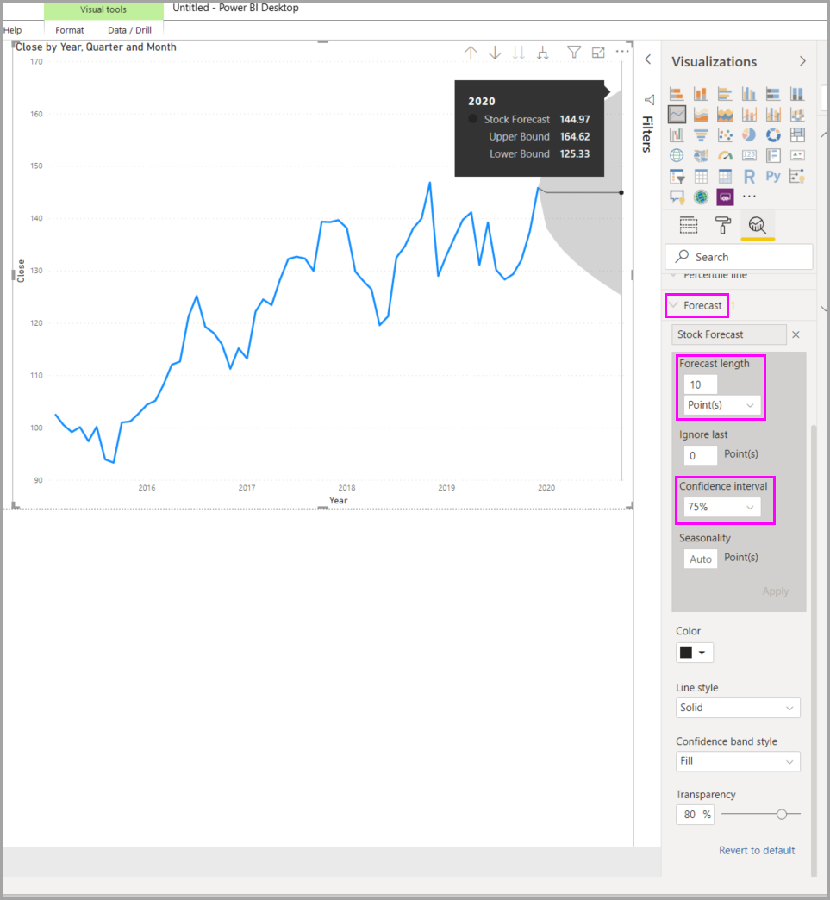

# Utilizar o painel Análise no Power BI Desktop

Com o painel **Análise** do Power BI Desktop, pode adicionar *linhas de referência* dinâmicas a elementos visuais e destacar tendências ou informações importantes. O painel e o ícone **Análise** encontram-se na área **Visualizações** do Power BI Desktop.

> [!NOTE]
> O painel **Análise** aparece apenas quando seleciona um visual na tela do Power BI Desktop.

## Pesquisar no painel Análise

A partir da versão de fevereiro de 2018 do Power BI Desktop (versão 2.55.5010.201 ou posterior), pode pesquisar no painel **Análise**, que é uma subsecção do painel **Visualizações**. A caixa de pesquisa aparece quando seleciona o ícone **Análise**.

## Utilizar o painel Análise

Com o painel **Análise**, pode criar os seguintes tipos de linhas de referência dinâmicas:

* Linha constante do Eixo X
* Linha constante do Eixo Y
* Linha Mín
* Linha Máx
* Linha Média
* Linha Mediana
* Linha de Percentil
* Sombreado de simetria

> [!NOTE]
> Nem todas as linhas estão disponíveis para todos os tipos de elementos visuais.

As seguintes secções mostram como pode utilizar o painel **Análise** e linhas de referência dinâmicas nas suas visualizações.

Para ver as linhas de referência dinâmicas disponíveis para um visual, siga estes passos:

1. Selecione ou crie um visual e, em seguida, selecione o ícone **Análise** na secção **Visualizações**.

    

2. Selecione o tipo de linha que quer criar para expandir as opções. Neste caso, vamos selecionar **Linha média**.

    

3. Para criar uma nova linha, selecione **+&nbsp;Adicionar**. Em seguida, pode dar um nome à linha. Faça duplo clique na caixa de texto e introduza o nome.

    Tem agora todos os tipos de opções da linha. Pode especificar a **Cor**, a percentagem de **Transparência** , o **Estilo de linha** e a **Posição** (em comparação com os elementos de dados do elemento visual). Também pode escolher se quer incluir a **Etiqueta de dados**. Para especificar a medida do elemento visual na qual se vai basear a linha, selecione a lista pendente **Medida**, que é preenchida automaticamente com elementos de dados do elemento visual. Aqui, vamos selecionar **Cultura** como medida, dar-lhe a etiqueta *Média de Cultura* e personalizar algumas das outras opções.

    

4. Se quiser que apareça uma etiqueta de dados, altere o estado da **Etiqueta de dados** de **Inativa** para **Ativa**. Quando o fizer, receberá uma série de opções adicionais para a sua etiqueta de dados.

    

5. Repare no número apresentado junto ao item **Linha média** no painel **Análise**. Isto indica-lhe quantas linhas dinâmicas, e de que tipo, tem atualmente no seu elemento visual. Se adicionarmos uma **Linha máxima** para **Acessibilidade**, o painel **Análise** mostrará que temos também uma linha de referência dinâmica **Linha máxima** aplicada a este elemento visual.

    

Se não puder aplicar linhas de referência dinâmicas ao elemento visual que selecionou (neste caso, um elemento visual **Mapa**), receberá a seguinte mensagem quando selecionar o painel **Análise**.

Pode realçar muitas informações interessantes ao criar linhas de referência dinâmicas com o painel **Análise**.

Estamos a planear mais funcionalidades e capacidades, incluindo expandir os elementos visuais aos quais é possível aplicar linhas de referência dinâmicas. Consulte esta secção com frequência para ver as novidades.

## Aplicar a previsão

Se tiver dados de tempo na origem de dados, poderá utilizar a funcionalidade *previsão*. Basta selecionar um elemento visual e, em seguida, expandir a secção **Previsão** do painel **Análise**. Pode especificar muitas entradas para modificar a previsão, como a **Duração da previsão** ou o **Intervalo de confiança**. A seguinte imagem mostra um elemento visual de linha básico com a previsão aplicada. Utilize a sua imaginação (e experimente a previsão) para ver como é que esta pode ser aplicada aos seus modelos.

> [!NOTE]
> A funcionalidade de previsão está apenas disponível para elementos visuais de gráfico de linhas.

## Limitações

A capacidade de utilizar linhas de referência dinâmicas baseia-se no tipo de visual utilizado. As listas seguintes descrevem estas limitações mais especificamente.

Pode utilizar *linha constante do eixo x*, *linha constante do eixo y* e *sombreamento de simetria* no seguinte elemento visual:

* Gráfico de dispersão

A utilização de *linha constante*, *linha mínima*, *linha máxima*, *linha média*, *linha mediana* e *linha de percentil* está disponível nestes elementos visuais:

* Gráfico de área
* Gráfico de barras agrupadas
* Gráfico de colunas agrupadas
* Gráfico de linhas
* Gráfico de dispersão

Os seguintes visuais só podem utilizar uma *linha constante* no painel **Análise**:

* Gráfico de áreas empilhadas
* Gráfico de barras empilhadas
* Gráfico de colunas empilhadas
* Gráfico de cascata
* Gráfico de barras 100% empilhadas
* Gráfico de colunas 100% empilhadas

Os seguintes elementos visuais poderão utilizar uma *linha de tendência* se existirem dados de tempo:

* Gráfico de área
* Gráfico de colunas agrupadas
* Gráfico de linhas
* Gráfico de linhas e colunas agrupadas

Por fim, atualmente não pode aplicar linhas dinâmicas a muitos elementos visuais, incluindo (entre outros):

* Funil
* Gráfico de linhas e colunas agrupadas
* Gráfico de linhas e colunas empilhadas
* Gráfico do friso
* Elementos visuais não cartesianos, como Gráfico de anel, Medidor, Matriz, Gráfico circular e Tabela

A *linha de percentil* só está disponível quando utiliza dados importados no Power BI Desktop ou quando está ligado em direto a um modelo num servidor com o **Analysis Service 2016** ou posterior, o **Azure Analysis Services** ou um conjunto de dados no serviço Power BI.

## Próximas etapas

Pode fazer todo o tipo de coisas com o Power BI Desktop. Para obter mais informações sobre as respetivas capacidades, consulte os seguintes recursos:

* [Novidades no Power BI Desktop](../fundamentals/desktop-latest-update.md)
* [Obter o Power BI Desktop](../fundamentals/desktop-get-the-desktop.md)
* [O que é o Power BI Desktop?](../fundamentals/desktop-what-is-desktop.md)
* [Descrição geral das consultas no Power BI Desktop](desktop-query-overview.md)
* [Tipos de dados no Power BI Desktop](../connect-data/desktop-data-types.md)
* [Formatar e combinar dados com o Power BI Desktop](../connect-data/desktop-shape-and-combine-data.md)
* [Executar tarefas comuns no Power BI Desktop](desktop-common-query-tasks.md)
