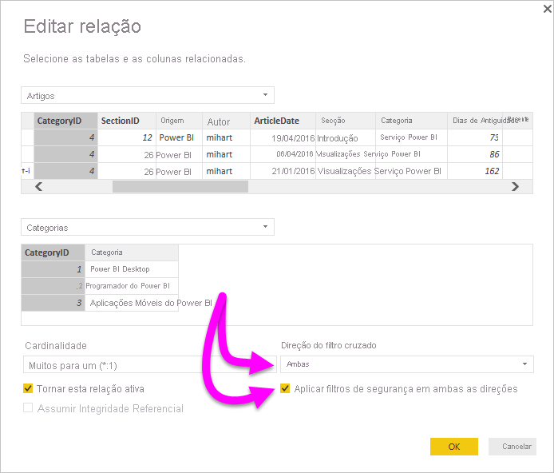

# Ativar a filtragem cruzada bidirecional para o DirectQuery no Power BI Desktop

Ao filtrar tabelas para criar a vista adequada dos dados, os criadores de relatórios e modeladores de dados enfrentam desafios ao determinar como aplicar filtros a um relatório. Anteriormente, o contexto de filtro da tabela era mantido de um lado da relação, mas não do outro. Esta configuração exigia, muitas vezes, fórmulas DAX completas para obter os resultados pretendidos.

Com a filtragem cruzada bidirecional, os criadores de relatórios e modeladores de dados têm agora mais controlo sobre como podem aplicar filtros ao trabalhar com tabelas relacionadas. A filtragem cruzada bidirecional permite-lhes aplicar filtros em *ambos* os lados de uma relação de tabelas. Pode aplicar os filtros ao propagar o contexto para uma segunda tabela relacionada no outro lado de uma relação entre tabelas.

## Ativar a filtragem cruzada bidirecional para o DirectQuery

Pode ativar a filtragem cruzada bidirecional na caixa de diálogo **Editar relação**. Para ativar a filtragem cruzada para uma relação, deve configurar as seguintes opções:

* Defina **Direção de filtro cruzado** como **Ambas**.
* Selecione **Aplicar filtros de segurança em ambas as direções**.

  

> [!NOTE]
> Ao criar fórmulas DAX de filtragem cruzada no Power BI Desktop, utilize *UserPrincipalName*. Este campo costuma ser o mesmo que o início de sessão de um utilizador, por exemplo <em>joe@contoso.com</em>, em vez de *UserName*. Por esse motivo, poderá precisar de criar uma tabela relacionada que mapeie *UserName* ou *EmployeeID* a *UserPrincipalName*.

Para obter mais informações exemplos do funcionamento da filtragem cruzada bidirecional, veja o [documento técnico de filtragem cruzada bidirecional para Power BI Desktop](https://download.microsoft.com/download/2/7/8/2782DF95-3E0D-40CD-BFC8-749A2882E109/Bidirectional%20cross-filtering%20in%20Analysis%20Services%202016%20and%20Power%20BI.docx).

