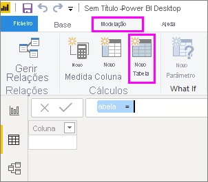
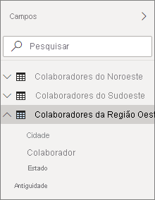

# <a name="create-calculated-tables-in-power-bi-desktop"></a>Criar tabelas calculadas no Power BI Desktop
Na maioria das vezes, cria tabelas ao importar dados para o seu modelo a partir de uma origem de dados externa. No entanto, as *tabelas calculadas* permitem-lhe adicionar novas tabelas com base nos dados que já carregou no modelo. Em vez de consultar e carregar valores nas colunas da sua nova tabela a partir de uma origem de dados, crie uma fórmula [DAX (Data Analysis Expressions)](/dax/index) que define os valores da tabela.

DAX é uma linguagem de fórmulas para trabalhar com dados relacionais, como no Power BI Desktop. O DAX inclui uma biblioteca de mais de 200 funções, operadores e construtores, fornecendo enorme flexibilidade na criação de fórmulas para calcular os resultados de praticamente qualquer análise de dados que seja necessária. As tabelas calculadas são melhores para cálculos intermédios e para dados que pretenda armazenar como parte do modelo, em vez de calcular dinamicamente ou como resultados da consulta. Por exemplo, pode optar entre *union* e *cross join* de duas tabelas existentes.

À semelhança de outras tabelas do Power BI Desktop, as tabelas calculadas podem ter relações com outras tabelas. As colunas na tabela calculada têm tipos de dados, formatação e podem pertencer a uma categoria de dados. Pode nomear as suas colunas como pretender e adicioná-las a visualizações do relatório, tal como com outros campos. As tabelas calculadas são recalculadas se alguma das tabelas de onde retiram os dados forem atualizadas, a menos que a tabela utilize dados de uma tabela que utilize DirectQuery; no caso do DirectQuery, a tabela só refletirá as alterações depois de o conjunto de dados ter sido atualizado. Se uma tabela precisa de usar DirectQuery, o melhor é ter a tabela calculada também no DirectQuery.

## <a name="create-a-calculated-table"></a>Criar uma tabela calculada

Pode criar tabelas calculadas com a funcionalidade **Nova Tabela** na Vista de Relatório ou Vista de Dados do Power BI Desktop.

Por exemplo, imagine que é um gestor do pessoal que tem uma tabela **Northwest Employees** e outra tabela **Southwest Employees**. Quer combinar as duas tabelas numa única tabela chamada **Western Region Employees**.

**Northwest Employees**

 

**Southwest Employees**

 

Na Vista de Relatório ou Vista de Dados do Power BI Desktop, no grupo **Cálculos** do separador **Modelação**, selecione **Nova Tabela**. É um pouco mais fácil fazer isso na Vista de Dados, porque pode ver imediatamente a sua nova tabela calculada.

 

Na barra de fórmulas, introduza a seguinte fórmula:

```dax
Western Region Employees = UNION('Northwest Employees', 'Southwest Employees')
```

É criada uma nova tabela chamada **Western Region Employees** e aparece como qualquer outra tabela no painel **Campos**. Pode criar relações com outras tabelas, adicionar medidas e colunas calculadas e adicionar campos a relatórios, tal como com qualquer outra tabela.

 

 

## <a name="functions-for-calculated-tables"></a>Funções para tabelas calculadas

Pode definir uma tabela calculada por qualquer expressão DAX que devolva uma tabela, incluindo uma referência simples a outra tabela. Por exemplo:

```dax
New Western Region Employees = 'Western Region Employees'
```

Este artigo fornece uma introdução rápida às tabelas calculadas. Pode usar tabelas calculadas com o DAX para solucionar muitos problemas analíticos. Aqui estão algumas das funções de tabela DAX mais comuns que pode utilizar:

* DISTINCT
* VALUES
* CROSSJOIN
* UNION
* NATURALINNERJOIN
* NATURALLEFTOUTERJOIN
* INTERSECT
* CALENDAR
* CALENDARAUTO

Veja a [Referência de Funções DAX](/dax/dax-function-reference) para estas e outras funções DAX que devolvem tabelas.

