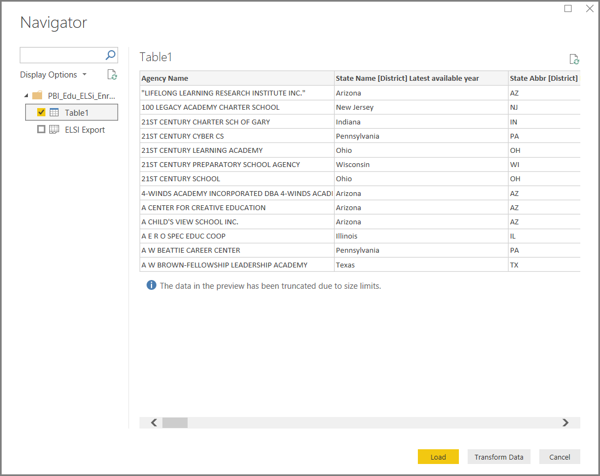
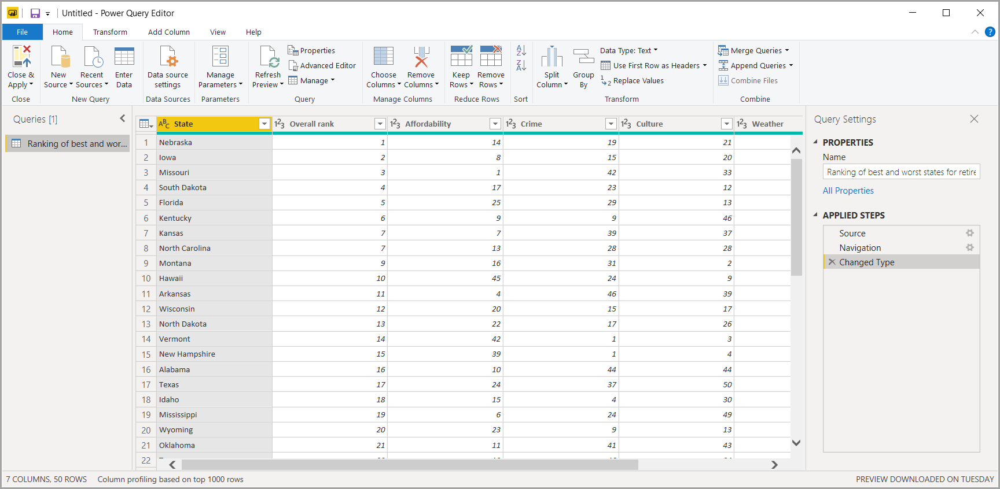

# Executar tarefas comuns de consulta no Power BI Desktop

Na janela do Editor do Power Query do Power BI Desktop, existem algumas tarefas comuns. Este artigo demonstra essas tarefas comuns e apresenta ligações para informações adicionais.

As tarefas comuns de consulta demonstradas aqui são:

* Ligar-se a dados
* Formatar e combinar dados
* Agrupar linhas
* Colunas Pivot
* Criar colunas personalizadas
* Consultar fórmulas

Iremos utilizar algumas ligações de dados para concluir estas tarefas. Os dados estão disponíveis para transferir ou ligar-se, caso deseje executar estas tarefas por conta própria.

A primeira ligação de dados é [um livro do Excel](https://download.microsoft.com/download/5/7/0/5701F78F-C3C2-450C-BCCE-AAB60C31051D/PBI_Edu_ELSi_Enrollment_v2.xlsx), que pode transferir e guardar localmente. A outra é um recurso Web que também é utilizado noutros artigos do Power BI Desktop:

<https://www.bankrate.com/retirement/best-and-worst-states-for-retirement/>

As tarefas comuns de consulta começam nos passos necessários para se ligar a ambas as origens de dados.

## Ligar-se a dados

Para se ligar aos dados no Power BI Desktop, selecione **Página Inicial** e, em seguida, **Obter Dados**. O Power BI Desktop apresenta um menu com as origens de dados mais comuns. Para obter uma lista completa de origens de dados às quais o Power BI Desktop se pode ligar, selecione **Mais** no final do menu. Para obter mais informações, veja [Origens de dados no Power BI Desktop](../connect-data/desktop-data-sources.md).

Para começar, selecione **Excel**, especifique o livro do Excel mencionado anteriormente e, em seguida, selecione **Abrir**. Depois de selecionar uma tabela, a consulta inspeciona o livro e apresenta os dados encontrados na caixa de diálogo **Navegador**.

Pode selecionar **Transformar Dados** para editar, ajustar ou *formatar* os dados antes de os carregar no Power BI Desktop. A edição é especialmente útil quando trabalha com grandes conjuntos de dados que quer reduzir antes de carregar.

É igualmente fácil ligar-se a diferentes tipos de dados. Se também quiser ligar-se a um recurso Web, escolha **Obter Dados** > **Mais** e, em seguida, selecione **Outro** > **Web** > **Ligar**.

É apresentada a caixa de diálogo **Da Web**, onde pode escrever o URL da página Web.

Selecione **OK**. Tal como antes, o Power BI Desktop inspeciona os dados da página Web e mostra opções de pré-visualização na caixa de diálogo **Navegador**. Quando seleciona uma tabela, será apresentada uma pré-visualização dos dados.

Outras ligações de dados são semelhantes. Se precisar de autenticar-se para fazer uma ligação de dados, o Power BI Desktop pedir-lhe-á as credenciais apropriadas.

Para ver uma demonstração passo a passo da ligação aos dados no Power BI Desktop, veja [Ligar-se aos dados no Power BI Desktop](../connect-data/desktop-connect-to-data.md).

## Formatar e combinar dados

Pode formatar e combinar dados facilmente com o Editor do Power Query. Esta secção inclui alguns exemplos sobre como pode formatar dados. Para obter uma demonstração mais completa da formatação e combinação dos dados, veja [Formatar e combinar Dados com o Power BI Desktop](../connect-data/desktop-shape-and-combine-data.md).

Na secção anterior, ligou-se a dois conjuntos de dados: um livro do Excel e um recurso Web. Depois de os dados serem carregados no Editor do Power Query, selecione a consulta da página Web nas consultas disponíveis no painel **Consultas**, como mostrado aqui:

Ao formatar dados, transforma uma origem de dados na forma e formato que atendem às suas necessidades.

No Editor do Power Query, poderá encontrar muitos comandos no friso e nos menus de contexto. Por exemplo, quando clica com o botão direito do rato numa coluna, o menu de contexto permite-lhe remover a coluna. Pode também selecionar a coluna e, em seguida, selecionar o botão **Remover Colunas** no separador **Página Inicial** do friso.

Pode moldar os dados de muitas outras formas nesta consulta. Pode remover qualquer número de linhas da parte superior ou da parte inferior. Em alternativa, pode adicionar colunas, dividir colunas, substituir valores e realizar outras tarefas de formatação. Com estas funcionalidades, pode direcionar o Editor do Power Query para obter os dados da forma pretendida.

## Agrupar linhas

No Editor do Power Query, pode agrupar os valores de muitas linhas num único valor. Esta funcionalidade pode ser útil ao resumir o número de produtos oferecidos, o total de vendas ou a contagem de alunos.

Neste exemplo, agrupa linhas num conjunto de dados de matrículas académicas. Os dados são do livro do Excel. Este foi formatado no Editor do Power Query para obter apenas as colunas de que precisa, mudar o nome da tabela e fazer mais algumas transformações.

Vamos descobrir quantas Agências existem por estado (as agências podem incluir distritos escolares, outras entidades educacionais, como distritos de serviços regionais, entre outras). Selecione a coluna **ID da Agência – \[Distrito\] Atribuído pelo NCES Mais Recente** e, em seguida, selecione o botão **Agrupar Por** no separador **Transformar** ou no separador **Página Inicial** do friso (**Agrupar Por** está disponível em ambos os separadores).

É apresentada a caixa de diálogo **Agrupar Por**. Quando o Editor do Power Query agrupa linhas, cria uma nova coluna na qual coloca os resultados de **Agrupar Por**. Pode ajustar a operação **Agrupar Por** das seguintes formas:

1. A lista pendente sem etiquetas especifica a coluna a agrupar. O Editor do Power Query predefine este valor para a coluna selecionada, mas pode ser alterado para ser qualquer coluna na tabela.
2. **Nome da nova coluna**: o Editor do Power Query sugere um nome para a nova coluna com base na operação que este aplica à coluna que está a ser agrupada. Porém, o utilizador pode dar o nome que quiser à nova coluna.
3. **Operação**: pode escolher a operação que o Editor do Power Query aplica, como **Soma**, **Mediana** ou **Contagem de Linhas Distintas**. O valor predefinido é **Contagem de Linhas**.
4. **Adicionar agrupamento** e **Adicionar agregação**: estes botões apenas estarão disponíveis se selecionar a opção **Avançado**. Numa única operação, pode realizar operações de agrupamento (ações **Agrupar Por**) em muitas colunas e criar várias agregações com estes botões. Com base nas seleções nesta caixa de diálogo, o Editor do Power Query cria uma nova coluna que opera em várias colunas.

Selecione **Adicionar agrupamento** ou **Adicionar agregação** para adicionar mais agrupamentos ou agregações a uma operação **Agrupar Por**. Para remover um agrupamento ou uma agregação, selecione o ícone de reticências ( **...** ) à direita da linha e, em seguida, **Eliminar**. Continue e experimente a operação **Agrupar Por** com os valores predefinidos para ver o que ocorre.

Quando seleciona **OK**, a Consulta realiza a operação **Agrupar Por** e devolve os resultados. Repare que Ohio, Illinois, Texas e Califórnia agora têm mais de mil entidades cada um!

Adicionalmente, com o Editor do Power Query, pode sempre remover a última operação de formatação. No painel **Definições de Consulta**, em **Passos Aplicados**, basta selecionar o **X** ao lado do passo recentemente concluído. Assim, continue e experimente. Se não gostar dos resultados, refaça o passo até que o Editor do Power Query formate os seus dados conforme desejado.

## Colunas Pivot

Pode dinamizar colunas e criar uma tabela que contém valores agregados para cada valor exclusivo numa coluna. Por exemplo, se descobrir quantos produtos diferentes existem em cada categoria de produto, poderá criar rapidamente uma tabela para o efeito.

Vejamos um exemplo. A tabela **Produtos_por_Categorias** a seguir foi formatada para mostrar apenas cada produto exclusivo (por nome) e a qual categoria cada produto pertence. Para criar uma nova tabela que mostra uma contagem de produtos para cada categoria (com base na coluna **CategoryName**), selecione a coluna e, em seguida, selecione **Transformar** > **Coluna Dinâmica**.

É apresentada a caixa de diálogo **Coluna Dinâmica**, a qual informa quais os valores da coluna que serão utilizados para criar novas colunas (1) (se não for mostrado o nome da coluna de **CategoryName** pretendido, selecione-o na lista de pendente). Quando expandir **Opções avançadas** (2), poderá selecionar a função que será aplicada aos valores agregados (3).

Ao selecionar **OK**, a Consulta apresenta a tabela de acordo com as instruções de transformação fornecidas na caixa de diálogo **Coluna Dinâmica**.

## Criar colunas personalizadas

No Editor do Power Query, pode criar fórmulas personalizadas que operam em várias colunas na tabela. Em seguida, pode colocar os resultados dessas fórmulas numa nova coluna (personalizada). O Editor do Power Query facilita a criação de colunas personalizadas.

Com os dados do livro do Excel no Editor do Power Query, aceda ao separador **Adicionar Coluna** no friso e, em seguida, selecione **Coluna Personalizada**.

É apresentada a seguinte caixa de diálogo. Neste exemplo, cria uma coluna personalizada chamada *Percentagem de ELI* que calcula a percentagem do total de Estudantes de Língua Inglesa (ELI).

Como em qualquer outro passo aplicado no Editor do Power Query, se a nova coluna personalizada não fornecer os dados que procura, poderá eliminar o passo. No painel **Definições de Consulta**, em **Passos Aplicados**, basta selecionar o **X** ao lado do passo **Personalização Adicionada**.

## Consultar fórmulas

Pode editar os passos que o Editor do Power Query gera. Também pode criar fórmulas personalizadas, que permitem ligar aos dados e formatá-los com maior precisão. Sempre que o Editor do Power Query executa uma ação nos dados, a fórmula associada à ação é mostrada na barra de fórmulas. Para ver a barra de fórmulas, aceda ao separador **Vista** do friso e, em seguida, selecione **Barra de Fórmulas**.

Todos os passos aplicados de cada consulta são mantidos pelo Editor do Power Query como texto que pode ver ou modificar. Pode visualizar ou modificar o texto de qualquer consulta com o **Editor Avançado**. Basta selecionar **Vista** e, em seguida, **Editor Avançado**.

Eis uma apresentação do **Editor Avançado**, com os passos de consulta associados à consulta **USA\_StudentEnrollment** apresentados. Estes passos são criados na Linguagem de Fórmula do Power Query, normalmente conhecida como *M*. Para obter informações, veja [Saiba mais sobre as fórmulas do Power Query](https://support.office.com/article/learn-about-power-query-formulas-6bc50988-022b-4799-a709-f8aafdee2b2f). Para ver a especificação da linguagem, veja [Especificação da linguagem de fórmulas M do Power Query](/powerquery-m/power-query-m-language-specification).

O Power BI Desktop oferece um amplo conjunto de categorias de fórmula. Para obter mais informações e uma referência completa de todas as fórmulas do Editor do Power Query, veja [Referência de funções M do Power Query](/powerquery-m/power-query-m-function-reference).

## Próximos passos

Pode fazer todo o tipo de coisas com o Power BI Desktop. Para obter mais informações sobre as suas capacidades, veja os seguintes recursos:

* [O que é o Power BI Desktop?](../fundamentals/desktop-what-is-desktop.md)
* [Descrição geral das Consultas no Power BI Desktop](desktop-query-overview.md)
* [Origens de dados no Power BI Desktop](../connect-data/desktop-data-sources.md)
* [Ligar a dados no Power BI Desktop](../connect-data/desktop-connect-to-data.md)
* [Formatar e combinar dados com o Power BI Desktop](../connect-data/desktop-shape-and-combine-data.md)
