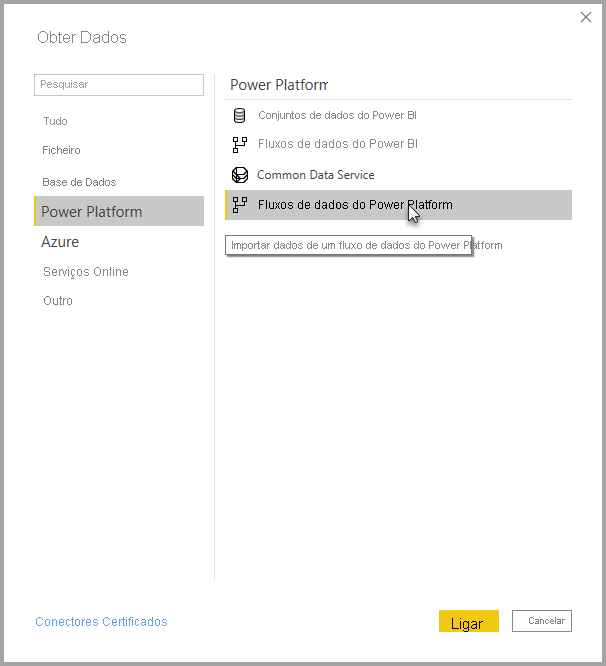

# Ligar a dados criados por fluxos de dados do Power Platform no Power BI Desktop
No **Power BI Desktop**, pode ligar a dados criados por **fluxos de dados do Power Platform** tal como faria com outra origem de dados no Power BI Desktop.

O conector de **fluxos de dados do Power Platform** permite-lhe ligar a entidades criadas por fluxos de dados no serviço Power BI. 

## Considerações e limitações

Para utilizar o **conector de fluxos de dados do Power Platform**, tem de executar uma versão recente do **Power BI Desktop**. Pode sempre [transferir o Power BI Desktop](../fundamentals/desktop-get-the-desktop.md) e instalá-lo no seu computador para se certificar de que tem a versão mais recente.  

> [!NOTE]
> A versão anterior do conector de fluxos de dados do Power Platform exigia que transferisse um ficheiro .MEZ e o colocasse numa pasta. As versões atuais do **Power BI Desktop** incluem o conector de fluxos de dados do Power Platform, ou seja, esse ficheiro já não é obrigatório e pode entrar em conflito com a versão incluída do conector. Se tiver colocado manualmente esse ficheiro .MEZ na pasta, *terá* de eliminar esse ficheiro .MEZ da pasta **Documentos > Power BI Desktop > Conectores personalizados** para evitar conflitos. 

## Desempenho do Desktop
O **Power BI Desktop** é executado localmente no computador em que está instalado. O desempenho da ingestão de fluxos de dados é determinado por uma variedade de fatores. Esses fatores incluem o tamanho dos dados, a CPU e a RAM do computador, a largura de banda de rede, a distância do centro de dados e outros fatores.

Pode melhorar o desempenho da ingestão de dados dos fluxos de dados. Por exemplo, se o tamanho dos dados ingeridos for demasiado grande para o **Power BI Desktop** gerir no computador, poderá utilizar entidades ligadas e calculadas nos fluxos de dados para agregar os dados (dentro dos fluxos de dados) e ingerir apenas os dados preparados previamente e agregados. 

Dessa forma, o processamento de dados de grandes dimensões é realizado online nos fluxos de dados, em vez de ser feito localmente na instância em execução do **Power BI Desktop**. Essa abordagem permite ingerir quantidades mais pequenas de dados do Power BI Desktop e a experiência com os fluxos de dados permanece rápida e reativa.

## Considerações adicionais

A maioria dos fluxos de dados reside no inquilino do serviço Power BI. No entanto, os utilizadores do **Power BI Desktop** não podem aceder a fluxos de dados que estão armazenados numa conta do Azure Data Lake Storage Gen2, salvo se forem os proprietários do fluxo de dados ou se lhes tiver sido dada autorização explícita para a pasta de CDM do fluxo de dados. Considere a situação seguinte:

1.  A Ana cria uma nova área de trabalho e configura-a para armazenar os fluxos de dados no data lake da organização.
2.  O Nuno, que também é membro da área de trabalho criada pela Ana, quer utilizar o Power BI Desktop e o conector de fluxo de dados para obter dados do fluxo de dados criado pela Ana.
3.  O Miguel recebe um erro porque não foi adicionado como utilizador autorizado à pasta de CDM do fluxo de dados no data lake.

Para resolver este problema, devem ser concedidas permissões de leitor ao Nuno à Pasta de CDM e aos respetivos ficheiros. Pode saber mais sobre como conceder acesso à Pasta de CDM em [configurar e consumir um fluxo de dados](dataflows/dataflows-configure-consume.md).

## Passos seguintes
É possível fazer todo o tipo de coisas interessantes com os fluxos de dados. Para obter mais informações, consulte os seguintes recursos:

* [Introdução aos fluxos de dados e à preparação personalizada de dados](dataflows/dataflows-introduction-self-service.md)
* [Criar um fluxo de dados](dataflows/dataflows-create.md)
* [Configurar e consumir um fluxo de dados](dataflows/dataflows-configure-consume.md)
* [Configurar o armazenamento do fluxo de dados para utilizar o Azure Data Lake Gen2](dataflows/dataflows-azure-data-lake-storage-integration.md)
* [Funcionalidades Premium do fluxo de dados](dataflows/dataflows-premium-features.md)
* [IA com fluxos de dados](dataflows/dataflows-machine-learning-integration.md)

Também existem artigos sobre o **Power BI Desktop** que poderão ser úteis:

* [Origens de Dados no Power BI Desktop](../connect-data/desktop-data-sources.md)
* [Formatar e Combinar Dados com o Power BI Desktop](../connect-data/desktop-shape-and-combine-data.md)
* [Introduzir dados diretamente no Power BI Desktop](../connect-data/desktop-enter-data-directly-into-desktop.md)