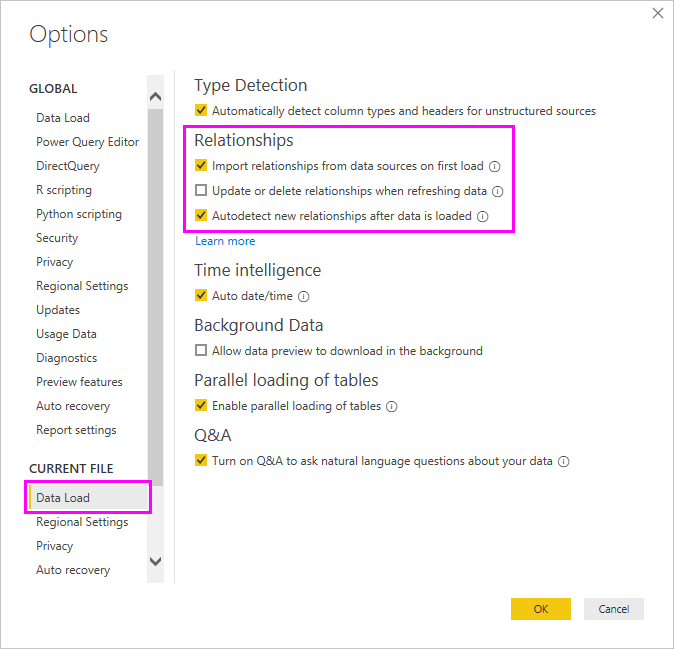
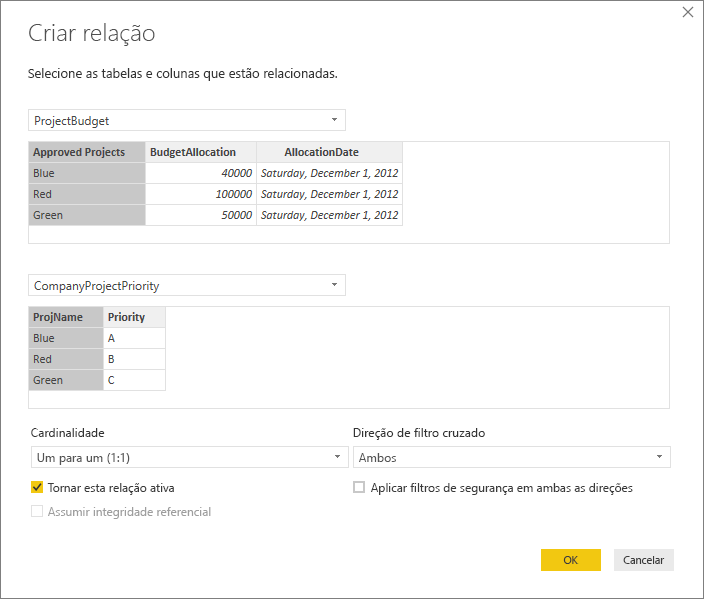
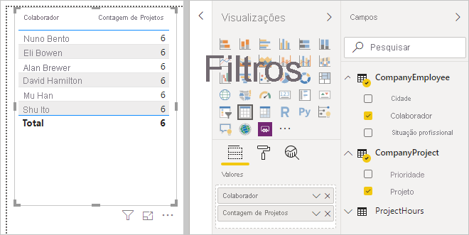
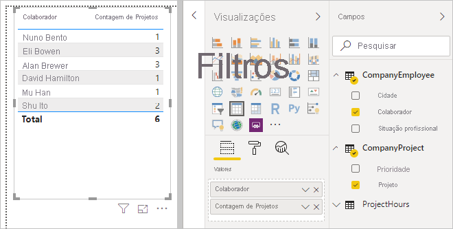
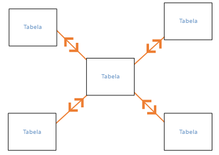
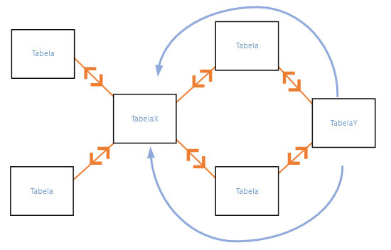
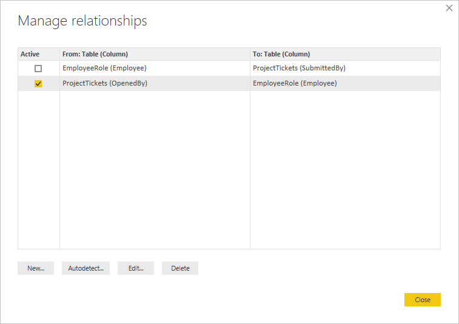

# Criar e gerir relações no Power BI Desktop
Quando importa múltiplas tabelas, é provável que faça algumas análises com dados de todas essas tabelas. As relações entre essas tabelas são necessárias para calcular os resultados com precisão e apresentar as informações corretas nos seus relatórios. O Power BI Desktop facilita a criação dessas relações. Na verdade, não tem de fazer nada na maioria dos casos: a funcionalidade de deteção automática fá-lo por si. No entanto, por vezes, pode ter de criar relações ou talvez seja necessário fazer alterações a uma relação. De qualquer modo, é importante compreender as relações no Power BI Desktop e como criá-las e editá-las.

## Deteção automática durante o carregamento
Se consultar duas ou mais tabelas ao mesmo tempo, quando os dados forem carregados, o Power BI Desktop tenta localizar e criar relações para si. As opções de relação **Cardinalidade**, **Direção do filtro cruzado** e **Tornar esta relação ativa** são definidas automaticamente. O Power BI Desktop procura os nomes de coluna nas tabelas que está a consultar para determinar se existem potenciais relações. Se houver, essas relações são criadas automaticamente. Se o Power BI Desktop não conseguir determinar com um elevado nível de confiança que existe uma correspondência, não cria a relação. No entanto, pode também utilizar a caixa de diálogo **Gerir relações** para criar ou editar relações manualmente.

## Criar uma relação com deteção automática
No separador **Home Page**, selecione **Gerir Relações** \> **Deteção Automática**.

## Criar uma relação manualmente
1. No separador **Home Page**, selecione **Gerir Relações** \> **Nova**.

2. Na caixa de diálogo **Criar relação**, na lista pendente da primeira tabela, selecione uma tabela. Selecione a coluna que pretende utilizar na relação.

3. Na lista pendente da segunda tabela, selecione a outra tabela que pretende na relação. Selecione a outra coluna que pretende utilizar e, em seguida, selecione **OK**.

   

Por predefinição, o Power BI Desktop configura automaticamente as opções **Cardinalidade** (direção), **Direção de filtro cruzado** e **Tornar esta relação ativa** para a sua nova relação. No entanto, pode alterar estas definições, se for necessário. Para obter mais informações, veja [Noções básicas sobre opções adicionais](#understanding-additional-options).

Se nenhuma das tabelas selecionadas para a relação tiver valores exclusivos, verá o seguinte erro: *Uma das colunas tem de ter valores exclusivos*. Pelo menos uma tabela numa relação *tem* de ter uma lista distinta e exclusiva de valores-chave, que é um requisito comum para todas as tecnologias de bases de dados relacionais. 

Se ocorrer esse erro, existem algumas formas de corrigir o problema:

* Utilize a opção **Remover Duplicados** para criar uma coluna com valores exclusivos. A desvantagem desta abordagem é o facto de poder perder informações quando remover as linhas duplicadas; muitas vezes, uma chave (linha) é duplicada por um bom motivo.
* Adicione uma tabela intermediária criada a partir da lista de valores-chave distintos ao modelo, que será então associada a ambas as colunas originais na relação.

Para mais informações, consulte esta [publicação de blogue](/archive/blogs/cansql/relationships-in-power-bi-fixing-one-of-the-columns-must-have-unique-values-error-message).

## Editar uma relação
1. No separador **Home Page**, selecione **Gerir Relações**.

2. Na caixa de diálogo **Gerir relações**, selecione a relação e, em seguida, selecione **Editar**.

## Configurar opções adicionais
Quando cria ou edita uma relação, pode configurar opções adicionais. Por predefinição, o Power BI Desktop configura automaticamente as opções adicionais com base na sua melhor estimativa, que pode ser diferente para cada relação com base nos dados nas colunas.

### Cardinalidade
A opção **Cardinalidade** pode ter uma das seguintes definições:

**Muitos-para-um (\*:1)** : Uma relação muitos-para-um é o tipo de relação predefinido mais comum. Significa que a coluna numa determinada tabela pode ter mais do que uma instância de um valor, enquanto a outra tabela relacionada, geralmente conhecida como tabela de referência, tem apenas uma instância de um valor.

**Um-para-um (1:1)** : Numa relação um-para-um, a coluna numa tabela tem apenas uma instância de um valor específico e a outra tabela relacionada tem apenas uma instância de um valor específico.

**Um-para-muitos (1:*)** : Numa relação um-para-muitos, a coluna numa tabela tem apenas uma instância de um valor específico e a outra tabela relacionada pode ter mais de uma instância de um valor específico.

**Muitos-para-muitos (\*:\*)** : Com os modelos compostos, pode estabelecer uma relação muitos-para-muitos entre tabelas, o que remove os requisitos para valores exclusivos em tabelas. Também remove soluções anteriores como, por exemplo, apresentar novas tabelas apenas para estabelecer relações. Para obter mais informações, veja [Relações com uma cardinalidade de muitos para muitos](./desktop-many-to-many-relationships.md). 

Para obter mais informações sobre quando alterar a cardinalidade, veja [Noções básicas sobre opções adicionais](#understanding-additional-options).

### Direção de filtro cruzado
A opção **Direção de filtro cruzado** pode ter uma das seguintes definições:

**Ambas**: para fins de filtragem, ambas as tabelas são tratadas como se fossem uma única tabela. A definição **Ambas** funciona bem com uma única tabela que tem uma série de tabelas de referência à sua volta. Um exemplo é uma tabela de dados reais de vendas com uma tabela de referência para o respetivo departamento. Esta configuração é frequentemente chamada de configuração de esquema em estrela (uma tabela central com várias tabelas de referência). No entanto, se tiver duas ou mais tabelas que também têm tabelas de referência (com algumas em comum), não é vantajoso utilizar a definição **Ambas**. Para continuar o exemplo anterior, neste caso, também tem uma tabela de vendas de orçamento que regista o orçamento de destino de cada departamento. A tabela de departamento está ligada tanto à tabela de vendas como à de orçamento. Evite a definição **Ambas** para este tipo de configuração.

**Única**: A direção predefinida mais comum, que significa que as opções de filtragem nas tabelas ligadas funcionam na tabela em que os valores estão a ser agregados. Se importar uma tabela do Power Pivot no Excel 2013 ou um modelo de dados anterior, todas as relações terão uma única direção. 

Para obter mais informações sobre quando alterar a direção de filtro cruzado, veja [Noções básicas sobre opções adicionais](#understanding-additional-options).

### Tornar esta relação ativa
Quando selecionada, a relação serve de relação ativa predefinida. Em casos em que existe mais de uma relação entre duas tabelas, a relação ativa fornece uma forma de o Power BI Desktop criar automaticamente visualizações que incluem ambas as tabelas.

Para obter mais informações sobre quando tornar ativa uma relação específica, veja [Noções básicas sobre opções adicionais](#understanding-additional-options).

## Noções básicas sobre relações
Depois de ter ligado duas tabelas através de uma relação, pode trabalhar com os dados em ambas as tabelas como se fossem uma única e não tem de se preocupar com os detalhes da relação nem unir essas tabelas numa única antes de importá-las. Em muitas situações, o Power BI Desktop pode criar relações automaticamente. No entanto, se o Power BI Desktop não conseguir determinar com um elevado grau de certeza que deve existir uma relação entre duas tabelas, não cria automaticamente a relação. Nesse caso, tem de fazê-lo você. 

Vamos fazer um tutorial rápido, para mostrar melhor como funcionam as relações no Power BI Desktop.

>[!TIP]
>Pode concluir esta lição autonomamente: 
>
> 1. Copie a tabela **ProjectHours** seguinte para uma folha de cálculo do Excel (excluindo o título), selecione todas as células e, em seguida, selecione **Inserir** \> **Tabela**. 
> 2. Na caixa de diálogo **Criar Tabela**, selecione **OK**. 
> 3. Selecione qualquer célula da tabela, selecione **Estrutura da Tabela** \> **Nome da Tabela** e, em seguida, introduza *ProjectHours*. 
> 4. Faça o mesmo para a tabela **CompanyProject**. 
> 5. Importe os dados através da opção **Obter Dados** no Power BI Desktop. Selecione as duas tabelas como origem de dados e, em seguida, selecione **Carregar**.

A primeira tabela, **ProjectHours**, é um registo de pedidos de trabalho que registam o número de horas que uma pessoa trabalhou num projeto específico. 

**ProjectHours**

| **Ticket** | **SubmittedBy** | **Hours** | **Project** | **DateSubmit** |
| ---:|:--- | ---:|:--- | ---:|
| 1001 |Alan Brewer |22 |Azul |1/1/2013 |
| 1002 |Alan Brewer |26 |Vermelho |2/1/2013 |
| 1003 |Shu Ito |34 |Amarelo |1242012 |
| 1004 |Alan Brewer |13 |Laranja |1/2/2012 |
| 1005 |Eli Bowen |29 |Roxo |01/10/2013 |
| 1006 |Nuno Bento |35 |Verde |2/1/2013 |
| 1007 |David Hamilton |10 |Amarelo |01/10/2013 |
| 1008 |Mu Han |28 |Laranja |1/2/2012 |
| 1009 |Shu Ito |22 |Roxo |2/1/2013 |
| 1010 |Eli Bowen |28 |Verde |1012013 |
| 1011 |Eli Bowen |9 |Azul |10/15/2013 |

Esta segunda tabela, **CompanyProject**, é uma lista de projetos aos quais é atribuída uma prioridade: A, B ou C. 

**CompanyProject**

| **ProjName** | **Priority** |
| --- | --- |
| Azul |A |
| Vermelho |B |
| Verde |C |
| Amarelo |C |
| Roxo |B |
| Laranja |C |

Repare que cada tabela tem uma coluna de projeto. Cada uma é nomeada de modo ligeiramente diferente, mas os valores parecem ser os mesmos. Isso é importante e voltaremos a esse assunto em breve.

Agora que temos as duas tabelas importadas num modelo, vamos criar um relatório. A primeira coisa que queremos obter é o número de horas submetido por prioridade de projeto, pelo que vamos selecionar **Priority** e **Hours** no painel **Fields**.

Se observar a tabela na tela do relatório, verá que o número de horas é 256 para cada projeto, sendo também o total. Obviamente, este número não está correto. Porquê? Isto é porque não podemos calcular uma soma total dos valores de uma tabela (**Hours** na tabela **Project**), dividida pelos valores na outra tabela (**Priority** na tabela **CompanyProject**) sem que exista uma relação entre estas duas tabelas.

Portanto, vamos criar uma relação entre estas duas tabelas.

Lembra-se das colunas que vimos em ambas as tabelas com um nome de projeto, mas com valores parecidos? Vamos utilizá-las para criar uma relação entre as nossas tabelas.

Por quê essas colunas? Se observarmos a coluna **Project** na tabela **ProjectHours**, vemos valores como Azul, Vermelho, Amarelo, Laranja e assim por diante. Na verdade, podemos ver várias linhas com o mesmo valor. Assim, temos muitos valores de cor para **Project**.

Se observarmos a coluna **ProjName** na tabela **CompanyProject**, vemos que existe apenas um de cada valor de cor para o nome do projeto. Cada valor de cor nesta tabela é exclusivo e isso é importante, porque podemos criar uma relação entre essas duas tabelas. Nesse caso, uma relação muitos para um. Numa relação muitos para um, pelo menos uma coluna numa das tabelas tem de conter valores exclusivos. Existem algumas opções adicionais para algumas relações, que vamos ver mais tarde. Por agora, vamos criar uma relação entre as colunas do projeto em cada uma das nossas duas tabelas.

### Para criar a nova relação
1. Selecione **Gerir Relações** no separador **Home Page**.
2. Em **Gerir relações**, selecione **Nova** para abrir a caixa de diálogo **Criar relação**, onde podemos selecionar as tabelas, as colunas e quaisquer definições adicionais que queremos para a relação.
3. Na primeira lista pendente, selecione **ProjectHours** como a primeira tabela e, em seguida, selecione a coluna **Project**. Este lado é o lado *muitos* da relação.
4. Na segunda lista pendente, **CompanyProject** está pré-selecionada como a segunda tabela. Selecione a coluna **ProjName**. Este lado é o lado *um* da relação. 
5. Aceite as predefinições das opções de relação e selecione **OK**.

   

6. Na caixa de diálogo **Gerir relações**, selecione **Fechar**.

Com o intuito de fazer a divulgação completa, acabámos por criar esta relação da forma mais complicada. Poderia ter simplesmente selecionado **Deteção Automática** na caixa de diálogo **Gerir relações**. Na verdade, a deteção automática teria criado automaticamente a relação quando carregou os dados se ambas as colunas tivessem o mesmo nome. Mas qual é o desafio disso?

Agora, vamos analisar novamente a tabela na tela do relatório.

O aspeto está muito melhor, não está?

Quando somamos as horas por **Priority**, o Power BI Desktop procura cada instância dos valores de cor exclusivos na tabela de referência **CompanyProject**, procura cada instância de cada um desses valores na tabela **ProjectHours** e, por fim, calcula uma soma total para cada valor exclusivo.

Foi fácil. Na verdade, com a deteção automática, talvez nem tenha de fazer tudo isso.

## Noções básicas sobre opções adicionais
Quando uma relação é criada, seja com a deteção automática ou manualmente, o Power BI Desktop configura opções adicionais automaticamente com base nos dados das tabelas. Estas opções de relação adicionais estão situadas na parte inferior das caixas de diálogo **Criar relação** e **Editar relação**.

 

Geralmente, o Power BI define estas opções de forma automática e não tem de as ajustar. No entanto, há várias situações em que talvez queira configurar estas opções.

## Atualizações de relação automáticas

Pode gerir como o Power BI processa e ajusta automaticamente as relações nos seus relatórios e modelos. Para especificar como o Power BI processa as opções de relações, selecione **Ficheiro** > **Opções e definições** > **Opções** no Power BI Desktop e, em seguida, selecione **Carregamento de Dados** no painel esquerdo. As opções para **Relações** são apresentadas.

   

Existem três opções que podem ser selecionadas e ativadas: 

- **Importar relações de origens de dados no primeiro carregamento**: esta opção está selecionada por predefinição. Quando está selecionada, o Power BI verifica as relações definidas na sua origem de dados, como relações de chave de referência/chave primária no seu armazém de dados. Se essas relações existirem, serão espelhadas no modelo de dados do Power BI quando carregar os dados inicialmente. Esta opção permite que comece rapidamente a trabalhar com o seu modelo, em vez de exigir que encontre ou defina essas relações por si.

- **Atualizar ou eliminar relações ao atualizar dados**: Esta opção não está selecionada por predefinição. Se a selecionar, o Power BI verifica se existem alterações nas relações de origens de dados quando o seu conjunto de dados é atualizado. Se essas relações forem alteradas ou removidas, o Power BI espelhará essas alterações no seu próprio modelo de dados, atualizando-as ou eliminando-as em conformidade.

   > [!WARNING]
   > Se estiver a utilizar a segurança ao nível da linha que depende das relações definidas, não recomendamos que selecione esta opção. Se remover uma relação da qual as suas definições de RLS dependam, o seu modelo poderá tornar-se menos seguro. 

- **Detetar automaticamente novas relações após o carregamento dos dados**: esta opção é descrita em [Deteção automática durante o carregamento](#autodetect-during-load). 

## Atualizações futuras aos dados requerem uma cardinalidade diferente
Normalmente, o Power BI Desktop pode determinar automaticamente a melhor cardinalidade para a relação. Se tiver de substituir a definição automática por saber que os dados serão alterados no futuro, pode alterá-la no controlo **Cardinalidade**. Vejamos um exemplo em que temos de selecionar uma cardinalidade diferente.

A tabela **CompanyProjectPriority** é uma lista de todos os projetos da empresa, incluindo a prioridade de cada um. A tabela **ProjectBudget** é o conjunto de projetos para os quais foi aprovado um orçamento.

**CompanyProjectPriority**

| **ProjName** | **Priority** |
| --- | --- |
| Azul |A |
| Vermelho |B |
| Verde |C |
| Amarelo |C |
| Roxo |B |
| Laranja |C |

**ProjectBudget**

| **Approved Projects** | **BudgetAllocation** | **AllocationDate** |
|:--- | ---:| ---:|
| Azul |40.000 |1212012 |
| Vermelho |100.000 |1212012 |
| Verde |50 000 |1212012 |

Se criarmos uma relação entre a coluna **Approved Projects** na tabela **ProjectBudget** e a coluna **ProjectName** na tabela **CompanyProjectPriority**, o Power BI define automaticamente **Cardinalidade** para **Um para um (1:1)** e **Direção de filtro cruzado** para **Ambas**. 

 

O Power BI configura estas definições porque a melhor combinação das duas tabelas para o Power BI Desktop é a seguinte:

| **ProjName** | **Priority** | **BudgetAllocation** | **AllocationDate** |
|:--- | --- | ---:| ---:|
| Azul |A |40.000 |1212012 |
| Vermelho |B |100.000 |1212012 |
| Verde |C |50.000 |1212012 |
| Amarelo |C |  |  |
| Roxo |B |  |  |
| Laranja |C |  |  |

Existe uma relação um-para-um entre as duas tabelas, porque não há repetição de valores na coluna **ProjName** da tabela combinada. A coluna **ProjName** é exclusiva, porque cada valor ocorre apenas uma vez; por isso, as linhas das duas tabelas podem ser combinadas diretamente sem nenhuma duplicação.

Mas digamos que sabe que os dados serão alterados da próxima vez que os atualizar. Uma versão atualizada da tabela **ProjectBudget** tem agora linhas adicionais para os projetos Azul e Vermelho:

**ProjectBudget**

| **Approved Projects** | **BudgetAllocation** | **AllocationDate** |
| --- | ---:| ---:|
| Azul |40.000 |1212012 |
| Vermelho |100.000 |1212012 |
| Verde |50 000 |1212012 |
| Azul |80.000 |6/1/2013 |
| Vermelho |90.000 |6/1/2013 |

 Estas linhas adicionais significam que a melhor combinação das duas tabelas tem agora o seguinte aspeto: 

| **ProjName** | **Priority** | **BudgetAllocation** | **AllocationDate** |
| --- | --- | ---:| ---:|
| Azul |A |40.000 |1212012 |
| Vermelho |B |100.000 |1212012 |
| Verde |C |50.000 |1212012 |
| Amarelo |C |  |  |
| Roxo |B |  |  |
| Laranja |C |  |  |
| Azul |A |80000 |6/1/2013 |
| Vermelho |B |90000 |6/1/2013 |

Nesta nova tabela combinada, existe repetição de valores na coluna **ProjName**. As duas tabelas originais não terão uma relação um para um depois de a tabela ser atualizada. Neste caso, por sabermos que as atualizações futuras farão com que a coluna **ProjName** tenha duplicados, queremos definir a **Cardinalidade** como **Muitos para um (\*:1)** , com o lado *muitos* em **ProjectBudget** e o lado *um* em **CompanyProjectPriority**.

## Ajustar a direção de filtro cruzado para um conjunto complexo de tabelas e relações
Para a maioria das relações, a direção de filtro cruzado é definida como **Ambas**. No entanto, existem algumas circunstâncias mais invulgares em que talvez tenha de definir esta opção de forma diferente da predefinição, como se estivesse a importar um modelo de uma versão anterior do PowerPivot, na qual cada relação é configurada para uma única direção. 

A definição **Ambas** permite ao Power BI Desktop tratar todos os aspetos das tabelas ligadas como se fossem uma única tabela. No entanto, existem algumas situações em que o Power BI Desktop não pode definir a direção de filtro cruzado da relação como **Ambas** e, ao mesmo tempo, manter um conjunto inequívoco de predefinições disponíveis para relatórios. Se a direção de filtro cruzado de uma relação não estiver definida como **Ambas**, é geralmente porque iria criar ambiguidade. Se a predefinição de filtro cruzado não estiver a funcionar, experimente defini-la para uma tabela específica ou para **Ambas**.

A filtragem cruzada numa única direção funciona em inúmeras situações. Na verdade, se importar um modelo do PowerPivot no Excel 2013 ou anterior, todas as relações serão definidas para uma única direção. A utilização de uma única direção significa que as opções de filtragem, em tabelas ligadas, funcionam na tabela na qual está a ocorrer o trabalho de agregação de valores. Por vezes, compreender a filtragem cruzada pode ser um pouco difícil, por isso, vamos analisar um exemplo.

Com a filtragem cruzada de direção única, se criar um relatório que resume as horas do projeto, pode optar por resumir (ou filtrar) pela tabela **CompanyProject** e respetiva coluna **Priority** ou pela tabela **CompanyEmployee** e respetiva coluna **City**. No entanto, se quiser contar o número de colaboradores por projeto (uma pergunta menos comum), isso não funcionará. Obterá uma coluna de valores todos iguais. No exemplo seguinte, a direção de filtragem cruzada de ambas as relações está definida como uma única direção: em direção à tabela **ProjectHours**. No conjunto **Values**, o campo **Project** está definido como **Count**:

 

A especificação de filtro fluirá de **CompanyProject** para **ProjectHours** (conforme mostrado na imagem seguinte), mas o fluxo não chegará até **CompanyEmployee**. 

 

No entanto, se definir a direção de filtragem cruzada como **Ambas**, funcionará. A definição **Ambas** permite à especificação de filtro fluir até **CompanyEmployee**.

 

Com a direção de filtragem cruzada definida como **Ambas**, o relatório parece agora correto:

 

A filtragem cruzada em ambas as direções funciona bem para um padrão de relações de tabela, tal como o padrão acima. Este esquema é mais frequentemente designado por esquema em estrela, como este:

 

A direção de filtragem cruzada não funciona bem com um padrão mais geral encontrado com frequência em bases de dados, como neste diagrama:

 

Se tiver um padrão de tabela como este, com ciclos, a filtragem cruzada pode criar um conjunto ambíguo de relações. Por exemplo, se somar um campo da Tabela X e, em seguida, optar por filtrar por um campo na Tabela Y, o percurso que o filtro deve fazer não fica claro, pela tabela superior ou pela inferior. Um exemplo comum para este tipo de padrão é a Tabela X como uma tabela de vendas com dados reais e a Tabela Y ser de dados de orçamento. Em seguida, as tabelas no meio são tabelas de referência utilizadas por ambas as tabelas, como divisão ou região. 

Tal como acontece com relações ativas/inativas, o Power BI Desktop não permite que uma relação seja definida como **Ambas** se isso gerar ambiguidade nos relatórios. Existem várias formas diferentes de lidar com esta situação. Seguem-se as duas mais comuns:

* Eliminar ou marcar as relações como inativas para reduzir a ambiguidade. Em seguida, pode definir a filtragem cruzada de uma relação como **Ambas**.
* Inclua uma tabela duas vezes (com um nome diferente na segunda vez) para eliminar os ciclos. Isto torna o padrão de relações semelhante a um esquema em estrela. Com um esquema em estrela, todas as relações podem ser definidas como **Ambas**.

## Relação ativa errada
Quando o Power BI Desktop cria relações automaticamente, por vezes encontra mais de uma relação entre duas tabelas. Quando esta situação acontece, apenas uma das relações é definida como ativa. A relação ativa serve de relação padrão para que, quando selecionar campos de duas tabelas diferentes, o Power BI Desktop possa criar automaticamente uma visualização. No entanto, em alguns casos, a relação selecionada automaticamente pode estar errada. Utilize a caixa de diálogo **Gerir relações** para definir uma relação como ativa ou inativa, ou definir a relação ativa na caixa de diálogo **Editar relação**. 

Para garantir que existe uma relação predefinida, o Power BI Desktop permite apenas uma única relação ativa entre duas tabelas num determinado momento. Portanto, tem de definir primeiro a relação atual como inativa e, em seguida, definir como ativa a relação pretendida.

Vejamos um exemplo. A primeira tabela é **ProjectTickets** e a segunda tabela é **EmployeeRole**.

**ProjectTickets**

| **Ticket** | **OpenedBy** | **SubmittedBy** | **Hours** | **Project** | **DateSubmit** |
| ---:|:--- |:--- | ---:|:--- | ---:|
| 1001 |Tom Perham |Alan Brewer |22 |Azul |1/1/2013 |
| 1002 |Daniel Romano |Alan Brewer |26 |Vermelho |2/1/2013 |
| 1003 |Daniel Roth |Shu Ito |34 |Amarelo |1242012 |
| 1004 |Tom Perham |Alan Brewer |13 |Laranja |1/2/2012 |
| 1005 |Daniel Romano |Eli Bowen |29 |Roxo |01/10/2013 |
| 1006 |Daniel Roth |Nuno Bento |35 |Verde |2/1/2013 |
| 1007 |Daniel Roth |David Hamilton |10 |Amarelo |01/10/2013 |
| 1008 |Tom Perham |Mu Han |28 |Laranja |1/2/2012 |
| 1009 |Daniel Romano |Shu Ito |22 |Roxo |2/1/2013 |
| 1010 |Daniel Roth |Eli Bowen |28 |Verde |1012013 |
| 1011 |Tom Perham |Eli Bowen |9 |Azul |10/15/2013 |

**EmployeeRole**

| **Employee** | **Role** |
| --- | --- |
| Nuno Bento |Gestor de Projeto |
| Eli Bowen |Líder de Projeto |
| Alan Brewer |Gestor de Projeto |
| David Hamilton |Líder de Projeto |
| Mu Han |Líder de Projeto |
| Shu Ito |Líder de Projeto |
| Tom Perham |Patrocinador de Projeto |
| Daniel Romano |Patrocinador de Projeto |
| Daniel Roth |Patrocinador de Projeto |

Na verdade, existem duas relações aqui:
- Entre **Employee** na tabela **EmployeeRole** e **SubmittedBy** na tabela **ProjectTickets**.
- Entre **OpenedBy** na tabela **ProjectTickets** e **Employee** na tabela **EmployeeRole**.

 

Se adicionarmos ambas as relações ao modelo (**OpenedBy** primeiro), a caixa de diálogo **Gerir relações** mostrará que **OpenedBy** está ativo:

 

Agora, se criarmos um relatório que utiliza os campos **Role** e **Employee** de **EmployeeRole**, e o campo **Hours** de **ProjectTickets** numa visualização de tabela na tela de relatório, veremos apenas os patrocinadores de projeto, porque são os únicos que têm um pedido de projeto aberto.

 

Podemos alterar a relação ativa e obter **SubmittedBy** em vez de **OpenedBy**. Em **Gerir relações**, desselecione a relação entre **ProjectTickets(OpenedBy)** e **EmployeeRole(Employee)** e, em seguida, selecione a relação entre **EmployeeRole(Employee)** e **Project Tickets(SubmittedBy)** .

## Ver todas as relações na vista Relação
Por vezes, o modelo tem múltiplas tabelas e relações complexas. A vista **Relação** no Power BI Desktop mostra todas as relações no modelo, a direção e a cardinalidade num diagrama fácil de entender e personalizável. 

Para saber mais, veja [Trabalhar com a vista Relação no Power BI Desktop](desktop-relationship-view.md).