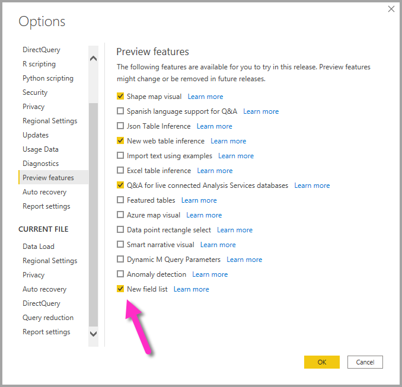
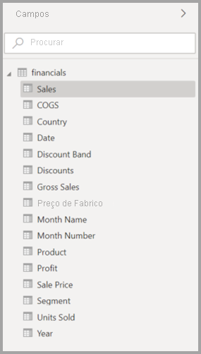
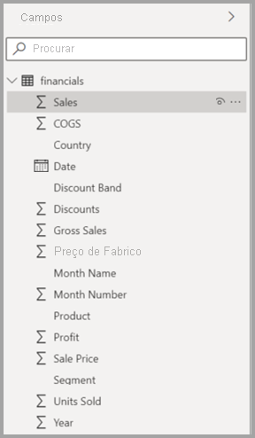
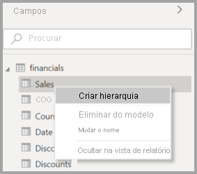
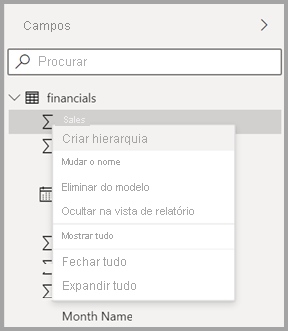
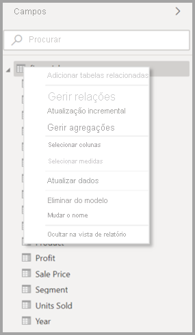
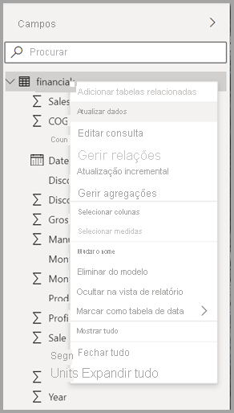
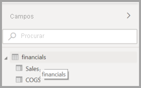
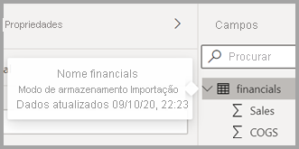

# Utilizar a Lista de Campos no Power BI Desktop (pré-visualização)

A partir da atualização de novembro de 2020, iremos unificar as Listas de **Campos** na Vista de Modelo, Vista de Dados e Vista de Relatório no Power BI Desktop. A unificação destas vistas irá criar consistência para a funcionalidade e para a interface do utilizador (IU) em todas as vistas e abordar o feedback de clientes.

As alterações que irá notar nas vistas incluem as seguintes:

* Iconografia
* Funcionalidade de pesquisa
* Itens do menu de contexto
* Comportamento de arrastar e largar semelhante
* Descrições
* Melhorias de acessibilidade

A intenção é melhorar a utilização do Power BI Desktop. As alterações devem ter um impacto mínimo sobre o fluxo de trabalho de dados típico.

## Ativar a nova Lista de Campos (pré-visualização)

A Lista de Campos unificada começa com a vista de **Modelo** e, subsequentemente, será ativada para outras vistas. No Power BI Desktop, navegue para **Ficheiro > Opções e definições > Opções** e, em seguida, selecione **Funcionalidades de pré-visualização** no painel da esquerda para ativar a vista de Campos unificada. Na secção Funcionalidades de pré-visualização, selecione a caixa de verificação ao lado de **Nova lista de campos**.

Ser-lhe-á pedido que reinicie o Power BI Desktop para a seleção entrar em vigor.

## Alterações da lista de campos

As tabelas seguintes mostram as atualizações à lista de campos. 

|**Lista de campos original (vista de Modelo)**  | **Nova lista de campos (vista de Modelo)**  |
|:---------:|:---------:|
|**Original** |**Novo** |
|**Ícones e IU**       ||
|     |    |
|**Menu de contexto – Campo**       ||
|     |    |
|**Menu de contexto – Tabela**       ||
|     |    |
|**Descrições**       ||
|     |    |

Também existem novos ícones da Lista de campos. A tabela seguinte mostra os ícones originais e o seu novo equivalente e fornece uma breve descrição de cada um. 

|Ícone original  |Novo ícone  |Description  |
|:---------:|:---------:|:---------|
|     |           |Pasta na lista Campos         |
|     |         |Campo numérico: os campos numéricos são agregações cuja soma ou média pode ser calculada, por exemplo. As agregações são importadas com os dados e definidas no modelo de dados no qual se baseia o seu relatório. Para obter mais informações, consulte [Agregados em relatórios do Power BI](../create-reports/service-aggregates.md).         |
|     |         |Coluna calculada com um tipo de dados não numérico: uma nova coluna não numérica que cria com uma fórmula Data Analysis Expressions (DAX) que define os valores da coluna. Saiba mais sobre as [colunas calculadas](desktop-calculated-columns.md).        |
|     |          |Coluna calculada numérica: uma nova coluna que cria com uma fórmula Data Analysis Expressions (DAX) que define os valores da coluna. Saiba mais sobre as [colunas calculadas](desktop-calculated-columns.md).         |
|     |          |Medida: uma medida tem a sua própria fórmula codificada. Os visualizadores do relatório não podem alterar o cálculo; por exemplo, se for uma soma, só poderá ser uma soma. Os valores não são armazenados numa coluna. São calculados dinamicamente, dependendo apenas da sua localização num elemento visual. Para obter mais informações, leia a secção [Noções básicas sobre medidas](desktop-measures.md).         |
|     |         |Grupo de medidas.         |
|     |         |KPI: uma indicação visual que comunica a quantidade de progresso feito em relação a um objetivo mensurável. Saiba mais sobre os elementos visuais do [Indicador Chave de Desempenho (KPI)](../visuals/power-bi-visualization-kpi.md).         |
|     |           |Hierarquia de campos: selecione a seta para ver os campos que constituem a hierarquia. Veja este vídeo do Power BI no YouTube, intitulado [Creating and working with hierarchies](https://www.youtube.com/watch?v=q8WDUAiTGeU) (Criar e trabalhar com hierarquias), para obter mais informações.         |
|     |         |Dados de áreas geográficas: estes campos de localização podem ser utilizados para criar visualizações de mapas.         |
|     |          |Campo de identidade: Os campos com este ícone são campos exclusivos, definidos para mostrar todos os valores, mesmo se tiverem duplicados. Por exemplo, os seus dados podem ter registos para duas pessoas diferentes chamadas Guilherme Sarmento e cada um dos registos será tratado como exclusivo. Os registos não serão somados.         |
|     |          |Parâmetro: defina parâmetros para fazer com que várias partes dos seus relatórios e modelos de dados (como um filtro de consulta, uma referência de origem de dados, uma definição de medida, etc.) dependam de um ou mais valores de parâmetros. Veja esta mensagem de blogue do Power BI sobre [parâmetros de consultas](https://powerbi.microsoft.com/blog/deep-dive-into-query-parameters-and-power-bi-templates/) para obter mais informações.         |
|     |         |Campo de data do calendário com uma tabela de datas incorporada.         |
|     |          |Tabela calculada: uma tabela criada com uma fórmula DAX (Data Analysis Expressions) baseada em dados já carregados para o modelo. Funcionam melhor para cálculos intermédios e o ideal é que os armazene como parte do modelo.         |
|     |         |Aviso: um campo calculado com um erro. Por exemplo, a sintaxe da expressão DAX pode estar incorreta.         |
|     |         |Grupo: os valores nesta coluna baseiam-se em valores de agrupamento de outra coluna ao utilizar a funcionalidade grupos e discretização. Pode saber mais sobre como [Utilizar o agrupamento e discretização](../create-reports/desktop-grouping-and-binning.md).         |
| sem ícone original    |          |Medida de deteção de alteração: ao configurar uma página para que atualize automaticamente, pode configurar uma [medida de deteção de alteração](../create-reports/desktop-grouping-and-binning.md). Esta será consultada para determinar se os elementos visuais do resto da página devem ser atualizados.         |

## Próximos passos

Poderá também estar interessado nos seguintes artigos:

* [Criar colunas calculadas no Power BI Desktop](desktop-calculated-columns.md)
* [Utilizar agrupamento e discretização no Power BI Desktop](../create-reports/desktop-grouping-and-binning.md)
* [Utilizar linhas de grelha e ajustar à grelha em relatórios do Power BI Desktop](../create-reports/desktop-gridlines-snap-to-grid.md)

