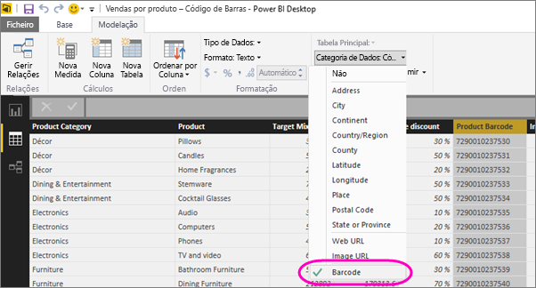

# Marque campos de código de barras no Power BI Desktop para permitir a filtragem de códigos de barras nas aplicações móveis

No Power BI Desktop, pode [categorizar dados](desktop-data-categorization.md) numa coluna, para que o Power BI Desktop saiba como tratar os valores nos elementos visuais num relatório. Também pode categorizar uma coluna como **Código de Barras**. Depois, quando alguém da sua empresa ou organização [digitalizar um código de barras](../consumer/mobile/mobile-apps-scan-barcode-iphone.md) num produto que utiliza a aplicação móvel Power BI no seu iOS ou telemóvel Android ou tablet, verá qualquer relatório que inclua esse código de barras. Quando abrirem o relatório, será automaticamente filtrado para os dados relacionados com esse código de barras.

## Categorizar dados de código de barras

Assumindo que tem um relatório que inclui códigos de barras: 

1. No Power BI Desktop, mude para a visualização de Dados.
2. Selecione a coluna que contém os dados de código de barras. Veja a lista de [formatos de código de barras suportados](#supported-barcode-formats) abaixo.
3. No separador **ferramentas coluna,** selecione **Data Category**  >  **Barcode**.
   
    

    >[!WARNING]
    >Não categorize mais de uma coluna em todas as tabelas de dados num relatório como **Barcode**. As aplicações móveis suportam a filtragem de Código de Barras apenas para relatórios que tenham apenas uma coluna de código de barras em todas as tabelas de dados do relatório. Se um relatório tiver mais do que uma coluna de código de barras, não se faz qualquer filtragem.

4. Na opinião do Relatório, adicione o campo de código de barras aos visuais que pretende filtrar pelo código de barras.
5. Guarde o relatório e publique-o no serviço Power BI.

Agora, quando abrir o scanner nas aplicações Power BI para iOS e Android e tablets e digitalizar um código de barras, verá este relatório na lista de relatórios que têm códigos de barras. Quando abrir o relatório, os seus visuais serão filtrados pelo código de barras do produto que digitalizou.

## Formatos de código de barras suportados
Estes são os formatos de código de barras que o Power BI reconhece se os pode marcar num relatório power BI: 

* UPCECode 
* Code39Code  
* A39Mod43Code 
* EAN13Code 
* EAN8Code  
* 93Code  
* 128Code 
* PDF417Code 
* Interleaved2of5Code 
* ITF14Code 

## Passos seguintes
* [Digitalize um código de barras da aplicação Power BI no seu iOS ou telefone Android ou tablet](../consumer/mobile/mobile-apps-scan-barcode-iphone.md)
* [Problemas com códigos de barras de digitalização](../consumer/mobile/mobile-apps-scan-barcode-iphone.md#issues-with-scanning-a-barcode)
* [Categorização de dados no Power BI Desktop](desktop-data-categorization.md)  
* Perguntas? [Experimente perguntar à Comunidade do Power BI](https://community.powerbi.com/)
