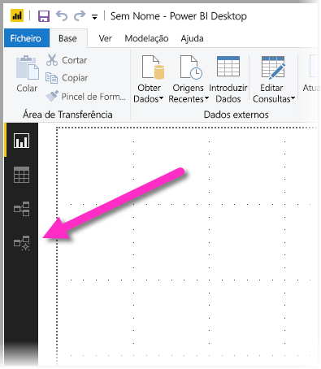
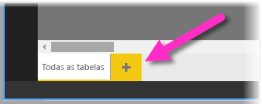
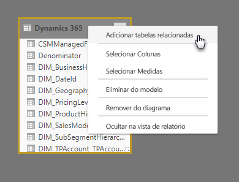
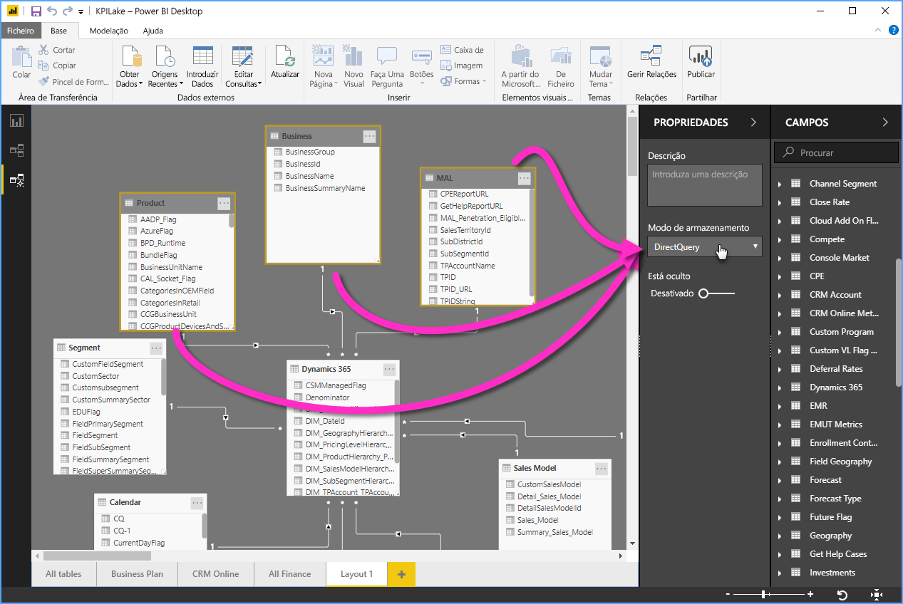

# Trabalhar com a Vista de modelação no Power BI Desktop

Com a **Vista de modelação** do **Power BI Desktop**, pode visualizar e trabalhar com conjuntos de dados complexos que contenham muitas tabelas.

## Utilizar a Vista de modelação

Para aceder à Vista de modelação, selecione o ícone da Vista de modelação no lado esquerdo do **Power BI Desktop**, conforme mostrado na imagem seguinte.

## Criar diagramas separados

Na Vista de modelação, pode criar diagramas do modelo que contêm apenas um subconjunto das tabelas do seu modelo. Tal pode ajudar a ver melhor as tabelas com as quais pretende trabalhar e a facilitar o trabalho com conjuntos de dados complexos. Para criar um novo diagrama com apenas um subconjunto de tabelas, clique no sinal **+** junto ao separador **Todas as tabelas** na parte inferior da janela do Power BI Desktop.

Em seguida, pode arrastar uma tabela da lista **Campos** para a superfície do diagrama. Clique com o botão direito do rato na tabela e, em seguida, selecione **Adicionar tabelas relacionadas** no menu apresentado.

Quando o fizer, as tabelas relacionadas à tabela original são apresentadas no novo diagrama. A imagem seguinte mostra as tabelas relacionadas conforme são apresentadas depois de selecionar a opção do menu **Adicionar tabelas relacionadas**.

## Definir propriedades comuns

Pode selecionar vários objetos ao mesmo tempo na Vista de modelação ao premir a tecla **CTRL** e clicar em várias tabelas. Quando seleciona várias tabelas, estas ficam em destaque na Vista de modelação. Quando são destacadas várias tabelas, as alterações aplicadas no painel **Propriedades** aplicam-se a todas as tabelas selecionadas.

Por exemplo, pode alterar o [modo de armazenamento](desktop-storage-mode.md) de várias tabelas na vista do diagrama ao manter premida a tecla **CTRL**, selecionar as tabelas e, em seguida, alterar a definição do modo de armazenamento no painel **Propriedades**.

## Próximas etapas

Os artigos seguintes descrevem de forma mais detalhada os modelos de dados e também o DirectQuery.

* [Agregações no Power BI Desktop (Pré-visualização)](desktop-aggregations.md)
* [Modelos compostos no Power BI Desktop](desktop-composite-models.md)
* [Modo de armazenamento no Power BI Desktop (Pré-visualização)](desktop-storage-mode.md)
* [Relações muitos para muitos no Power BI Desktop](desktop-many-to-many-relationships.md)

Artigos do DirectQuery:

* [Utilizar o DirectQuery no Power BI](../connect-data/desktop-directquery-about.md)
* [Origens de dados suportadas pelo DirectQuery no Power BI](../connect-data/power-bi-data-sources.md)
